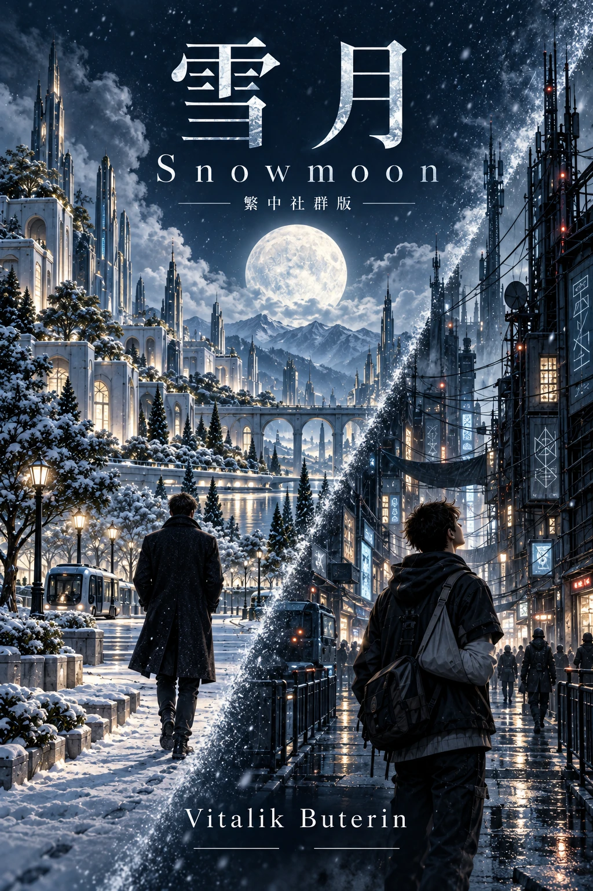

# 雪月（Snowmoon）｜Vitalik Buterin 長篇小說・台灣繁體中文版

  

> 一座城市讓抽籤選出的市民投票決定大樓好不好看；一個國家被強權壓了一百年，只能靠加密和分散撐下去。
> 戰爭從北方逼近時，這些制度撐得住嗎？

《雪月》是以太坊創辦人 **Vitalik Buterin** 寫的長篇小說，原名《Snowmoon》。這是它的台灣繁體中文版，一共 32 章，全部免費。

如果你讀過 AI 翻的小說，應該知道那種感覺：每一句都看得懂，讀到第三頁就想關掉。我們想做的，是一個讓你一路讀下去的版本。[看看差在哪 →](#讀起來有什麼不同)

**[從第一章開始讀 →](zh-tw/chapter-01.md)**　目錄裡標著 v2 的章節，就是已經改好的版本。

不想在 GitHub 上讀的話，《雪月》也上架到小說平台 Elsesora 了。那裡沒有廣告，可以切深色模式、調字型和字距，也會記得你上次讀到哪裡。我們自己也蠻喜歡在那裡讀：**[到 Elsesora 讀《雪月》→](https://elsesora.com/@punk-relayer/snowmoon)**

## 故事簡介

維瑞迪亞的首都梅爾丹滿城綠意。在這裡，連一棟大樓美不美，都要交給隨機抽中的市民，用平方投票來決定。

撐起這套稅與補貼制度的，是一個叫「掌舵會」的組織。成員身分保密，專門稽核每家企業對社會造成的影響。格拉迪亞斯是掌舵會的見習生，白天隱姓埋名出門稽核，晚上回家，和妻子賽菈、孩子們一起吃哲戈餐車的晚餐。直到有一天，一封匿名訊息告訴他：有人認出他了。

另一邊的哲戈，百年前打了敗仗，從此重工業和科技一直被北極帝國壓著。高中生澤和死黨汾在電子街長大。他們上課的地點，要等到開課那一刻才解密公布；整個國家的戰略，只有四個字：「扎根，無首」。

兩條故事線在一年裡慢慢靠近，時間從這個雪月走到下一個雪月。

## 這本書在寫什麼

Vitalik 這些年在部落格上談的東西，在這本小說裡都成了角色每天過的日子。你會看到：

- 平方投票和土地稅，怎麼決定一座城市長什麼樣子
- 一個沒有中央指揮的國家，怎麼靠密碼學和分散的組織活下來
- AI 和無人機，怎麼改變間諜、戰爭和民主
- 好的制度碰上外來強權，要付出什麼代價

不懂區塊鏈也沒關係，你不用先搞懂平方投票的數學。跟著格拉迪亞斯走在路上，他的手持裝置跳出通知，要他替一棟樓投票，你就跟著他一起看懂了。

## 讀起來有什麼不同

一般用 AI 翻譯的中文，雖然每一句都對，但你會發現讀沒幾行就讀不下去。句子很僵硬，也沒有呼吸感。

所以 v2 我們一段一段重寫。英文的長句拆開，順序照中文的習慣排，該分段就分段。原文寫了什麼都留著，不會替角色多加戲。每段改完會再對一次英文，最後人工再讀過。

下面三段都出自第一章，你可以自己比比看。「直譯」是我們第一輪的譯稿，一般 AI 翻出來差不多就是這樣。

**主角拿不定主意的時候**

> **直譯**：格拉迪亞斯的腦袋陷入掙扎。每棟建築被課的美觀稅似乎……已經很公道了？那棟飛機大樓或許被罰得*太*重了一點。容許這樣的建築存在，不只是向人們在自己土地上愛怎麼蓋就怎麼蓋的自由讓步，它也確實讓梅爾丹多了真正的變化。

> **本版**：格拉迪亞斯犯難了。每棟建築被課的美觀稅，看起來……已經很公道了？說不定那棟飛機大樓還被罰得*太*重了一點。讓這種建築留在那裡，不只是對「自己的地自己作主」的自由讓步，它也實實在在讓梅爾丹多了變化。

**交代世界觀的時候**

> **直譯**：格拉迪亞斯還記得小時候在維瑞迪亞的公民課上學過：這種投票是為了決定每棟建築要繳多少公共美觀稅——那是綜合土地稅的一大部分。開發商對此非常在意。在維瑞迪亞，蓋出大眾覺得好看的建築，不只是炫耀手藝的機會，還能賺錢。

> **本版**：這種投票的用意，他還記得小時候在維瑞迪亞的公民課上學過：每棟建築要繳多少公共美觀稅，就靠它來決定。而美觀稅在綜合土地稅裡占了很大一塊。
>
> 開發商對這件事都很在乎。在維瑞迪亞，房子蓋得讓大家看了順眼，不只是展現手藝的機會——還真的能賺錢。

**講到數學的時候**

> **直譯**：這是平方投票，他想起來了。他所有的票都會被自動平移、拉伸或壓縮，讓全部票數的平均變成零，票數平方的平均變成一。所以全部投高、全部投低，或每一票都投得很極端，都沒有意義。

> **本版**：他想起來了，這是平方投票。系統會自動校正他的評分尺度：他所有的票都會被平移、拉伸或壓縮，直到平均值是零、平方的平均值是一。
>
> 所以什麼都給高分、什麼都給低分，或每一票都給得很極端，全都沒有意義。

對照英文原文

> Gladias's mind struggled. The aesthetics taxes given to each building seemed ... already fair? Maybe the aeroplane building was perhaps being treated a little *too* harshly. Allowing such a building to stand is not just a concession to people's freedom to do their own thing on their own land, it also brought genuine variety to Meldan.

> The goal of the voting, Gladias remembered from the Veridian civics lessons of his youth, was to determine the public aesthetics tax - a major component of the composite land tax - that each building would have to pay. Developers paid a lot of attention to this. In Veridia, making buildings that the public found appealing was not just a chance to show off their craft - it was profitable.

> This was quadratic voting, he remembered. All his votes would be automatically shifted, stretched or squeezed so that the total average of the votes becomes zero, and the average of the squares of the votes becomes one. So there was no point in voting up on everything, down on everything, or overly extreme on everything.

想知道我們改到什麼程度、哪些地方不能動，正反例都在 [`translation/literary-edit/examples.md`](translation/literary-edit/examples.md)。

## 目錄與翻譯進度

這本書我們分兩輪做。

第一輪（v1）先讓 AI 翻完全書，逐段對過英文，也統一了譯名。內容大致沒問題，但讀起來就是翻譯書。

第二輪（v2）一章一章重寫成中文小說，再人工校稿。**目錄標著 v2 的章節，請放心讀**；其他章節暫時還是 v1，會陸續換掉。人工校稿做到哪裡，看最後一欄。

每章的連結都指向那一章目前最好的版本。想看 v1 原本的樣子，都留在 [`zh-tw-v1/`](zh-tw-v1/)。

| 章節 | 地點 | 日期 | 版本 | 人工校稿 |
|---|---|---|---|---|
| [第一章](zh-tw/chapter-01.md) | 維瑞迪亞，梅爾丹 | 3724 年雪月 3 日 | **v2** | 已完成 |
| [第二章](zh-tw/chapter-02.md) | 哲戈，帕佛蓋都 | 3724 年雪月 5 日 | **v2** | — |
| [第三章](zh-tw/chapter-03.md) | 維瑞迪亞，梅爾丹 | 3724 年雪月 8 日 | v2 | — |
| [第四章](zh-tw/chapter-04.md) | 哲戈，帕佛蓋都 | 3724 年雪月 24 日 | **v2** | — |
| [第五章](zh-tw/chapter-05.md) | 聯合城邦，自由城 | 3724 年雨月 11 日 | **v2** | — |
| [第六章](zh-tw/chapter-06.md) | 維瑞迪亞，梅爾丹 | 3724 年雨月 12 日 | **v2** | — |
| [第七章](zh-tw/chapter-07.md) | 哲戈，帕佛蓋都 | 3724 年雨月 23 日 | **v2** | — |
| [第八章](zh-tw/chapter-08.md) | 維瑞迪亞，梅爾丹 | 3724 年雨月 26 日 | **v2** | — |
| [第九章](zh-tw/chapter-09.md) | 哲戈，帕佛蓋都 | 3724 年雨月 28 日 | **v2** | — |
| [第十章](zh-tw/chapter-10.md) | 聯合城邦，自由城 | 3724 年風月 24 日 | **v2** | — |
| [第十一章](zh-tw/chapter-11.md) | 維瑞迪亞，梅爾丹 | 3724 年花季 15 日 | **v2** | — |
| [第十二章](zh-tw/chapter-12.md) | 哲戈，薩祖都 | 3724 年草季 22 日 | **v2** | — |
| [第十三章](zh-tw/chapter-13.md) | 維瑞迪亞，梅爾丹 | 3724 年穫月 8 日 | **v2** | — |
| [第十四章](zh-tw/chapter-14.md) | 哲戈，薩祖都 | 3724 年火月 10 日 | **v2** | — |
| [第十五章](zh-tw/chapter-15.md) | 聯合城邦，自由城 | 3724 年火月 17 日 | **v2** | — |
| [第十六章](zh-tw/chapter-16.md) | 維瑞迪亞，梅爾丹 | 3724 年火月 25 日 | **v2** | — |
| [第十七章](zh-tw/chapter-17.md) | 維瑞迪亞，梅爾丹 | 3724 年果月 11 日 | **v2** | — |
| [第十八章](zh-tw/chapter-18.md) | 哲戈，帕佛蓋都 | 3724 年果月 18 日 | **v2** | — |
| [第十九章](zh-tw/chapter-19.md) | 哲戈，帕佛蓋都 | 3724 年葡萄季 15 日 | v1 | — |
| [第二十章](zh-tw/chapter-20.md) | 維瑞迪亞，梅爾丹 | 3724 年霧季 10 日 | v1 | — |
| [第二十一章](zh-tw/chapter-21.md) | 維瑞迪亞，梅爾丹 | 3724 年霧季 20 日 | v1 | — |
| [第二十二章](zh-tw/chapter-22.md) | 聯合城邦，自由城 | 3724 年霧季 22 日 | v1 | — |
| [第二十三章](zh-tw/chapter-23.md) | 哲戈，帕佛蓋都 | 3724 年霧季 22 日 | v1 | — |
| [第二十四章](zh-tw/chapter-24.md) | 哲戈，帕佛蓋都 | 3724 年霧季 27 日 | v1 | — |
| [第二十五章](zh-tw/chapter-25.md) | 哲戈，帕佛蓋都 | 3724 年霜季 1 日 | v1 | — |
| [第二十六章](zh-tw/chapter-26.md) | 維瑞迪亞 | 3724 年霜季 5 日 | v1 | — |
| [第二十七章](zh-tw/chapter-27.md) | 維瑞迪亞，梅爾丹 | 3724 年霜季 7 日 | v1 | — |
| [第二十八章](zh-tw/chapter-28.md) | 維瑞迪亞，梅爾丹 | 3724 年霜季 15 日 | v1 | — |
| [第二十九章](zh-tw/chapter-29.md) | 維瑞迪亞，艾勒納森林 | 3725 年雪月 29 日 | v1 | — |
| [第三十章](zh-tw/chapter-30.md) | 維瑞迪亞，艾勒納森林 | 3725 年雪月 30 日 | **v2** | — |
| [第三十一章](zh-tw/chapter-31.md) | 維瑞迪亞，北林 | 3725 年雨月 2 日 | **v2** | — |
| [第三十二章](zh-tw/chapter-32.md) | 維瑞迪亞，梅爾丹 | 3725 年雨月 12 日 | **v2** | — |

## 關於這個譯本

這是非官方的社群譯本，跟 Vitalik 本人沒有關係。原作《[Snowmoon](https://vitalik.eth.limo/snowmoon/)》以 GPL v3 授權公開，英文版在他的網站上就能讀。

翻譯主要靠 AI（Claude）。v1 是 AI 照著我們的風格指南和術語表翻的；v2 由一個 AI 改寫，另一個 AI 逐段挑出偏離原文的地方，最後由人工校稿。整套流程、prompt 和工具都放在 [TRANSLATION.md](TRANSLATION.md)，每章的編輯紀錄在[文學編輯進度](translation/literary-edit/progress.md)。

讀到不熟的人名、地名，或書裡自創的詞，可以翻[術語表](translation/glossary.md)、[人物表](translation/characters.md)和[世界觀設定](translation/worldbuilding.md)。

## 發現錯字或誤譯？

看到哪裡怪怪的，請告訴我們。[開 Issue](https://github.com/himynameisben/snowmoon-zh-tw/issues/new) 或直接送 Pull Request 都好，做法寫在 [CONTRIBUTING.md](CONTRIBUTING.md)。

## 授權

原作以 GPL v3 釋出，這個譯本也一樣，全文在 [LICENSE](LICENSE)。原作者要求衍生作品連製作過程一起公開，所以我們的轉檔腳本、翻譯 prompt 和術語表都在這個 repo 裡，誰都可以拿去用。

---

關鍵字：Vitalik Buterin 小說、Snowmoon 中文版、雪月、Snowmoon Chinese translation、
以太坊、科幻小說、平方投票、quadratic voting、去中心化治理、密碼學、繁體中文翻譯
