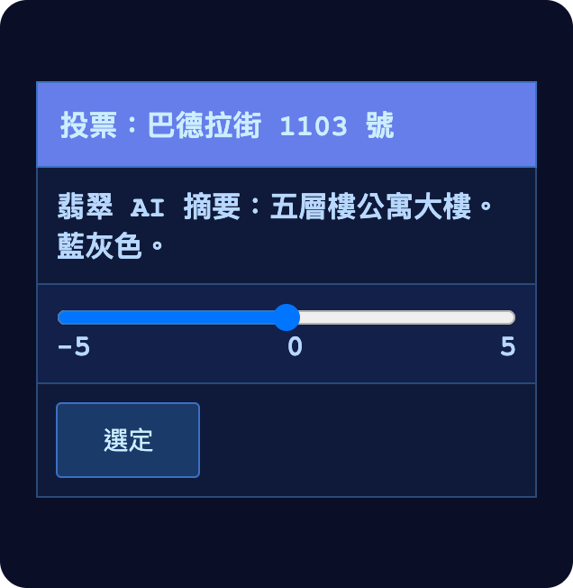
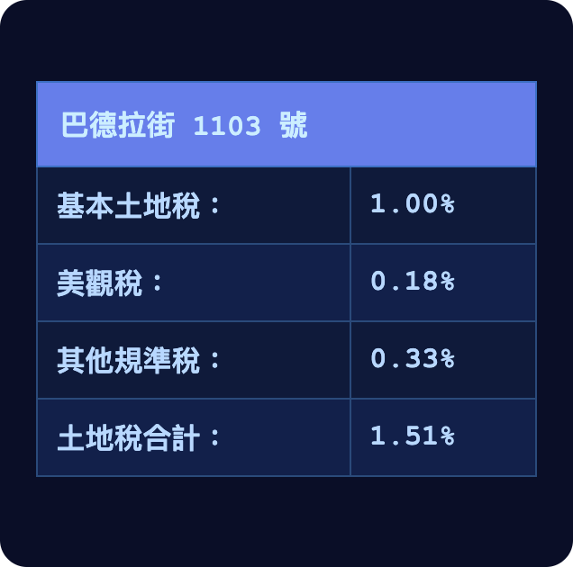
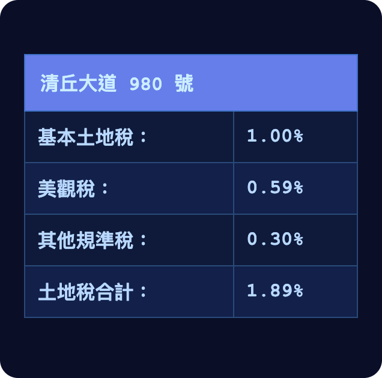
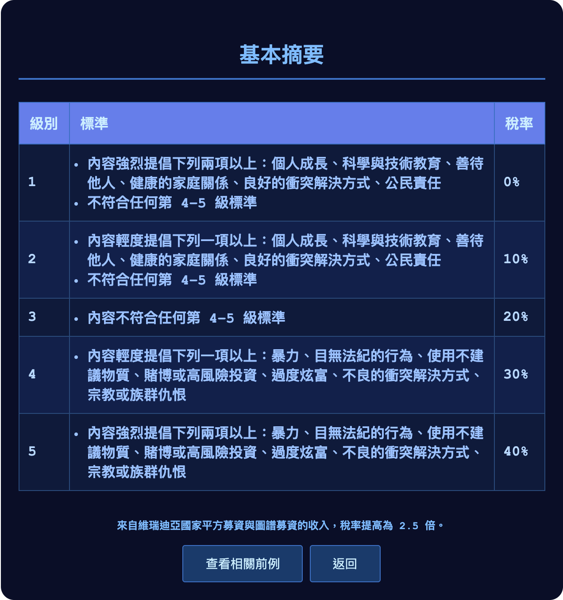
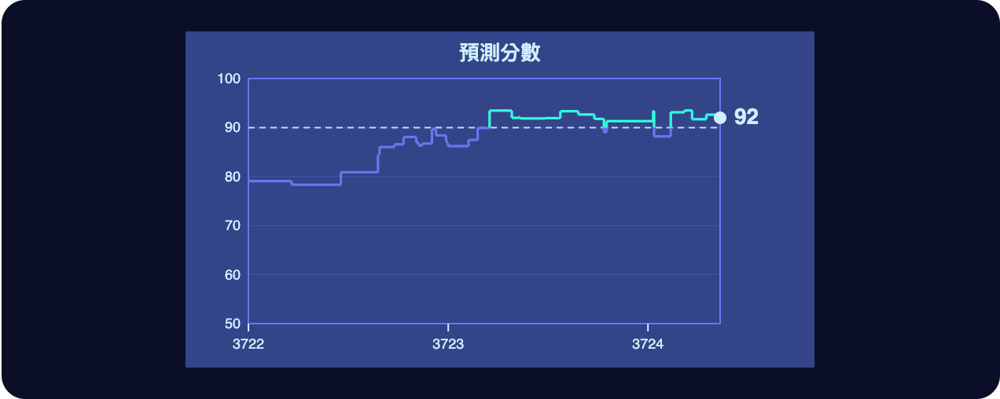

# 第一章

維瑞迪亞，梅爾丹·3724 年雪月 3 日

格拉迪亞斯走在一條步道上，兩旁的樹長得很高。

樹後面，左右兩側都是大石磚砌成的房子，一派中世紀風格。不過，一千年前真正的中世紀建築會有的那些東西——堆在一旁的雜物、地上的塵土，還有其他種種瑕疵——這裡一樣也沒有。有幾棟房子掛著小招牌，賣衣服、賣花，也賣吃的。每棟房子看起來都和周圍散落的葉子、植物與樹木融成一片，找不到接縫。

他看了看四周，吸了一口帶著草木味的空氣，停下腳步，享受片刻的自然。這裡的草木夠密，四下也夠安靜，讓他差點忘了，自己人就在維瑞迪亞首都梅爾丹的卡利馬區正中央。

忽然，一架小型無人機從頭頂飛過。

格拉迪亞斯下意識看向手錶。幾乎就在同時，綠色勾號亮了起來。

他還沒完全弄清楚發生了什麼，手錶已經走完零知識驗證協定，拿到一份密碼學認證。認證確認了兩件事：這架無人機是玩具；它的導航演算法設有安全覆寫機制，未經許可，不會讓它飛進任何人身邊五十公分以內。

手錶知道了這架無人機沒有威脅——除此之外，什麼也不知道。

無人機飛走了，沿著左邊岔出去的那條人行道上空繼續往前。就在那一下，格拉迪亞斯瞥見了它的樣子：一顆小球，三面都有羽毛似的旋翼。

緊接著，一個小男孩跳了起來，趁它還在半空中，伸手一把抓住。

「我拿五分！」男孩興奮地大叫。

格拉迪亞斯又悠閒地看起四周。剛才接住球的男孩和家人在一起。這家有四個孩子，比較小的兩個各騎著一輛三輪車。

右邊也岔出一條人行道。格拉迪亞斯看見一位奶奶帶著一個小孩，兩人走近一張長椅，看樣子要停下來。長椅上原本坐著一對情侶，不等她開口，就先起身讓座。奶奶道了謝，帶著孩子坐下。

這一路上，格拉迪亞斯耳裡一直播著翡翠的語音課程。翡翠是本地 AI，在他的手持裝置上執行。課程講的是空氣傳播病毒的種種細節，也教人怎麼計算：一棟建築的通風或人口密度做了某個改動，在流行病期間，可能讓全市的病例總數受到多大影響。

------------------------------------------------------------------------

格拉迪亞斯繼續往前走。沒多久，兩旁的房子換成了濃密的綠色灌木叢；灌木叢一過，步道便開始緩緩往上彎。

步道平順地一轉，忽然就成了一座天橋，橫跨在一條繁忙的馬路上。許多車子和自駕巴士從他腳下駛過，其中還有幾輛自動送貨車，車聲一陣陣從橋下傳上來。

一陣冷風迎面吹來。

「暫停，我想看看風景。」格拉迪亞斯對翡翠說。

出於習慣，他這句話說得極輕，輕到只有喉部肌肉在動，嘴唇間沒有發出半點聲音。緊貼在他脖子上的那條絲質布帶，還是一字不漏地收到了。

他在天橋中央停下，轉向左側，往前方望去。腳下這條繁忙的馬路往前延伸大約兩公里，接著向右轉。過了轉彎處，看得見一座長滿樹的山。山坡下半部有幾處，冒出幾棟十五層樓左右的公寓大樓，高高突出在樹梢上。大樓的造型和裝飾都像放大版的中世紀城堡塔樓，只是側面的窗戶多得多。

格拉迪亞斯又一次轉頭看向左邊，最後看了一眼這片自然世界。維瑞迪亞的大自然真美，他想。

然後他把臉轉向右邊。馬路在那一側越過天橋繼續延伸，兩旁的建築密集得多。

今天，他的工作是對人類的世界發表意見。

他重新邁開步子，走下天橋。這時左手邊是一排五層樓的公寓，中間穿插著步道，還有賣各種東西的小店。步道和人行道上方，都有高大的綠樹遮陽。

右手邊則是一道高高的隔音牆，漆著綠色和藍色，藏在另一排更茂密的高樹後面，幾乎看不見。

沿著隔音牆走沒多久，他的手持裝置就震動了。

格拉迪亞斯馬上就明白要他做什麼。身為維瑞迪亞公民，他經由密碼學抽籤被隨機選中，要替這棟建築投票：他有多喜歡它？

這種投票的用意，他還記得小時候在維瑞迪亞的公民課上學過：每棟建築要繳多少公共美觀稅，就靠它來決定。而美觀稅在綜合土地稅裡占了很大一塊。

開發商對這件事都很在乎。在維瑞迪亞，房子蓋得讓大家看了順眼，不只是展現手藝的機會——還真的能賺錢。

格拉迪亞斯看了看那棟建築：巴德拉街 1103 號，藍灰色。它看起來和這條街很搭，跟同一條街上的其他建築差不了多少。風格現代，卻不失品味，和他在自由城那類地方的照片裡看慣的那種毫無靈魂的方正水泥建築完全是兩回事。兩側都有步道，步道上都有樹蔭，和附近其他建築一個樣。

格拉迪亞斯這才發現：這一票還真難投。

為了找點靈感，他揮了一下手持裝置，看看附近*其他*幾棟建築都繳多少土地稅率。先看他要投票的這一棟。

接著他轉向左邊，用手持裝置拉近畫面，對準最先找到的幾棟真正與眾不同的建築。

一棟是木材和石材混搭的建築風格；一棟屋頂上有花園；第三棟小一些，但看起來更豪華，蓋成正八面體，基地周邊圍著一圈排列得很漂亮的方形花園，四個角上各有一棵長滿紅葉的楓樹。

這三棟的美觀稅都明顯比巴德拉街 1103 號低，其中一棟甚至略為負值。

然後他又把畫面拉近，對準遠處另一棟勉強看得出來的建築。隔了這麼遠，街道兩旁濃密的樹巧妙地把它擋住了；手持裝置卻輕輕鬆鬆就鎖定了它，下載了一張近照和各項稅率。

那是一家航空公司的總部。這家公司突發奇想，把辦公大樓蓋得像一架飛機。

建築本身確實令人驚豔，他想。但要是每天早上都得從它旁邊走過，他肯定要討一點補償。

他查了一下它的稅。

應得的，格拉迪亞斯心想。

不過，維瑞迪亞的制度讓品味和他天差地遠的人也能表達自我，這一點他還是很慶幸，即使這些人得為這份特權付錢。

格拉迪亞斯猛然把心思拉回任務上。他要投票的，是正前方那棟藍灰相間的建築。他又看了一次介面。

他想起來了，這是平方投票。系統會自動校正他的評分尺度：他所有的票都會被平移、拉伸或壓縮，直到平均值是零、平方的平均值是一。

所以什麼都給高分、什麼都給低分，或每一票都給得很極端，全都沒有意義。最好的投法——*在數學上可以證明是最好的*——是*方向*照自己覺得對的投，*強度*也照自己覺得對的投，不多也不少。

格拉迪亞斯犯難了。每棟建築被課的美觀稅，看起來……已經很公道了？說不定那棟飛機大樓還被罰得*太*重了一點。讓這種建築留在那裡，不只是對「自己的地自己作主」的自由讓步，它也實實在在讓梅爾丹多了變化。反正那一帶本來就是企業區，有這麼一棟，也許無妨。

想到這裡，他才提醒自己：他投的不是飛機大樓，是巴德拉街 1103 號。

對，他心想。那到底要怎麼投？支持，還是反對？

想了一會兒，他最後全憑直覺拍板，把滑桿往右推了一點點。

他按下「選定」。

剛才只是暖身，他想。他以維瑞迪亞公民的身分被分派到一場美觀投票，時間又剛好落在他以掌舵會見習生身分要投的一場更重大的票之前——純屬隨機的巧合。剛才那一票已經很難了，接下來那一票還會難上許多。

而且這一次，系統會記分。

他繼續往前走。一分鐘後，他走到隔音牆上的一道開口前。他要去的演唱會，入口就在這裡。

------------------------------------------------------------------------

入口閘門上有個圓圈，外框亮著綠光。格拉迪亞斯把手持裝置湊過去，稍等了一下：裝置先產生一份密碼學證明，嵌在閘門裡的機器再把它驗證過。

「驗證完成，歡迎。」機器說。

閘門得知：有個人帶著一張有效、還沒用過的憑證來了——除此之外，什麼也不知道。

他穿過閘門，往演唱會的主場區走。

觀眾裡有幾個人和他一樣，穿著維瑞迪亞招牌的隱私袍。那是一件寬鬆的深紫色長袍，兜帽罩住頭，袍身一路往下遮到腳踝，把全身包住。腳踝以下，穿隱私袍的人一律是同樣深紫色的鞋子。

其他人多半穿著簡單的上衣，有的素色，有的印著自己最愛的樂團的標語。

有人和格拉迪亞斯一樣，目標明確，腳步俐落地往前走。有人在跳舞。有人在聊天。也有人只是不慌不忙地往前走，單純想輕輕鬆鬆看場表演。

格拉迪亞斯走進一大片空地。四周圍著高高的隔音牆，正是他先前看到的那道牆，只是這回換成從裡面看。

他往人群裡擠。聲音越來越大，低音一下一下震在胸口。

他拉了拉隱私袍前方臉罩上的束帶。束帶收緊，把鼻子以下和鼻子以上隔了開來。幾分鐘前他還在聽那堂空氣傳播病毒的課程，課程讓他格外留意，別讓自己生病。

沒多久，他就到了舞台區，Dreadknot 主唱粗啞的嗓音聽得一清二楚。

> 我們迎向他們，滿腔怒火燃燒
>
> 用閃亮鋼刃和飛鏢，將他們的皮肉剝掉

格拉迪亞斯又拿出手持裝置。

來看演唱會的人，大多是為了享受音樂、和朋友一起玩。對格拉迪亞斯來說，這當然稱不上*理想*的娛樂，他喜歡的音樂要輕柔、溫和得多。但他也不*討厭*。

他最主要是從人類學的角度，覺得這場演唱會很有意思：這群人平常和他很少有交集，在這裡，正好可以看看他們喜歡什麼、有什麼樣的情緒。

不過說到底，他來這裡，為的是一件完全不同的事。他看了看手持裝置上的這條規準：

在維瑞迪亞，真正被嚴格*禁止*的事少之又少。

Dreadknot 想的話，大可讓每一首歌都高喊「北極皇帝萬歲」、「希望所有政府官員都被虐殺」，一遍又一遍，喊個不停。他們永遠不會被封殺，也不會去坐牢。

維瑞迪亞*確實*有的，是一套套錯綜複雜的稅與補貼制度。負責維護這些制度的，是一個叫掌舵會的團體：和政府有關聯，卻是去中心化的。

掌舵會的一部分叫守律者，負責投票決定稅務規準；稅怎麼課，就看這些規準。另一部分叫哨兵，負責稽核個別企業，每做一次稽核，就替某家企業在某條規準上定出一個位置。格拉迪亞斯是見習生，也就是受訓中的掌舵會成員。

而今天，他的任務是評估 Dreadknot 在公開演出社會影響這條稅務規準上，落在哪個位置。

> 夜裡城市燃燒，濃煙升起
>
> 凡我們目光所及，無處可躲避

格拉迪亞斯點了「查看相關前例」，一路往下捲。接著他按下側鍵，右上角跳出一個小視窗：「翡翠聆聽模式已啟動」。他一句話也沒說，就只是讓翡翠聽 Dreadknot 唱歌。可是聽了五分鐘，相關前例也只出現寥寥幾條。

他把模式切到「分析」，讓它再聽五分鐘。翡翠列出幾條結論，聽起來都還算合理，但格拉迪亞斯看得出來，這些結論靠不住。

這類音樂的原始資料實在太少，翡翠 AI 給不出好答案。說到底，什麼時候該聽翡翠的，什麼時候該讓自己的直覺多做點主，本來就是他的工作。

這一次，靠直覺。

嗯，這首歌確實很暴力。

但另一方面，維瑞迪亞一百多年來的公民傳統，一向把*鼓吹*暴力和單純為了娛樂效果而*展示*暴力，當成兩回事。格拉迪亞斯看得到、也聽得到觀眾在跳舞、歡呼，享受著音樂。他們看起來玩得很開心，並不是滿懷仇恨、要起來對付誰。

可是，還有*另一個*另一方面。格拉迪亞斯知道，近年來的哨兵已經不像從前那麼看重這個區分；他們似乎把一個更柔和、更溫和的社會，幾乎當成了目的本身。

這是不是當初制定這條規準的守律者想要的？對社會來說，又是不是對的？格拉迪亞斯不太確定。

再過幾個月，他就會成為正式哨兵，能自行決定的空間也會大一些。但眼下，他能自己作主的範圍有限：系統會記分。

格拉迪亞斯低頭看向手持裝置。

見習生做過的稽核，有一成會交給哨兵再做一次。見習生的分數，看的就是這一成：他們的票能把哨兵的判斷預測得多準。

格拉迪亞斯今天的分數是九十二。只要守在九十以上，他就能入選，成為哨兵——要是他改了主意，也可以當守律者。可是哪怕只掉三分，他的職涯就得擱下來，至少再等一年。

畫面其他地方塞滿了聊天訊息。

這次稽核分派了九名見習生，三人一組，共分三組。他這組另外兩個人談不攏：一個堅持第三級，算是中立的判定；另一個比較嚴，非要第四級不可。

格拉迪亞斯嘆了口氣。另外兩組的想法，大概也差不多。

先簡化一下：假設其他每個見習生都是在第三級和第四級之間擲硬幣。依二項式公式，其他六人也剛好三比三對半分的機率，是六取三的組合數——20——除以 64，大約百分之三十一。

要是其他人的票*不是*擲硬幣呢……呃，那就太難精確算了，但肯定比較低，就算百分之二十吧。

兩、三成的機率，他這一票會大幅左右 Dreadknot 明年的稅率。

喔，太好了。這下是真的要負責任了。

格拉迪亞斯又朝人群看了一圈。第一首歌唱完了，他聽見大家在歡呼。

一股勇氣忽然湧了上來。那一成預測分數受損的風險，他認了。他不再多想，按下第三級。

短短一瞬間，他為自己的決定感到驕傲。

「喂，大家快看，是掌舵會的人！」他身後有人大喊。

------------------------------------------------------------------------

格拉迪亞斯嚇得渾身一僵。腦子還沒轉過來，眼睛已經先掃過整個場地，找到了最近的出口。

他立刻明白是怎麼回事。

掌舵會的安全靠的是成員的隱私，防範有人施加影響或行賄更是如此。成員嚴禁透露自己被分派的任務。

為了讓成員認真看待自己的隱私，有一種刻意設計出來的遊戲，逼得他們時時不敢鬆懈。管理掌舵會運作的是一個去中心化的密碼學網路，任何人都能連上去，猜某位成員被分派了什麼任務，連同一小筆保證金一起送出。猜對了，那位成員就會被扣薪，猜中的人拿走其中一半當獎勵。

他還來不及多做反應，附近另一個同樣穿著隱私袍的男人突然拔腿，往右邊的逃生門衝去。十公尺內的人全都掏出手持裝置，對準他錄影。

這又是怎麼回事，格拉迪亞斯也立刻明白了：誘餌。某個路人無私地把眾人的注意力引到自己身上，好讓格拉迪亞斯有機會脫身。

格拉迪亞斯轉身想跑。一步都還沒跨出去，就看見正前方有個高大魁梧的男人，手持裝置直直對著他的臉。

他僵住了。

一開始，他以為自己完了。腦子飛快轉過各種可能，想找出任何一條出路。

最後，那個深思熟慮的哲學家格拉迪亞斯退到一旁，換另一個格拉迪亞斯上場。這一個更有想像力，也更頑皮——從國中的下課時間之後，他就再也沒醒來過。

格拉迪亞斯往右邊看。

「等等，那是北極皇帝的新檄文嗎？」他問。

男人一臉困惑，順著他的視線看過去。就在這一刻，格拉迪亞斯一把搶過男人手中的手持裝置，猛地轉身。

「刪除過去一長時內的所有音訊、圖片和影片。重新開機。」

他拔腿就跑。幾拍之後，裝置回應：「已刪除 4 個檔案」，畫面上短暫閃過幾張照片和影片的截圖。右下角那張，拍的是格拉迪亞斯的臉。

螢幕隨即一黑。

他把手持裝置往空中一拋，希望追他的人寧可保住自己的裝置，也不想再追他。他腳下沒停，繼續跑。

鞋子拖慢了他的速度。那雙鞋有高跟，把他墊到和其他穿袍子的人一樣高；鞋底也刻意做得高低不平，讓步態變得隨機。即使如此，他還是很快就跑到了出口。人群被其餘的騷動分了心，似乎沒有察覺。

他出了演唱會場地，跳上一輛本地的自駕巴士。

------------------------------------------------------------------------

巴士上幾乎是空的。

格拉迪亞斯左手邊有兩個人，都穿著隱私袍，是男是女、是老是少，他看不出來。右手邊是個青少年，穿著普通的衣服，揹著背包，看樣子是剛放學要回家。

他的視線飄到車廂內壁的廣告上。

第一則是張海報，提醒維瑞迪亞人終身學習有多重要。海報左半邊是一間教室的圖：一個孩子、一位中年女性，還有一位年紀大得多的男人，三個人一起讀著課本。右半邊寫著：

> 學校教育到 20 歲。教育，是每個維瑞迪亞人終其一生的責任與義務。
>
> 維瑞迪亞圖譜募資補助的教育計畫，適合各個年齡層。今天就來了解。

第二則廣告是海卓菲的。這個牌子賣水，也賣各式各樣的飲料。二十年來，在維瑞迪亞掌舵稅溫和的引導下，它們的飲料一步步變得幾乎完全無糖。

廣告左邊是海卓菲經典的黃綠配色瓶子，右邊寫著：

> 海卓菲
>
> 超過 2,000 種已知毒物與不建議物質，我們的飲料一概不含。我們引以為傲。

格拉迪亞斯笑了。

剛才被選中要投票的，要是這則海卓菲廣告，而不是那棟藍灰色的建築就好了。換成這一則，他很清楚，自己幾乎會把滑桿一路推到最右邊。

這世界需要多一點樂趣。

------------------------------------------------------------------------

十五分鐘後，格拉迪亞斯下了巴士，沿著街走沒多久就到家了。他推開門。

「賽菈，在家嗎？」他喊了一聲。

「剛剛在寫部落格文章。」賽菈應著，從房間走出來迎他。

「那，晚餐想吃什麼？」

「嗯，哲戈餐車再七分鐘就到了，要不要再吃一次？」

「好啊！你應該又是十號餐吧？」

「對！」

「好，那我這次換十三號餐。」

賽菈拿出手持裝置，開始下單。

樓梯上傳來咚咚咚的腳步聲，又重又響，一路往下。

「爸回來了！」

喊的是年紀小的那個男孩，茲文。他一次跳三階衝下樓，跑過來抱住格拉迪亞斯，格拉迪亞斯也由著他抱。

年紀大一點的費布里克已經是青少年了，下樓的腳步慢得多。他一手拿著手持裝置，另一手拎著一台大一點的運算盒，兩樣東西之間連著一條線。

「我們要叫哲戈餐車。你們要吃什麼？」格拉迪亞斯問。

「四號餐！」費布里克說。

「五號餐，我贏了！」茲文大喊。

「莉莉跟赫蕾妲呢？」

「莉莉在廁所。赫蕾妲放學後去上數論課，再一長時才會回來。拜託，你明明知道她每次都點九號餐。」

廁所門開了。莉莉慢慢走出來，眼睛盯著地板。

賽菈嘆了口氣：「怎麼了？」

「歷史考六十分。隨便啦……」

賽菈轉過身，伸手抱住莉莉，輕聲說：「不用每樣都拿手，沒關係的。」

莉莉把臉轉得更開，不看賽菈，也不看其他家人。接著她往前跑，在沙發上坐了下來。

賽菈又嘆了口氣，替莉莉點了八號餐，按下訂購。

格拉迪亞斯、賽菈、茲文和費布里克在餐桌旁坐著等。

沙發上，莉莉拿出手持裝置，盯著螢幕飛快地點個不停，全副心思都在某個遊戲上。到底是什麼遊戲，格拉迪亞斯和賽菈始終看不清。

這是格拉迪亞斯和賽菈跟孩子們一起吃的倒數第四頓晚餐。

四個孩子裡，茲文和莉莉是他們倆的；費布里克和赫蕾妲則是共養家庭那邊的，也就是維爾叔叔和黛亞阿姨的孩子。再過四天，維爾叔叔和黛亞阿姨會來把四個孩子全接走，接下來半年換他們照顧。

格拉迪亞斯嘆了口氣。孩子們走了，他會想念；可這六個月的自由，他也一樣期待。

「我們還是要去維爾叔叔那邊住六個月嗎？」茲文問。

「當然啊！」賽菈說。

「耶，我最喜歡維爾叔叔了！」

「對我來說，維爾是*爸爸*！」費布里克特地提醒大家。他又想了一下，補上一句：「格拉德叔叔、賽菈阿姨，我也愛你們兩個！」

「我也愛你。」

門鈴響了。格拉迪亞斯走去開門，接過一整袋餐盒，放到桌上，再照盒子上的號碼一個個拿出來，發給每個人。格拉迪亞斯、賽菈、費布里克和茲文都開動了。

「維爾來了以後，你有什麼打算？」格拉迪亞斯問。

「我要去自由城待個一兩個月，見見楊恩，說不定還能想到一篇寫聯合城邦的部落格文章。他們的共同治理，我已經讀了那麼多，其實滿期待親眼看看，這些東西跟當地的實際情況到底是怎麼接在一起的。」

「不錯嘛！我打算去森林裡走幾趟長路，再跟 AI 一起好好鑽研環境與生物規準。還要再做四次稽核，才能當上哨兵！」

格拉迪亞斯和賽菈繼續吃飯。

莉莉不聲不響地走到桌邊，也打開了她的餐盒。

就在這時，格拉迪亞斯的手持裝置震了一下。他拿出來看，螢幕上只跳出一則通知。

幾拍之後，又來了一則：

