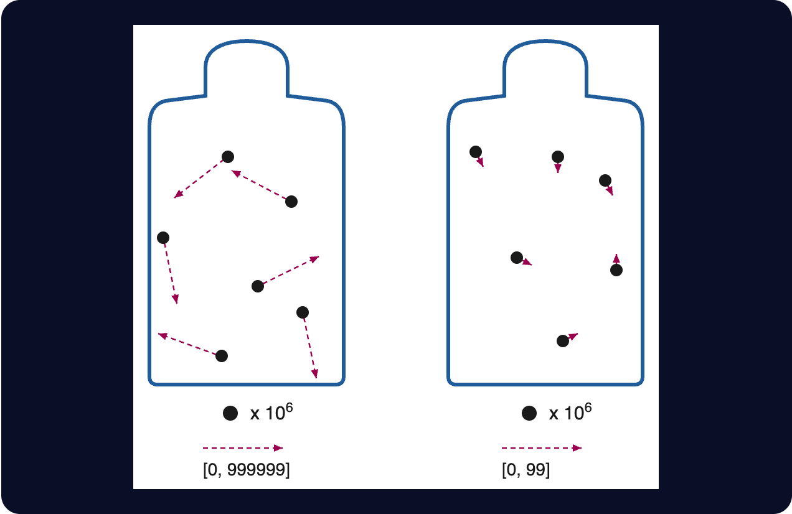
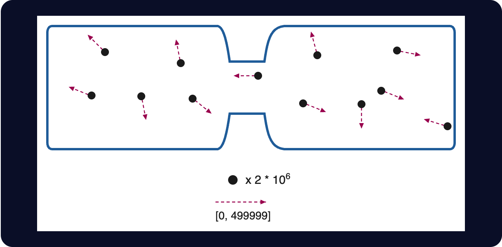

# 第二章

哲戈，帕佛蓋都·3724 年雪月 5 日

汾和澤下了自駕巴士，沿著洪民街往前走。

洪民街在帕佛蓋都算是比較熱鬧的商業兼工業街道。兩旁的招牌閃著彩色燈光，賣的全是電子產品：手持裝置、手錶、運算盒、照明、電池、感測器，什麼都有。店面之間夾著一間間迷你工廠，做各種精密裝置，有幾處甚至在做電腦晶片，裡頭傳出機器運轉的聲音。

這一帶的建築都只有一兩層樓高。不少招牌底下，就是通往地下的樓梯。

左手邊有兩間店並排。一間賣感測器，什麼種類都有：攝影機、麥克風、生物與化學感測器、空氣品質監測器——當然，還有專門用來偵測感測器的感測器。

另一間賣阻訊箔。這是很常見的材料，很多種房間預設都會用上，用來擋掉無線訊號。

隱私與透明，監控與反監控。守護哲戈人的安全，靠的就是這一體兩面。

兩間店中間有一塊招牌，上面用大字寫著：

zui fia kun zun

「地下安全處」。

「gie fe kiu kai ci bin hu。」澤在心裡默念。「扎根，無首。」半個世紀以來，哲戈就是靠這套戰略成長，也靠它保護自己。

兩人繼續往前走。馬路和人行道之間種了一排樹，走在樹蔭底下很舒服。

一架無人機嗡嗡飛過頭頂。

下一刻，兩人的手錶輕輕一震。手錶裡的軟體已經跑完驗證協定，確認那是一架友善的保全無人機：出自一批通過所有檢驗的產品，跑的也是友善的演算法。

飛過、驗證、確認，整串流程在幾百毫拍內就結束了。汾和澤幾乎沒察覺剛才發生過什麼。

「昨晚明盤台打得怎樣？」汾問。

「拿了第三名！我終於想出一種牆的結構，能把他們的滑翔機原路彈回去，把他們的地盤整個攪得一團亂。」

「你呢？」

「在無聊學校準備地理考。」

「我猜，很無聊？」

「對啊。現在上到聯合城邦，學校就只會叫我們背那一大堆共同治理比例。自由城在德文維爾有百分之五的票，德文維爾在紅郡有百分之十五的票，紅郡在……」

「那這整套制度到底有沒有用，你有什麼新看法嗎？」

「哪有可能，批判治理研究要上了大學才會教。」

「就像化學要到高中才會教那樣？」

汾笑了出來。「那 DU 現在是打算用十天上完一整年的批判治理研究嗎？」

他們要去的地方就是 DU——「去中心化大學」，哲戈語叫 *dzu hu sun du*。澤想起得準時趕到，看了一眼手錶。

「剛到六萬九千。教室的確切位置隨時會解密廣播出來。」

手錶一震。澤收到了一則通知。

澤停下腳步，把手錶亮給汾看。

「咦，黃色勾勾。看來升級成新的密碼學證明系統了，今天上課時得記得同步一下我們的代碼。」

「又換？」

「大概吧。聽說北極帝國越來越囂張，我們這邊也跟著加強安全。」

「好，總之上面寫孟桂街 1842 號。我們……剛經過洪民街 1990 號。所以是在後面。」

「那就在這裡左轉上第 20 街，再左轉上孟桂街？」

澤在腦子裡把數字核了一遍。有名字的街每兩百公尺一條，從 H 開頭的街到 M 開頭的街，隔了四條街。門牌號碼就是公尺數，從 2000 走到 1842，是一百五十八公尺。八百加一百五十八……總共要走九百五十八公尺。時間到七萬就上課，所以他們還有不到一千拍，也就是一般說的十分鐘。慢慢走是每拍一公尺，汾和澤又走得快。

時間夠。

「好啊！」

兩人加快腳步，好確定能提早一點到。

幾分鐘後，他們到了。「啊，汾，你來了！」一個年輕女子喊道。

有人領著汾和澤往下走了兩段樓梯，台階上有點灰塵。

到了底下，另一個男人已經等在那裡，把他們攔下。「計畫有變，現在改到地下一樓對面那間。」

澤嘆了口氣。

四個人又往回爬了一段樓梯，走進一間大房間，在其中一排椅子上並肩坐下。

牆上鋪了厚厚一層阻訊箔，弄得有點倉促。箔面上又覆了一層典型的哲戈美學：可愛的卡通動物在玩電子小玩意和化學實驗器材，背景是綠樹和藍天。

房間前方擺著兩隻充氣的卡通動物，左邊是豬，右邊是倉鼠。豬左手拿著一台計算機，倉鼠右手拿著一小瓶不知名的綠色液體。兩隻再各用另一隻手，一起舉著一張海報，上面是 DU 的校訓：

pa jan li sun zo

zai gau fe pa jan

go li sun zo

bai gau fe go

「一人學習，使一人自由。一國學習，使一國偉大。」

講師從他們身後走進來，帶上了門。澤看了一眼手錶：70,001。

------------------------------------------------------------------------

「歡迎來上物理課。」講師說。

「今天我想試著講一個很重要的主題。我覺得幾乎每個人都會被它搞糊塗：熱力學。」

比較專心的學生收起手持裝置，不再交談，準備聽課。其餘的人起先還在講話，但很快也安靜下來。

坐在澤旁邊的女生看都沒看，伸手到桌緣底下，用一根手指沿著邊摸了一遍。那是習慣，不是真的在找什麼。另一個學生也照例拿著手持裝置朝教室四周揮一圈，看能不能偵測到任何不明電子裝置。

沒有人說什麼。從來沒有人說什麼。

「有誰聽過『熵』這個詞？我是說在資訊理論或密碼學裡。」

大約四分之三的學生舉了手。

「那在熱力學第二定律裡聽過『熵』的呢？熵永遠會增加——其中一種方式，就是熱永遠從熱的地方流向冷的地方，絕不會反過來。」

幾乎每個學生都舉了手。熵是科幻小說最愛的題材之一。

「那有誰覺得自己能解釋，這兩者有什麼關聯？」

沒有人舉手。

「好，那我們開始。」

講師按了一下手錶上的按鈕，前方牆面出現一張投影片：

「想像我們有兩罐氣體，每罐都有一百萬個分子。不過，左邊那罐的分子跑得快得多。假設左邊那罐的速度可以用六位數來表示，從零到 999,999；右邊那罐的分子跑得很慢，所以速度可以用六位數表示，從零到 99。」

「誰能告訴我，要把左邊那罐裡發生的一切完整描述出來，需要幾位數字？假設對方已經知道這是氣體、知道有一百萬個分子，唯一的變數就是速度。」

「六百萬！」大約十個學生齊聲大喊。

「很好。那右邊那罐呢？」

「兩百萬！」

「我們整理一下。你們是觀察者。從你們的角度來看，你們知道這兩罐都是氣體，知道是哪一種氣體，也知道有一百萬個分子；但每一個分子的速度，你們並不知道。所以左邊那罐，*你們不知道的資訊量*是……？」

「六百萬位數！」

「右邊呢？」

「兩百萬位數！」

「所以加起來，你們不知道的資訊總共是八百萬位數。好，如果把兩罐接在一起，讓氣體混合，會怎麼樣？我們對裡面的速度又會知道些什麼？」

澤舉起手。

「好，你說說看？」

「分子會隨機互相碰撞、彈開。等穩定下來，因為能量守恆，速度最後會落在中間某處，在零到五十萬之間。」

「沒錯，非常好！嚴格說起來，能量跟速度的平方成正比；這些速度該怎麼表示，也還有得吵；順帶一提，我們還完全忽略了位置。不過先簡單一點，就說零到五十萬吧。」

講師又點了一下手錶。下一張投影片。

「那麼，這個新系統裡我們不知道的資訊，要用幾位數字才寫得下？」

另一個學生舉手。

「你說。」

「零到五十萬，超過五位數，又不到六位數。照對數算，每個分子大概是五點七位。」

「那總共呢？」

「一千一百四十萬位數。」

「非常好！所以結論是：兩罐一混，我們就失去了知識。對這些氣體，我們知道的比以前少了。而且失去了*多少*，還算得出來：三百四十萬位數。」

「我們說熱從熱的東西流向冷的東西時熵會增加，指的就是這件事。每一小份熱都是這樣：拿它去加熱冷的東西，多出來的未知位數，比讓熱的東西冷掉同樣一份所少掉的還多，所以未知的總量會上升。對這兩個罐子，你能做的任何動作，平均來說，都只會讓未知的總量維持不變，或者上升。只要你做了任何有用的事，或犯了任何錯，它就會上升。這就是熱力學第二定律。」

講師頓了一下。

「那這件事要怎麼證明？」

沒有人回答。不過很多學生好像都好奇地往前傾了一點。

「用反證法。假設我們真的有一套神奇的程序，能把過程倒過來跑：從混在一起、未知有一千一百四十萬位數的罐子出發，回到兩罐分開、未知只有八百萬位數的狀態。」

澤又舉手了。

「我可以試試嗎？」

「你說。」

「我記得，我們宇宙的物理定律是完全時間可逆的，對吧？也就是說，任何事只要能往一個方向做，就一定能把同樣的步驟倒過來再做一遍。」

「沒錯。那問題來了：在一顆一顆原子的層次上，物理是時間可逆的；為什麼這反而代表溫度均衡沒辦法逆轉？這不是矛盾嗎？」

「嗯，如果我們*真的能*把中溫分回高溫和低溫，那就能做到無限的資料壓縮。」

「比方說，你手上有一個檔案，裡面是一千一百四十萬位數的資料。你先做一個非常完美的雙罐，再準備一把槍，能用剛好對的速度把氣體分子射出來。然後用你那套程序把氣體分離，把罐子分開，最後量出速度。你會拿到八百萬位數。」

「而我們宇宙的物理是時間可逆的，所以整件事也能倒過來做：把那八百萬位數放進槍裡，用對的速度射出氣體分子，把同一套分離程序原封不動地倒著跑一遍，再量一次，就會拿回原本那一千一百四十萬位數，不管它原本是什麼。時間反轉的過程，輸出一定等於原本過程的輸入。這樣一來，我們就有了一個完全通用的方法，任何一千一百四十萬位數都能塞進八百萬位數裡。既然做得到，就能一次又一次做下去：整個星球都能用八百萬位數表示，甚至再壓小一點，八位數就夠了。可是這是不可能的！」

「完全正確。換句話說，在物理時間可逆的宇宙裡，你沒辦法從『不知道的事比較多』變成『不知道的事比較少』。換成物理時間不可逆的宇宙，你就*可以*了，因為你只要把所有你不知道的東西全部毀掉就好。」

「就跟北極皇帝一樣！」澤很想這樣喊出來，但還是忍住了。

這笑話明顯得很，在場大概有一半的學生腦子裡已經想到了。這種時候還當眾把它講破，太沒格調。

講師和學生們都停了一下，品味這個笑話，暗自偷笑，享受片刻心照不宣的交流。

然後講師繼續講下去。

「但在物理時間可逆的宇宙裡，永遠會有你不知道的東西。這些未知只能搬來搬去，而且免不了會越來越多。我們頂多能做到的，是把『不知道我們在乎的事』，換成『不知道我們不在乎的事』。比方說，這台投影機一邊放這些投影片，一邊把廢熱排出來。從不懂熱力學，變成不知道那些廢熱分子各自跑多快，就是這種換法。」

「同學，答得太漂亮了。你叫什麼名字？」

「澤。」

「好，澤，你答得完——」

附近一個房間轟地傳出一聲巨響，震得耳朵嗡嗡作響。整間教室都在搖晃。

不到一拍，一部分牆壁和地板就轟然塌了下來。

澤還沒搞清楚發生什麼事，一塊碎石已經砸中了他的手臂。

------------------------------------------------------------------------

澤這才發現自己倒在地上，椅子翻倒在身邊。

他腦中閃過一個人：那個在最後一刻把他們改帶到別間教室的男人。那間教室，比他們原本該去的地方高了一層樓。

他一下子就懂了。

DU 一直以來那些多出來的防範措施——密碼學、臨時換地點、阻訊箔——都不只是遊戲。北極帝國也不只是地理課上的一個單元。

這些都是*真的*。

「大家都還好嗎？有沒有人受傷？」講師大喊。

澤想了一下，想判斷這隻手臂傷得夠不夠重，值不值得抱怨。他試著把手臂抬起來，再放下。

手臂沒有反應。

接著他感覺到兩隻手抓住他，把他從地上拉起來，扶到一張椅子上。澤轉頭一看，是汾。

澤鬆了一口氣：汾一點傷也沒有。

教室裡滿是嗆鼻的煙。學生的手錶功能很多，空氣品質監測器也是其中之一；這時每個人的手錶都大聲嗶嗶叫了起來。大家點了點手錶，嗶嗶聲很快就停了。

學生們慢慢互相扶著站起來。講師在教室裡來回走，看有沒有誰傷得重、真的需要幫忙。

講師走到澤面前。澤沒說話，指了指自己的左臂。講師拿出手持裝置掃了一下，螢幕下方隨即填滿 AI 生成的結果。

「會痛嗎？」講師問。

「有一點，還撐得住。」

「看起來是骨折。今天就去醫院檢查，越早去，好得越快。」

「我帶你去。」汾接著說。「月底還有你的比賽，得確定你到時候沒問題。」

講師繼續往下一個人走。教室裡還是一片煙，空氣品質警報也還響個不停。不過汾和澤仍聽得出講師在問不同的學生「你還好嗎？」，也聽到有個學生回答「我沒事」。

空氣過濾系統開到最大功率，煙很快就散了。汾和澤互看一眼。有那麼一會兒，學生和講師都坐著，誰也沒開口，氣氛很尷尬。

澤用沒受傷的那隻手撐著桌子，站了起來。「我想，我們對這面牆的了解，比兩分鐘前少多了。」他開玩笑說。

幾個學生笑了，有的只是微笑，有的輕輕笑出聲。大家的心情，他抓得沒錯。

「真的沒有其他人受傷了？大家都確定嗎？」

「我沒事。」大概有十個人這樣回答。

「好，我想今天的熵已經夠多了。大家回家吧。」

------------------------------------------------------------------------

其他人陸續離開，汾和澤沒有走。

澤又坐回椅子上。汾抓了把掃帚，把殘骸全掃到一邊，掃帚刮過地面，沙沙作響。沒多久，教室裡就只剩他們倆和講師。

「哇，北極人越來越囂張了。以前他們可不會對物理教育下手。」

「最後一刻幫我們換教室的那個人，不管是誰，真的是天才。剛剛那一下，等於救了我們一命。」

「可惜，我想接下來只會越來越糟。」

汾和澤一臉震驚地看著講師。

「別忘了，他們的打算，就是把我們的重工業和科技永遠壓在低水準。讓我們活下去，但只能活在一個永遠威脅不了他們的文明程度。」

「而我們的反制，就是『gie fe kiu kai ci bin hu』：扎根，無首。我們所有的工具，都用分散式製造來打造。官方政府就讓它照常運作，又慢又腐敗，跟一百年前我們戰敗時沒兩樣；真正重要的決策，則用密碼學匿名協調，不需要任何暴露在外的領導人掌舵。整個 DU 已經是這樣運作的。很快，我們的發電、農業和醫療也會有一大部分改成這樣。」

「這招一直很管用。這幾年下來，我們總算快要做到不靠任何集中式重工業，也能自己站穩腳跟。問題是，看來他們開始察覺了。」

「Dze go ba fau gie。」汾和澤異口同聲，語氣平靜，卻毫不退讓。

「哲戈必將再起。」
