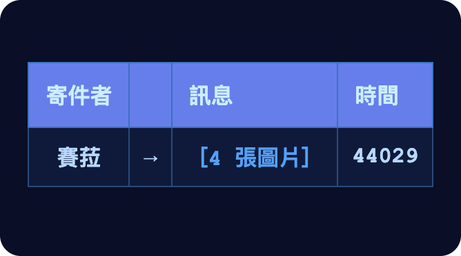
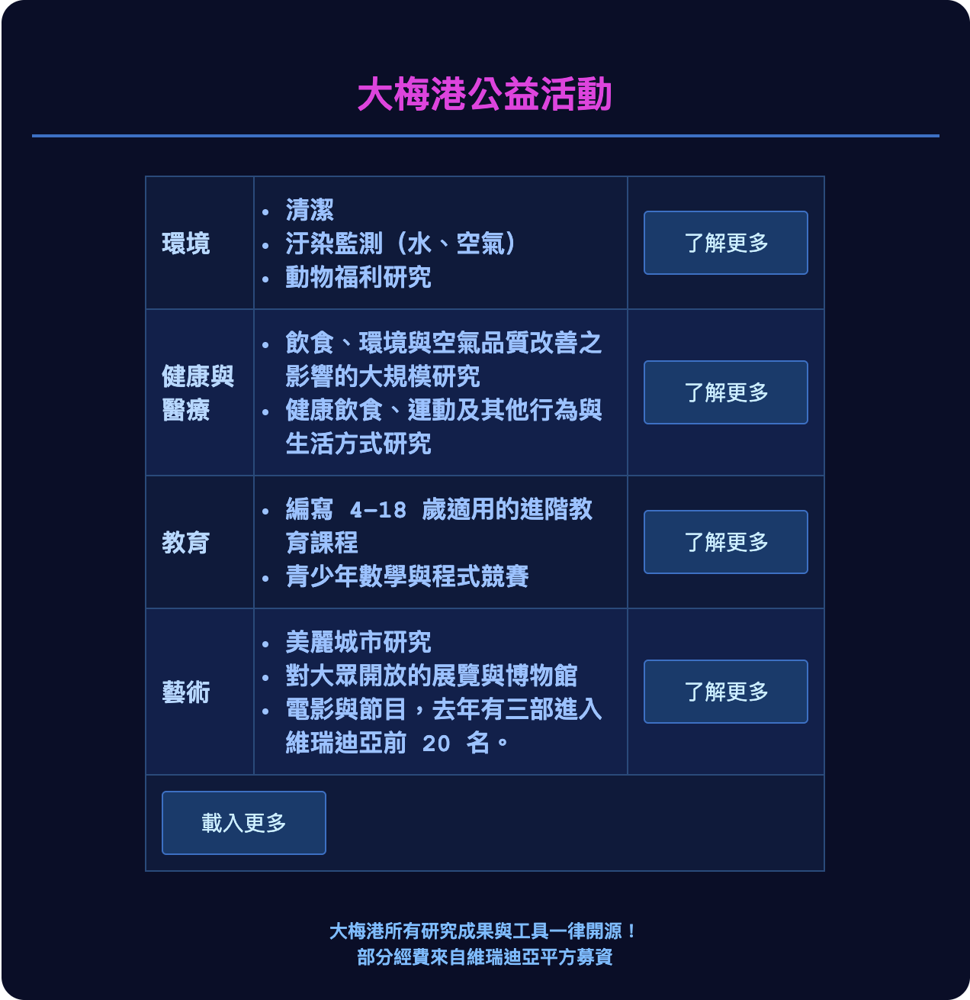
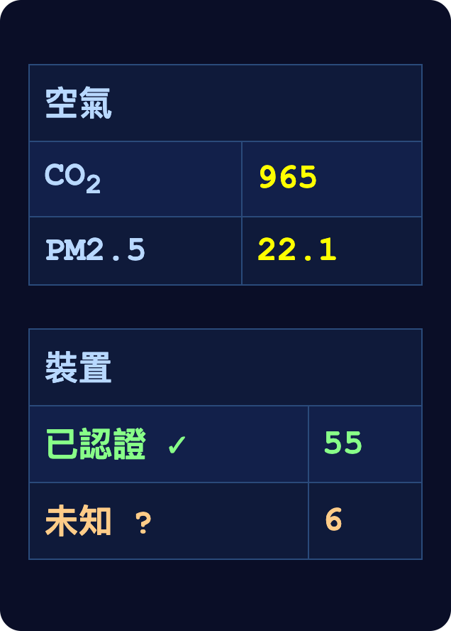

# 第三章

維瑞迪亞，梅爾丹·3724 年雪月 8 日

格拉迪亞斯沿著人行道往前走。路的兩邊，小店一家挨著一家：賣花的、賣衣服的、賣電子設備的，什麼都有。

他過了一條馬路。

對面的路面開始往下斜，順順地接進一條隧道，看不出哪裡是接縫。隧道裡的照明剛好夠人舒舒服服地看東西、讀字，再亮就沒有了。

走到一處 Y 字形的岔路口，牆上貼著一張海報，四個角各用一塊膠帶黏住。格拉迪亞斯在海報正前方停下腳步，看了起來。

「耶，又是北極的宣傳。」格拉迪亞斯心想。

北極帝國當然和大家一樣有言論自由。他只是納悶：什麼樣的維瑞迪亞人，會想去破壞公共環境，把自己的文宣印出來，貼在維瑞迪亞的隧道裡？

他開始盤算，該怎麼把這張海報撕下來。

肩膀上忽然被人拍了一下。

格拉迪亞斯轉過頭。

------------------------------------------------------------------------

「喔，莫夫，是你啊？」

「不是，我是北極皇帝。專程來吸走你的靈魂，不是比喻喔。」

「好啦好啦……等等，穿著隱私袍往大梅港走的人差不多有一百個，我只是其中一個，你怎麼知道我在哪？」

「你一年前把我加進信任名單，後來一直沒刪，所以我們兩邊的本地 AI 有權限開位置分享。你的 AI 知道我們約好先碰個面，等你去見那位神祕紳士時，我再暗中跟著你，所以今天就對我開放了位置分享。」

「啊——原來如此……就是那個什麼什麼情境親密度吧，還是現在又流行叫什麼新詞了。」

「對啊，大概連兩方混淆電路的功能都用不著。」

「那你最近都在想些什麼？」

「嗯，我今年被分到網路媒體的一條開放性規準。我們守律者小組最近一直在討論，要不要把 API 限制的稅調高。一個月前我找了一場公民會議談這件事，他們對現在的情況非常不滿。」

「這件事怎麼現在鬧得這麼大？」

「藍鯨一個月前宣布要砍 API，以後只讓通過驗證的硬體連上平台。他們說是為了擋自動化的垃圾訊息，可是會議上幾乎每個人都覺得，他們其實只是想封鎖替代介面，好把大家的注意力抓得更牢、榨出更多錢。」

「他們具體在做些什麼，我們知道嗎？演算法有沒有哪個是公開的？」

「沒有，演算法完全不透明，光這一點他們就已經在繳最高稅級了。」

「這樣啊……」

「所以啊，很多守律者覺得，這種行為應該再多課一點稅。這樣一來，要嘛他們收手；要嘛，呃，他們照做不誤，網路變得更爛，但政府收到的錢夠多，可以讓每個人都享有更好的醫療。問題是，藍鯨一直在強力反對。最近有個守律者沒顧好隱私，她本人和她的立場都被人查了出來，事情傳開，才過幾天她先生就丟了工作。不知道兩件事有沒有關係，可是，嗯，這就是為什麼這整套稅制非得這樣運作不可：靠一大堆密碼學網路隨機選出守律者，匿名討論、匿名投票，還要穿隱私袍。」

一提到藍鯨，格拉迪亞斯就想起年輕時的事。他當年學寫程式，就是替另一個大型社群平台銀聊寫第三方用戶端。

他也知道，那件事做得成，全靠銀聊的 API 是開放的：平台允許開發者做第三方用戶端，也允許使用者匯出、搬移自己的資料。這些決定，無疑是為了壓低他們在軟硬體開放性規準上的稅率才做的——至少在那些斤斤計較的財務人員面前，是拿這個當理由。

正是那段經驗，讓格拉迪亞斯想要有所回饋，自己也投入掌舵的工作。

「對了，說到隱私，你那位信譽 200 的匿名朋友，你打算怎麼處理？」

「嗯，他跟我說，他覺得整個掌舵機制從根本上就壞了。我想先聽他把話說完。就算是瘋子，通常也至少有一成是對的，而且對在某個有意思的地方。另外，希望能順便找到一點線索，搞清楚他是怎麼找到我的？」

「那……萬一這是陷阱，想再挖更多能拿來要脅你的把柄呢？」

「這個嘛，他要是真想害我，直接把我的身分和任務丟進網路就好，我今年整年都會跟哨兵資格無緣。不過話說回來，搞清楚這種事，本來就是你來這裡的目的。」

莫夫接著敞開隱私袍，從內袋掏出一個大包裹。

「來，談其他正事之前，先換上一件新的隱私袍。以防萬一，你那件說不定沾了什麼髒東西，讓人能追蹤你。北極人把監控裝置走私進來的本事越來越好，進步得比我們偵測的本事還快。我們的被害妄想得再升級一下。」

「要是已經嚴重到這種地步，我們根本就不該當面見才對吧。」

「少來了，格拉德，你不只是快要加入我們、成為哨兵的人，你是我朋友。我喜歡跟你見面——趁現在還見得到的時候。」

------------------------------------------------------------------------

隧道一路往上爬，外頭的光又照進格拉迪亞斯眼裡，有點刺眼。小路兩旁都是樹。

飲水台旁站著兩個孩子在聊天。經過時，他聽出其中一個在說最近跟家人去了一趟北林，另一個說他喜歡那邊的旋翼球隊。

等走到聽不見他們說話的地方，沒多久，手錶就震動了。

他看了看。

是賽菈，從自由城傳來幾張照片。第一張拍的是市中心；第二張是一座大公園，站在入口閘門前拍的。照片左邊有張告示，上面寫了些字。他把手錶湊到眼前，才認出那是一張價目表。

格拉迪亞斯按了個鍵，回她一顆愛心。

視線從手錶螢幕回到街上，他這才發現，自己已經走進梅爾丹比較都會的一帶，四周也商業化得多。

右邊是一整排辦公大樓。遠處那幾棟是玻璃和鋼骨蓋的，通透發亮；只是距離遠，又隔著樹，只看得到一部分。近處的幾棟還在施工，四周全圍上又高又大的圍籬，把工地擋得外人看不見。

第一道圍籬上貼著一張海報，提醒維瑞迪亞人要善待家人、善待社區。

第二道圍籬上，又是海卓菲的廣告。左半邊是那支經典的海卓菲水瓶，瓶身塗滿黃綠兩色。

右半邊則印著這段文字：

> 氫氧化氫是：
>
> - 有毒汙水裡常見的成分
> - 大量攝取足以致命
> - 經常用在受刑求的囚犯身上
> - 固態下長時間握在手裡，會造成皮膚損傷
>
> 但你知道嗎？今天就能買到屬於你自己的一整瓶新鮮、可飲用的氫氧化氫！
>
> 海卓菲，現在就買。

格拉迪亞斯又笑了。

這片工地已經施工很久了，幸好有這兩張海報把工地遮起來，他很感激。同樣是看，海卓菲的廣告*或*維瑞迪亞的美德海報，隨便哪一種，都比起重機和蓋到一半的水泥樓好看得多。

接著他看向左邊。那裡有一道長長的牆，像城牆一樣，灰色和紫色交錯。

牆前種了兩排樹，中間夾著一條人行道。

樹後方的牆上，掛著一張大海報：

「快來了解大梅港為你的社區做了哪些事！」

文字底下的背景是一群撿垃圾的機器人，畫成給小朋友看的卡通風格。右下角有個二維條碼。格拉迪亞斯好奇，掃了一下。

格拉迪亞斯看見長椅上坐著兩個人，各喝著一杯茶，望著那面看板。其中一人腿上擱著手持裝置。

「你進去過嗎？」第一個男人問。

「沒有，簽證一直沒辦下來。」第二個人說。

「那地方很有意思。裡頭跟維瑞迪亞其他地方完全不一樣，幾乎就是國中之國。」

格拉迪亞斯停下腳步，面向看板，免得引人起疑。

偷聽別人講話是有點失禮。可是了解民意，本來就是未來的哨兵該做的事之一。公民諮詢會議是有幫助，卻始終比不上一段真實的對話：說話的人根本沒察覺有人在聽。

第二個男人低頭看著兩人共用的手持裝置。「哇，你看看他們都繳些什麼稅。」

「他們繳哪些稅？」格拉迪亞斯問翡翠。他幾乎沒出聲，低語只有頸帶讀得出來。

翡翠立刻回答。

「營業稅平均 5.2%，為全市平均的一半。土地稅合計 1.48%，略高於全市平均。圖譜募資，尤其是平方募資的收入，約可回收其中一半。」

格拉迪亞斯把注意力轉回兩人的對話。

「我真搞不懂。人家就安安分分待在角落，自己過自己的。我沒去過那裡，他們也從來沒招惹過我。他們甚至還做了一大堆環境、教育、醫療、博物館的事。他們沒辦法只專心做真正擅長的科學，還得做這一堆討好民眾的事，才能把稅壓低，再從平方募資拿回一點錢——偏偏這些事他們根本也不擅長。結果做了這麼多又怎樣？還是一堆人討厭他們，故意假裝他們的牆很醜，就為了把他們的土地稅拉高。我們這麼會當自己最大的敵人，還那麼擔心北極人做什麼？」

「至少在這裡，我們對他們頂多也只能做到這樣。要是換成德文維爾或英格沃爾，大梅港光是不想被整個關掉，就得拚了命。」

格拉迪亞斯已經將近十年沒進過大梅港了，這下更好奇，想再進去看看。他繼續往前走。

------------------------------------------------------------------------

格拉迪亞斯把手錶湊近入口閘門上的綠色圓圈，等了大約一拍。

「證明已驗證，歡迎。」機器的聲音很機械，聽起來倒是挺認可的。

他穿過閘門。

一進來，他馬上就明白了：難怪長椅上那兩個人會說，大梅港和維瑞迪亞其他地方那麼不一樣。

這裡的建築比外面整齊得多。形狀大同小異，不是圓的就是方的；顏色只在白、灰、紫之間交錯；高度都在五到十公尺上下。

樹也只有寥寥幾種，沿著人行道仔細地等距種好。

商店和餐廳各有各的店名，各掛一面四分之一公尺寬的標誌，除此之外完全不打算突出自己，安分地在視覺上當大梅港這個整體裡的一小塊。

和維瑞迪亞一般的建築比起來，這裡明顯更有未來感：玻璃和鋼材用得更多，稜角也更銳利。

格拉迪亞斯照著手錶的指示繼續往前走。走了五分鐘，來到一處隧道入口。他順著往下，中途經過一片人潮來來往往的地方，四周都是腳步聲，沒多久就穿了過去。

才剛走出人群，手錶就震動了。

兩個問題，格拉迪亞斯心想。

第一，人太多，通風和過濾都跟不上。他拉了一下隱私袍前方臉罩上的束帶，把鼻子以上和以下隔開。

第二，不知道那些未認證的裝置是什麼來頭。如今幾乎每台裝置都有認證：用零知識證明確認它出自某家製造商的某個批次。已認證的五十五台，沒認證的卻有六台，比例高得不尋常。

可惜沒時間細查。格拉迪亞斯想，也許是哪個孩子的科學作業；也許在大梅港，沒認證的裝置本來就很正常——畢竟從維瑞迪亞的角度來看，這整塊地都只是一家巨型企業的私有財產；也可能是藏起來的間諜攝影機，或者更糟的東西。

他稍微加快腳步，繼續往前走。

在這座迷宮裡又拐了好幾個彎，他再度來到戶外，這回是在一座隱密庭院的正中央。庭院裡擺著幾張桌椅，有人在吃東西、喝水。

格拉迪亞斯找到一張包廂裡的桌子，包廂外有一道布簾擋著。他走進去坐下。

桌子最裡側的正中央擺著一盞有裝飾的燈，左右兩側各有一朵大花。包廂角落的地上，貼牆放著一個白色盒子。他湊過去想看清楚，手錶就震動了：PM2.5 讀數低於 1。

一定是空氣清淨機，他想。

他把隱私袍的兜帽拿了下來。

他用手錶碰了碰桌子中央的綠色圓圈，過了一會兒，響起一聲確認音。

兩分鐘後，一台頂著笑臉的機器人滑到桌邊，送來水和一份沙拉。格拉迪亞斯把兩樣都接過來擺上桌，機器人便滑走了。

五分鐘後，又一個穿著隱私袍的男人走了進來。

------------------------------------------------------------------------

「所以，我們終於見面了。」

「你先是把我找出來，說有些事我非聽不可，卻只肯當面說；接著又把我帶到大梅港這個偏僻角落，我根本不知道有這種地方。結果到現在，我連你叫什麼都不知道。」

「啊，我叫德爾瓦特，幸會。」

「我是格拉迪亞斯。」

「我知道。你太太叫賽菈，你孩子分別叫——」

「你這是在恐嚇我？」

「其實不是。嗯，現在想想，說穿了比較像是在炫耀。真是失禮了。」

兩人有幾分鐘沒說話，各自摘下隱私袍的臉罩和兜帽。

格拉迪亞斯喝起水，吃起沙拉。德爾瓦特拿自己的手錶往桌上的綠色圓圈碰了一下。過了一分鐘，他的茶送來了，另外還有某種長方形的營養棒，附一支叉子。

格拉迪亞斯又往前傾身。

「那麼，你想要什麼？」

「你最近對掌舵制度還滿意嗎？」

「任何制度都有缺點，它也不例外。不過整體來說，還算可以吧？」

「這樣啊，看來你的心防我還沒攻破。好，那就拿 Dreadknot 的演唱會來說。他們是不錯的樂團，聽起來很過癮，對吧？」

「嗯，我滿喜歡他們的。」

「可是有一群哨兵想把他們推上第四級，理由是歌詞不夠溫和。」

格拉迪亞斯點點頭，表示同意。

「你投了第三級，很勇敢。大多數見習生都會屈服，去投他們以為哨兵想看到的答案。你沒有。這很難得。」

「不過，我們換個例子。你覺得大梅港怎麼樣？」

「這裡顯然是個好地方。和維瑞迪亞不一樣，但有它自己的美，也很氣派。不見得人人都喜歡，不過我懂為什麼很多人愛來這裡。」

「那你知道他們的掌舵稅是多少嗎？」

「掌舵稅還好，但他們在土地稅上真的吃了大虧。」

「沒錯。一套經過深思熟慮、說明這地方對維瑞迪亞有多少好處的論證，還抵不過一句幾乎沒經過大腦的『我不喜歡你』。」

「那你的主張是什麼？」

「自由。真正的自由。別再處處引導每個人，讓大家露出真正的自己。」

「那我能幫什麼忙？」

「兩個月後你如果獲准轉正，打算當哨兵，還是守律者？」

「目前想的是哨兵。」

「去當守律者。然後看到任何規準，就投票刪掉。」

「就這樣？這就是你的計畫？」

「你想想，現在哨兵比守律者多得多，而大家想影響的，正是哨兵。為什麼？因為哨兵直接連著世界上具體的事物；守律者調整的則是全域的規則。可是任何一條規則，對任何一家企業的影響都有限，何況每條規則大概有二十個守律者在決定。當哨兵，你的影響實在得多，也比較好玩。」

「我的計畫不一樣。我想盡量拉攏守律者，因為我要的是整個體制的改變。重點不是某一場演唱會，也不是一塊紫色用得太多的飛地，而是把維瑞迪亞人從這種眾人偏見的暴政裡解放出來，讓他們做自己。」

「你連圖譜募資也想廢掉？」

「我是覺得圖譜募資在不少地方確實也管太多了，但我的重點是掌舵。」

「圖譜募資支持的很多開放科技，在幫哲戈現代化、保衛自己這件事上，一直相當關鍵。你不覺得這很重要嗎？」

「聽著，我喜歡他們的人民。可是說真的，我們在玩一場危險的遊戲，都快變成在資助一場可能的戰爭了。我們應該先處理自己的問題。」

德爾瓦特不再說話，喝起自己的茶，吃起營養棒。格拉迪亞斯趁這個空檔琢磨他的話，一邊繼續喝水，把沙拉吃完。

「說掌舵根本就是在過度操縱人心——這想法挺有意思。但要直接把一切歸零，我不確定自己完全同意；尤其是砍掉圖譜募資，而掌舵稅一旦歸零，我們就非砍不可。」

格拉迪亞斯停了幾拍，看向德爾瓦特。德爾瓦特也看著他。兩人各自又啜了一口飲料。

「不過好吧，就算有些地方我可能認同，我又為什麼要聽你的？」

「這個嘛，我認識你，知道你住在哪裡，也知道你怎麼想事情。連我都查得出這些，你想想藍鯨能做到什麼地步。北極人也一樣。我可以幫忙保護你。但我也需要你的幫忙。」

「總之，最終路線選擇的提交期限大約在一個月後。別去當哨兵，當守律者。我們就先從這一步開始吧。」

德爾瓦特起身，走出包廂。

格拉迪亞斯把布簾中間的縫留著一點，看德爾瓦特離開。德爾瓦特就快走出視線時，隔壁包廂走出另一個穿隱私袍的人，跟了上去。

格拉迪亞斯看了看手錶。

