
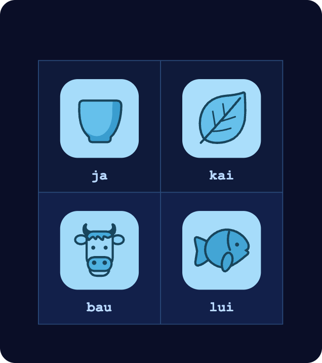
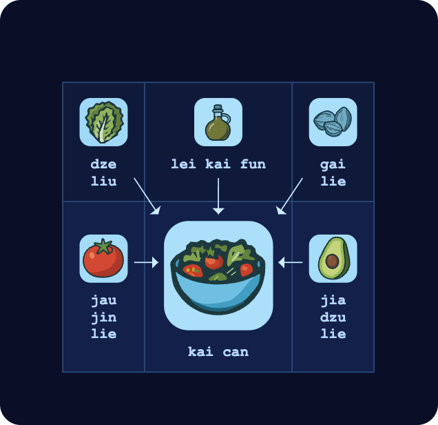
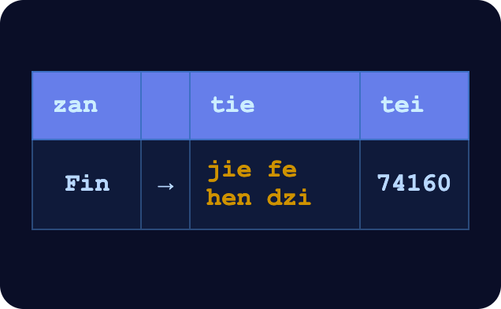

# 第四章

哲戈，帕佛蓋都·3724 年雪月 24 日

汾和澤坐在露天庭院的一張桌子旁。附近幾張桌子空著，其他桌坐了幾群青少年，還有幾對上了年紀的夫妻，各自吃著東西。

透過庭院入口望出去，汾看得到對街。一根公共路燈柱上匆匆靠了一把木梯，有個青少年正往上爬。

沒多久，他已經到了頂端，立刻動手轉開一具監視攝影機的螺絲。拆下來之後，他把攝影機收進一個黑色小袋，再爬回地面。

澤用手敲了敲桌子。汾的目光一下子收了回來，又專心盯著澤手持裝置上的一段動畫。

「好，那我現在看的是什麼？」汾問。

「這是我上一場明盤台比賽，用的是『逢三轉一百八十度』規則。有人發現一種新招，能攻破一般的牆結構，接著拿垃圾把對手的地盤整個淹掉。我在想有什麼對策。」

「那最後要走到哪裡？做出一道完美的牆？還是說這根本是剪刀石頭布，一路剋下去，沒有盡頭？」

「嗯，你別忘了，規則是時間可逆的。所以一道牆只要有某種辦法造出來，就有某種辦法毀掉。」

「蛤？」

「還記得國中的時候嗎？我們看那些電影，總覺得裡面的好人也好、壞人也好，反正不管是誰，居然把護盾產生器放在護盾外面，讓對方找到、毀掉，實在很蠢。」

「記得。」

「結果他們不笨，笨的是我們。物理定律是時間可逆的，所以沒有東西是無敵的。凡是造得出來的，就毀得掉：找出當初造出它的那條路，倒過來再走一遍就行了。

「所以說，毀不掉的護盾，本來就不可能造得出來。弱點一定在某個地方——差別只在你藏得好不好。」

「你是打算去搞國防還是怎樣？」

「欸，我只是想打贏冠軍賽而已。今年是我最後一年能參賽，贏了就能去全國賽。」

「你是說，今年是你在白面前表現的最後機會吧？」

「喂——」

一台機器人朝他們滑了過來。

「jie mo kai tu jie hei ja ma？」它問，用的是餐廳機器人典型的那種、刻意裝可愛的哲戈語。「要吃東西，還是喝東西？」

汾看向機器人身上的螢幕。

他先點「kai」，再點一張沙拉的圖片。

汾又點了一下，再按了幾個按鈕，點了茶。機器人嗶一聲表示收到，接著滑到澤那邊，靠近了些。

「哇，現在什麼都越來越用圖來表示了耶！」

「這下總算輪到我在這裡當天才了。我上一堂 DU 的課，剛好就是語言學。」

汾從背包裡拿出一本小小的紙本冊子。封面印著班順派的標誌：兩條橫放的手臂，一左一右伸向中間，握住彼此的手。標誌上方是標題「po so dze go ban de sia」，意思是「哲戈語第九版構想」。

「說來聽聽？」

「你記得吧？字根數量降到 256 個以後，大家都在說還會繼續減下去，很快就能用四大元素——土、氣、火、水——來表達一切。」

「嗯？」

「結果班順派現在打算放棄了。字根就停在 256 個，下一版哲戈語改往別的方向推。」

「什麼方向？」

「走視覺化。首先，他們是真的在認真考慮把象形文字找回來。」

「什麼？！」

「當年改用維瑞迪亞字母，是因為舊的符號都很難畫，那時候這樣做很合理。可是現在我們有電腦了。問題不在輸出，在輸入。妙就妙在，他們在設計新的符號：符號有一部分把完整的發音編了進去，就算你忘了怎麼念，看一眼就知道該怎麼發音。剩下的部分，還是盡量把意思表達出來。」

「好喔……？」

「他們的思路還有一個更大的轉變。到目前為止，語言都非常一維，因為說話是一維的：你一個字接一個字說出來，寫下來的也就是說出來的。可是如果去想『語言』裡跟說話無關的部分——比方說，你喜歡數學嘛——那就想想一元二次方程式的公式解。」

「負 b 加減根號 b 平方減四 a c，全部除以二 a？」

「你想想，要是得把這串字寫下來，放在螢幕上給別人看，那有多醜。真的，想像一下，這時候正好有人在螢幕上讀這幾個字，心裡會是什麼感覺。再想想那條式子平常寫出來的樣子。整條我到現在還是記不全，可是我記得它很好看！就是一張漂亮的圖：分數線把東西分成上下兩半，有一個根號，哪些在根號裡、哪些在外面，一眼就看得出來。」

「所以他們想讓所有書面哲戈語都長那樣？」

「對。」

「你知道嗎，有個老結論是這樣的：同一段文字翻成每一種語言，譯本的長度都不一樣。可是把這些譯本拿去壓縮——真的，隨便哪台運算裝置裡現成的壓縮都行——壓完的長度卻幾乎一樣。所以資訊量其實全都一樣。問題永遠是：要怎麼組織，才最好取用、也最有用？」

澤想了一會兒，回想起一個月前那堂熱力學課。資訊就是資訊，唯一的問題是怎麼排列。

澤點了點頭。

「所以班順派現在就在全哲戈對這件事做 A/B 測試。祭司們一共想出六種不同的視覺化風格。只要你照這些新點子去改自己寫的東西或招牌，或是回報你讀別人貼出來的東西有什麼心得，就能拿到信譽點數。」

「等等……他們在全國動員到*這種*程度，就只為了再把我們的語言最佳化一次？」

「大概吧……」

------------------------------------------------------------------------

澤朝金字塔走去。那座金字塔高達半公里，是帕佛蓋都南緣最顯眼的地標。

從外面看，它是一座方底的石造金字塔，表面覆著光滑的石材，像是一千年前某個偉大文明留下來的。石面被幾排樹截斷：兩排樹夾著一條步道，從澤站的位置一路往上，延伸到金字塔一半高的地方；另一排樹橫著繞金字塔一圈，不多不少，正好在一半的高度。

但外表會騙人。真要蓋一座這麼高的金字塔，代價實在太高，維瑞迪亞負擔不起，就連北極帝國也負擔不起。這其實是一座山，山裡本來就有洞穴。山被整修成金字塔的樣子，洞穴則改建成住宅和工作空間。哲戈政府有一部分設在這裡，許多大企業也是，不過這裡的空間很貴。

澤在紅綠燈前停下，接著穿過載君街。過了這條街，帕佛蓋都就正式結束了。對面是一條筆直、維護得很好的步道，從這裡開始，一路直通山體金字塔的入口。

他把受傷那隻手的手指一根一根張開、合起，再把五指反覆張開、併攏，又比劃了幾下按按鈕的動作。

手臂*感覺*已經完全好了。不過澤知道，自己的反應時間還是會稍微慢一點。

路面往上彎，坡度大約百分之十。走在這段坡上，熱量消耗差不多翻了一倍，澤也確實感覺得到，腿漸漸沉了起來。不知不覺間，他的腦袋不再推演待會比賽的戰略，只是單純讚嘆起金字塔有多美。

爬到比較高的地方，他回頭看了一眼，帕佛蓋都的景色讓他讚嘆不已。

低矮的建築一大片綿延開來，中間點綴著樹木；各式小店與工廠燈光閃爍，生產、販賣著各種商品。這一切都落在一張整整齊齊的棋盤式街道網裡：由北到南十七條街，彼此相隔兩百公尺；由東到西三十三條街，彼此相隔一百公尺。

有些路會在地上和地下之間切換。空間夠用時，整條路都在地面上；人行道需要整個路面來容納行人時，車道那一段就潛進地下。

澤轉回前方，繼續往上爬。大約五分鐘後，他到了正門。

澤的手錶震了一下。

「祝你好運。」這是汾傳來的訊息。

正門旁有幾塊標示。澤照著指示左轉，沿著綠樹覆蓋的水平步道走了大約三十公尺，從一扇比較小的側門進了山體金字塔。

裡頭的隧道，看起來就像現代建築裡的走廊。走廊大約兩公尺寬、三公尺高：下面兩公尺是長方形，上面一公尺是半圓形。石面打磨得很乾淨，跟其他保養得宜的建築內部沒什麼兩樣，只是沒有窗戶。

一路上偶爾會經過幾間開著門的房間。哪些隧道、哪些房間是整修過的洞穴，哪些是從頭挖出來的，澤分辨不出來。

他跟著標示走：右轉往下，再左轉，接著直直往下走了大約一百公尺。最後，又一個右轉。

再走大約十公尺，他看到了那扇門。兩側是一列石磚，到了頂端彎成拱形。拱頂正中央有個標誌：兩條橫放的手臂在中間相會，拳頭相抵。

他走進去。一位年長的女性注意到他，轉過身來。

「噢，嗨，澤！」

「啊，穆，真高興又見到你！」

「八強賽，很興奮吧？」

「對啊！」

「那可要小心。別忘了，這次你得跟人組隊。你是數學腦，又不是外交官。你連我的生日都記不住！」

「欸，隊伍是隨機分的！沒有什麼人際關係要經營，比較像數學，不像外交。」

「你會很意外的。我倒覺得，正因為這樣，臨場的外交才更重要。」

又有一個女生走了進來，年紀跟澤差不多。

「啊，澤，我們又見面了。」

澤立刻皺起眉頭。過去這幾年，白跟他交手三次，三次都是她贏，而且贏了也沒半點風度。他把臉轉開。

白走近，一手搭上澤的肩。「怎麼，怕我啊，澤？你知道的，我最喜歡讓你害怕了。你滿心期待拿獎金替你媽買一台運算盒，我就把這些全搶走，換我自己去紅郡南方那些漂亮的島上度假。到時候我該傳幾張照片給你看看。」

澤握緊了拳頭。

「戰場上見！說不定這一輪你還沒對上我，就先輸給別人了。」她笑了笑，慢慢走開。

鈴聲嗡嗡響起。一個機械語音要所有選手前往自己的位置，口氣比咖啡店的機器人嚴肅得多。

澤走進牆上的一座電梯艙。門關上，他感覺到電梯開始往下降。一個托盤彈了出來，接著又是一個機械語音，這次跟送餐點飲料的機器人一樣可愛，要澤交出所有電子裝置。澤拿出手持裝置，摘下手錶，一起放上托盤。托盤又縮回電梯側壁裡。

過了四分之一分鐘，電梯門打開。眼前是一座巨大的廳室，超過一千人在裡頭觀戰，人聲低低地嗡成一片。地上亮起一條路，指向一座附有座椅的巨型遊戲主控台。

澤望著整座廳室，心生敬畏。他是第一次來這裡；八強賽之前的比賽，場地都簡陋得多。他看得目不轉睛，不敢相信一個高中程式遊戲，竟然弄得到這種場地。

接著他猛地回過神來。之後再問穆吧，他想。現在他不是來享受的，是來比賽、來贏的。

澤往前走。遠處隱約有另外三名選手的身影，也在往前走，但太暗了，看不清是誰。他走到座椅前，坐了下來。

幾架跟手持裝置差不多大的無人機嗡嗡地繞著他飛，掃描任何可能用來作弊的設備。

要是手持裝置或手錶還帶在身上，它們會自動反過來對無人機做同樣的事：要求無人機出示由製造商與兩名檢驗員出具的認證，並加以驗證，確認無人機的韌體跑的是反作弊掃描，不是來殺他的。

可是在這裡，澤身上沒有任何電子裝置撐腰，只能靠信任。

半分鐘後，無人機確認完畢，飛走了。遊戲主控台下方滑出一個托盤，上面是一副連著長纜線的眼鏡。澤拿起眼鏡，從手臂底下往後繞過去，讓纜線落在背後，然後戴上。

一個響亮的自動語音宣布，口氣同樣嚴肅：「MU GU GEI FA」。五十拍後開始。

澤讓自己靜下來，試著把壓力拋到腦後，在腦中又把戰術排練了一遍。牆、滑翔機、岩塊、從岩塊萃取可用負熵的技巧、側翼攻擊。不過每場比賽總會冒出某種新規則；所有戰術裡最重要的，還是懂得隨機應變。

「LE MU GEI FA」。二十五拍後開始。

澤閉上眼睛片刻，呼吸。

「PA GU GEI FA」

「歡迎來到第十八屆明盤台錦標賽，八強賽第一輪。今晚四場比賽將接連登場。到了午夜，我們就會知道誰晉級準決賽，誰又得另謀出路。或者，明年再加把勁！」

「今天由命運隨機分進 Ja 隊的，是潘・孟寶與札・津戈。」

「Zau 隊則是……澤・雷明，以及白・嘉恆。」

澤僵住了。

------------------------------------------------------------------------

遊戲場地出現在澤眼前，一開始全是黑的。

顯示畫面的一角是他的*印記*：一組點陣圖樣。棋盤上只要哪裡有它的副本，那一處周圍三十格內的東西，他都看得見。

布局階段只能在右下角放方格。他在那裡畫了幾個印記，附近的場地馬上亮了出來。幾乎同一時間，左下角也有幾塊看得見了——白也放下了她的印記。

白正在架牆、蓋滑翔機工廠。滑翔機會直直飛向附近的岩塊，撞上之後，反彈一架回白的地盤；那裡有一道鏡牆，把它原路送回去，同時再往上射出另一架。

澤也跟著做。幾種滑翔機和牆的陣型，他先在沙盒裡試過，確認行得通，才部署到場上。

「MU GU GEI TAU FA」

五十拍後開戰。

照理說，選手到了這時候都會在語音裡講個不停，協調戰略。澤和白卻誰也沒開口。

勉強算得上溝通的，只有這樣：澤故意不讓滑翔機去打某幾處岩塊，白看懂了，自己把那幾處拿下，也同樣留了幾處給澤。

「LE MU GEI TAU FA」

二十五拍。

澤忽然想到一件事：新規則到現在都還沒宣布。眼前的規則，跟他玩過不知多少次的一模一樣。是要等開戰才宣布嗎？還是另有名堂？

沒時間猜了，澤想。得專心比賽。

「PA GU……SO……BI……ZE……HA……MU……FO……SHI……LE……PA……」

「TAU FA」

滑翔機飛了出去。

更大的太空船也從澤和白的基地出發了。

頭幾百回合沒有交戰，大家只是往場地擴張、蒐集資源。滑翔機飛出去，和岩塊互相作用，生出更多滑翔機。太空船也飛出去，像是又大又慢的滑翔機，最後照設計好的方式撞上岩塊，留下各自選手的印記副本。澤看得見的場地，一塊一塊變大。

澤和白的地盤連起來了。

白有幾架滑翔機亂飛，誤闖進澤的地盤，撞毀了他一座工廠。澤在心裡暗罵一聲，下一個干預回合就多架了幾道朝向白的牆。

架其中一道牆時，他手指一滑，不小心造出一架滑翔機，掉頭往自己的基地飛。澤又暗罵一聲。好在那架滑翔機撞上一處岩塊，什麼也沒弄壞，他這才鬆了口氣。

一千回合後，雙方的滑翔機和太空船碰上了。第一個干預回合也在這時到來：所有選手都能在自己任何一個印記副本附近，多放一些方格。澤手忙腳亂地調整兵力，想更有效地進攻札。

他在前線放下自己早就打磨到完美的「移動牆」。那是一種大型滑翔機，速度只有一半，但專門最佳化過，能把比較基本的滑翔機原路彈回發射的人那裡。三道移動牆全都對準札所在的那一角棋盤，緊跟在後面的，是他的載印記太空船。

白那一側，她和潘的滑翔機飛進對方地盤的次數差不多。白有幾架滑翔機成功鑽進潘的地盤深處，把幾處岩塊攪成一團混亂，滑翔機朝四面八方亂噴，也毀掉了潘的一些印記。潘則比較會往中央推進，再繞回來，從背後打白的一些陣型。

接著，澤出了下一招。

他讓三架長相古怪的滑翔機沿著邊緣，一路鑽進札的地盤深處。札的主基地在東北角，周圍架了牆；三架滑翔機撞上那道牆，拼成了澤的印記，剛好撐一個回合——正好是澤的下一個干預回合。

澤飛快清掉雜物，在印記四周架起牆，再朝幾個戰略方向放了三架滑翔機。

現在，他在札的地盤正中心有了一座基地。

觀眾看的是螢幕上一張又大又詳細的全場地圖。汾在遠處用手持裝置看，看到的是摘要畫面，上面標出每位選手印記的位置：

澤繼續攻擊札。只要徹底除掉兩名對手中的一個，他想，干預回合裡的動作就少了一半。干預回合向來是最大的變數。

這時，白的印記又少了好幾個。潘朝場地下半部的中央發動攻勢，想把澤和白切開。

穆在場邊看著，嘆了口氣。

她知道澤和白處不來，這一方正吃著這個虧。她想，這就是「無政府代價」：一個團體的成員各追各的目標，彼此不協調，團體因此損失的那一部分。

她專注地看著。她知道，接下來這一分鐘，就會決定他們能不能想通。

幾公里外，汾用手持裝置看著，自己也乾著急。他知道澤想贏；可是澤幾乎一樣想要的，是聽到白開口求他。

澤盯著棋盤，集中精神，想找出下一步。像是過了一輩子那麼久，他才決定改變戰術。

對札的攻擊沒有停，但他刻意不去瞄準札的任何一個印記。他轉而攻擊潘地盤東緣偏北的一塊區域，花了整整一個干預回合，在那裡架牆、蓋滑翔機工廠。

然後他又架了*更多*牆。只為了一件事：讓滑翔機越積越多，在牆之間來回反彈。

這些，潘和札一樣也沒看到。他們看到的是另一回事：澤重創了札，卻遲遲收拾不掉他；潘則把白一步步往東南方逼。

潘膽子大了起來，朝東邊發動攻擊。澤的主基地和東北方對札的前線之間，有一片防守薄弱的區域，潘想在那裡製造混亂。

澤看得出白很吃力。兩人之間的通訊頻道卻始終一片沉默。她還是太驕傲，不肯開口求援。

接著，澤發現潘派來對付他的，正是他自己用過的那種移動牆。

他明白了：光靠自己，打不贏潘。於是他用這次干預回合，試了一個新策略。

他先派出幾架滑翔機，摧毀潘在場地中央的印記。然後才是真正的攻擊。

一艘太空船從澤的主基地出發，往西北斜飛，直奔潘的主基地。澤、白和觀眾都看見了。潘和札卻毫無察覺，因為沿途潘的印記已經全被清空。

潘看到的，是自己的攻勢奏效了：白和澤被切開，白一路被逼回她的主基地，四面受敵。札還剩五個印記，奇蹟似地頂住了澤主力的攻擊。

澤看了一眼時鐘。離下一個干預回合還有六十回合。他的太空船幾乎已經到了潘的基地。

四十回合。

澤終於開口。這是整場比賽裡，隊伍語音頻道上的第一句話。

「白，下一個干預回合，輪到你大顯身手了。」

二十回合。

澤的太空船撞上潘主基地南面那道還完好的牆，一下子閃動著散成一團混亂的形狀。

接著，像是奇蹟似地，那團混亂拼成了一個印記——只撐了一個回合。

白的印記。

澤聽見一聲倒抽口氣。這是本場比賽，隊伍語音頻道上的第二則訊息。

澤用干預回合拆掉自己的牆。幾十架滑翔機朝四面八方飛出，從好幾個角度同時瞄準札剩下的每一個印記。

白在沙盒畫面裡試得很吃力，想照抄澤一千多回合前用過的那招，試了幾次。第三次她成功了，立刻在場上照做一遍。印記被牆圍住，滑翔機朝四面八方飛去。

兩百回合後，札剩下的印記全數被消滅。

論印記總數，十五比十五，剛好打平。可是札已經出局了。干預回合裡，澤和白聯手能做的事，是潘一個人的兩倍。

潘做了最後一搏。他派出新型的滑翔機，想把澤主基地裡能毀的全部毀掉；又照抄澤的招牌戰術，派一艘太空船過去，想在那裡建立印記。

計畫成功了一部分。偏偏最關鍵的那一步，建立印記，沒有成功。澤早就布好了對策，把那艘太空船擋在半路。

白和澤則繼續在潘的地盤上大肆破壞：白攻西邊，澤攻北邊和東邊。

一千回合後，場地大半成了高熵的荒原。還算完好的，主要只剩白的主基地、澤主基地的一小部分，以及當初對札那條戰線上澤這一側的地盤。印記總數：澤五個，白五個，潘四個。

就在這時，潘投降了。

觀眾歡聲雷動。

------------------------------------------------------------------------

兩部電梯的門同時打開，澤和白一起走進等候室。穆已經在那裡等他們了。

「恭喜你們兩個。下一站，十五天後的準決賽。」

「我不懂。這場比賽跟以前一模一樣，新規則到底是什麼？」

「啊，就猜到你會問。」

「幾天前，祭司們要進地窖決定規則，就在他們進去之前，我跟其中一位提了個建議：這次弄得有趣一點，多點創意。結果地窖的門封了五天，是平常的兩倍。現在我們知道為什麼了。

「這次改的規則是：分隊不是用密碼學隨機決定的。」

澤瞪大了眼睛。

「這一次的比賽，是一場心理考驗。隊友偏偏是你們最不想合作的人；整場比賽下來，語音頻道裡的訊息少到創了歷史紀錄。可是時候一到，你們幾乎沒怎麼說話，就合作了。所以你們過關了。」

穆頓了一下。

「祭司們會很滿意的。」

穆和澤靜靜對望了片刻。

白走過來，打破了沉默。

「對不起。」

「拜託，光這樣不夠吧，總得拿出點實際的。比如說，下次你去紅郡度假，帶我一起去。」

話一出口，澤才想到這個提議可能會讓白誤會，趕緊補了一句：

「還有我媽。」
