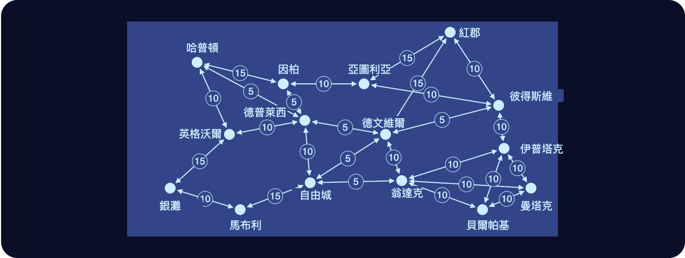

# 第五章

聯合城邦，自由城·3724 年雨月 11 日

澤走出空港的門，回身把門撐住。

「快點啦，媽！」他喊。

澤的媽媽敏連忙趕上來，穿過門走了出來。白提著一個購物袋，跟在後頭。

三人照著指標找到計程車招呼站，一到就把行李放進後車廂，開了車門坐進去。

「你們兩個，歡迎來到自由城！」白興奮地說。

「很高興能來。」敏說，「其實這是我第一次出國。」

「那你覺得這裡跟紅郡比起來怎麼樣？看來你現在已經哪裡都去過了。」敏又問。

「喔，我覺得紅郡比較好。可惜北極的無人機害他們這五天把航班全取消了。」

「那真的太可惜了。不過到目前為止，我覺得自由城很棒！這樣以後我去紅郡，就不會先被寵壞，到時候我對紅郡的興奮，會跟現在對自由城一樣！」

話聲漸漸停了，三人都望著車窗外。

車子開在高速公路上。兩旁的建築什麼形狀、什麼大小都有：有矮有高；有石造的、混凝土的，也有玻璃和鋼構的；有的漂亮，有的醜。有些蓋到一半，看起來像是荒廢了。

當中也有幾處真正迷人的地方。小公園裡擺著長椅，樹木經過精心安排，人待在裡頭，城市其餘的部分好像就看不見了。

頭頂上，幾架小型旋翼機嗡嗡飛過。有的載著一個乘客，有的載著貨物——多半是食物，送給有錢又極度沒耐性的人。

遠處有一區看起來明顯比別處漂亮，四周圍著一道灰紫相間的高牆。白和澤坐在右側，兩人都轉頭望了過去。

「大概是本地的大梅港吧。」白若有所思地說。

計程車猛地一偏，切出高速公路，下了交流道，接著沿一條街往前開，接連繞過好幾個圓環。

有幾分鐘，路上的人、建築裡頭的模樣，看起來都比哲戈任何地方有錢得多。

接著車子突然從一座高架橋底下穿過。到了另一邊，房子明顯破舊許多，餐廳和店家也簡陋得多，外頭騎機車的人也多了。

計程車一條街一條街穿過自由城。澤、白和敏一路看著，待在安全的小繭裡，打量外頭的一切。

又開了五分鐘，計程車轉了個彎，開進一座車庫，光線一下子暗下來。車子停下，車門打開。

「謝謝！」敏大聲說，打開後車廂。三人拿了行李，走進飯店。

一根一公尺高的柱子頂端有個綠色圓圈，中央寫著「入住報到」。澤用手錶往圓圈上啪地一拍。

過了一拍，圓圈嗶了一聲。

澤、白和敏的手錶同時震了一下，房卡已經確認存入。

------------------------------------------------------------------------

澤把行李放進房間，沖了個澡，出了電梯，又回到飯店大廳。白已經在那裡，正在窗邊往外看。

「媽說她要睡一下。我們出去逛逛吧。」澤提議。

白點點頭。兩人走出飯店，踏進自由城的廣闊天地。

「話說回來，你到底為什麼會答應跟我來？」白問。

「嗯，很明顯啊。往後很長一段時間，我都不會再碰到成本這麼低的出國機會了。」澤回答。

「我們兩個準決賽都贏得很輕鬆。我的對手是到了第四千回合，規則突然一變，他完全沒準備；而你贏得比我還快，我看到了。所以決賽就是你跟我。」

「這就是特別的地方。平常會有囚犯困境：我們誰都不能休息、不能去玩，因為只要有一個人休息，另一個就會趁大賽前拚命抱佛腳，搶到優勢。可是這次不一樣。我們可以一起休息，所以都很確定對方沒在做別的事。」

「而且剩餘很高：我媽和我，這輩子都是第一次出國。」

「那你呢？你為什麼答應帶我來？」

「現在想想，跟你差不多。只是少了那套賽局理論的數學。」

「不過對我來說，你說的剩餘，就是跟你在一起的時間。」

澤哀號了一聲。

------------------------------------------------------------------------

澤和白來到一棟建築前。跟四周比起來，這棟樓明顯更大，也更漂亮。

招牌上寫著「自由城經濟研究所」。

名稱正下方列著入場費的收費表，附了一條公式，有兩個變數：在館內待得越久，費用越高，按停留時間的平方根增加；學術與知識信譽分數越高，費用就越低。

學術與知識信譽分數很難拿到。

另一種信譽倒是好拿：可以以零知識方式抵押、拿去借款或入住飯店的那種。除非好幾次借錢不還，或好幾次把飯店房間搞得一團亂，否則那種信譽並不難拿。

學術與知識信譽就不一樣了。那得真的做出認真的成果才行。

入口是一道閘口，裝著旋轉閘門，還有幾個發著綠光的圓圈。澤和白用手持裝置碰了一下，旋轉閘門喀噠一聲轉開，兩人走了進去。

建築內部只有一層樓板：一道螺旋狀的斜坡樓板，一圈一圈繞了好幾圈。

沿著外牆走，幾乎感覺不到坡度。一圈大概三百公尺，繞完才往上爬四公尺。

想上下樓快一點的人，可以走中間的電梯和樓梯。

澤和白不急不徐地沿著樓板走，沒多久就看到一間餐廳。裡頭坐著兩個人，一女一男，喝著茶，吃一道蔬菜配飯的料理。

餐廳裡有一面大螢幕，這時正在播一段課程，講解聯合城邦的共同治理制度。

「兩座城市一旦建立共同治理關係，就會各自選出對方議會裡一定比例的席次。」

「這個比例，取決於雙方事先約定的數字。先比兩座城市的規模，規模以人口與 GDP 的幾何平均來計算。較大的城市，選出較小城市議會裡那個約定比例的席次；較小的城市能選的較大城市議會席次，則是約定比例除以兩城規模比的平方根。」

「你可能會問：為什麼是平方根？這是因為，由較大的參與者握有較大的治理份額時，它帶來的效用會超線性地大於較小份額的效用——」

澤沒再聽下去。他讓腦子自己轉，試著從第一原理把這套數學推出來。

白朝坐在桌邊的那兩個人走了過去。

澤還在想那道數學，跟在她後面。兩人一路走到幾乎就站在那兩個正在吃飯的人旁邊，才停下來。

「嗨，你們在忙嗎？」澤冒冒失失地脫口而出。

「啊，沒有，一點都不忙。」那位女性說。

「來，跟我們一起坐吧。我是觀光客，每次都很樂意認識本地人，多了解這個地方一點。」

「啊，我們也是觀光客，從哲戈來的。」澤說，「我是澤。」

「我是白。」

「我叫賽菈。」那位女性說，「這是我的……朋友，楊恩。」

澤和白坐了下來。

白轉頭問：「那你們是從哪裡來的？」

「維瑞迪亞。」賽菈說。

「我倒是本地人。」楊恩補了一句。

「那你們怎麼會來這裡？」

「嗯，我是部落客，主要寫經濟和文化。前一陣子輪到我先生和我照顧孩子，這一輪剛結束，孩子現在在我們的共養父母那裡，所以我們兩個都在休息——」

「嗯，其實也不算休息，工作還是照做。只是一邊旅行，一邊到處看看。」

「到目前為止，覺得自由城怎麼樣？」

「嗯，有些地方很自由。有些地方就不一定了。」

「這裡的隱私袍沒有維瑞迪亞或哲戈那麼常見，可是那是因為大家都開車到處跑，有趣的事又多半發生在這些封閉的園區裡。」

「哲戈那邊怎麼樣？」

「老樣子。讀書，打明盤台。我還在想以後要讀物理還是密碼學。」

「跟他講你手臂的事。」白小聲說，音量卻大到另外三個人都聽得見。

「喔對，前陣子我們教室被炸，我的手臂斷了。」

賽菈和楊恩愣住了。第一次，是因為這件事本身；第二次，是因為澤講起這件事時完全若無其事。

「攻擊越來越嚴重了嗎？」

「他們開始更常對教室下手。也聽說偷偷運進來的監視無人機越來越多。」

「那哲戈是不是要，呃，自己也建一套反監控網路來跟上？」

「嗯，問題是，北極人在每個機關裡都有間諜。反監控網路要是看得到太多東西，反而會變成他們自己的武器。」

「所以我們才一直在研究密碼學的做法。每台監視攝影機都跑一套演算法，只有遇到可疑的情況才揭露資料；每揭露一次，就把一個雜湊值發布到密碼學網路上，這樣我們就能追蹤揭露有多頻繁。另外還有一整套硬體認證和隨機紅外線掃描的系統，用來確保攝影機跑的真的是它們宣稱的那套程式。」

「甚至還有一條規定：公共場所的任何一台攝影機，任何人都可以去拆下來，自己檢查。有好幾個社團專門在做這件事，還把報告公布在網路上。這些東西滿先進的。真希望我能搞懂這些加密、證明和認證背後的數學到底是怎麼運作的。」

「拜託，我們整個 DU 分部都知道你是熱力學高手，懂得比老師還多。你絕對可以轉換專長去讀密碼學，把這些全部搞懂。」

「你是*故意*要讓我分心，好讓我沒辦法專心準備明盤台決賽嗎？」

一台機器人滑到他們面前，螢幕上顯示著菜單。

白和澤看起菜單，輪流按了幾個按鈕，點了一些茶，還有一份跟賽菈和楊恩吃的差不多的蔬菜配飯。

楊恩問：「這整場軍備競賽，佔掉你們多少時間？」

「時間嗎？嗯，我們有百分之幾的人是全職在做這件事。其他人的話，除了跟上怎麼保護自己之外，這本來就不是我們的工作。至於佔掉我們多少快樂、多少精神、多少靈魂？那就是另一個問題了。」

楊恩和賽菈嘆了口氣。

幾分鐘後，機器人送來他們的飲料；又過了幾分鐘，再送來餐點。

他們邊吃邊聊。有時輕鬆閒談，多知道了一些哲戈文化的細節：明盤台、哲戈語，還有人民渴望看到國家再起的強烈意志；有時就只是安靜地吃。

螢幕還在繼續解說共同治理，秀出各種圖表和數學公式，這時已經完全沒人注意了。

------------------------------------------------------------------------

賽菈在手錶上點了一下。

她看得出那是格拉迪亞斯的臉。

「在自由城還順利嗎？」格拉迪亞斯問。

「剛跟楊恩吃完午餐。後來有兩個哲戈來的孩子過來找我們，好可愛。」

「他們怎麼樣？」

「很棒的孩子。只是北極人那樣對他們，真的很讓人難過——兩個孩子裡的一個，前陣子手臂才受了傷。」

賽菈決定換個話題：「你最近好嗎？」

「還好。」

他頓了一下：「我在考慮一件事。」

「什麼事？」

「最近有人建議我，別去當哨兵了，改當守律者。」

「咦！」

「你覺得呢？」

格拉迪亞斯明顯停了一會兒，想著該怎麼回答。

「真正確保規準本身定得對，對維瑞迪亞來說才是更重要的事。而且我覺得，那份工作會比較有意思。」

「嗯，我的第一直覺是，我其實支持這個決定。」

「跟你說，那兩個孩子走了以後，楊恩沒多久也去開會了。這五十分鐘左右，我一直在想哲戈的事。」

「他們從我們的圖譜募資拿到很多好處，對吧？」

「是啊。」

「那規準呢？規準有沒有鼓勵企業，在任何一方面讓自己的產品對哲戈更有幫助？」

格拉迪亞斯想了一會兒。「沒有吧。至少我想不到。」

「那你或許真該去當守律者。這可以當成你的計畫之一！想辦法制定或調整規準，讓它們更能支持哲戈。」

賽菈頓了一下。

格拉迪亞斯睜大眼睛，愣愣地看著她。

「對，一定要當守律者。這絕對是正確的選擇。」

「會很好玩的。就像他們說的，Dze go ba fau gie！」
