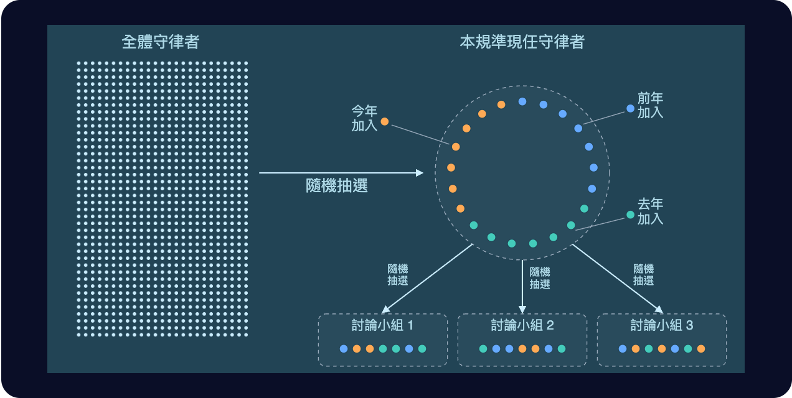
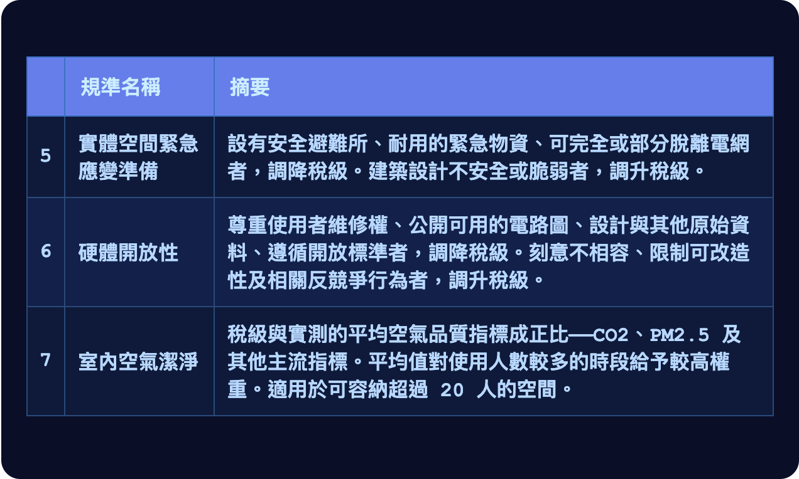
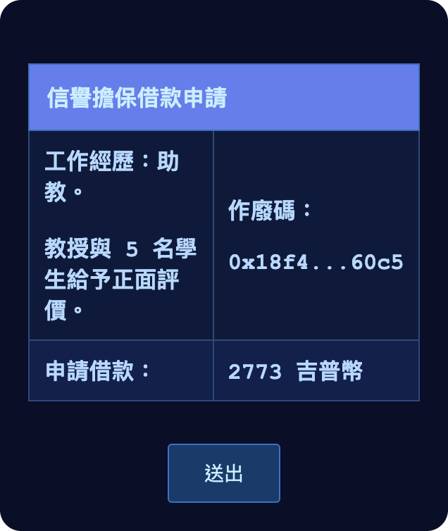
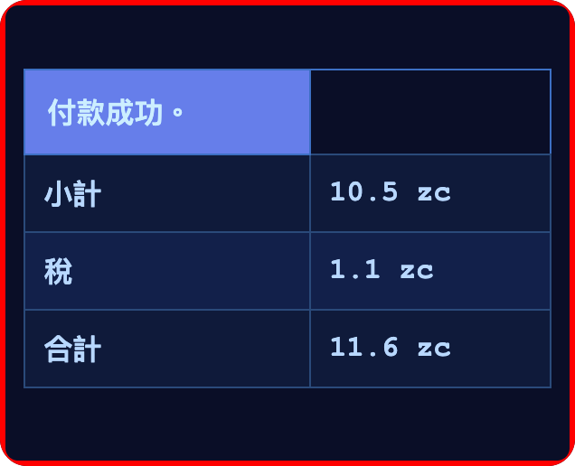

# 第六章

維瑞迪亞，梅爾丹·3724 年雨月 12 日

格拉迪亞斯低著頭，慢慢走向家門，讓隱私袍的兜帽順便替他擋一擋冷雨。

門前有一小片屋簷，雨點打在上面嗒嗒作響。走到門口，他才慢慢摘下兜帽，從一張小桌上拿起一盒餐點——哲戈餐車上他常點的十號餐。接著，他把手錶往門邊那個發著綠光的圓圈上一碰。

門開了。格拉迪亞斯嘆了口氣，進了屋，讓門在身後關上。他順著一段樓梯走到地下室，把餐盒擱在桌上。

燈亮了。模擬大自然聲音的輕柔背景音慢慢大起來，身後另一道門也自動關上。

他脫下隱私袍，頸帶倒是留著，順手把袍子丟在一張椅子的椅背上晾乾。然後在另一張椅子上坐下。那張椅子又大又軟，椅背往後傾，大約四十五度。

手錶震了一下：家裡的區域網路驗證過它，讓它連上了。

他微微張嘴，對著頸帶低聲下指令：打給莫夫。

莫夫幾乎馬上就接了。

「你在安全的地方嗎？」莫夫問。

「我正對著默唸頸帶小聲說話，你的聲音是從耳機傳過來的。這裡是一間密封的地下室，門跟牆都貼了阻訊箔，外面還是一棟上了鎖、隔絕良好的房子。屋外下著真的雨，屋裡放著假的雨聲。這樣夠安全了吧？」

「這年頭很難說。」

「不然這樣，你要的話，我把假雨聲換成人群的嘈雜聲，讓人更難把聲音分離出來，*再*加戴一副耳罩式耳機。」

「好啦，不用了。你這套設備本來就比大多數人好。」

「我今天就要提交路線選擇了。我要當守律者。」

好幾拍，兩頭都沒有人說話。

「什麼時候決定的？」

「幾天前。」

「至少這一年來，你都是打定主意要當哨兵的。」

「守律者才是真正能改變事情的位置。規準本身比——」

「是他，對吧？那位神祕紳士，德爾瓦特？」

又安靜了好幾拍。

「賽菈知道嗎？」

「當然知道，我兩天前就跟她說了。」

「比我還早。」

「那當然，她是我的——」

「可是你還沒跟她說……你為什麼改變主意，對吧？」

「你打探到什麼，可以直接講了嗎？」

「好啦好啦。」

「還記得我上次說的吧。德爾瓦特一離開那場會面，我就跟上去，結果他只是走到大梅港另一間完全不相干的茶館，五十分鐘後在那裡又跟人見面。後來他從另一道門離開，我就在那裡跟丟了。」

「嗯，記得。」

「欸，你猜怎樣，故事還沒完。那兩個地方，我都找了不起眼的角落丟一隻監視蝙蝠進去——兩隻都被抓了，什麼也沒撈到。不過接下來三天，我也刻意在兩個地點之間來回跑。頭兩天，兩邊都沒動靜。到了第三天，我又看到德爾瓦特了。他每天都換一件新的隱私袍，還會重新隨機化鞋墊，讓步態跟身高都不一樣。可是他有一個弱點，我就是靠這個逮到他的。」

「什麼弱點？」

「他的舉止。他東張西望的次數比一般人少很多，感覺整個人都專注在要去的地方。我犧牲過幾次監視蝙蝠，讓它弄出聲音來分散注意。大多數人至少會稍微轉一下頭；德爾瓦特不會。」

「我就是這樣又找到他的，一路看著他從一間茶館走到下一間。」

「所以這段時間他一直在跟人會面？」

「對。說不定你不是唯一一個他想說服去當守律者的人。」

「那我們該怎麼辦？」

「看來眼下我們只能做一件事：照德爾瓦特說的做，同時把眼睛放亮。」

「總之，你該休息了。別忘了，明天我們還要去參加那場公民會議。」

格拉迪亞斯掛了電話，拿出手持裝置，繼續研讀守律者的治理結構。

格拉迪亞斯發現，這跟哨兵很像，只是規模更大：哨兵是三組、每組三人；守律者是三組、每組七人。

法院不屬於掌舵會，不過他記得，法院的結構也差不多：兩組各兩人，先分開合議再投票，另有一人負責決勝；判決由五人意見的中位數決定。

守律者小組的人比法院和哨兵小組都多，這很合理：一條規準比任何單一判決都重要。法院人數比較少，也說得通：五名法官只負責一輪，而且隨時可以上訴。

他在各個畫面之間來回切換，捲動瀏覽目前預定要評估的規準：

格拉迪亞斯繼續往下捲，讀著守律者的文件。大約三十分鐘後，他累了，往椅背上一靠。

他請翡翠根據他到目前為止看過的資料出一份小測驗，幫他複習。翡翠回應收到，便在背景開始作業。

然後他放下手持裝置，打起精神從椅子上起身，上了床，睡了。

3724 年雨月 13 日

格拉迪亞斯出了家門。身上穿著隱私袍，臉罩和兜帽都沒戴。他往右轉，沿著街道走下去。

街道兩側是一排排跟他家差不多的房子，兩邊人行道都種了樹遮蔭。房子大多是幾種大同小異的預設風格，米色、淺藍、灰色，看起來都是這二十年內蓋的。

不過，大約每十棟裡就有一棟有點古怪。

他經過的第一棟，陽台長得像一艘未來風的太空船。第二棟乾脆不是一般的房子，而是三棟小屋，一看就知道是貨櫃改造的。格拉迪亞斯心想，那*看起來*正是他會想住的房子，他甚至挺喜歡看的；可是有它們在，這個街區怎麼看都不可能整齊劃一。

第三棟的側邊開了一家咖啡店，幾個人站在店外喝茶。格拉迪亞斯想起賽菈好幾年前寫的一篇部落格文章。這種事在英格沃爾絕對不會被允許，他想；住宅區就是給人住的。

代價是：在英格沃爾，要是住錯了地方，得走一公里半才到得了最近的咖啡店。在這裡，他根本沒打算找，走不到三百公尺就經過了一家。

目的地終於到了：就在第一個街角，一座小小的社區活動中心。他看見其他人陸續到來，有的走路，也有幾輛計程車在建築旁的路邊減速停下。他右轉，跟著大家從同一個入口走進去。

「莫夫，原來你在這裡！」他喊道。這一聲其實沒有出聲，只有頸帶收得到；但他說得很用力，頸帶便把它判讀成大喊。

「啊，格拉迪亞斯，見到你真好！」

「所以，今天會議的主題是什麼？」

「他們要討論我們希望多一點哪些公共空間，好創造更多面對面社交的機會。現在大家不只在銀聊和藍鯨上講話，還會跟翡翠和其他 AI 講話，他們擔心面對面的交流不夠。」

「有道理。」

一聲哨音響起。其他與會者開始往其中一間會議室走，格拉迪亞斯和莫夫也跟了上去。

會議室裡擺了五張桌子，每張配十把椅子；前方是一塊舞台區，上面有一座講台，供一個人發言。兩人一進門，就感覺到一陣微風輕輕拂過臉頰：天花板上的風扇把空氣往下推，再從外面抽進新鮮空氣替換。

格拉迪亞斯抬頭，還看見天花板上似乎有淡淡的紫光往下照。一定是遠紫外線 C 消毒燈，他想。

他們挑了一張桌子坐下。

一個年紀較大的少女在格拉迪亞斯旁邊坐下，向他自我介紹。

「嗨，我是佩萊。」

「我是格拉迪亞斯。」

「很高興認識你。」

大約半分鐘後，一名穿著隱私袍的男子走上講台，兜帽和臉罩都沒戴。他停頓片刻，才開口。

「歡迎各位！」

會議室很快安靜下來。

「第一次來的朋友，歡迎，也謝謝你們來。我是阿拉蓋爾，當傳令官七年了。今天是這學期會議的第四場，主題是怎麼改善維瑞迪亞的公共空間，讓大家有更好的面對面社交。」

「不管是第一次來的，*還是*從頭參加到現在的，都非常謝謝各位出席。」

格拉迪亞斯眼角餘光瞥見佩萊拿出一條頸帶戴上，轉過來朝他低聲說話。過了片刻，他的手錶震了一下。手錶偵測到佩萊想問他事情，替他們開了一個對話頻道。

「提醒我一下，傳令官是做什麼的？」耳機裡傳來她的問題。

格拉迪亞斯還沒想好怎麼回，莫夫已經接過話頭。

「傳令官是掌舵會的成員，守律者或哨兵都有。每年會隨機抽出一些人退任，去當某種大使，讓掌舵會和大眾更了解彼此。圖譜募資的成員或法官，我記得也可能當上傳令官。」

「目的是讓制度透明一點。守律者和哨兵為了不被操弄，行事都非常低調；可是他們也不希望大家產生誤會，開始不信任整套制度。所以傳令官就是中間的橋梁。他們會很公開地說自己怎麼思考、當初怎麼做事——但都是在手上已經沒有任何權力之後，所以不必擔心有人去影響他們。」

「那每個傳令官都會主持會議嗎？」

「看個人選擇。有人演講，有人寫書，有人幫忙籌辦會議。最不愛跟人打交道的，就只寫書，或在銀聊上管管子論壇。」

「你如果想搞清楚自己對加入掌舵會有沒有興趣，傳令官也是很好的請教對象。」莫夫補充。

「你想加入嗎？」他又補了一句，隨即咬住舌頭。他這才發現，自己差那麼一點就犯了大忌：在陌生人面前洩漏自己是掌舵會成員。

「不了，我已經決定了，我要讀化學。」

「不錯喔！」

「我朋友都覺得我不會喜歡，而且得非常拚。可是我就喜歡挑戰。」

他們又把注意力轉回講台。

「好，請每一桌的人輪流分享一次正面的經驗：某個你待過、而且很喜歡的公共空間。這個部分進行半長時。我會到各桌走走，有任何問題都歡迎問我。」

「開始吧！」

阿拉蓋爾說完，慢慢走下講台，往會議室側邊走去。

格拉迪亞斯這一桌，有位中年女性輕輕舉起手。其他人點點頭，讓她先說。

「我真的很喜歡加拉納廣場，就是從這裡往南大約一公里、在卡利馬區邊界上的那個。我常去那邊喝茶、吃東西、看看鳥和樹。那個地方真的好舒服。樹好，茶好，樹蔭也好，總是有有趣的人經過，可以聊上幾句。」

格拉迪亞斯接過話。

「我喜歡它旁邊還有一座遊樂場。孩子還小的時候，我們家常去那裡，大人喝茶，讓孩子自己去玩。」

那位女性和其他幾個人都點點頭。

「那裡還有一間小圖書館跟科學館！」佩萊補充。

她話才說完，就傳來一陣腳步聲。阿拉蓋爾走了過來，站在他們桌邊。

「阿拉蓋爾，」佩萊問，「這些會議的結果，實際上是怎麼變成成果的？」

「問得好。很多人都在看會議做了些什麼。守律者在辯論稅務規準的時候會參考這些結果，想清楚要鼓勵這些地方具備哪些特色。」

「有時候守律者也會悄悄直接來參加會議。誰知道呢，說不定現在這桌就坐著一位守律者或見習生。」他開玩笑地補了一句。

阿拉蓋爾停了一會兒，才又開口，說了最後一件事。

「還有圖譜募資的成員，以及所有參與平方募資的人。這是很值得留意的好指標。」

就在這時，格拉迪亞斯的手錶震了一下；會議室裡每個人的手錶也同時震了起來。

他看了看手錶：會議室空氣清淨機內的感測器，偵測到某種流感病毒。

天花板上的風扇幾乎馬上轉得更快，紫光也更亮了。大約一半的與會者從口袋裡掏出口罩戴上，有的是布口罩，有的是彈性體呼吸防護具；另一半什麼也沒做，就只是看著。

很多人也戴上了頸帶，打算接下來都透過頸帶低聲說話，以防萬一生病的正是自己：病人不大聲說話，就能減少傳播。這一切看起來都很自然，像是自動就會發生的事；大家似乎也都尊重彼此的選擇。

另一位女性開口了。她是透過頸帶低聲說話，可是傳到格拉迪亞斯的耳機裡，聲音清楚自然，跟當面直接說話沒有兩樣。

「再往西大約一公里，還有一個類似的廣場，叫塔帕亞廣場。那裡的東西也差不多：可以坐下來喝茶，附近也有店。可是遊樂場簡陋得多，我兒子說根本不舒服。而且我一直覺得那裡沒有加拉納熱鬧。所以說不定遊樂場真的很重要。」

「塔帕亞的圖書館也是這樣。書不是無聊的商業書，就是沒人看得懂的外文書，不是古貝爾帕基語，就是哈拉米爾那邊的什麼語言。」

莫夫又加入對話。

「啊，對，那邊是怎麼回事我知道。有一條規準在鼓勵一樓活化使用，可是很多人在鑽制度的漏洞，放一些理論上符合資格、實際上根本沒人想用的東西進去。我猜塔帕亞的經營者認為，他們的主要客群不喜歡身邊有小孩。」

「那條規準真的該調整一下了……」

佩萊和那位女性都點了點頭。

莫夫往後一靠，對話繼續下去。其他人你來我往地回答彼此的問題，格拉迪亞斯和莫夫則都在心裡記下：大家說出來的偏好裡，有哪些共通點。翡翠也在背景做著筆記。

------------------------------------------------------------------------

離開會議、跟莫夫道別後沒多久，格拉迪亞斯來到一家餐廳。他一走到門前，門就開了。他走進去坐下，一台機器人滑到他身邊，把菜單亮給他看。他按了幾個按鈕，點了水和一份沙拉。

他看了看店裡。除了他，還有四個人，全都坐在窗邊看風景：兩個人各自獨坐，另外兩個是一起的。

獨坐的兩人裡，有一個戴著某種耳塞式耳機，脖子上還套著頸圈。大約每分鐘有兩次，他的嘴會動個幾拍。格拉迪亞斯想，那不是在跟人講話，就是在上某種 AI 輔助的家教課。

另一個獨坐的人看起來什麼也沒做，就只是在欣賞風景。

一起坐的是兩位女性，看起來三十幾歲，正聊著天。隔著一段距離，格拉迪亞斯聽得出幾個字，好像在講她們兒子接下來的旋翼球比賽。

過了幾分鐘，一個還不算成年的少年走了進來。格拉迪亞斯一眼就認出他：費布里克。

「格拉德叔叔，在這裡碰到你真好！」

「費布里克！」

格拉迪亞斯張開雙臂要抱他，費布里克也乖乖讓他抱了。

「要去上學？」

「對，去學校。再兩天就考試了！」

「有把握嗎？」

「應該有！今天考樹。我昨天憑記憶從零開始寫了兩種有限深度樹，還有雜湊字典樹。只要真的搞懂了，就超好玩的！」

「維爾和黛亞有把你們照顧好嗎？」

「喔，他們超棒的，跟以前一樣，很照顧我們。每天都煮很好吃的東西給我們吃。還有，爸買了一台新的運算盒給我！」

服務生遞給費布里克一杯茶，杯子上蓋著密封蓋。

「我來付。」格拉迪亞斯喊了一聲，「你快去學校吧，祝你好運！」

「格拉德叔叔，我好想你喔！」

費布里克跑出餐廳，往左一轉，就不見了。

又過了幾分鐘，水和沙拉送來了。格拉迪亞斯慢慢吃完，走到櫃台結帳。

檯面上，一個綠色圓圈的外框亮了起來。格拉迪亞斯把手錶往上一碰。

外框變成了紅色。

格拉迪亞斯趕緊把手持裝置裡的錢包一個個看過去，這才發現自己忘了先轉錢給自己。

他大部分的錢只能在家裡動用。真到了萬不得已，還有社交恢復這條路：事先選定的家人和朋友手上一共有六把金鑰，湊齊其中四把的聯合簽章就能取用。這些人彼此都不知道其他恢復人是誰。

他飛快地想了想，請翡翠以他的信譽為抵押借一筆錢。手持裝置花了一拍收集作廢碼、產生零知識證明，再把證明顯示在格拉迪亞斯的手錶上，讓他確認。

會公開讓人看到的只有兩樣：作廢碼，和借款金額。

作廢碼是一個偽隨機雜湊值，由他工作上的公開評價產生，產生的方式是確定性的，但不可連結。它會發布到密碼學網路上，這樣同一份信譽就不能拿來抵押借款兩次。

證明負責確認兩件事：作廢碼有效，它代表的信譽也足以借出這筆錢。除此之外，什麼也不透露。任何人都看不到格拉迪亞斯的名字。

格拉迪亞斯點下「送出」，交易飛進了密碼學網路。兩拍後交易確認，2773 吉普幣出現在他的錢包裡。

他又把手錶碰了一次。

在維瑞迪亞，世界上很多地方也一樣，連營業稅繳納都是零知識的。這筆 10.5 吉普幣的消費，只有格拉迪亞斯和餐廳知道。營業稅會即時自動繳給政府。

整套制度不是靠稽核帳目來落實，而是靠隨機抽查：有人會來店裡點餐，確認餐廳每次要求付款時，用的都是會繳稅的交易類型。

格拉迪亞斯向服務生道了謝，慢慢走出餐廳。

------------------------------------------------------------------------

離開餐廳，格拉迪亞斯沿著街道往前走，走了幾百公尺後右轉。經過幾棟房子，小路就這樣無縫地融進一片森林。再走幾百公尺，兩旁開始出現一棟棟大石磚砌成的房子。

卡利馬區的這條路，他走過很多次了。

他繼續往前，過了天橋，進了隧道，來到那個 Y 字形的岔路口。

艾費里昂勳爵的那張海報，這次不見了。

他停了一下，在岔路口左轉——這輩子也許才第二次。然後繼續往前走。

路很快又回到地面，在幾條高速公路底下蜿蜒穿過。一路上都有樹遮著，*尤其*是高速公路正好從頭頂經過的那幾段。

高速公路底部的塗鴉，還有橋下的髒汙，感覺都比平常多。是最近清潔做得比較差，還是單純這條路線不知為什麼維護得比較不好？格拉迪亞斯也說不準。

不久，路開始往上彎，接著變成一道筆直的戶外階梯，沿著山腰往上，高達兩百公尺。這裡他只來過一次：獲准成為見習生的那一天。

他爬了大約十分鐘。外頭很冷，可是爬得這麼吃力，身上又穿著隱私袍，他渾身發熱，呼吸也粗了起來，幾乎要冒汗。

終於到了頂端。路又變成隧道，隧道沒多久接上樓梯；再爬兩段，天光重新出現。

他站在一座塔的頂樓，一片開放空間的正中央。四周是石牆，抬頭就是天空。身旁有一個綠色圓圈，比平常見到的大，也更亮。塔的邊緣圍著一圈座位，坐著十名掌舵會成員，全都穿著隱私袍。

他把手錶往圓圈上一碰。牆上各處的燈亮了起來，是一種獨特的綠色。那些燈，他剛才都沒注意到。

幾乎是立刻，一名掌舵會成員開口了。

「歡迎，見習生。」

「你們可以叫我——」

「我們不該知道你是誰。這道程序要套用到正確的檔案上，那是密碼學負責的事。」

「那我想，你們就叫我證明裡那串作廢碼的數字好了。」

有幾名掌舵會成員身子一繃，看起來有點不自在。這本該是一道莊嚴、幾乎全程靜默的程序，他們沒料到會有人這樣應對。不過也有幾個人身子往前傾，似乎很歡迎這點不一樣。

「很好，三七二 F。你做出選擇了嗎？」

「選好了。」

「你的選擇是？」

「我申請成為守律者。」

好幾拍，沒有人出聲。

「三七二 F，你可以再用手持裝置碰一次圓圈，確認你的決定。」

格拉迪亞斯拿手持裝置碰了一下圓圈。

