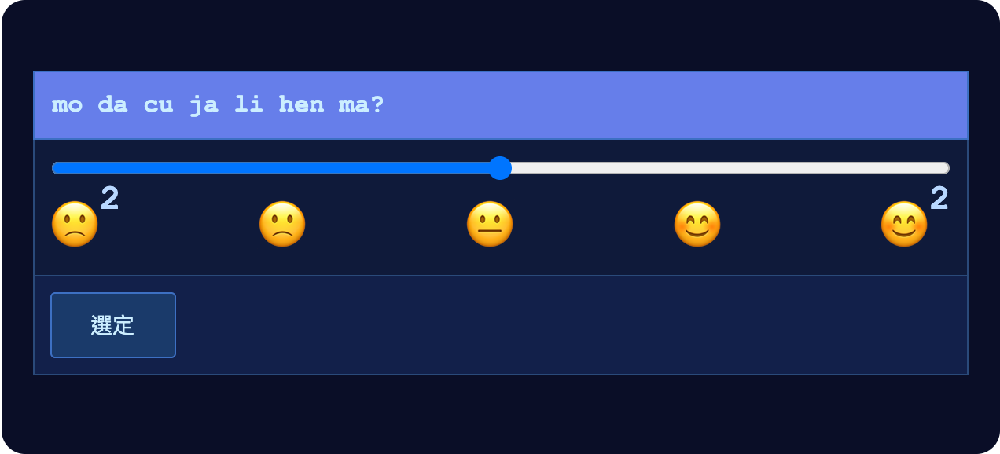
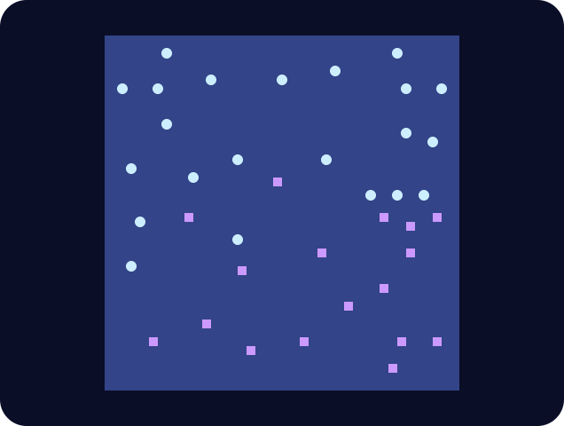

# 第七章

哲戈，帕佛蓋都·3724 年雨月 23 日

澤獨自坐在庭院的一張桌子旁，一邊喝茶，一邊吃一份蔬菜配飯。左手拿著手持裝置，正在複習明盤台的戰略。

一台機器人滑到他身邊。

「mo da cu ja li hen ma？」它問。「餐點和飲料好吃嗎？」

機器人的螢幕換成了評分畫面。

澤想了一會兒，把滑桿往右拉到大約四分之三的地方。

機器人嗶了一聲，慢慢滑開了。

等澤再抬起頭，汾正朝他跑過來，到了桌邊就坐下。

「你跑去哪了？」澤問。

「又去上語言學訓練了。」汾說。「看來班順派覺得我還真的滿適合他們。」

「大比賽準備得怎樣？」

「過去這一長時，我跟 AI 打了大概五場。」澤說。「感覺已經到了報酬遞減的地步。到頭來，全看這次的規則怎麼改。」

「所以最後兩場，我叫 AI 隨機想出規則變動，再跟它們對打。問題是兩場我都贏得很輕鬆。標準的明盤台，AI 打得比我好；可是只要碰到沒有訓練資料的新狀況，它們應變起來就差多了。」

「那你不能做一套流程嗎？它們一想出新規則，就先自我對弈微調，把新規則練熟，你再跟練好的版本打。」

「好啊，你要是能在接下來兩長時內幫我把這個架起來，我會非常感激。別忘了，比賽就是明天！」

汾想了一下。「這樣的話，我就得跟班順派說今晚不去了。」

「『Po so dze go ban』可以晚點再說，跟白的比賽可是明天。」

「拜託嘛？」

汾又想了幾拍。「好啦，我跟他們說今晚不去。不過下個月得跟他們補回來。」

3724 年雨月 24 日

汾和澤沿著坡道，往山體金字塔爬上去。澤在腦中過著明盤台的戰略。爬坡很累，反倒讓他更專心，腦袋想往別處飄的念頭都被壓了下來。

忽然，有人拍了拍他的肩膀。

澤轉過頭。是白。

「怎麼樣，期待今天的比賽嗎？」她問。「我覺得這對你來說會是個不錯的收尾。我想你媽大概還不太明白，你要拿下全市第二名，這有多了不起。」

澤腦子飛快地轉，想找句話回嘴。

「你知道嗎，你要是對澤好一點，」汾搶先嗆了回去，「等他拿下全國賽冠軍，說不定會用獎金替*你*出下一趟去紅郡或自由城的旅費。」

「說不定連你媽也一起帶上。」

白的笑容僵了一下，很快又回來了。

「謝謝你喔，汾。」

「不過說真的，我們就專心讓大家看一場好比賽吧。」

地面忽然微微一震。

他們已經爬到山的三分之一高，居高臨下。過了一會兒，他們望見遠處冒出一團煙霧，大概在城市郊區的某個地方。

「哇，那是什麼？」汾問。

澤拿出手持裝置，對準那團煙霧。

「查查看。」

他把手持裝置對著煙霧和底下那一帶停了片刻，才放下來。「定位到了。是市內最大的電腦晶片製造廠。別忘了，北極人一直拚命想阻止我們的科技再往前走。」

「看起來這座廠是政府經營的。我猜他們大概會說是意外之類的吧。」

「呵。」汾冷笑一聲。

「『gie fe kiu kai ci bin hu』裡那個『bin hu』，這些人到底是哪裡聽不懂？無首。本來就不該把東西集中成這樣。」

「我再說一次，這是政府。一半的人根本不懂自己在幹嘛，剩下的人裡，很多大概也以某種形式在拿北極人的錢。幾十年來，哲戈真正聰明、真正有效的事，全都是在政府*和*大企業之外做出來的。」

「不過反正我們現在有很多規模比較小、分散在各地的地下晶圓廠。不會有事的。」

「好了，兩位，」白插話，「我們真的得去比賽了。」

三人繼續往上爬。又過了幾分鐘，他們到了正門，走進隧道，腳步聲在隧道裡迴響。

到了第三個轉角，汾左轉往觀眾席去，白和澤則往右。兩人走進那扇門，穆已經在裡面等他們了。

「歡迎兩位回來。」穆說。「很期待看看你們兩個的表現。」

「希望這次的規則變動夠精采。」

「喔，一定會的。等著看吧。」

一台機器人滑過來，端給他們三杯水。澤、白和穆各拿了一杯。

穆舉起杯子。「敬我們的未來。」她說。「Dze go ba fau gie。」

澤有點困惑。「哲戈必將再起」是句很美的話，可是比起明盤台冠軍賽，這句話似乎更適合用在真正的戰場上，或是某種工業、教育活動。不過他還是本能地回了這句，白也在同一時間開口。

「Dze go ba fau gie。」

三人喝下杯裡的水。

他們坐下來休息了幾分鐘。接著，兩部電梯的門打開了。

------------------------------------------------------------------------

「MU GU GEI FA。」響亮的自動語音宣布。五十拍後開始。

澤吸氣，吐氣，最後一次在腦中把戰略默念過一遍。

「LE MU GEI FA。」

他的目光掃過觀眾席。大多數人他幾乎看不清楚，但整體看下來，他看得出這次的興奮比前兩場都要高。整片觀眾席嗡嗡地響著人聲。

「PA GU GEI FA。」

澤又吸了一口氣，憋住，撐過宣布前的最後十拍。

「歡迎來到第十八屆明盤台錦標賽帕佛蓋都決賽。今晚，我們將見證全市最關鍵的一場比賽。兩位選手的棋力，都經 AI 評定，勝過區區五年前的全國冠軍。」

「今天的兩位決賽選手，一個月前，我們才看著他們以隊友的身分並肩作戰。兩位天才：澤・雷明，以及白・嘉恆。」

「今天，我也很高興在此宣布本輪的新規則：兩位選手都會配有一個強大的個人 AI，在比賽中協助他們。」

澤的顯示畫面上忽然跳出一個新分頁。

「不過，選手和他們的 AI，都可以完整讀取對方 AI 的思考紀錄。」

澤把這段話聽進去，腦子很快轉了起來：這個 AI 要怎麼用？

他先讓 AI 照他自己的風格，排出標準的滑翔機和牆的陣型。讓他意外的是，AI 竟然知道他的風格。

旁邊另一個分頁開著白的 AI 思考紀錄。白也在做同樣的事，而她的 AI 一樣知道她的風格。

「MU GU GEI TAU FA。」響亮的自動語音大聲宣布。五十拍後開戰。

兩個 AI 還在最佳化各自的滑翔機和牆的陣型。到了這一步，它們都開始針對對方紀錄裡的戰略設計對策。

澤也開始親手布置幾個結構。為了快一點，他直接從 AI 做好的東西裡複製貼上幾塊；眼睛則一直專心盯著白的紀錄，看白的 AI 還有哪些戰略沒做好對策。

「LE MU GEI TAU FA。」

他開始親手布置最後一個主要結構：一艘載印記太空船。

AI 已經造了四艘，但他打算完全自己做一艘。這樣白就看不到；而且船的前面，他要擺一種風格不同的移動牆。他讓這艘載印記太空船瞄準 AI 先前架好的一道牆，撞上去反彈之後，再沿著場地中線往上走。

「PA GU……」

快點，澤想，把載印記太空船做完。

「SO……BI……ZE……HA……」

澤放下最後幾個方格。

「MU……FO……」

然後……做完了。

澤長長吐出一口氣。

「SHI……LE……PA……TAU FA。」

滑翔機飛了出去。澤的載印記太空船從東南角出發，開始往西移動。他看得到的場地範圍越來越大。

兩邊的 AI 思考紀錄都全神貫注在開發自己的地盤：造更多滑翔機、太空船和牆，往外擴張。

幾百回合後，澤和白的滑翔機開始互撞，接著撞上對方的太空船和牆。

又過了幾百回合，雙方的載印記太空船進入了彼此的視野。

沒多久，澤的載印記太空船撞上南邊的牆，反彈之後，開始往北走。

觀眾都在大螢幕上看著。

第一個干預回合到了。前線附近的結構，澤交給 AI 去調整。反正那裡改了什麼，白馬上就看得到。

他在白的 AI 思考紀錄裡找弱點，找到了一個：它完全沒在考慮從對角線打下來的滑翔機攻擊。

澤調低了分給 AI 的資源，把省下來的資源拿去親手送出大批滑翔機，沿著兩條對角線打下去。他算好了方向，讓兩批一前一後經過，去打白的兩座主基地。另外，他還送出一艘載印記太空船，瞄準的是兩批滑翔機都過去幾百回合之後，才通過中央。

比賽繼續。

中央前線打得出奇地勢均力敵。兩個 AI 都下得接近最佳；雙方又都看得到對方的動作和想法，幾乎沒有耍詐的空間。

不過，白確實在前線投入了更多資源，尤其是西側。幾百回合下來，差距開始在棋盤上浮現。很快，澤在西側的一艘載印記太空船被攻破，炸成一陣朝四面八方飛散的滑翔機風暴。

澤繼續下，把棋盤上的細節一一最佳化。他知道，自己那波攻擊要很久以後才看得到結果。

第二個干預回合到了。

澤能想到最好的做法，是在那艘沿著場地中線、慢慢往北飛的載印記太空船旁邊，再多造幾座工廠。除了對角線攻擊，白唯一不可能知道的結構就是它。

除非澤自己的 AI 不理他的指示。他交代過，要它只專注在分配給它的範圍；可是它也可能決定不管這道指示，在紀錄寫到一半時，脫口說出太空船的位置。澤決定不管這個可能性，反正他也沒什麼辦法。

他在西側又多架了幾道牆。

又過了好幾回合。西側，白還在持續推進，她的一些滑翔機闖進澤在西南方的基地，摧毀了他兩個印記。澤看著自己的載印記太空船朝西北方前進。

接著，突然間，西、北、東三個方向都有滑翔機朝太空船飛來。太空船很快就崩解，炸成一堆殘骸和十幾架滑翔機。

到這時，澤才明白是怎麼回事。

白的 AI 沒去考慮對角線，根本不是疏失。是白刻意要 AI 專注在其他方向，對角線那邊，她自己親手架起了堅固的多層防禦。

那是一個陷阱。澤不偏不倚，一頭栽了進去。

澤讓穆一陣失望。十七個印記對二十二個，她想。他怎麼會掉進那種陷阱，自己又拿不出半點有意思的招？

中間是有一艘太空船在往北走，但那又怎樣？白的基地守得住沿對角線來的攻擊，澤那艘太空船要抵達北邊，機會也不算大。她心想，除非澤想出完全出人意料的東西，否則這盤棋會拖成一場消耗戰，而局勢只會越來越偏向白。

又一批滑翔機出其不意地殺到，打掉澤兩個印記：一個在場地中央稍偏西南，另一個在中央稍偏西、靠近南端。另一批滑翔機也突然打中澤的東南基地，不過那裡的牆這時已經準備周全，滑翔機撞上去就彈開了，沒造成任何損害。

大廳另一頭，汾坐在比較不舒服的一般觀眾席，同樣害怕地盯著棋盤。

終於，澤腦中有什麼東西卡上了。

「我從西邊數來第四個印記，」他對 AI 說，「在它附近建一座工廠。先想出你能想到最好的十六種戰略，這座工廠每一種都要能執行。啟動工廠的，是一架從西南方飛來的滑翔機；實際選哪一種戰略，看滑翔機的類型和擊中的時間決定。然後，在我從西邊數來第二個印記附近，造出那架滑翔機。這個干預回合，八成資源都用在這件事上。」

AI 開始細細推演，著手實作那座工廠，還有那架滑翔機。

白的 AI 開始針對全部十六種戰略想對策，但很快就碰到極限：它沒辦法同時針對每一種把防禦最佳化。

它也把心力放在加強白自己的西翼。澤這才明白，他的*第一個*賭注押對了。白自己並沒有意識到，她在西側造成了多大的破壞；也沒發現澤幾乎沒做什麼彌補。所以不管是她還是她的 AI，都沒想到，到了這個時候，澤從西邊數來第四個印記，可能已經在場地的正中央。

接著，澤動手布他的*第二個*賭注。沒分給 AI 的那些資源，他拿來在工廠南邊加了一塊磚，擋住 AI 送出的那架滑翔機；又加了兩架自己的滑翔機，從南邊飛進來。

干預回合結束了。工廠有一部分在干預回合裡就已經建好，其餘的部分則交給滑翔機，用附近的岩塊即時繼續建造。

幾百回合後，澤的 AI 從西邊送出的那架滑翔機，被澤放的那塊磚擋了下來。*又*過了幾百回合，澤親手送出的滑翔機撞上工廠，把它啟動了。

工廠選出的戰略，不在白的 AI 重點規劃防禦的那四種之中。出手的位置也是白沒料到的：棋盤中央與北緣之間的中點。

工廠很快開始產出載印記太空船，往東移動；同時放出一陣滑翔機風暴往北飛，撞上岩塊和白自己的牆之後反彈，轉而往西。

白和她的 AI 完全措手不及。

到了下一個干預回合，澤的太空船已經深入白在東邊的防線後方。澤的 AI 趁機設計了一陣滑翔機風暴，從後方攻擊白的側翼；澤則另外加了幾架自己的滑翔機，攻擊白的東北基地——這幾架是他親手造的，這樣就不會出現在紀錄裡。

再過五百回合，棋盤上已經大不相同。

這時，穆凝重的搖頭和汾滿臉的恐懼，都已經變成了興奮的笑容。

十四比十一。澤又領先了，而且局面占優。

下一個干預回合很快就到了。澤盤算著，這次就重複同一套戰略，只是換成更短期的版本：馬上在東北方造出許多滑翔機工廠，每座工廠確切的樣式和方向，交給一個十回合後才會出現的觸發器決定。白看不到觸發器確切的內部邏輯——那部分是澤自己設計的，所以不會出現在紀錄裡。

白試著模仿澤的戰略。澤則拿一半的資源全面加強防禦，沒打算特別耍什麼聰明去勝過白。

他知道自己還算安全。他在白的防線後方有據點，白在他的防線後方卻根本沒有。

五百回合後，雙方的攻擊都見了分曉：澤的成功了，白的失敗了。白唯一像樣的戰果，是摧毀了澤西南基地裡剩下的印記。

十二比六。

白投降了。

觀眾歡聲雷動。

------------------------------------------------------------------------

穆和澤、白一起站在等候室裡。她才開口：「恭喜你們兩個——」

「恭喜你，澤。你只要等到我們的最後一季，就能打敗我了。」

「白，你今天下出了這輩子最好的一場。」

穆停了一會兒。

「連祭司們都不知道你們兩個會想出什麼。他們跟我說，想讓比賽更……*真實*一點。可是真實到底是什麼意思，他們跟大家一樣好奇。」

「真實？」白不敢置信地叫了出來。「AI 可以讀彼此的心，這哪裡真實了？」

「我一開始也覺得很瘋狂。可是越想，我就越明白他們的意思。」

「就拿維瑞迪亞的掌舵制度來說。那是政府裡最不透明的部分之一，連守律者都不知道彼此是誰。可是正因為這樣，它也是最值得信任、最難收買的部分之一。法院也差不多：從一大群人裡匿名、隨機選出的小組。」

「可是議會是透明的。所以凡是議會直接做的決定——大型基礎建設、外交政策、醫療，所有它出錢的東西——大家都一直在鑽它的漏洞、算計它。平方募資也一樣，其實還更糟。守律者、哨兵和法院的法官也沒有完全隔絕，核准他們的仍然是議會的委員會；但至少中間隔了一層，而且那些職位還有預測分數把關。」

「這就是教訓。在現實世界裡，重要的不只是想得好，還要把想法藏起來。有時候，甚至要對你的盟友，或是你應該服務的人藏起來。」

澤和白都盯著穆看。

「總之，你們兩個今天都表現得非常好。」

一台機器人滑了進來，帶著兩個袋子。一個側面印著數字 1，另一個印著數字 2。

穆把第一個袋子交給澤，第二個交給白。

兩人都坐下來，翻看袋子裡的東西：一面獎牌；一張刮開式一次性掃描碼，裡面有一些密碼學代幣和憑證；還有幾樣小禮物，一個杯子、一支書寫用具，和一支臭氧電解淨水筆。

白開始仔細研究每一樣禮物。

澤則馬上動手刮掃描碼上的覆膜，又拿出手持裝置，準備掃描。他想替媽媽買一台新的運算盒，已經想了好幾個月。現在終於真的買得起了，他還是不敢相信。

穆站了起來。

「希望你們兩個好好休息。」她一邊說，一邊轉身往房間外走。

穆一走，澤就發現有一份禮物是他有、白沒有的：一封深紫色的信，正面寫著字。

dun fe tin di zei de kin kie

「僅限澤親閱」

澤不刮掃描碼了，改把信收進口袋。
