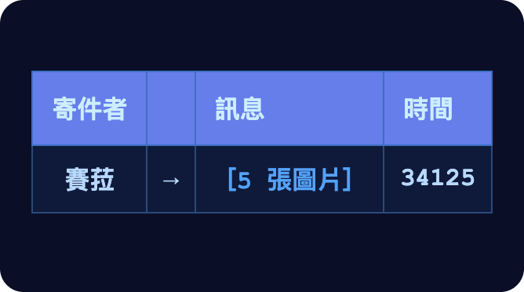
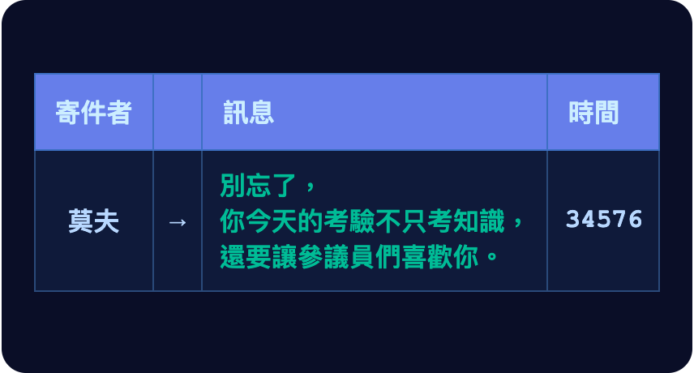
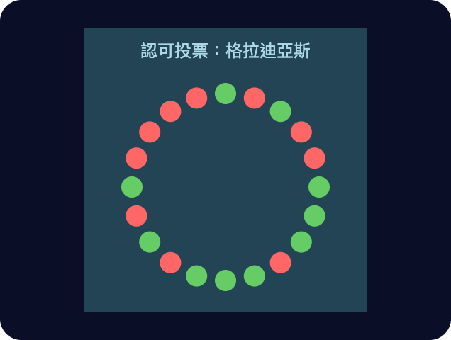
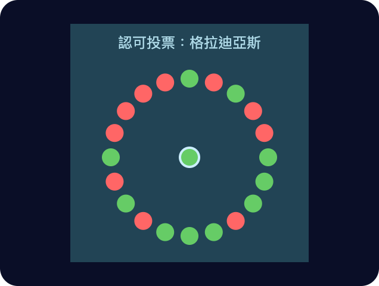
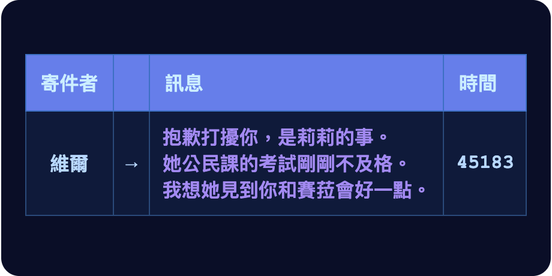
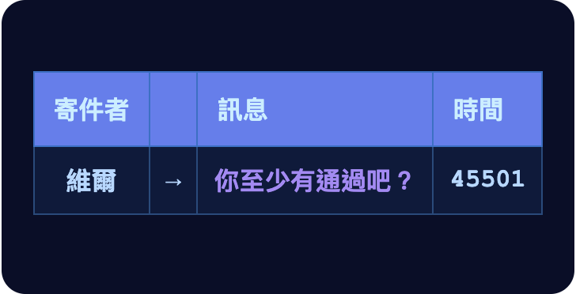
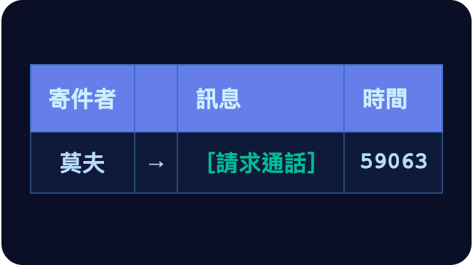

# 第八章

維瑞迪亞，梅爾丹·3724 年雨月 26 日

走在街上時，格拉迪亞斯的手錶震了一下。

他打開手持裝置，想把照片看清楚一點。

是賽菈，從伊普塔克傳來的。格拉迪亞斯一看就好奇起來。

維瑞迪亞人習慣把翁達克、伊普塔克、曼塔克和貝爾帕基這一群城市叫作「克城」。那地方，他和賽菈都從來沒去過。

照片裡的建築明顯不一樣：磚和木頭用得多，色調偏紅、偏褐。跟他在維瑞迪亞看慣的不同，甚至跟哲戈的照片也不同；他去過、或在照片裡看過的聯合城邦城市，沒有一座是這個樣子。

招牌上的文字一半是字母、一半是圖像。哲戈語以前也跟這差不了多少，後來為了精簡語言，才把圖像的部分拿掉。

他按下一個按鈕，給賽菈回了個愛心符號。

「好期待你的部落格文章。」格拉迪亞斯對著頸帶低聲說。翡翠自動把這句話轉給了賽菈。

「我過幾天就回去了！」賽菈回道。

這時他已經走到小路盡頭，眼前就是和街邊人行道交會的路口。正前方立著一塊站牌，列出在這一站停靠的自駕巴士。他找到自己要搭的那班巴士號碼，便站在那裡等了起來。

手錶又震了一下，螢幕上跳出一則通知。

格拉迪亞斯嘆了口氣，手臂垂回腰側。

他繼續等。

------------------------------------------------------------------------

幾分鐘後，下一班巴士進站了。格拉迪亞斯看了看車號，正是他要搭的那班。他快步上車，車門在身後關上。

眼角餘光裡，他發現這時低頭盯著手持裝置看的人比平常多。他有些好奇，往前走了一步，悄悄看了看其中一位乘客在看什麼。

畫面最上方的標題寫著「維瑞迪亞國立大學」，底下一行是：「國立大學校長希爾卡教授與北極帝國駐維瑞迪亞大使艾費里昂勳爵現場辯論」。

正在發言的是希爾卡。畫面上有字幕，格拉迪亞斯看得清楚。

「經濟總產出本身，只能衡量人類進步的一部分。」她說。格拉迪亞斯只看得到，聽不見。「可是一旦把它當成全部的目標，這個視角就會變得非常狹隘、貧乏。」

他實在好奇，便透過頸帶低聲請翡翠開啟這場辯論的語音直播。

「重要的事情還多得很。公民的健康、他們的情緒福祉，還有社會中的連結有多健康。」

希爾卡說完這段，語音直播也接通了。格拉迪亞斯從那名乘客身邊退開。

剛才偷看人家的螢幕，等於短暫侵犯了對方的隱私，他有點不好意思。好在現在是用完全正當的方式收看，他也鬆了一口氣。

「人要是因為活著沒有目標而不快樂，車子再大又有什麼用？人要是在社會裡覺得疏離，沒有朋友可以請來家裡，房子再大又有什麼用？」

「底層的人拿最新的電子產品去當駭客、去偷，上層的人拿它們侵犯隱私、監控別人，每個人又無時無刻拿它們在社群平台上發怒——那這些東西再新，又有什麼用？」

「維瑞迪亞會有掌舵這樣的機制，為的就是這些問題。」

希爾卡停了下來，換艾費里昂勳爵發言。

「想設計出比經濟總產出更好的指標，這件事人們已經做了一個世紀。可是我們看到的是：不論用哪一項這類指標，表現最好的國家，恰恰就是經濟產出最高的那些。從長期來看尤其如此。」

「這背後有個深刻的原因。歷史學家早就明白，社會裡有許多現象是循環往復的。古人講過一個循環：興盛、驕傲、傲慢、衰落、受苦、重生，然後再一次興盛。講到治理，他們也是同樣的說法：治理必然在技術官僚、民主、混亂與強人之間輪替。」

「每當我們談起興衰的必然，以這種方式起伏的，恰恰就是『社會凝聚力』『自由』『福祉』這類比較『軟』的特質。在這些面向上，主導的變換是一種旋轉：好會產生壞的根源，壞的根源帶來壞，壞又再一次產生好的根源。」

「而且說句實在話：大家拿來當目標的這些『軟』特質，是由一群群祭司組成的委員會挑出來的。這些人被選上，靠的不是能力，而是附和當時最投人所好的意識形態。」

「只有一件事跳脫了這個模式，帶來真正持久的改善：經濟成長。科學、技術與資本累積不斷進步，推著它勢不可擋地往前走。社會的情緒在成功的驕傲與崩潰、挫敗的絕望之間來回擺盪；可是每走完一個循環，人們都比以前更聰明、更富有。」

巴士上有幾個人也在看直播，格拉迪亞斯看得出他們眼睛亮了起來。

「掌舵會的成員是透過一套精密的——」

「請遵守秩序。現在由艾費里昂發言。」主持人插話。

「所以，如果你想真正改善一個社會，帶來長遠持久的價值，就不要把心力放在循環往復的東西上。不要把心力放在加速旋轉上。你應該把心力放在增加最大特徵向量上。把心力放在那個有千年複利紀錄的東西上——在那個向量上，好會穩定地帶來更多的好。至於其餘的，就任它依循自然法則去吧。」

艾費里昂說完，希爾卡清了清喉嚨，準備開口。格拉迪亞斯這才發現車門開著，巴士已經停在他要下的那一站。他趕緊跑下車，翡翠自動暫停了直播，好讓他專心。

那場辯論在他腦中又多停留了片刻。他有點惱火地察覺到，艾費里昂的句子多麼輕易就排成了一套論證，而且照它自己的前提，看起來還說得通。

一個有天分的煽動家，他下了結論。接著便把注意力拉回眼前的事。

格拉迪亞斯沿著一條小路往前走，兩旁綠樹成蔭，頭頂的枝葉沙沙作響。走了幾分鐘，前方出現一座大型的圓形建築。這就是議會大廈。

它和掌舵會總部明顯不同。掌舵會總部刻意蓋得遙遠又神祕；議會大廈卻就建在地面上，融合了中世紀與現代的美學，四面八方都有入口。

他繼續往前，不久就到了入口。

------------------------------------------------------------------------

「格拉迪亞斯，歡迎來到你的遴選聽證會。」

「你擔任見習生已經四年，預測分數來到第九十四百分位。現在你申請成為掌舵會的正式成員。至於申請的是哨兵還是守律者，永遠只有你自己，或許再加上你最信任的幾位顧問，才會知道。」

「今天要進行的是入會考核的第二部分：由議會委員會核准。準備好開始聽證了嗎？」

一台機器人端著一杯水，滑到房間中央格拉迪亞斯坐的椅子旁。他接過杯子，放進椅子側邊的杯架。

「我準備好了。」

「那麼，開始提問。」

房間是圓形的。二十位參議員沿著邊緣坐了一整圈，每人一張大椅子，彼此相隔約兩公尺。有些椅子之間擺著空氣清淨機，低低地運轉著。

參議員頭頂上方有明亮的燈往下照。亮黃色的那些負責照亮房間；另外還有幾盞看起來淡紫色的燈，光線微弱，是用來保持空氣潔淨的。

委員會主席坐在一個格外尊貴的位子上。大約五位參議員按下桌上的按鈕，要求發言。

系統自動挑了其中一位，他座位邊緣的燈亮成綠色。

「韋爾多參議員，請提問。」

「格拉迪亞斯，跟我們談談你的背景。」

「呃，」格拉迪亞斯說得結結巴巴。「我是三十九年前出生的。家裡算是中產階級，很普通，沒什麼特別。念的是一般學校，成績不錯，可是從來沒拿過全班第一之類的。」

「為什麼沒有？」

「我想，大概就是沒有那個動力。有一年我非常拚，平均拿到九十七分。可是後來我發現，那段時間我心裡最主要的感覺是害怕：只要搞砸一次，那份漂亮的紀錄就沒了。我甚至避開了比較難的課。

「那一年結束時，我覺得這場遊戲根本不值得玩。所以我就沒那麼用力了，空閒時間開始寫程式，後來又讀法律，因為我對這些有興趣。結果程式競賽的成績還算不錯。」

「你為什麼選擇當見習生？」

「成年以後，我開始認真寫程式，給自己的第一個業餘專案，是替銀聊寫一個第三方用戶端。寫完之後，我想替藍鯨也做一個，結果難了太多，因為他們在很多方面都比較封閉、比較專有。

「那時我才明白，銀聊的開放性帶給我多少價值，而這些價值，銀聊自己永遠收不回來。那之前沒幾天，我才剛讀過規準，一下子就通了：就是這個。市場單靠自己會漏掉的、一個好社會的那些面向，正是掌舵這麼重要的原因。所以我覺得很有動——」

計時器響了。

「下一個問題！帕普利。」

「你最喜歡哪個樂團？」

「呃……沒有特別喜歡的。」

「最喜歡的遊戲？」

「也沒有。」

「最喜歡的運動？」

「我記得小時候很愛玩彩球？就是學校裡玩的那個，後來的旋翼球就是照它發展出來的。」

「一般維瑞迪亞人的生活，你脫節成這樣，我們怎麼可能信得過你，讓你代表我們的社會做判斷？」

「公民會議和廣聽報告，不就是為了這個才存在的嗎？守律者小組在對一條規準做出決定之前，有好幾個月可以聽取這兩者。守律者和哨兵可以各自專精，不也是這個原因？我大概不會去決定任何跟運動有關的事。」

「你對哲戈有什麼看法？」

「我喜歡他們的食物。他們的歷史，我最近才開始多了解一些。我太太遇到過兩個哲戈的孩子，他們看起來人都很好。整體來說，我很同情他們的處境，希望我們能想辦法多支持他們一點。」

「哈，所以你要我們支持哲戈，又要我們把社群網路弄得更開放，好讓幾個超級聰明的小孩玩得更方便。可是一般維瑞迪亞人在乎的、會影響他們生活的事，我一次都沒聽你談過。」

「您不覺得，硬體開放性提高了，就會有更多技師能進入市場，擁有東西的成本也會跟著降低——」

「那技師自己的薪水呢！」

格拉迪亞斯開始在腦中組織回應。經濟學是每個受訓見習生的基本課程，這個謬誤他立刻就認了出來。

一方面，維修費每漲一塊錢，就是從顧客那裡拿走一塊錢、交給技師；從這個角度看，好壞剛好抵銷。

但另一方面，還有二階效應。擁有物品的成本降低了，人們就能把省下的錢拿去買別的東西，別的地方也就會創造出更多工作。

忽略這一點，正是所有以政治之名推行的天真經濟干預主義共同的謬誤：只顧看得見的，犧牲了看不見的。

在腦中理出這套論證的架構，他大約花了三拍。可是接著他發現，要把它說完得花上大約二十拍——計時器上卻只剩四拍。

格拉迪亞斯放棄了，乾脆不回答。

計時器響了。

格拉迪亞斯緊張得開始冒汗。

「安庫斯參議員？」

「你上一次投美觀稅，投的是什麼？」

「巴德拉街上一棟藍灰色的大樓。那一票很難決定。它就是普普通通，沒有什麼不搭調的壞地方，可是也沒有什麼出色之處。我每次經過，總有一家家人進進出出，甚至有人坐在外面的長椅上，偶爾還有小孩在賣自己做的食物。不過這在現在的梅爾丹很平常。所以我只給了它非常小的一票贊成。」

「那你上一次*希望*自己能投的，是什麼？」

「一面海卓菲的廣告看板。說他們的飲料不含兩千多種毒物和不建議物質的那一面。」

「為什麼？」

「那個廣告很好玩。我還記得小時候，所有的廣告不是無聊，就是看了很痛苦。它們只想鑽進你的腦袋，其他什麼都不在乎。在大眾運輸上這樣搞尤其糟糕：搭大眾運輸的體驗一差，就會有更多人改開車，污染和壅塞更嚴重，對所有人都不好。海卓菲這麼努力想做得比那更好，我很高興。」

「帕普利，」安庫斯猛地轉頭看向帕普利，大聲說：「你不覺得一家人享受戶外環境、好的大眾運輸，還有好玩的東西，都是一般維瑞迪亞人非常看重的嗎？」

帕普利沒有回答。

「對話請限於提問的參議員與申請人之間。」主席插話。

「我想是的。帕普利大概會說，海卓菲那種幽默是自以為聰明的人的做作幽默，之類的。

「可是我覺得他低估了維瑞迪亞人，低估了他們很多人其實有多聰明。我來這裡的時候在巴士上，希爾卡正在跟艾費里昂辯論怎麼衡量社會進步，她發言的時候，大家看起來都聽得很投入。」

「那不過是聰明人自鳴得意版的看人吵架。旋翼球還*更*和平咧。」帕普利插嘴，「至少平方募資會資助旋翼球比賽。我們應該把你們這些人廢掉，直接做一個反向的平方募資，拿它來算所有大企業的稅。」

「肅靜！」主席喊道，「下一個問題。」

提問又持續了半長時，每位參議員都輪到了發問的機會。

最後一位參議員向格拉迪亞斯問完問題，計時器響起，主席站了起來。

「投票時間到！」

「贊成」和「反對」兩個投票按鈕就在桌上，清清楚楚，格拉迪亞斯只要看著參議員，就分辨得出每個人投了什麼。

參議員們開始按下按鈕。每投一票，就響起一種不同的聲音。幾拍之內，所有的票都投完了。格拉迪亞斯望向房間上方的螢幕。

「哇，」主席叫了一聲。「剛好十比十。照認可投票的規則，決定票由我來投。所以，我投……」

他按下桌上兩個按鈕的其中一個。

「贊成。」

「格拉迪亞斯，歡迎加入掌舵會。」

------------------------------------------------------------------------

一走出建築，格拉迪亞斯就看了手錶。入會聽證還在進行時，手錶就一直震個不停，聲音不小，他始終沒去理它。

賽菈還在伊普塔克。格拉迪亞斯心想，只能自己去了。

到維爾家的路線，他懶得問翡翠。路他自己認得，也不算遠。

他邁開腳步。腦子裡大多是在擔心莉莉，另外還有一點沮喪——也許比他願意承認的還多。勝利才剛到手，轉眼就被恐懼取代：眼前擺著一個問題，他卻完全不知道該怎麼解決。

「我馬上到。」他對著頸帶低聲說。這一次同樣不是因為他當下多想保護隱私，只是到了這時候，低聲說話已經成了習慣。「幫我叫平常那份吃的。我剛結束入會聽證，等一下會很餓。」

「過了。不過是驚險過關。」

走了二十分鐘，格拉迪亞斯到了維爾家。維爾替他開了門，自己又坐回椅子上。莉莉坐在沙發上，正在哭。

格拉迪亞斯在她身邊坐下，抱住她，等了一會兒才開口。

「沒事的。」他低聲說，「分數不是一切。你心裡是多麼美好的一個人，維爾、黛亞、賽菈和我都知道。我們都愛你。」

莉莉把臉轉開，悶悶不樂。

「我們可以幫你。只是得找到一種讀這些內容的方式，讓你覺得跟自己有關。」

「你們已經試過了。」莉莉一邊啜泣，一邊小聲說。「我這次考五十九分。五十九分！全班倒數第三。」

「那你說，你們班上最聰明的那個孩子，能像你半年前那樣，替賽菈烤一個生日蛋糕嗎？幾年前赫蕾妲出了意外、還在休養的時候，你連續一個月每天送飯給她。他會這樣做嗎？」

「你要明白，你本來就已經是一個很美好的人了。自信就是從這裡來的。想要進步的動力，也可以從這裡來。」

「這些學校真的得更懂得把公民這類科目，跟你生活裡重要的事連起來。我當初會走上見習生這條路，也只是因為看到掌舵的誘因怎麼幫忙把網路世界打開，讓我也能參與、能替它寫程式。你也會有屬於你的那一刻。」

「你下次公民考試要是考到七十五分以上，」維爾說，「我下一趟去北林就帶你一起去。」

這個誘因未免太粗糙，格拉迪亞斯微微皺了一下眉。不過他心裡也覺得，值得一試。

這時門鈴響了。維爾起身走過去開門。是送餐來了。

維爾拿起餐點擺到桌上，和格拉迪亞斯一起打開。

莉莉慢慢站起來，也到桌邊坐下。三個人開始吃飯。

------------------------------------------------------------------------

格拉迪亞斯的手錶震了一下。

他接了起來。

「莫夫，最近怎麼樣？」

「我這邊有個有意思的消息。不過先問你，你過了，對吧？」

「驚險過關。」

「進了就是進了。」

「那你那邊有什麼消息？」

「看來我們終究當不成守律者了。密碼學的隨機之神選中了我，從下個任期開始，我要去當傳令官。」

「哇。」

「是啊。所以從今天起，我手上一點正式權力都沒有了。」

「你覺得自己當了傳令官會做些什麼？我實在想像不出你去主持那些會議、上台演講什麼的。該不會就是去銀聊管一個子論壇吧？」

「你太了解我了。不過，我也會有更多時間可以幫你。」

------------------------------------------------------------------------

當天晚上，格拉迪亞斯打了電話給賽菈。

「我過了！」他興奮地說。

「我就知道你會過！」

「差一點點。十比十，最後是主席投下決定票。」

「贏了就是贏了。從你跟我說要走守律者那天起，我就一直好興奮，想著你在那個位置上能做多少好事。」

「我會盡力的！」
