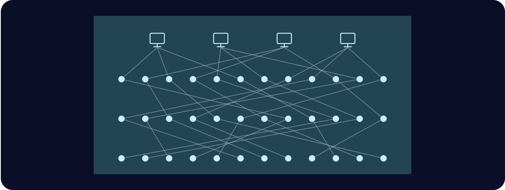

# 第九章

哲戈，帕佛蓋都·3724 年雨月 28 日

白和汾坐在一處庭院裡，一起吃東西、喝茶。白的臉上掛著淚。

「澤其實是個很好的人，你知道嗎？」汾輕聲說，「你只要對他好一點，他能幫你很多。」

「好一點？像你那樣？」白難過地回了一句。

汾遲疑了，不知道該怎麼接。

「澤帶他媽媽跟我一起去自由城那次，你知道我是什麼感覺嗎？」她問。

「難過？因為你想跟他兩個人去，可是你看得出來，他不想？」汾問。

「才不是！」白大吼。

「給你個提示。前幾天比賽完，你說我下一趟旅行可以帶上我媽——那時候我也是一樣的感覺。」

「你不喜歡你媽？」

「我媽在哪裡，甚至我媽是誰，你從來沒問過！我們見過十幾次面，你一次都沒問。」

「呃，抱歉。那你媽是誰？」

「我媽死了！我爸也是。」

「我還很小的時候，他們死在一間實驗室的爆炸裡。是誰幹的，你也知道。」

汾的臉沉了下來。

「我住到我阿姨家。可是她基本上都不理我，給我一個房間、一天兩餐，差不多就這樣。」

「所以我只能靠自己的雙手活下去。自己學著賺錢。連讀高中的時候都在打工。」

「所以那幾次我害澤拿不到獎金、沒辦法替他媽媽買運算盒，希望他能原諒我。」

「我連媽媽都沒有！我有的就只是我的成就和成功。現在連這些也被澤拿走了。」

她靜了下來，往椅背上一靠。這些話，她本來一句也沒打算說。

停了一下，她又開口。

「可是澤的那些戰術，真的很漂亮。我在對角線上布下那麼完美的防禦，騙澤往那裡攻，那時候我好驕傲，覺得那是我這輩子做過最聰明的事。結果他一出手，做了一件更聰明的事。」

「我是真的想更了解你們。是什麼在驅動你們，你們又是怎麼思考的。」

兩人都停了下來，各自喝了幾口茶。

「我們聊點別的吧。來，你想不想看看，他們對下一版哲戈語有什麼構想？」

白的眼睛亮了起來。

「好啊，有何不可。」她說。

汾拿出他的小冊子。封面上寫著「po so dze go ban de sia」，也就是哲戈語第九版構想。

「哲戈語是一件傑作。」汾解釋，「它一直在一個很難拿捏的平衡上找路：要好學，語法要合邏輯，可是說起來、讀起來也要順，還得能拿來談現實世界裡大家在乎的事。」

「最早那幾版，是上個世紀我們輸掉對北極的戰爭之後，才短短十年就開始的。那時候改的都很簡單，沒什麼爭議：從圖像文字改成字母，拿掉複雜的名詞變格、動詞變位和不規則動詞。」

白這時已經聽得很專心，眼裡滿是好奇。

「再來就是語法上比較難的取捨了。哲戈語的語法，只要你願意，可以非常合邏輯。拿小學課本裡那種簡單的句子來說：『giu jan li mo fe jia dzu lie』，那個人吃酪梨。『li』是主詞和動詞之間的分隔詞，『fe』是動詞和受詞之間的分隔詞。電腦程式也剖析得出來，清清楚楚，不會有歧義。」

「還可以更複雜。『lo mo fe jia dzu lie zo hen jun』，吃酪梨很健康。『lo』和『zo』是開括號和閉括號。口語裡，『lo』可以省掉。」

「可是這樣一來，就有歧義了。我們把『jia dzu lie』拆開來看：黑、心、果。這是中心是黑色的果實，還是又黑、又在某種意義上很『中心』的果實？理論上，我們有分隔詞可以處理這個：『ji』。說成『jia dzu ji lie』，歧義就會少一點。可是歧義永遠沒辦法完全消除。木瓜籽也有黑色的中心啊。」

「所以規則性和實用性之間，你得取得平衡。講到大家生活裡常見的東西，要好說，說起來也要舒服。所以班順派的祭司們一直努力把意義空間的規則性最佳化，雖然他們知道自己永遠不會——也永遠不可能——完全成功。」

「就算你只會那 256 個字根，別人說的話也能聽懂一半以上。不是全部，可是比以前好太多了。以前碰到複雜的字，除非你剛好看過那個字，否則根本猜不出它是什麼意思。」

「他們為什麼要在這上面花這麼多工夫？怎麼不多花點心思改善經濟、科技，或者軍事什麼的？」

「這個嘛，我們要是在那些事情上下工夫，北極人就會轟炸我們。語言沒有威脅性。我想連北極人都覺得哲戈語很了不起。而且班順派還花過幾次時間改革計時制度。一分鐘一百拍、一長時一百分鐘、一天十長時，就是這樣來的，我們還讓它在全世界通行了。這套東西，連北極人都採用了。」

「你們該不會有一本祕密課本，連*那個*的第九版都規劃好了吧？」

「有啊，我們打算哪天用光呎取代公尺。光在一拍內前進十億光呎。一光呎等於兩百五十九點零二零六八三七一二公釐。」

「聽說英格沃爾的人很喜歡。長久以來，大家一直笑他們的舊度量單位又複雜、又不合邏輯；現在我們推出的單位，長度跟他們的舊長度單位非常接近，而且直接建立在宇宙最基本的物理常數上。所以某種意義上，我們等於在說：他們從頭到尾都是對的。」

白咧嘴笑了。

「總之，下一版的哲戈語——」

白打斷了他。

「下次吧。聽你講這些，我都好奇起來了。我覺得哪天應該自己去研究一下哲戈語的歷史。」

「好直覺！我保證，等講到第九版會更好玩。澤自己就看不出這些東西的價值，他最近一心都在比賽上。」

「我想也是。而且我覺得他不會停的，這顯然讓他得到了很大的回報。」

「也許哪天我該找他玩幾場——就當好玩，或者，對他來說，大概是練習。」

「喔，對了，謝謝你轉移我的注意力，讓我心情好起來！」

------------------------------------------------------------------------

澤照著手錶的指示穿過隧道，走下樓梯，腳步聲在隧道裡回響。每到岔路口，他都會刻意往每個方向看一看，把周圍記清楚。他從來沒有走進山體金字塔這麼深的地方。

最後，他走到一扇密封的門前。門邊有個綠色圓圈，他把手錶往圓圈上一碰，門緩緩打開。

門後是個又窄又長的房間，盡頭擺著一張大桌子。桌邊坐著一個男人，披著暗色斗篷。那不是維瑞迪亞的隱私袍，是明盤台祭司的服裝。

澤慢慢穿過房間，在祭司對面坐下。

「歡迎。」祭司輕聲說。

「很榮幸能來這裡。」澤說，「可是……請問您是哪位？」

「我是鄧，昆高派最高議會的成員。謝謝你來。」

「昆高派？我們連負責國防的祕密社團都有？還替哲戈養了另一整支影子軍隊？」

「當然。很意外嗎？」

澤遲疑了一下。

「前幾天那場明盤台比賽，你的表現讓我印象深刻。」

「不過，讓我印象深刻的不只是你贏了。我研究過那場比賽的思考紀錄。真正讓我印象深刻的，是你用的那種戰略。」

「我問你，你學過密碼學嗎？」

「我……懂一些基礎？因數分解很難；加密就是對 n 取模算立方，只有知道 n 是哪個 p 乘以 q 的人，才能把立方反解回去解密。」

「不不，那是科普程度的密碼學。以因數分解為基礎的那套，已經幾十年沒人用了。連橢圓曲線都開始退流行，因為大家都擔心北極人這幾年隨時會拿出量子電腦。」

澤沒有接話，只是回望著他。一方面，他感謝對方替他更新了知識；另一方面，他也好奇這整段對話到底會走向哪裡。

「好吧。我是覺得，你在上一場比賽裡，幾乎是從零開始，發明了密碼學的一大塊。」

「想想混淆協定。你想把一個程式交給別人，讓他能執行，卻看不到程式內部的細節。我們現代的密碼學網路，像是處理付款和信譽、替哲戈的祕密社團管理治理的那些，全都仰賴這個。」

「可是，要怎麼做出單一一個協定來辦到這件事？怎麼把程式藏起來？藏資料不難想像：把資料藏起來，再對藏起來的資料做加法和乘法——尤其是全靠把資料藏在經過線性變換的大向量裡、再加上誤差來做的時候。可是程式要怎麼藏？你到底要把一個程式藏進什麼樣的可能程式空間裡？」

「解法是——好吧，是某一類解法裡的一小部分——做一個元程式。這個程式會依輸入不同，執行任何可能的程式。這樣一來，你就把程式化約成一組數字，只需要對它們做加法和乘法。」

「這是資訊科學裡最基本的技巧之一。我們的電腦，那些實體硬體，本身就是元程式。而你想出了一個非常基本的版本：只有十六種可能的演算法，融合在一座工廠裡。你再加上一架隱藏的滑翔機提供輸入，靠這一套把你的意圖藏了起來。」

澤點點頭。

「謝謝您的稱讚。可是……我現在很好奇，您說這些，是想做什麼？」

「是這樣的，澤，我想招募你投入國防。」

澤的眼睛睜大，嘴也張開了。

國防。

澤不自覺地把左手的手指一根根張開又合起。那隻手臂斷過，花了一個月才癒合，全都只因為一堂熱力學課。

鄧在說的，可不是一堂課。

可是救了他一命的，正是這種工作：在最後一刻，祕密又協調得很好地臨時換了教室。也許這是他的機會，去替別人做同樣的事。

「我確實希望你繼續打明盤台，一路打進全國賽，我覺得這對你有好處。不過學業方面，去讀密碼學吧。我想那對你的比賽也會有幫助。」

「當然，這一路上我都會跟你保持聯絡。等你準備好了，我就會開始建議一些任務給你。」

澤又一次沒有作聲。

任務。

他注意到鄧換口吻換得有多快：說起話來，已經預設澤會照他的計畫走。

他心裡有一部分已經在找答應的理由；另一部分則看著自己的熱情一點一點升起，並不完全信任它。

「我有個主意。」鄧開口，「你知道晶片驗證是怎麼運作的嗎？比方說，我現在是怎麼自動驗證你所有的電子裝置都是友善的？」

鄧一說完，澤就開始回答。運氣真好，鄧要考他的，剛好是應用密碼學裡他*確實*研究過的領域。

「裝置製造的時候，製程裡會產生一個物理不可複製函數。那是一把私鑰：晶片做好之後會冷卻，化學物質在冷卻過程中沉降下來，就生成了這把私鑰。連製造商都不知道它是什麼。製造商會探測裝置，取得它的公鑰——就是那個 p 乘以 q；或者，我現在知道了，那根本不是 p 乘以 q，是完全不同的東西。接著，製造商用自己的金鑰簽署這把公鑰，再發布到密碼學網路上。」

「好吧，把函數叫作金鑰，大致上也說得通。繼續。」

「身為使用者，你可以要求裝置簽署一個值，它就會簽。接著，你從密碼學網路下載公鑰，拿來驗證它的簽章，就能確認它真的出自那家製造商。」

「然後還有公共檢驗員。他們會隨機向製造商購買裝置，用某種掃描方式做破壞性檢驗，確認晶片裡真的是它應有的邏輯。」

「為什麼要用密碼學網路？直接簽署不就好了？」

「這樣才知道總共有多少個。要是製造商作弊，或有人駭進他們的金鑰，簽出比應有數量更多的公鑰，這類攻擊就能避免。而且這樣也知道簽章是什麼時候做的，可以確定是在裝置製造時簽的。萬一製造商的金鑰不知怎麼被偷了，也能分辨簽章是在被偷之前還是之後做的。」

「那我要怎麼驗證你的裝置？」

「用無線的方式要它簽章，跟我驗證裝置的方式一樣。」

「我怎麼知道，它不是在轉發別處另一台裝置的回應？」

「在這裡的話，因為我們在山的深處。一般情況下，我不知道。」

「晶片檢驗流程又是怎麼運作的？」

「這我不知道。」

「檢驗員怎麼知道，他們拿到的裝置跟大眾買到的是同一批，而不是製造商特地挑來騙他們的？」

「我不知道。」

「我們先想另一種情況。就拿公共保全攝影機來說，裝在路燈柱上、建築外牆上、自駕巴士上的那些。每個哲戈人都有權偶爾隨機挑一台，拆下來自己分析。我們就是靠這樣，才知道它們只在該錄的時候錄影、傳輸；也才知道從製造到安裝，整條供應鏈上沒有人能在裡面裝竊聽器，把資料洩漏給跟蹤狂、內線交易者或北極人。」

「這就是隨機檢驗流程——前提是，把檢驗攝影機當嗜好的人裡，至少有一些人真的是隨機挑的。不過那是保全攝影機，它們本來就在公共場所，誰都能隨便挑一台去拆。那這裡呢？向製造商買來的電腦晶片，我們要怎麼做隨機檢驗？」

「好吧，您告訴我。」

「嗯，很高興還有很多東西我可以教你。不如我們現在就去參觀一座這樣的工廠？」

澤想了一下。他心想，這還不算是做出承諾，而且那會是他從來沒見過的東西。

「好啊，很樂意！」

澤和鄧走出房間，穿過隧道，來到金字塔一個比較小的出口。出口外直接接著一輛大型長方形黑色專車的車廂。金字塔的門和車門形狀一模一樣，緊緊貼合在一起。

兩人上了車。

車門密封關上時，澤注意到車廂兩側貼著阻訊箔。車子有窗戶，但從窗裡看出去，外面的世界似乎被調暗了；他知道，從外面看進來，幾乎什麼都看不到。

車子開動了。一分鐘後，駛進一條隧道，窗外跟著暗了下來。

直到這時，澤才明白：現在全世界沒有一個人知道他在哪裡。

------------------------------------------------------------------------

澤和鄧下了黑色專車。這次車門一開，正對著另一扇敞開的門，門後就是往地下室去的樓梯。從車裡到門裡，連一拍都不會暴露在外頭的視線中。

兩人順著樓梯往下走，最後進了一個大房間。

他們看到成千上萬個空的白色盒子，側面貼著印有二維條碼的標籤。輸送帶嗡嗡運轉，把晶片從另一個房間送過來；一台機器自動把剛送出來的晶片一一裝進盒子裡。

鄧打開手持裝置，把一張圖拿給澤看。

「你看過這個嗎？」鄧問。

「某種網際網路的示意圖？」

「這是混合網路。交易就是靠它進入密碼學網路的，而且沒有人看得出是誰送出的。」

「每個寄件者送出的每則訊息，都會先包上三層加密。包好之後，最外層這則訊息會送到第一層的某個節點。」

「第一層的節點解開最外層的加密，看到的是另一則加密訊息，外加一個位址：這則訊息該轉給第二層的哪個節點。」

「第二層的節點再解開下一層加密，一樣看到另一則加密訊息，加上該轉給第三層哪個節點的位址。」

「最後，第三層的每個節點解開那一層加密，拿到目的地的位址，還有真正的酬載。當然，酬載本身通常也是加密的。」

「哇，原來是這樣運作的，我都不知道。所以要揭穿一則訊息是誰寄的，得三個節點一起共謀才行。」

「不只是三個節點——是三個*隨機選出*的節點。要是你很多疑，還可以讓內層的酬載再套一個信封，要求在下一輪把訊息直接再送進系統，重走一遍。」

「所以包裝這一步就是在做這件事。那些盒子高度不透光，密封防竄改，二維條碼就是加密的酬載。這是混合網路，只不過送的是實體商品。」

「你透過這套系統買東西的話，三個節點裡只有最後一個知道你的地址，而那個節點不知道寄件者是誰，也不知道自己送的是什麼。要是你*加倍多疑*，還可以把地址設成公共取貨點，自己去拿。」

「檢驗員是透過混合網路購買的。所以身為消費者，你自己也透過混合網路買的話，拿到的晶片就跟檢驗員買的出自同一批。製造商只要把能通過檢驗的誠實晶片交給檢驗員，就幾乎一定也會交一顆給你。哪些晶片會送到誰手上，他們分辨不出來——其他經過這套系統的實體商品也一樣。」

鄧接著往前，走向一扇門。澤跟了上去。

鄧把手錶貼上一個外框發著綠光的圓圈。門開了。

他們穿過走廊，轉了幾個彎，又過了另一扇門，進到一個房間。房裡擺著一台大型顯微鏡。

「這是這座晶圓廠的檢驗設施。自家的晶片要檢驗，別人生產的晶片也檢驗。」

「他們會用不同的波長，做好幾種三維掃描，確保實體晶片跟規格完全吻合。」

「真讓人佩服。請替我謝謝准您帶我們參觀的人。」

「我會的。對了，澤，我記得你還有另一個問題。」

「對，我記得。不過那個問題跟製造無關。」

「沒錯——你問的是，負責驗證的人怎麼知道回應不是從另一台裝置轉發過來的。這個我也可以告訴你答案。我的手持裝置有一套協定：它會反覆跟每台裝置聯繫一百萬次，而且要求整套協定在十分之一拍內跑完。所以不管簽章是從哪裡來的，來源一定在五十光呎之內——將近十三公尺。其實還更近，因為晶片本身也有延遲。」

「那麼，澤，你覺得怎麼樣？」

「您說過我還是可以打全國賽，對吧？」

「我*希望*你去打全國賽。」

「好，我加入——或者至少，我答應先轉讀密碼學，看看情況怎麼樣。」

鄧點點頭。

鄧繼續往前走，澤的思緒卻飄開了。先是飄到正前方那台大型顯微鏡上，接著又飄到別的事情上。

他開始想，今天下午要跟媽媽說些什麼。可以說汾很忙，說自己出去散了個步。

但全部的真相，他不能說。昆高派禁止這麼做——而且媽媽已經看著他從一次爆炸中康復過一回了。
