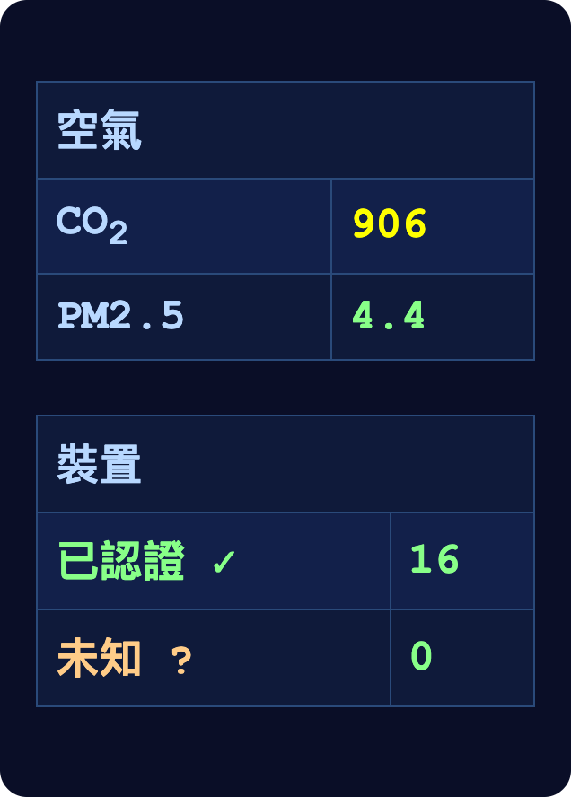

# 第十一章

維瑞迪亞，梅爾丹·3724 年花季 15 日

賽菈、黛亞和維爾站在一大片草地上，附近還有許多別的家庭。

黛亞遠遠就看見格拉迪亞斯走過來，朝他揮了揮手。格拉迪亞斯看到了，笑著加快腳步走向他們。

「真高興你也來了！」黛亞喊道。

「我兒子第一場正式的旋翼球比賽，怎麼能錯過。」格拉迪亞斯說。

「那你最近好嗎？」

「嗯，掌舵會的事很多。你也知道，不能公開講。不過還算順利！」

「你們呢？」

維爾開口了。

「嗯，給分歧那件訴訟的文件一大堆。過去兩個月，我大半的時間都耗在這上面。」

「提醒我一下，那是怎麼回事？」

「啊，抱歉。我一直不想拿這些細節煩你們，我知道你們手上的事已經夠多了。」

「拜託，維爾，你的生活我們當然在乎。」

「嗯，記得吧，大概半年前跳躍公司破產，我丟了工作。過了一個月，另一個員工來找我，我才從他那裡知道真正發生了什麼事。是這樣的，官方的說法一直是——」

「這我記得，新聞有報。跳躍公司經營困難，為了自救做最後一搏，在金融市場上下了一筆高風險的賭注：買進某個地區的房價衍生性商品，而他們正準備宣布要開始在那個地區提供服務。結果沒成功。在乎的人不夠多，接著又運氣不好，房價下跌，整件事就垮了。」

「沒錯。可是我後來知道的是這樣。跳躍公司能在那麼小眾的市場下那麼大的注，卻沒有出現離譜的滑價，唯一的原因，是有一家避險基金接了這場對賭的另一邊——就是分歧。而分歧的主要持有人，早就悄悄用極低的價格，買下了跳躍公司的過半股份。」

「如果那個地區的房價漲了，跳躍賺錢、分歧虧錢，對他們來說一來一往，淨值是零。如果房價跌了——結果也確實跌了——跳躍虧錢、分歧賺錢，一樣是零。可是不對稱的地方在這裡：跳躍要是虧了——它也確實虧了——跳躍就宣告破產，這樣一來，就不必付員工年終獎金，外加一年的資遣費。所以他們等於踩著我們，替自己拿到了一個免費選擇權。」

「我們發現之後就提告了，全體員工一起，提了集體訴訟。過程很辛苦，分歧甚至嚇得一些媒體網站不敢報導。不過我覺得到目前為止，法官都看穿了他們的把戲。所以我還滿樂觀的。」

一聲響亮的哨音傳來。他們轉過身，朝聲音的方向看去。

是教練。草地中央已經開來了一輛大卡車。

「旋翼球比賽五分鐘後開始！」教練大喊。

教練按下一個按鈕，卡車後門緩緩打開，以底部的鉸鏈為軸往後倒。幾拍之後，後門成了一道斜坡。

幾架個人旋翼機自動從卡車裡滾了出來。說是旋翼機，其實就是一張簡單的椅子：頂上裝著旋翼，四周圍著一圈防護罩。

一群大約十到十二歲的孩子朝卡車跑過去，一半穿黃色上衣，一半穿紫色上衣。茲文就在穿黃衣的那群裡。他們抓起旋翼機，開始把自己綁進座椅。

教練走進卡車，不久拿著一個小得多的盒子出來。盒子一打開，四架鮮紅色的無人機就彈了出來，飛上天空。每一架都是幾公分寬的球形，頂上是柔軟、像羽毛一樣的旋翼。

「歡迎來到今天的旋翼球比賽。」教練說，「今天我們打限定賽，只用紅球。抓到紅球就拿回來給我，你的隊伍就得一分。先拿到六分的隊伍獲勝。」

這時，十個孩子都已經在個人旋翼機上綁好了。旋翼開始轉動，轉速剛好足以抵銷大約四分之三的地心引力。孩子們興奮地跑來跑去，有些人一跳就離地兩公尺左右，再慢慢滑翔落回地面。

「大家都知道要做什麼了嗎？」教練問。

「知道！」許多孩子齊聲大喊。

「那比賽就要開始了。五……四……三……二……一……起飛！」

個人旋翼機紛紛飛上天，旋翼聲一下子響成一片。

「說真的，我很意外學校到現在還在玩這個。」格拉迪亞斯對賽菈說，「這東西要是現在才發明，大家一定會說太危險。」

「它也是不到十年前才發明出來的。」

「在哲戈。」

茲文發現一顆紅球，朝它飛過去。沒多久，兩個穿紫衣的孩子也看見了那顆紅球，緊跟在他後面追上來。

紅球突然往左一拐。

茲文和其他孩子也跟著左轉。茲文的旋翼護罩撞上其中一個孩子的旋翼護罩，兩架旋翼機互相彈開，誰也沒受傷。

茲文讓旋翼機往高處飛。他稍微落到剛才撞上的那個孩子後面；第三個孩子則往前飛，很快就到了他正下方。氣流把茲文往下吸，沒多久，他的腳就彈到了對方旋翼頂上的護網。

茲文迅速跳開。他和那個孩子都往下翻滾了幾公尺才穩住，接著各自朝不同的方向飛走。

「這些東西上的 AI 現在真的越來越厲害了。」格拉迪亞斯喃喃說。

紅球又突然轉向，這次是往上。茲文立刻把旋翼開到全速，往上爬升。剛才撞上的那個孩子還在他下方幾公尺；另一個孩子沒能及時發現紅球轉向。於是茲文領先了。

茲文看著紅球越來越近，又更近了。現在它就在他前方一公尺。

紅球突然關掉旋翼，往下掉。茲文反應很快：球一掉到腳的高度，他就一腳把它踢回上方，同時讓旋翼機往前移。他伸出手，用掌心接住了紅球。

接著，他讓旋翼機朝教練飛去。旋翼慢了下來，但沒有完全停住；等茲文下降的速度到了安全上限每拍五公尺，旋翼又加速起來。

這個速度，相當於從略低於兩公尺的高度摔下來、落地時的速度。

教練看著茲文降落，伸手接過他遞來的紅球。

「全場第一球由茲文接到，黃隊拿下第一分！」

教練再次放飛紅球。紅球迅速往前衝，方向正好和茲文站的地方相反。

茲文又飛上天，繼續找更多紅球。

「赫蕾妲、莉莉和費布里克都好嗎？」格拉迪亞斯問黛亞。賽菈聽到了，把頭微微轉向他們，想聽聽答案。

「赫蕾妲去北林參加數學競賽了。莉莉呢，我們一直想讓她對藝術多一點興趣，不過到現在都不太成功。」

「我也跟茲文聊了一下，他給我看了他的作業。我有點意外。他們出給他的算術題，我看了，好像比費布里克在他這個年紀時做的……稍微淺了一點？」

「多穆斯接得漂亮！」教練大喊，「蓋爾也接得漂亮！紫隊兩分。」

賽菈加入了對話。

「那，格拉德，你現在是——」她及時打住，想起就連說出「守律者」都不妥，「——掌舵會成員了。掌舵會有沒有什麼辦法，能讓維瑞迪亞的教育變得更好？」

「你知道的，學校不歸掌舵會管。公立學校由教育委員會負責，委員是議會任命的。不過一直有人在想辦法多支持一些私立學校：用圖譜募資資助它們，再設計一些規準，給它們正確的誘因。」

「也許你可以在守律者會議上推動這件事？」賽菈回答。這句話她是對著手錶低聲說的，拿手錶權充頸帶。她心想，與其每個字都得小心挑選，免得洩漏格拉迪亞斯的職位，還不如乾脆私下談。

德爾瓦特會支持的，格拉迪亞斯想。不過私立學校要是*完全不*附帶任何規準細部輕推，他會更支持。

「茲文又接到一顆，漂亮！黃隊第二分。」

格拉迪亞斯和賽菈的注意力回到了比賽上。

空中有三組孩子，每組三人，各自追著一顆紅球，都認定自己追的一定是不同的那顆。茲文獨自往上飛，沒有加入任何一組。他倒像是在天上隨意閒晃，眼睛一直盯著地平線，想找出第四顆紅球可能在哪裡。

有個孩子從空中翻落，不過旋翼的 AI 自動緩衝了他的墜落。他摔到地上，幾拍之後又站起來，回到空中。

一分鐘後，有個孩子降落在教練身邊，遞給他一顆紅球。

「蓋爾又接到一顆，漂亮！紫隊第三分。」

紅球再次飛上天。蓋爾和剛才跟他一起追那顆紅球的兩個孩子，又追了上去。

又過了兩分鐘，另一個孩子降落在教練身邊。

「黛拉接得漂亮！黃隊第三分。」

再過一分鐘，兩個孩子差不多同時降落：

「普拉特接得漂亮！黃隊第四分。」

「梅妮也接得漂亮！紫隊第四分。」

茲文還在獨自尋找第四顆紅球。其他孩子似乎都完全忘了有這顆球。

「艾加多接得漂亮！紫隊第五分。」

「黛拉又接到一顆，漂亮！黃隊第五分。」

茲文開始往地面靠近。

格拉迪亞斯和賽菈看見蓋爾甩開兩個對手往前衝，準備抓住紅球。紅球就在他前方一公尺。

蓋爾伸出手，準備一把抓住。

就在這時，另一個孩子突然撞上他，他往右偏了好幾公尺。那個孩子想趁機去抓紅球，紅球卻迅速掉頭往後飛，正好從兩人中間穿過。球經過的那一下，蓋爾和那個孩子都伸手去抓，都撲了空。

蓋爾先重新看到紅球，迅速朝它飛去。兩個對手很快跟上，不過至少落後十公尺。

蓋爾和紅球一起往上爬升，蓋爾離紅球越來越近。五公尺。四公尺。三公尺。

另一頭，茲文不知怎麼的，好像突然掉到了地上。旋翼機的 AI 照例替他緩衝了墜落。

高高的天上，遠在其他選手之上，蓋爾得意地舉起手，拳頭裡緊緊握著紅球。

觀眾裡不少人歡呼起來。蓋爾繞過跟在後面的兩個學生，開始以每拍五公尺的最高速度往下降。

突然，格拉迪亞斯和賽菈的目光轉向了茲文。他已經離開旋翼機，正朝教練跑去。

蓋爾離地還有大約三十公尺時，茲文張開手，把第四顆紅球交給了教練。那顆球是他在地上找到的，旋翼已經壞了。

「然後，茲文接得漂亮。黃隊第六分。黃隊獲勝！」

格拉迪亞斯鬆了一口氣。

賽菈滿臉笑容，為茲文感到驕傲。

「他走上人跡較少的那條路，」她輕聲吟誦，引用的是一位維瑞迪亞古代作家的句子，「而那為眾人開出了一條道路。」

------------------------------------------------------------------------

格拉迪亞斯拉開隔門，走進包廂，再把隔門拉上，滑軌輕輕響了一聲。

裡面已經有三位守律者。另外三位，他想，一定還在路上。

這是他被分派到的第三個守律者小組，主題是空氣品質。在這一組，他的編號是二號。

他一進門就拿出手錶，對著頸帶低聲下指令，查這間包廂的空氣品質。

「才四個人，怎麼就已經 906 了？」他問。「過濾器運作得很好，可是這種保密包廂，看來他們還沒想出要怎麼通風？」

「是啊，幾乎大家都遠遠達不到標準。我們一直在說，這個稅級的稅真的得全面調高。」

格拉迪亞斯手錶上的 CO₂ 讀數更新了。918。

「我覺得大家自己會想出辦法。」另一位守律者說。「問題只在技術夠不夠開放、夠不夠容易部署。這種過濾器，過去十年來，我們每兩年就讓它便宜一半。」

「我倒覺得，我們得再推得用力一點。」格拉迪亞斯說。

「室內空氣品質的稅務規準，現在是怎麼定的？」

「它是土地稅的一個成分。空氣品質完美，就是零；有人使用的房間，平均讀數如果比一千還差，每年就多課三分之一個百分點。有裝過濾器或紫外線 C 燈的話，門檻會往上調。」

「才三分之一個百分點？從理論上的完美到糟到極點，就只差這樣？」

「是土地價值的三分之一個百分點，而且每年都要繳。對很多企業來說，這大概等於營收的六分之一。」

「土地稅要算進去的東西太多了。公共美觀。無障礙——包括對身障者友善的那種，*也*包括讓人可以自由穿過你的土地、不把它圍起來的那種。建蔽率。一樓活化使用，不過這一項有爭議，有些人覺得乾脆併進美觀就好。緊急應變準備。消防安全。實在塞不下所有東西。」

「再說，拜託，維瑞迪亞人又沒病得那麼嚴重。去看我們一個月前做的廣聽報告，室內的空氣傳播疾病防治，根本不在維瑞迪亞人最關心的前十名裡。」

「一樓活化使用不只是美觀的事，它也能提升步行友善度、減少壅塞——」

「好吧。不過我覺得，那些事就該直接針對著處理。」

「總之，那條規準不歸我們決定。我們管的是空氣品質。你漏掉了尾部風險。」

「什麼尾部風險？」格拉迪亞斯插話。

「超級大流行。比如說，北極人故意散播的那種。」

「有任何證據顯示他們在搞這類東西嗎？」

「他們是個超級不透明的社會。北極人到底知不知道有維瑞迪亞這個國家，我們手上唯一的證據，就是一天到晚都得聽艾費里昂勳爵說教。」

「那現在檯面上有哪些可能的方案？」

「把上限提高到三分之二個百分點。然後去跟資助機構——圖譜募資、平方募資、議會撥款——講清楚理由，說服他們多支持開放的——」

另一位守律者插話：

「平方募資？那一輪現在一團亂。有人放出一個程式，下載到裝置上，就能證明你捐了錢給某個研究社群媒體極化的計畫——其實也不是什麼好計畫——然後領一筆獎勵。你捐十吉普幣，拿回二十；計畫那邊，連同有上限的配對補助，能拿到一百。很多人都參加了。結果昨天，藍鯨有個內部人士出來爆料，看來整件事都是他們幹的。」

「藍鯨？可是他們幹嘛這樣做？拿到那筆錢的計畫，又不是他們在控制的。」

「錢流到哪裡根本不重要。就算是拿去雇伊普塔克的人來挖洞、再把洞填回去，他們照樣會做。他們的目標，是把所有跟開放平台接軌的東西的資金都抽乾。把開放的生態系餓死，封閉的那一邊就不戰而勝。」

「好吧，那我們就專注在圖譜募資。透過我們的管道，建議圖譜募資那邊的人多支持開源技術：空氣過濾、清淨、汙水監測，全部都要。」

「連汙水監測也要？你想讓大家的隱私被破壞得更徹底？要是北極人駭進來，把那些資料全拿走怎麼辦？到時候他們就會知道誰住在哪裡，就算搬了家也一樣；還會知道每個人什麼時候健康、什麼時候生病。」

「我還以為，一直說沒有證據顯示北極人真的會做那種瘋狂事的人，是你？」

「難道沒有什麼密碼學的方法，能從監測裡取得我們要的資料，卻從頭到尾都不必在任何一個地方以明文蒐集那些資料本身？」

「這個嘛，要是你找得到想得出這種辦法的天才，記得告訴我們。」

------------------------------------------------------------------------

格拉迪亞斯下了自駕巴士，拉了一下隱私袍前方臉罩上的束帶。臉照樣遮著，只是鼻子上下之間那條帶子鬆了，不再勒緊。

這樣防病毒的效果會差一點。不過巴士是格外擁擠的室內空間，一下了車，他也就用不著那層額外的防護了。換來的是舒服，呼吸也順多了。

他邁步走回家。

路上經過那家餐廳，幾個月前他就是在這裡巧遇費布里克。餐廳外牆上有一則廣告。

廣告左邊是海卓菲的吉祥物，一身海卓菲經典的黃綠配色，懷裡抱著一個小孩。一道像汙泥般的綠色水柱噴過來，吉祥物拿背替孩子擋住了。

廣告右邊是一段文字：

> 重水裡的氫原子，被帶有中子的同位素氘取代。已知大量攝取重水具有毒性。
>
> 我們研究過競爭對手的水，發現平均重水含量是 145 ppm。
>
> 我們的水取自新鮮的維瑞迪亞北方冰原——在距離北極邊界僅僅三十公里處英勇開採。重水含量：132 ppm。
>
> 所以，我們的水比競爭對手的毒性低一成。只有我們在乎你的健康。其他人都不在乎。海卓菲想治癒你、保護你。我們的競爭對手卻認為，你活該在汙泥裡淹死。
>
> 信賴海卓菲。今天就買海卓菲。

格拉迪亞斯笑了笑，繼續往前走。

背後忽然有人一把將他抱住。

格拉迪亞斯轉過身。

「賽菈！」

「總算在你回家的路上逮到你了。」

「那你今天後來呢？過得怎麼樣？」

「那篇談自由城都市經濟的文章寫完了。已經上線了，你該去看看。」

「喔，好期待。」

「楊恩最近跟我說了些八卦。那邊的人現在對北極越來越緊張，很多事都跟著在變。」

「那你有什麼猜想嗎？為什麼維瑞迪亞的人對整個北極的局勢，好像都這麼……滿不在乎？」

「我猜是北極其實不太影響這裡的人過日子吧？他們只是三不五時發表那些蠢說教，大家出於好奇，看一看、聽一聽。」

格拉迪亞斯哀嘆了一聲。

「就連守律者內部，情況都很怪。資深的那些好像明白出了問題。可是新進的那些……也不是全部，但很多人都覺得，我們乾脆別管就好？」

「怪的是，自由城的企業好像比較抵得住……不管是什麼讓大家變得這麼蠢，總之他們比較不受影響。基本上只有他們這座城市把這個問題當真——紅郡除外，還有那些透過共同治理、部分由紅郡議會管理的城市。」

「我想最主要的是，新進的守律者好像對掌舵、平方募資、圖譜募資都抱著懷疑，總之也不太相信政府能做成什麼事。」

賽菈嘆了口氣。

兩人繼續往前走，幾分鐘後到了家門口。格拉迪亞斯把手錶貼上圓圈，門開了，兩人走進屋裡。

賽菈打開手持裝置。

「哲戈餐車，一分鐘後到。我猜還是老樣子？」

「對。你怎麼知道？」

賽菈笑了，按了幾個按鈕，下好單。

家門都還沒關上，賽菈就已經看得到餐車從幾百公尺外朝他們開過來。兩人就這樣等著它開到。

賽菈走出去，直接從餐車上取了餐，再走回屋裡，順手把門帶上。

她把餐點放到桌上，馬上拆開。

兩人坐下，打開餐盒，吃了起來。
