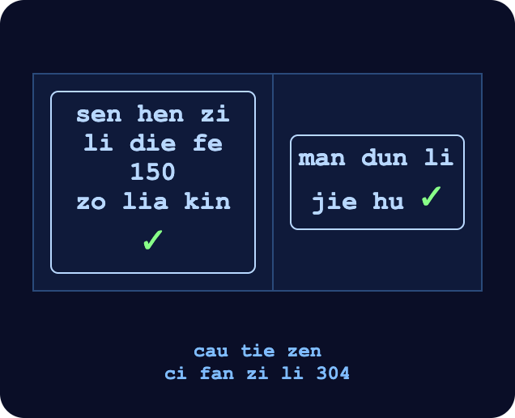
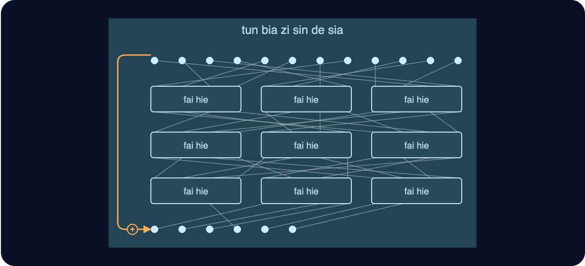
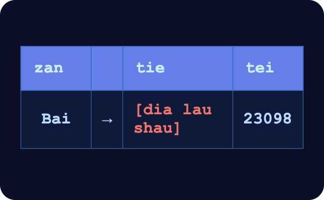

# 第十二章

哲戈，薩祖都·3724 年草季 22 日

列車開始減速，輪下的聲響一聲比一聲慢。澤望向窗外。

一開始只有樹。接著出現建築，越往前越密。又過了幾分鐘，車站到了。

一面招牌從車窗前緩緩滑過。

sa dzu du

「主城」——哲戈的首都，名字取得一目了然。

列車停穩，車門嘶的一聲打開。其他乘客紛紛起身，收拾起行李。

澤決定不跟人搶第一個下車，改把這段時間的品質最大化。他花了大約兩分鐘，跟 AI 把一局明盤台下完。

他對上的還是原版 AI。汾一直沒抽出空寫那套訓練框架，好把 AI 微調成在自訂規則下也下得好。

就在這時，其他 AI 投降了。澤以一敵三，贏了這局。

為了彌補它們實力不足，他把對局調成自己只佔一個角落，另外三個角落分給三個 AI，還讓它們全編在同一隊來對付他。即使如此，贏的還是澤。

他發現三打一對 AI 根本沒多大幫助。這種打法不在它們的訓練資料裡，結果它們犯了一堆基本錯誤，還互相蠶食彼此的負熵。

澤收起手持裝置，嘆了口氣。

這時，乘客幾乎都下車了。澤抓起包包站起身，也往車外走。

一踏出車廂，就看見六個穿著明盤台祭司袍的人在等他。

「歡迎來到薩祖都，澤。」帶頭的祭司開口。她是位年長的女性，年紀和穆差不多。

「能來這裡好興奮。」澤馬上接話，「這才是我第二次來首都。」

「對了，我是蘇，全國賽的主辦人之一。」

「嗯，很高興認識您，蘇。」

「那這幾天，我有哪些行程？」

「先去飯店入住，明天早上有說明會。一共三十二名選手，全哲戈明盤台最聰明的年輕頭腦，到時候你都會見到。」

蘇領著澤走進一個房間，裡頭有好多扇門。其中一扇滑開，門後直接就是一輛黑色專車的車廂。

和幾個月前鄧載他去晶圓廠的那輛，一模一樣。

「可惜我只能送你到這裡了，澤。半長時後還有另一位選手搭火車到站。祝你一路順利，好好休息。」

「真的很謝謝您。」

澤坐進車裡，門關上，車子開動了。

他盯著窗外，城裡的建築和樹木看得他讚嘆不已。有些地方看起來跟帕佛蓋都差不多，只是這裡電子用品店少一些，各式各樣的店家倒是多了些。也有幾家藥店。

其中一家店的櫥窗上，澤看到一面招牌：

ti ka dia shu fe cen su jui hui

「長壽套組，本店有售」

沒多久，保健店漸漸少了，換成賣藝術家具和其他家居用品的店。

再過去是幾家看起來很傳統的餐廳和茶館，仿的是哲戈自己的中世紀風格。

右手邊的建築一度完全斷開，澤看見一座公園。公園後方有好幾座山體金字塔，每座大約只有帕佛蓋都南邊那座的一半高。

一分鐘後，公園到了盡頭，車子開上一座橋，越過一條小河。往前看，建築越來越密。

路面慢慢往下傾，沉入地底，成了一條隧道。窗外暗了下來。

又過了幾分鐘、轉了幾個彎，車子停了。車門一打開，正好緊緊貼著另一扇門，把澤整個遮住：不論從車外，還是從他要走進的那棟建築外頭，都沒有人看得見他。

澤下了車。這裡是一家飯店。

他走到最近的綠色圓圈前，用手錶輕碰了一下。

信譽 150 以上，已驗證。無需付款。核准，房號 304。

手錶震了一下，確認房間鑰匙已經設好。

澤進了房間，沖了個澡。

然後倒頭就睡。

------------------------------------------------------------------------

鬧鐘嗡嗡響了起來。

澤點了一下手錶看時間：30,003。離開幕典禮只剩半長時。他在客房服務選單上按了幾下，點了一杯蔬果汁，然後把衣服穿上。

三分鐘後，果汁送來了。澤很快喝光，立刻覺得有了精神——至少，撐到會場是夠了。

他沒再耽擱，開門下樓。

黑色專車已經在等他了。飯店門和車門早就打開，緊緊貼在一起。澤穿過大廳，直接從飯店門一步跨進車門。門關上了。

鄧有一次見面時，推薦過他一本密碼學教科書。車子一開動，澤就拿出來，從上次停下的地方接著讀。

這一節講雜湊函數。頁面正中央是一張大圖。

「雜湊演算法的構想」。

澤讀起圖旁的說明文字。

書上說，雜湊演算法是用來替一大筆資訊做出一枚縮小的指紋，而這枚指紋仍然能唯一識別原本的資料。設計目標是：要找出兩筆雜湊值相同的不同資料，必須難到實際上做不到。

雜湊天生就會毀掉資訊；用小東西代表大東西，本來就是它全部的目的。但這裡有個弔詭：我們打造出來的所有最好的雜湊函數，內部最大的組成部分，卻是一個*保持熵*的變換：置換。

核心的構件把輸入一對一地對應到輸出。不只如此，它正向、反向都能*有效率地*執行。至於縮小和不可逆，則來自疊在上面的一層簡單處理：刪掉一部分，再在最後和原始輸入的一部分做一次 XOR。

為什麼要這樣做？為什麼要把不可逆蓋在可逆之上？

原因很微妙。直接打造不可逆的結構，你就沒辦法控制熵在什麼時候被毀掉。不可逆的輪函數只要套用夠多次，大約一半的熵就會崩塌，協定的安全性也跟著垮掉。

所以，就算毀掉資訊正是你的最終目標，最好還是把負責這件事的那一塊乾淨地拆出來：在演算法裡某一個精確的位置，照你自己的方式毀掉資訊。

澤收起手持裝置，往後一靠。

一切都是熵，不是嗎？他心想。

一分鐘後，車子忽然減速，向左轉。右手邊有一塊區域拉起了警戒膠帶，再往裡面，停著各種大型車輛。

「發生什麼事了？」澤刻意提高音量，讓司機絕對聽得出這句是在問他。

「有間高等生物研究實驗室爆炸了。八成又是北極人幹的。他們得花好幾天清理，確保一切都安全。」

又過了幾分鐘，車子慢下來，停住了。車門一開，外面直接就是一條走廊。

------------------------------------------------------------------------

澤穿過隧道，順著樓梯往下走。樓梯間只聽得到他自己的腳步聲。

前方出現一扇門。和帕佛蓋都山體金字塔裡，明盤台廳的那扇門很像：一列石磚往上砌，到頂端彎成拱形；拱頂上是那個標誌，兩條橫放的手臂在中間相會，拳頭相抵。

不過這扇門明顯大得多，維護得更好，裝飾也氣派得多。

澤把手錶貼上綠色圓圈，門開了。他走進去。

裡面大約擺了五十張椅子，已經有二十來名選手坐在位子上。他認出台上的蘇，她身旁還有另外三名祭司。

澤也坐下來。接下來十五分鐘，其他選手陸續在自己的位子坐定，廳裡漸漸有了低低的說話聲。

一個年紀稍大的少年在澤旁邊坐下。

「嗨，我是德盧因。」他說。

這名字不太像哲戈人，澤心想。

「我是澤。」

「你是哪裡來的？」

「啊，我從紅郡來的。名字讓我露餡了，對吧？」

澤笑了。「大家都是這種反應嗎？」

德盧因也跟著笑。

「這裡的人都叫我 De lu hin——『有著……外表的叉子』。好名字吧，你不覺得嗎？」

「你在這裡念書嗎？還是爸媽移民過來的？」

「啊，我是外國參賽者。他們這次找了四個外國選手來，讓比賽好玩一點。」

「興奮嗎？」

「當然。說起來這還是我第一次來哲戈，這地方超酷的。」

鈴聲響起，選手們很快安靜下來。

「歡迎來到明盤台全國錦標賽。」蘇開口。「今年能見到這麼多才華洋溢的選手，我深感榮幸。也希望各位昨晚和今天早上都過得愉快。」

「很高興為各位介紹本次的總主辦人，金總督導。」

另一名祭司上前一步，開始致詞。

「此刻對哲戈的每一個人來說，都是特別的時刻。不只是對我們、對各位，也是對全國各地數百萬名收看比賽的哲戈人：他們將看到哲戈新一代最聰明的頭腦，在這裡彼此交鋒。」

「我也很榮幸地宣布，今年有四位尊貴的外國來賓和我們一同參賽。」

「今天，我們要參觀明盤台博物館，就在這座山體金字塔裡。明天安排了薩祖都各地的觀光行程，晚上讓各位好好休息。再過兩天，第一批錦標賽對局就會開始。」

「資格賽一共六輪，每場之間休息八天。」

「三十二位選手裡，贏最多場的四位晉級準決賽。如果找不到一個勝場門檻，剛好讓四個人過關，同分的人就比兩個數字的幾何平均：一個是在輸掉的比賽裡，各位落敗前撐過了幾回合；另一個是在贏下的比賽裡，取勝所需回合數的倒數。回合數最多只算到八千。所以，在八千回合之前投降，不會有任何好處。如果這樣還是同分，我們會再加一輪資格賽。」

「希望各位能享受比賽，享受薩祖都能提供的一切；同樣重要的是，也享受彼此的相處。在這裡，你們不是敵人，只是暫時的對手。離開賽場，就該把彼此當成朋友，也請記得，我們都是同一項共同事業的一分子。Dze go ba fau gie。」

「Dze go ba fau gie。」全體選手齊聲回應。

「現在，請跟著蘇。她會帶各位參觀博物館。」

3724 年草季 25 日

澤醒過來，白想跟他通話。他在手錶上點了一下。

「你那邊怎麼樣？」白問。

「這時間打來有點早吧？離我鬧鐘響還有十九分鐘耶。」

澤頓了一下，還是決定回答白的問題。

「都還不錯。三天前去博物館看了一場很精彩的展覽，隔天又把薩祖都逛了不少地方。還認識了一個紅郡來的人。」

「參賽者？」

「對，他們今年決定讓比賽稍微國際化一點。」

「那帕佛蓋那邊呢？」

「問點我答得出來的吧。過去這一個長時，我都在河對岸盯著你要去比賽的那座山體金字塔。」

澤坐起身。

「你在*這裡*？」

「鄧的人找上我，要我過來，把每個選手的戰術都記下來。」

「你的第一場比賽就是今天，對吧？」

「沒錯。」

「要不要我過去幫忙？至少也能在旁邊看。」

「我……應該不用吧。而且我想你也買不到現場場館的票。」

「你讓我進去不就好了。」

澤哀嚎一聲。

「那我就在遠處看囉。我們都替你加油！」

「汾還好嗎？我已經好幾天沒他的消息了。」

「大概在忙班順派的事吧。他也好幾天沒跟我說話了。」

「好吧。那我得開始準備了。祝你今天愉快！」

「也祝你今天好運——你會用得上的！」

「喔，對了，我們明天來打一場練習賽吧。」

澤又點了一杯蔬果汁，然後穿好衣服。幾分鐘後果汁送來，他很快喝完，開門下樓，坐進等著他的車。

二十分鐘後，車子停在金字塔的一個入口。

澤下了車，沿著隧道往裡走，腳步聲在隧道裡來回迴盪。走了幾百公尺、轉過幾個彎，眼前又是那扇大石磚門。

這次一進門，他就往右轉。這條走廊，三天前第一次來的時候他根本沒注意到。他跟著指標走，沒多久就到了一間等候室。

蘇在裡面，還有另一名選手。

「歡迎，澤！來，這位是柏。」

「很高興認識你，澤。」

「我也很高興認識你，柏。」

「今天會是一場好玩的比賽，我很確定。」

一個機器人走過來，給三人各端上一杯茶。三人各自把茶喝了。

「那接下來呢？我們就在這裡坐一個長時、不能上網，等其他人比完，免得提前知道新規則？」

「沒錯。手持裝置跟手錶也不能帶，機器人一分鐘後會來收。你們可以看那邊螢幕上去年的比賽。」

------------------------------------------------------------------------

一長時後，電梯門開了。澤和柏各自走進一部電梯，蘇朝他們揮手道別。門關上了。

四分之一分鐘後，澤這部電梯的門又開了。門外是一個巨大的廳室，比帕佛蓋都那間大得多，滿場是低低的說話聲。看起來大約有五千到一萬人在觀戰。

一條路亮了起來，引向一座附有座椅的巨大主控台。

澤往前走。遠處隱約看得到柏的身影，也在往前走。他走到座椅前，坐了下來。

一群手持裝置大小的無人機嗡嗡地繞著他飛，掃描有沒有任何作弊用的設備。數量大約是帕佛蓋都那次的三倍多，形狀和大小也更五花八門。嗡嗡聲持續了大約二十拍，無人機才退回各自的原位。

自動語音響起，音量很大，這次聽起來比較像女聲：「MU GU GEI FA」。五十拍後開始。

澤閉上眼睛，一吸，一吐，盡力讓自己冷靜下來。

他知道這場不是決勝的一場。就算輸了，其他場次還能扳回來。

可是換個角度想，正因為這樣，他反而更怕。心裡揣著「輸了也沒關係」這個藉口，他的腦子還會有足夠的動力，把全部注意力和腦力都押在比賽上、把這場贏下來嗎？

「LE MU GEI FA」

澤重新睜開眼睛。

「PA GU GEI FA」

澤耐心地等著。

「歡迎來到今天北場館的第四場資格賽。各位，來見見本輪的選手：來自帕佛蓋都的澤・雷明，以及就來自我們薩祖都本地的柏・祖美。」

「另外，也很高興向大家宣布今天的規則變化。觀眾朋友或許已經聽太多次了，不過對兩位選手來說，這還是第一次：今天的明盤台，將在六角格上進行。」

澤驚得張大了嘴。

「兩位有二十分鐘，請盡全力摸索出自己的結構，不管是滑翔機、太空船還是牆。時間一到，雪花原野上的寧靜之戰就要開始。」

澤的顯示畫面亮了。眼前是一片六角形網格。

「LE FI SHI GEI TAU FA」，自動語音大聲喊道。兩千拍後開戰。

澤先在沙盒裡飛快地亂畫一通，看哪些會保持穩定、哪些會變成滑翔機。不到一分鐘，他就找出幾種滑翔機，還有幾種能拿來當牆的靜態結構。

讓他意外的是，跑得最快的那幾種滑翔機……是往正東走的。

接著，他刻意畫出各式各樣的牆，讓滑翔機去撞，看看哪些管用。

他盯緊滑翔機，想盡快培養出直覺：什麼樣的形狀能一邊移動、一邊保持原樣。滑翔機和牆，他都反覆定義了好幾輪。

「PA MU GU GU GEI TAU FA。」一千五百拍後開戰。

他開始試跟自己的印記相似的形狀，看有沒有哪個能當滑翔機。總得想出*點什麼*才行。不然他只能在每個干預回合，於現有的印記旁邊再建一個新印記，一次又一次，進展會非常緩慢。

他發現，要真正有進展，就得跟岩塊打交道。六角格版的明盤台，岩塊可能長什麼樣子？他猜了幾種，再看滑翔機撞上去會怎樣。

「FI SHI GEI TAU FA。」一千拍後開戰。

澤開始冒汗。到目前為止，一無所獲。滑翔機、看似合理的岩塊形狀、位移，他試過的每一種組合，都沒有產生出他的印記副本。

他回頭細想自己印記的確切形狀。

又白忙了兩分鐘。這時，澤的腦中忽然閃回那本教科書——不到兩長時前，他還在讀它。

> *核心的構件把輸入一對一地對應到輸出。不只如此，它正向、反向都能有效率地執行。*

這裡和雜湊函數不一樣，最後沒有一層截斷再 XOR 的外殼。所以只要他知道自己想要的最終狀態……就只需要把那個最終狀態放進沙盒，倒著播放。

可是……要怎麼倒著播放？

雜湊函數內部的置換，做法是從最後一層一路往回走到第一層，每走過一層，就把那一步反轉。

那這裡呢……澤生平第一次接觸的六角格規則，反轉過來又是什麼？

他拿眼前看到的滑翔機，先試最基本的幾種變換：翻轉、旋轉六十度、晚一個時間步再發射。

全都不行。

「MU FI LE GEI TAU FA。」五百拍後開戰。

澤放慢速度，一步一步重看。

然後他看出來了。

每走一步，棋盤都會分割成一個個三角形，六角格就在各自的三角形裡旋轉：三角形裡填滿一格的順時針轉，填滿兩格的逆時針轉。

所以要讓時間倒轉，他只需要……讓每個時間步發生兩次。畢竟轉一百二十度的反向，就是再轉兩次一百二十度。

但有個問題：每過一個時間步，三角形的分割方式就會位移。

所以要倒退一個時間步，他得……先往前播一步；再把時間往回調一步，好讓下一步也在同一種分割下往前播；接著往前播第二步，在這種分割下，每個三角形累計就轉了兩百四十度；最後把時間往回調*兩*步，遊戲便換回*前一種*分割。

把每一步反轉，再把步驟倒過來播放。跟反轉雜湊裡的置換，是同一回事。

他確認過了：有一個按鈕可以往前播一步，另外兩個按鈕可以調整時間，往前或往後都行。所以他得這麼按：A、B、A、B、B。

像某種電玩的作弊密技。而在某種意義上，這裡還真的就是。

好吧，他心想。

他把一架滑翔機放進沙盒，試了一次。過程很累人，手指沒多久就痠了。

但成功了。滑翔機倒著移動。

基本測試通過。

接下來是真正的測試。澤用同一套技巧倒推這樣一個局面：岩塊旁正形成一個印記，同時有一架滑翔機飛出去。

第一次失敗了。時間倒流時，滑翔機和印記撞在一起，可是同一個印記又在幾步之外重新成形，滑翔機也飛走了。也就是說，在澤剛剛取樣到的那段歷史裡，相撞之前，印記本來就一直在那裡。

他換了一架滑翔機再試。

這次成功了。時間往回倒，越過相撞那一刻之後，「岩塊加印記」變回了光禿禿的岩塊，兩架滑翔機又飛了出去。

「FI LE GEI TAU FA。」一百拍後開戰。

澤趕緊拿其他幾種候選的岩塊形狀，重複同樣的實驗。報倒數的聲音他完全不理，一路試下去，直到另外兩種最自然的岩塊形狀也都找到了解法。

「MU GU GEI TAU FA。」

澤飛快地擺上印記、牆，還有那種撞上合適岩塊就會產生印記的滑翔機。

前面每件事都花了那麼久，這次卻這麼快，連他自己都有點意外。但心底幾乎立刻就明白過來，這很合理：難的是想出要部署什麼；部署本身，只是複製貼上。

棋盤上的基本布置做好，他吐了一口氣。再吸氣時，他開始最後一輪修整結構——就在這時，最後的倒數開始了。

「PA GU……SO……BI……ZE……HA……MU……FO……SHI……LE……PA……」

「TAU FA。」

滑翔機開始往外飛。

起初，什麼事也沒發生。

五百回合後，棋盤有一塊顯露出來。他有一架滑翔機成功產生了印記，那一帶的棋盤跟著現形，岩塊長什麼樣子也看得見了。

澤立刻轉向下一個任務：想辦法建造滑翔機工廠。

第一個干預回合到來時，他還沒想出來。

不過，他又從主基地送出好幾架滑翔機，只要撞上位置對的岩塊，就能產生更多個他的印記。另外，他也從新印記附近送出滑翔機，飛快地往東衝。

觀眾聚精會神地看著。河對岸，白也聚精會神地看著。而在遠方，汾、穆和鄧也一樣。

看台上起了一陣低語。觀眾很意外：他們這才發現，兩名選手誰都沒能找出會垂直移動的滑翔機。

第二個干預回合，澤從棋盤兩側發射滑翔機，直直瞄準柏的主基地。

就在第三個干預回合之前，澤有一架滑翔機撞上了柏主基地旁的岩塊。這一撞，柏所有的印記都進了澤的視野。

澤利用那個干預回合，直接朝柏那三個看得見的印記發射滑翔機，又往附近幾個位置多送了一些，以防萬一。

不到三百回合，柏的印記全數被摧毀。

大會宣布澤獲勝。
