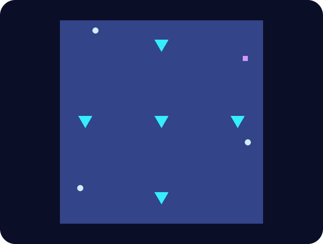
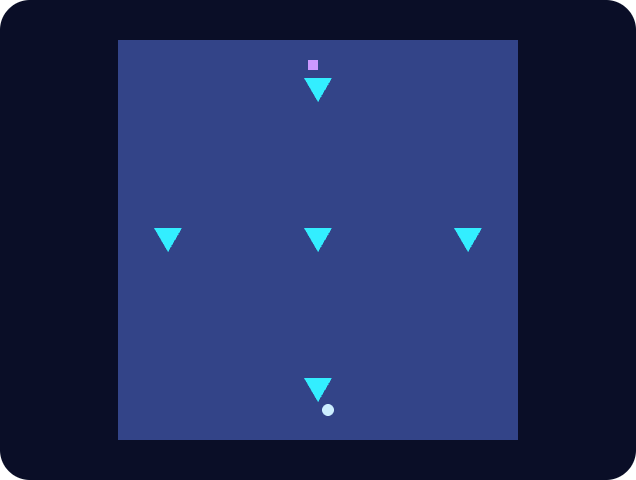

# 第十四章

哲戈，薩祖都·3724 年火月 10 日

澤的鬧鐘響了。

他慢慢爬起來，在客房服務選單上按了幾下，點一杯蔬果汁，然後把衣服穿上。

三分鐘後，果汁送來了。澤很快喝完，一刻也不耽擱，開門下樓。

一到大廳，他就看見大廳餐廳裡有人朝他揮手。轉頭一看，是白。

澤走過去，在她旁邊坐下。

「jie mo kai tu jie hei ja ma?」她問。用的是一種裝可愛的聲音，擺明了在取笑餐廳的機器人。

「我已經喝過果汁了，不用。」澤說，「最近還好嗎？」

「你不問我打聽到其他選手什麼戰術嗎？你今天就要打準決賽了。」白說。

「好，那你打聽到其他選手什麼戰術了？」說完，他又趕緊補上一句：「你該不會用了什麼*不正當*的手段弄到這些情報吧？」

「放心，我又不是什麼北極間諜。我只是每場比賽都有看，跟幾個選手交了朋友，他們也讓我參加了一些練習。」

澤微微翻了個白眼，隨即鬆了一口氣。

「基本的社交技巧。我是為了活下去，從小就得學會。」

「謝謝你，白，有你真好。」

他停了一會兒。

「那你有什麼建議？」

「要說有什麼模式一再出現，」白說，「就是這個：其他選手全都太沒耐心了。君*絕對*是，但其實其他人也一樣。他們不只想贏，還想贏得快。」

「我知道資格賽的計分方式會鼓勵這樣，可是……就算過了八千回合的門檻，這種習慣還是延續下去，連我看到的那場君和德盧因的練習賽也一樣。他們不是在講策略，是為了快而快。」

「所以能不急就別急，好嗎，澤？」

澤點點頭：「謝謝你的建議。」

機器人來了，送上白的菜飯和一杯茶。澤也替自己點了一杯茶，一邊喝，一邊看白吃東西、喝茶。

十分鐘後，澤的手錶震了一下：載他去準決賽的車到了。

------------------------------------------------------------------------

「歡迎來到準決賽！」播報的聲音大喊。

「我們一路走到了今天。這四十天裡，有好幾場是我們見過最艱難的對局。資格賽的前四名是：紅郡的德盧因，六戰全勝；帕佛蓋都的澤・雷明，五勝一敗，平均獲勝時間 5,047 回合；尊德的君・采百，五勝一敗，平均獲勝時間 5,699 回合；還有紀嘉肯的考・世薩，五勝一敗，平均獲勝時間 6,740 回合。」

「今天這一輪非常特別：澤・雷明將與君・采百正面對決！緊接著，另外兩位選手也會進行他們的準決賽。十五天後，兩位勝者將展開三戰兩勝的史詩對決，我們的全國冠軍也將就此誕生！」

「當然，還有今天的規則變化。每個干預回合可以配置的資源減少百分之八十。不只如此，棋盤上還會有五座神壇：四座分別位在棋盤四邊的中央，一座在正中心。每一千回合，神壇內容的任何變化，都會以 XOR 的方式套用到神壇四個角附近的區域，然後神壇會重置成預設的岩塊。」

「FI LE GEI TAU FA。」

澤立刻懂了新規則的意思。

神壇是唯一違反質量守恆的物件——但即使有了這些新規則，還是沒有任何東西會讓熵減少。XOR 不保持權重，但它可逆。所以時間一久，棋盤只會越來越滿、越來越亂。

可以配置的資源少了，干預回合就不再是拿來建造的。干預回合是拿來*掌舵*的。

澤擺上他慣用的牆、滑翔機和太空船。不過這次他用了一些不一樣的設計：一艘他幾個月前開發出來的可轉向載印記太空船，只要干預其中幾格，就能改變方向。

「MU GU GEI TAU FA。」

澤又想到一個調整。他重新安排太空船的位置，讓它們在剛好兩個干預回合之後，正好越過神壇。到時候，他就能朝剛好對的方向送出一架滑翔機，把兩座神壇變成一座永恆滑翔機工廠。

這座工廠是這樣運作的：一架滑翔機在兩座神壇之間來回反彈，每撞一次，就撞碎一些岩石，往更北邊噴出更多滑翔機；每過一千回合，岩石又會重置。

「PA GU……」

澤把全部心力都放在滑翔機風暴上，用來保護他的太空船前往中央、東邊和南邊。西邊，他決定放棄。

「SO……BI……ZE……HA……MU……FO……SHI……LE……PA……」

直到最後一刻，澤都還在最佳化他的結構。

「TAU FA。」

太空船和滑翔機開始移動。

一千回合後，第一個干預回合到來。澤射出幾架滑翔機，把更多岩塊變成印記和滑翔機工廠。

他發現自己有個重大弱點。印記他做得出來，但要做出一艘載印記太空船，或一座滑翔機工廠，得花上四個干預回合。也就是說，手上這三艘載印記太空船就是他全部的艦隊。他非保護好不可。

就在第二個干預回合之前，他的一艘太空船和君的兩艘在中央擦身而過。顯然，君比他還要執著於在中央搞出點名堂。

澤明白自己得做個選擇：送滑翔機出去攻擊君的船、架牆防禦君的船，或是建立永恆滑翔機工廠。

第二個干預回合到了。他選了最後一條路。他送出的滑翔機會在三組神壇之間來回反彈：中央與南方神壇、中央與東方神壇、南方與東方神壇。

干預回合才剛結束，澤就注意到君也做了一模一樣的事，用的是他在中央的兩艘載印記太空船。君還調整了這兩艘船的航向，讓它們也往南走。

澤和君都看不到全局。觀眾看得到。

幾百回合後，澤發現君的攻勢比他有效。君不只建立了兩座永恆滑翔機工廠，一座在中央與南方神壇之間，一座在中央與西方神壇之間，還放出一波滑翔機攻擊，摧毀了澤的載印記太空船。

這時，君的兩艘載印記太空船正往南移動，其中一艘和澤自己的船處在碰撞航線上。撞上的時間，會在下一個干預回合之前。

澤只會剩下一艘載印記太空船：東邊那艘。

澤嘆了口氣。

他發現，這最後一艘載印記太空船，是他手上唯一一個君完全不知道的可移動結構。他最大的優勢，或許就是讓情況一直維持這樣。

下一個干預回合，他引導那艘太空船暫時停下，就停在君東北基地的視野範圍外，再設定它射出滑翔機，去摧毀君東北基地裡那些肯定存在的印記。為了不暴露自己的位置，這些滑翔機不會直接往北飛，而是先撞上北方的岩石神壇，再反彈過去。

在這同時，東南方，澤自己的印記開始一個接一個消失。先是被君的永恆滑翔機工廠打掉；接著，換君那艘從南方往東移動的載印記太空船射出新的滑翔機來打。

就在下一個干預回合前，澤瞥見君的載印記太空船出現在他的西南基地附近。緊接著，那艘船射出滑翔機，把基地摧毀了。

然後，第四個干預回合到了。

君在物資上占了很大的優勢，這一點澤很清楚。他唯一的優勢，就是藏得住。

場上還有永恆滑翔機工廠噴出的滑翔機到處亂飛。東北角正南方那個位置，算是比較安穩的地方之一。

澤決定繼續低調。他讓載印記太空船停下，開始一項為期五個干預回合的任務：再造一艘。

同一時間，他回想起中央附近那些岩塊的樣子——那是他在中央的載印記太空船被摧毀前一刻看到的。他在沙盒裡複製出那個圖樣，推敲出一套策略：在中央神壇和北方神壇之間產生一座永恆滑翔機工廠，去君的西北方大肆破壞。

到了第五個干預回合，這波攻擊成功重創了君在西北方的基地。只是損害到底有多大，澤沒辦法知道。他繼續造另一艘載印記船。

沒過多久，澤在東南方的最後一個印記，也被一陣滑翔機風暴摧毀了。他在東南方看到的最後一幕，是君的載印記太空船開始往北移動。

澤送出滑翔機，再建一座永恆滑翔機工廠。這一次，他要讓滑翔機淹沒西邊的中央一帶。

他自己的太空船沒有動。也動不了：新太空船還在建造，接下來的三千回合，他都是個活靶。

第六個干預回合到來時，君的載印記船正好挨了一陣滑翔機齊射。這個時機讓君撿到了運氣：他替船擋下滑翔機，讓它多撐了一會兒。

那艘太空船最後還是被摧毀了。但在那之前，它已經開進澤自己那艘船的視野範圍。

澤算了一下：君看得到他的船，卻看不到他正在造的那艘新船。

能做的事只剩一件，澤就做這件：繼續造船，同時沿著西邊和對角線多架幾道牆。南邊，他審慎地不去管。既有的滑翔機風暴，加上君那艘船留下的殘骸，本身就足以當作屏障。

第七個干預回合到了。澤把所有資源都投進新船。快好了。下一回合的資源剛好夠把它完成，還能對兩艘船各下一道轉向指令。

接著，滑翔機風暴從四面八方朝澤的船襲來。

起初，牆還擋得住。可是滑翔機一波接一波地來，很快就開始突破牆壁。

第八個干預回合來得正是時候。澤的最後一艘船還沒被摧毀，但也撐不了多久了。這一回合，他終於可以把新船完成，再給既有的那艘船最後一道指令。

他讓兩艘船都往西走。

他判斷，既有那艘船上的印記，一百回合內就會被摧毀；但殘骸仍然可以繼續往西滑行，撞上北方神壇，往南釋放出一大陣滑翔機風暴。

新船*也*往西走，不過會停在北方神壇的正北邊。滑翔機風暴越來越猛烈，停在那裡，能得到一些掩護。

第九個干預回合到來時，附近有一處岩塊已經快被滑翔機打爛了。澤利用它反彈一架滑翔機，讓它轉往南方，去重新調整那些往南攻擊的永恆滑翔機工廠。調整後會變成什麼樣子，他沒時間計算；確切的後果是什麼，他也沒辦法知道。他只希望，這能讓原本安全的地方變得不安全。

他還往西發動了一波滑翔機攻擊。

第十個干預回合到了。似乎什麼事也沒發生。只有殘骸。越來越多的殘骸。

澤加固了最後那艘載印記太空船東西兩側的牆。

他發射幾架滑翔機，想再建立幾座永恆滑翔機工廠，希望能在南方製造更多混亂。其中一架還沒飛出澤的視野，就被另一架亂飛的滑翔機撞毀了。

第十一個干預回合到了。澤想出了最後一招。

他找出了辦法：讓一架滑翔機從自己的一道牆反彈往南，貼著神壇的邊緣走。他在沙盒裡模擬過——只要它撞上中央神壇的角，就會往北反彈回去。這架滑翔機會在中央和北方之間來回彈跳，每撞一次中央，就同時放出另一架往西飛的滑翔機。而*那架*滑翔機撞上西方神壇後，會反彈往東南走，希望能對南方的任何東西造成損害。

他照這樣做了，同時也朝東邊布下同一套策略的鏡像版本。

第十二個干預回合到了。到了這個地步，場上的殘骸和亂飛的滑翔機已經密集到不可能進攻。澤只是不停築牆。

蹲低、防守、撐到最後。

第十三個干預回合到了。澤已經在這艘船周圍築起四層牆。牆崩塌的速度，終於開始快過他造新牆的速度。

最後，又過了幾百回合，警報響起。

「而……勝利者是澤・雷明！」

澤鬆了一口氣。

------------------------------------------------------------------------

澤坐在等候室裡，看德盧因對考的那場比賽。打從開局，德盧因的戰術就讓他既意外又佩服。

德盧因前期把全副心思都花在築牆上，用的是他北邊和東北邊岩塊裡的資源。同一時間，他也送出滑翔機，想建起朝南的永恆滑翔機工廠。

可移動的載印記太空船，德盧因一艘也沒造，就只是固守。

考的永恆滑翔機工廠沒發揮多少作用。滑翔機雖然會永遠源源不絕地來，效果卻只維持短短一陣子。每當一陣滑翔機風暴襲來，德盧因都會想出辦法，把它反射回去。

澤很佩服。看來德盧因也想通了：自己得更有耐心才行。

七千回合後，考已經被逼得只能躲在南方神壇後面。但考也只勉強再撐了三千回合。亂飛的滑翔機和殘骸越來越多，而有那些牆擋著，德盧因比考安全得多。

比賽進行到第一萬零兩百回合，大會宣布德盧因獲勝。

德盧因從電梯裡走出來。

「德盧因，你打得真漂亮。」

「謝啦！牆能撐得這麼好，連我自己都很驚訝。接下來，我很期待看看你那場是怎麼打的。」

「喔——我的打法比你難看多了。不過說起來，我基本上也是靠防守贏的。」

「待會要不要一起去喝茶？」

「好啊！」

------------------------------------------------------------------------

德盧因坐在庭園裡喝茶。澤一看見他，就跑了過去。

「德盧因，見到你真好！」

德盧因朝他揮揮手。澤一路跑到他桌邊，坐了下來。

一台機器人立刻滑到兩人桌邊。

「jie mo kai tu jie hei ja ma?」

接著，一份菜單出現了。

「哇。」澤倒抽了一口氣。

「怎麼了？」德盧因問。

「我想這幾個是哲戈語第九版的新符號，他們正在拿來做 A/B 測試。」

說完他馬上想到，自己是在跟外國人說話，於是又問：

「你聽說過哲戈語第九版嗎？」

「喔，聽過，有幾個人跟我提過。就是把語言視覺化嘛。替每個字根找回象形文字，可是光看字形，就能完全讀出發音。另外還有一層，是想讓文法看起來更像數學。」

「對，我正在想辦法解讀。這個杯子是水，唸『ja』。杯子有兩個地方不太尋常：水平的直線比平常多，右邊還多了三條斜線。也許那就是發音標記？一個標子音，一個標母音？」

「右上角是『kai』。我看到特別的地方是……左邊多了一條垂直的葉脈，然後越往右，葉脈就越來越彎彎曲曲？不過……換作是我，大概不會把圖畫得這麼細。畢竟這些字常常要看上下文，意思也跟著不一樣。」

「等等，你會哲戈語？」

「澤，哲戈語的重點就在這裡：字根只有 256 個，不到一個月就學得會。細微的差別你不會全懂，但到處走走完全沒問題。」德盧因用說教的語氣回答。

「真厲害。你幾乎已經是本地人了。」

「那，明天要不要跟我去紅郡？我爸媽的生日只差幾天，我得飛回去替他們過，順便讓我們那邊的頂尖選手幫我做賽前最後衝刺的指導。你要是一起來，我就能跟他們說：你也一樣沒上，那我跳過指導也沒關係！」

「我很想去看看紅郡，可惜實在沒那個錢。也許過幾年吧。」

「不過我真的超好奇紅郡長什麼樣子！傳照片給我看。」

「喔，現在就能給你看幾張。」

德盧因拿出手持裝置，給澤看了幾張紅郡的照片。有城堡、松林、大片未經開發的草原、山頂積雪的紅色山脈，還有一座巨大的冰瀑。

「哇，好美。」

「你知道嗎？我小時候覺得，稱讚一個國家風景美，其實是明褒暗貶，幾乎算是一種侮辱。那時候我想：如果你對一個國家說得出口最好聽的話，是一樣那裡的人根本沒親手做出來的東西，只是軌道力學、生物學和板塊構造這些力量隨機白送給他們的，那對那裡的人其實相當刻薄。」

「可是長大以後，我才明白完全不是這樣。就算是美麗的自然，也要花很多人力去維護。

「要有人力去修步道、修道路，大家才走得到、開車到得了。要有人力去維持一套政治制度，不讓人汙染環境、砍伐森林、把房子蓋在山坡上把山弄醜、把整座山露天開採——同時又得允許在看得到風景的地方蓋房子，讓房子維持在負擔得起的價格，產業也還要維持下去。還要有人力去修復過去的破壞：那些都是在我們夠有智慧，或者說夠有錢，開始在乎這些事之前就造成的。」

「等我付得起，第一時間就跟你說。」

「希望是十五天後。」他開玩笑說。

「因為我會拿冠軍獎金幫你出旅費。」德盧因俏皮地回嘴。
