# 第十五章

聯合城邦，自由城·3724 年火月 17 日

楊恩穿過自由城經濟研究所的旋轉閘門，往餐廳走去。

這時還是清晨。這天的新聞，他刻意一則都還沒看——先讓腦袋清空，待會餐廳螢幕上播的不管是哪一場講座，都好好享受。

走了一分鐘，到了。

一看到螢幕上的內容，他的眼神就因驚恐而僵住了。

> 特別報導
>
> 北極帝國入侵並併吞紅郡

記者正在轉述事發經過，楊恩專心聽了起來。

> 今天早上 15,500 拍，大批北極無人機與飛行器在紅郡各大城市與軍事基地降落；同一時間，北方展開大規模陸路入侵，數千輛車輛從過去從未被發現的地下隧道中駛出。
>
> 紅郡軍隊完全措手不及，許多人懷疑軍方最高層貪腐。
>
> 主要戰鬥不到兩長時即告結束，傷亡極為有限。紅郡各地駐軍目前幾乎都已投降。

餐廳裡大約坐了十個人，烏塔庫也在其中。她看起來和楊恩一樣震驚。

> 載有阿爾博總統、塞勒迪爾總理與大部分議員的三架政府飛機試圖起飛，三架全遭擊落。目前跡象顯示無人生還。
>
> 總統之子塔芬德爾據信已遭北極俘虜。

記者短暫停頓了一下，又接著說下去。

> 最新消息：
>
> 紅郡南部最後一支駐軍已同意有條件投降。駐軍停止一切防衛行動，換取駐軍人員與另外三十名人員獲准飛往德文維爾，其中包括兩名參議員。
>
> 三架飛機將在五分鐘後起飛，也是唯一獲准離開的飛機。北極當局不允許其他任何交通工具進出紅郡，並已切斷所有通訊，也已經在積極架設干擾設備。

楊恩這時已經站在烏塔庫桌邊。「我們現在該怎麼辦？」他喃喃地說。

「認真看待威脅。」烏塔庫說。

楊恩還來不及移開目光，她已經在手持裝置上飛快地打起字來。

維瑞迪亞，梅爾丹

格拉迪亞斯和賽菈盯著螢幕，費布里克和赫蕾妲就在身旁。他們才剛在日出時醒來。陽光乾乾淨淨地從窗戶照進來，外頭步道上的樹已經投下長長的晨影。

一醒來，最先看到的就是這則新聞。

茲文還在睡，莉莉也還待在自己房間裡。

賽菈拿出手持裝置，飛快地打起字來。

她按下送出。

幾拍之後：

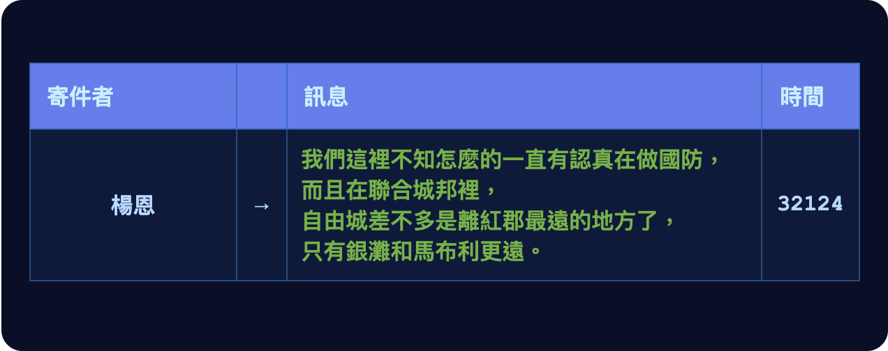

賽菈鬆了一口氣。

格拉迪亞斯看見她在傳訊息給楊恩，便把手搭在她肩上安慰她，沒有再多說什麼。

心思很快轉到了規準上。這下我們下個月肯定不會調整硬體開放性規準了，他想。說不定還得調高稅級。

又過了一會兒，他突然對德爾瓦特一陣火大。

賽菈出了房間，去叫醒茲文、叫莉莉出來。不到二十分鐘，四個孩子都上學去了，屋裡只剩格拉迪亞斯和賽菈兩個人。

格拉迪亞斯下到地下室，關上門。

「我們現在該怎麼辦，莫夫？」他透過頸帶低聲問。

「顯然德爾瓦特很多事都錯了。下次跟他談，我們*真的*有一大堆問題要問。要的是直截了當的答案，不是藉口。」

「別忘了，問題不只是他在政治上錯得離譜。還有我一個半月前發現的事：不管他在搞什麼，那個組織程度實在驚人。」

「那次之後，你還有再追蹤到他嗎？」

「只有兩次。第一次他跟一個穿隱私袍的人見面，不確定是誰，兩人談了很多銀聊的事。第二次是跟一個守律者，我聽出一些和 Dreadknot 有關的對話。大概從一個月前開始，就什麼都沒有了——他要嘛換了地點，要嘛變得更會躲。」

「那投票在什麼時候？」

「第一次大概在二十天後。」

「德爾瓦特可能會想辦法『驗證』你有沒有照他要的方式投票。所以記住掌舵會建立的那套機制，就是為了讓他做不到這件事。」

「只有用有效金鑰簽署的票才算數。」格拉迪亞斯像背課文一樣唸出來。「要產生投票金鑰，你得去見金鑰分配小組五個人中的至少三個，把投票金鑰的每一份盲化份額向他們登記。完成之後，哪些金鑰有效、哪些無效，這項資訊只有經混淆的電路能解密，而且只能在它指定的條件下解密。」

「所以不論是德爾瓦特還是其他任何人——嚴格來說，連我自己也一樣——都不會知道是哪一把金鑰、有幾把金鑰，甚至有沒有任何一把真的登記成功。會被解密的只有投票結果。德爾瓦特分不出我送出的票哪些是真的、哪些是假的，就算我想，也沒辦法向他證明。他要接管我的票，就得接管我的身分，也就是去找金鑰小組，*親自冒充我本人*。這很難，因為金鑰小組的重點，就在於裡面都是我當面見過的人。」

「人類——最終極的可信硬體。」

「功課做得不錯嘛。」

「不過我*希望*這些全都用不上，希望德爾瓦特能給我一個說得通的解釋。」

「希望不是策略。」

「確實不是。」

哲戈，帕佛蓋都

澤焦急地按著手持裝置上的按鈕，把訊息送了出去——這已經是第五次了。

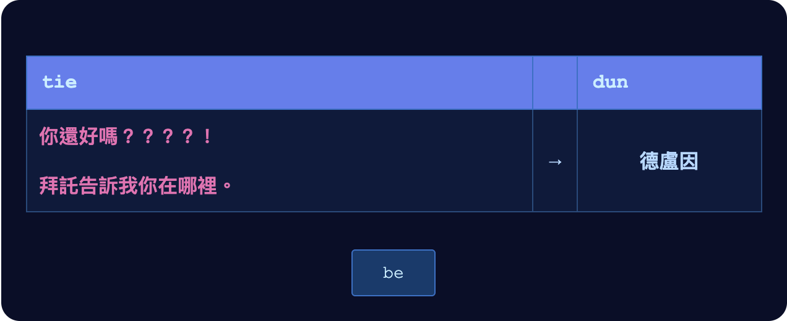

他坐在飯店大廳餐廳的一張桌子前，哭著。

桌上擺著一杯茶、一盤菜飯。茶他很快就喝完了，機器人已經來續了四次；菜飯擺了將近一長時，一口也沒動。

回覆終於來了。

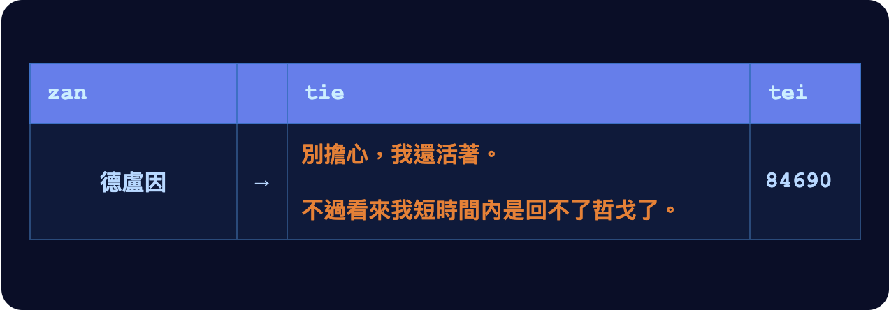

這不是澤想要的結果。但比起他害怕的那一種，已經好太多了。

他鬆了一口氣。

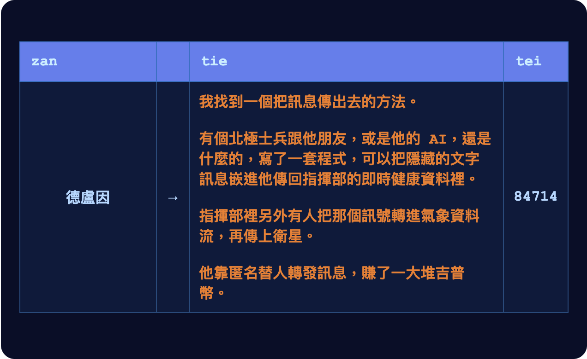

澤把眼淚擦掉，專心打起字來。

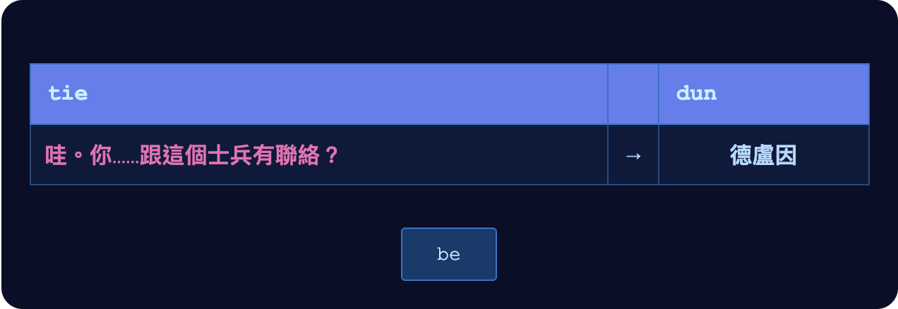

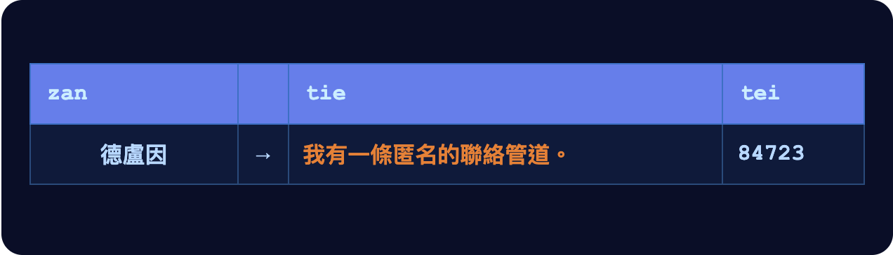

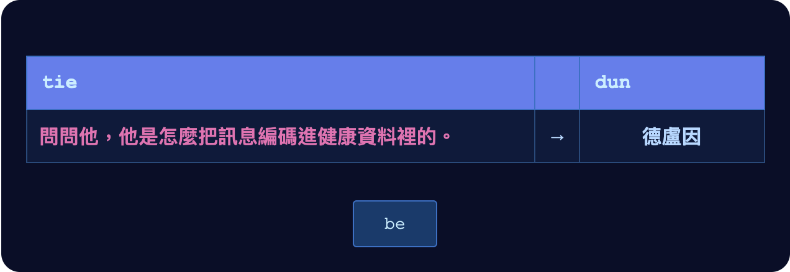

澤想了一下。或許，該輪到他當老師了。

他拿出鍵盤，飛快地打起字來。

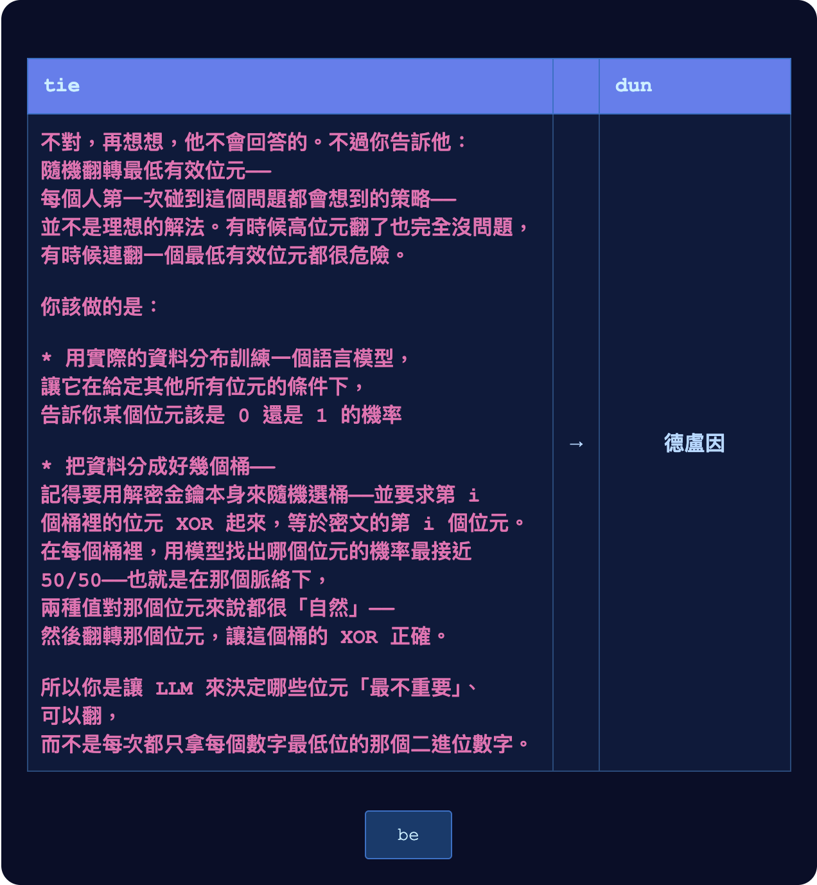

澤往後靠了一下，暗自得意。他不只弄懂了一個複雜的概念，還把它解釋清楚了——而且是*這件事剛好需要的那個複雜概念*。

他決定繼續寫下去。理由有兩個，分量差不多：一是他為自己懂這些而驕傲；二是他想讓更多紅郡人能把資訊偷偷送過北極的審查。

接著他想到，上一則訊息看起來可能太像在炫耀了。於是又補了一則。

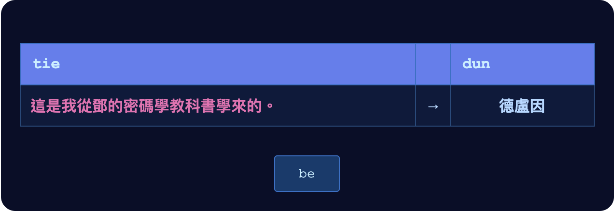

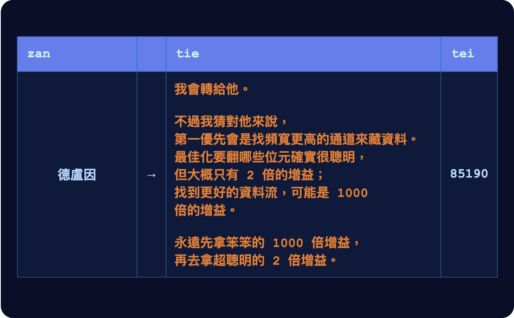

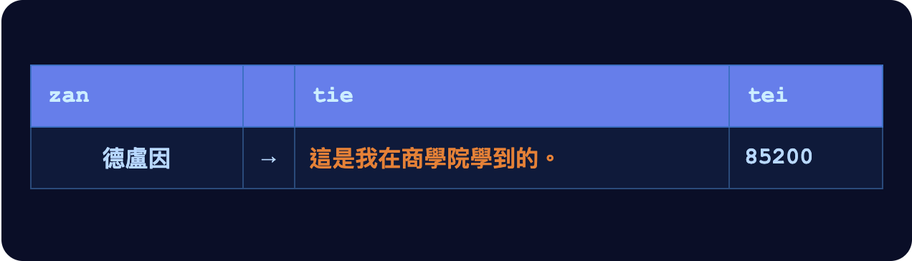

至於更好的隱寫編碼能帶來多大的改善，澤的看法比較樂觀。不過他決定不再爭下去。

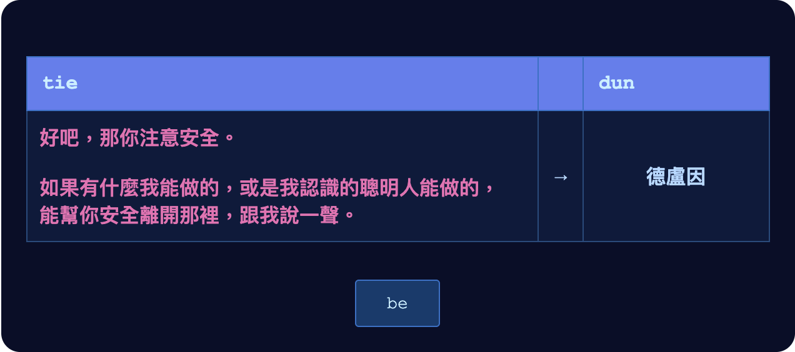

澤本來想寫「或是昆高派能做的」，甚至想寫「或是哲戈那些厲害的祕密社團能做的」。

但他想到兩件事。第一，讓外人知道這些東西存在，就是違反保密原則，何況這個外人現在身在敵方佔領區。第二，這條聯絡管道他沒辦法完全信任：他連安全提問都還沒問德盧因。

所以，最後還是寫了「我認識的聰明人」。

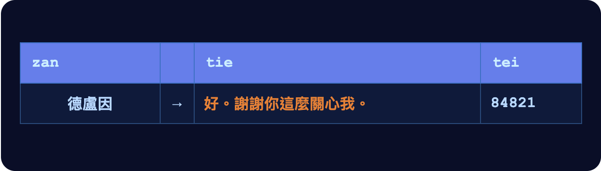

澤放下手持裝置，吐了一口氣。他的目光在餐廳裡短短掃了一圈，這才發現，整間餐廳已經沒有別人了。

他終於開始吃那盤菜飯。

------------------------------------------------------------------------

澤感覺到有人把手搭上他的肩。他轉過頭，是蘇。

「德盧因的事，我很遺憾。」

「昆高派應該正在想辦法把他弄出來吧？」

話一出口，澤才發現自己嚴格來說犯了個錯。蘇知不知道昆高派的事、該不該知道，他根本還沒確認過。到目前為止，知道的只有鄧和穆。

「那是我問鄧的第一件事。」蘇才剛開口，澤就幾乎無聲地鬆了一口氣。「目前他們已經拿到好幾條通進紅郡的網路連線，一分鐘前也收到了德盧因的訊息，至少他現在是安全的。要是有任何可行的營救計畫，我們會通知你。」

澤默默點頭。

「決賽取消了。」蘇又說。

「取消？不是延期？萬一他明天就回來了呢？」

「就算他回來，事情到了這一步，再比下去也不對了。我們也不想給觀眾虛假的希望，不想讓大家分心。今年的冠軍是你。要是德盧因真的回來了，我們會頒給他跟你一樣的獎盃、一樣的獎金。」

「不……」澤央求道，「我不想這樣贏。」

「我知道今天已經很晚了，不過你還是該去找鄧談一談。他在薩祖都，現在人在南方的山體金字塔。他可能要你留在這裡，也可能要你去帕佛蓋。這他會比我清楚。」

澤點點頭。這一切當然比比賽重要，他明白。

他希望鄧會派他去帕佛蓋，那樣就能再見到汾和媽媽了。

------------------------------------------------------------------------

澤的車開到山體金字塔的一個入口。這個入口他以前沒來過：山體金字塔側面的一排門，比平常那個入口更靠近地面，只是離市區遠了些。

車子停下，車門和其中一扇金字塔的門完美對齊。兩扇門同時滑開。

澤下了車，沿著走廊走去。

走了一百公尺，左轉一次，再右轉一次，他來到一扇門前。

他把手錶貼上綠色圓圈。門開了。

澤看見一個長長的房間，盡頭擺著一張桌子。鄧坐在桌子另一頭，只有他一個人。

澤坐了下來。

「謝謝你過來，澤。」

澤默默點頭。

「有能力幫哲戈撐過接下來這一年的人寥寥無幾。我想，你就是其中之一。」

澤睜大了眼睛。沒錯，他現在是明盤台全國冠軍，鄧那幾本密碼學書也讀得頗有進展，可是……他還是想不通，這些為什麼會讓他在這個節骨眼上變得有價值。

「你上一場明盤台比賽，有兩件事是你贏下來的關鍵。記得是哪兩件嗎？」

「我想得到幾個答案，不過不確定有沒有您心裡想的那個。」

「第一，你蹲低防守，撐得比對手久。」

「第二，你手上只有一條頻寬非常有限的資訊通道，卻把它用到了極致。你先把大部分資料預先發布出去——也就是那艘載印記太空船——到了最後，只靠幾個位元的操作，就部署了策略裡最重要的部分。」

「其實，這跟你幾個月前另一場比賽的戰術非常像。那次你送出一艘太空船，基本上把所有可能的滑翔機攻擊策略都編碼在裡面，再用另一架滑翔機，選出你要用的那一種。」

「這跟現在有什麼關係？」

「我們跟德盧因聯絡上了。你知道是怎麼辦到的嗎？」

「其實是他先聯絡我，跟我說的。有個北極士兵在向人收吉普幣，幫他們把訊息藏進他自己的健康資料裡。」

「沒錯。所以每個人都降到自己能用的、最有效率也頻寬最低的溝通方式——純文字——再全部交給他送出去。一個士兵的健康資料，承載著幾千人的通訊。」

「四分之一長時前，他收的費用突然降了三分之二。我們懷疑他找到了某種更有效率的資料編碼方式。有意思的是，到目前為止，不管是他還是其他任何人，都還沒找到比健康資料更好的通道。」

「好吧，這樣說來，我在想那會不會是我。我叫德盧因轉告那個士兵：先用他自己的健康資料訓練一個 LLM，然後在傳送途中修改要送出去的健康資料，專挑 LLM 說最安全的那些位元來翻轉。訊息則用分桶 XOR 來編碼，這樣要翻哪個位元，他就有很大的自由。每藏一個位元的資料會帶來多少『可疑程度』——要把這個壓低，這方法好太多了。所以同樣的掩護流量裡，他藏得進更多資料。」

鄧睜大了眼睛。

「嗯，我們沒辦法知道他是不是用了那一招——」

澤想起來，該看一下手錶。

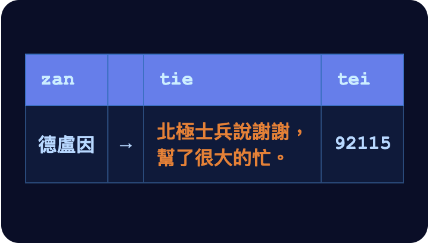

「看來他用了。」

「你看，你已經在幫反北極的抵抗運動了。」

「聽著，澤。現在的情況是，我們被迫出手了。我們不能再只是祕密地提升自己的能力。哲戈社會必須從暗處走出來。」

「影子社會必須成為社會本身，影子政府必須成為政府本身。我們得全力衝刺，把摸索出來的一切部署到全哲戈——要趕在北極人對我們出手之前。」

「這整件事裡，跟你最有關的是密碼學基礎設施。我們的協調要能繼續運作，該保密的事要能繼續保密，靠的就是它，而它是在帕佛蓋都運作的。所以我要你搭火車回去——蘇可以幫你把車票改到明天——之後我會傳訊息告訴你，接下來該去聯絡誰。」

「至於現在，或許你可以看看，能不能再想出什麼點子，讓那個士兵賣出更多封包。對你來說，這好像是比我的教科書還要好的密碼學訓練。」
