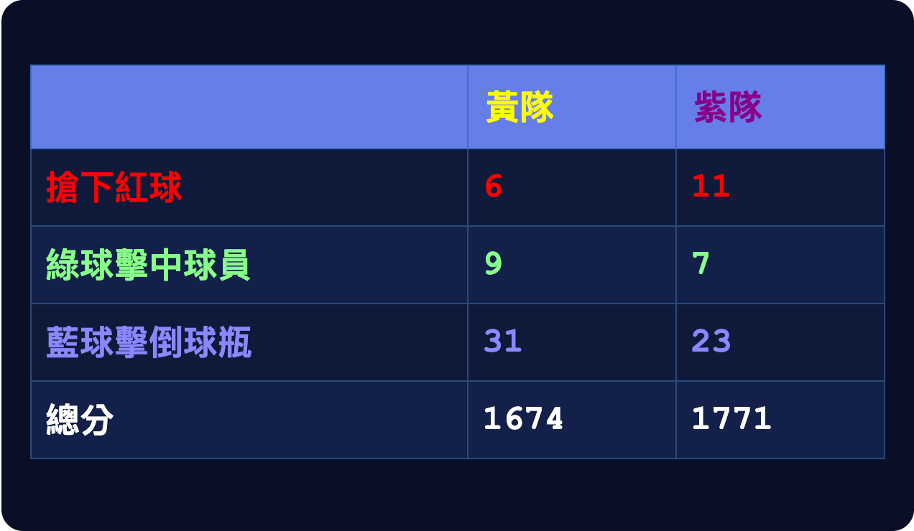
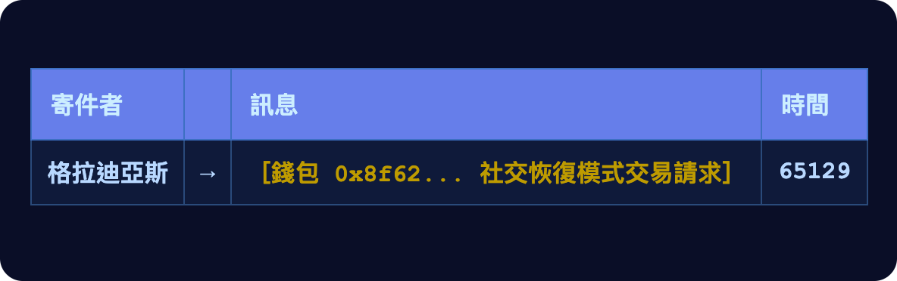
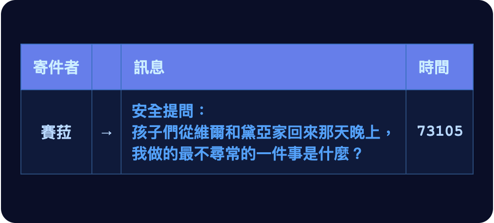
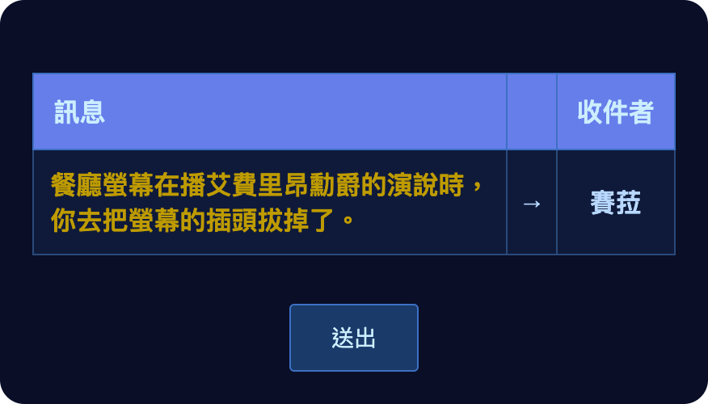

# 第十六章

維瑞迪亞，梅爾丹·3724 年火月 25 日

格拉迪亞斯拉開包廂的隔門，走進去，再把隔門拉上，氣沖沖地在德爾瓦特對面的長椅上坐下。

「你有很多事得解釋清楚。」

德爾瓦特低頭看著桌面，一臉歉意。

「聽著，格拉迪亞斯，你是對的，我錯了。我太痛恨維瑞迪亞政府和文化裡這一大堆干預主義，恨到被蒙蔽了眼睛，忘了有些事本來就一直是政府該做的。國防就是其中之一。」

「我生氣不是為了這個。」

德爾瓦特嚇了一跳，抬起頭來。

「我是說，這是原因之一，但遠遠不是最主要的。」

「那最主要的是什麼？」

「到底是怎麼回事？你到底是誰？你在跟誰合作？」

德爾瓦特嘆了口氣，沉默了片刻，接著身子往前一傾。

「好，我解釋。」

「我不只是一個憑著理念單打獨鬥的人。我，還有另外一群人——我不認識他們——都在替銀聊工作。」

「這些規準讓我們很不滿。只因為一堆人在我們平台上講了些粗俗的笑話，我們的稅就被調高。我們希望銀聊能成為一個避風港，躲開那種平淡——它正在吞沒維瑞迪亞其他大部分的地方。我們希望在這裡，連海卓菲、甚至 Dreadknot 都能受到歡迎。」

「所以我們決定自己動手。有組織地努力，試著把政治往更好的方向拉，直接去遊說守律者。」

「現在我才明白，這一切有多天真。如果我們擋住了平淡化，代價卻是讓北極帝國能夠趁機接管，帶來糟糕得多的後果——先是紅郡，之後是全世界——那這整件事就不只是不值得。它會帶來毀滅。」

格拉迪亞斯嘆了口氣。他還是非常生德爾瓦特的氣，只是現在，怒氣裡也摻進了一點同情。

一個機器人滑到桌邊，替兩人送上沙拉、長方形營養棒和水。

兩人都先把自己那盤食物拿起來，放到桌上。格拉迪亞斯接著拿起杯子，一口氣喝掉大約半杯水；德爾瓦特也一樣。

他們默默吃了起來。過了幾分鐘，才又接著談下去。

「你現在要我怎麼做？」格拉迪亞斯問。

「當然，現在別讓規準把軍事排除在外了。你甚至可以調高稅級，不過那只能幫上一點點——這方面最重要的槓桿在圖譜募資那邊。」

「不過我另外還有個主意，你可以去做。」

「什麼主意？」

「我覺得你應該去哲戈。」

「我？去哲戈？為什麼？」

「北極這整個問題，他們顯然比我們維瑞迪亞想得透徹多了。去研究他們。向他們學習。看看有什麼能帶回維瑞迪亞的。」

「你一直這麼不可信，我憑什麼要聽你的？」

「那你當然別只聽我的。去問問你最親近的朋友和顧問，看看他們怎麼想。」

------------------------------------------------------------------------

格拉迪亞斯沿著平常會走的那條路穿過卡利馬區。路上跟往常一樣綠樹成蔭，兩旁是石砌的房子。

但那天熱得反常。有些陽光從樹蔭間漏下來，把裹在隱私袍裡的他整個人曬得發燙，身上微微出了汗。

途中經過一間房子，他記得那家是賣維瑞迪亞傳統食品的。這次，海報上多了一張匆匆貼上去的紙條，推銷一種組合包：保存食品美味、營養完整、可長期保存，份量足夠撐過三十天。

他點了點手錶，打給莫夫。

「我跟德爾瓦特談過了。」

「怎麼樣？」

「你說對了，是有組織的行動。結果他——至少他現在是這麼說的——一直都在替銀聊工作。」

「銀聊？我還以為會是什麼更邪惡的公司，像藍鯨之類的。」

「不過我想也說得通。一個半月前我偷聽到的那場對話，對方大概就是銀聊的人。」

「所以他現在要我去哲戈。」

「哲戈？去幹嘛？」

「他說我們維瑞迪亞有很多要向他們學的。你覺得是這樣嗎？」

「說起來，紅郡被佔領那天，我有個朋友也跟我提過類似的事。他覺得*我*應該去一趟，看看他們的祕密社團是怎麼運作的之類的。」

「嗯，你也知道，賽菈現在有個那裡的朋友。她上次跟我說，他在明盤台的排名一路往上爬，已經打進全國賽了。所以我要是去了，說不定真的能學到一些東西。」

「是啊，我當然看得出這有什麼好處。維瑞迪亞人真的需要多了解外面的世界，尤其是體制裡的人：掌舵會、法院、議會，全都是。」

「給我幾天想清楚。」

「反正規準的投票在八天、十二天和十六天後，不管怎樣，你都有這段時間可以好好想。」

格拉迪亞斯停頓了一會兒。

這時，他正好走過家附近那間餐廳。他常在那裡停下來吃點東西、喝點飲料。透過窗戶，他看到費布里克在裡面吃飯。

「我也會想想。」他終於開口，結束了通話。

------------------------------------------------------------------------

格拉迪亞斯一走進餐廳，幾乎馬上就把隱私袍的臉罩摘了，前襟的拉鍊也拉開一半。反正吃東西時本來就沒辦法那麼隱密，何況他剛剛在大太陽底下一直流汗。

他在費布里克旁邊坐下。

「喔，格拉德叔叔，真開心又在這裡見到你！」

「我也很開心見到你！」

格拉迪亞斯注意到，費布里克一直在看螢幕。上面正在直播一場旋翼球比賽。

他索性讓自己也看了一分鐘。畫面跟著一名穿黃色球衣的球員，他領頭追著紅球。

突然間，另一隊一名穿紫色球衣的球員不知從哪裡冒出來，一把將他撞到一旁。穿黃色球衣的球員翻滾了幾圈，往下掉了大約五公尺，才自動恢復平衡。

畫面切到那名穿紫色球衣的球員。他在半空中接住一顆藍球，另外兩名穿黃色球衣的球員開始朝他飛過來。他們還沒趕到，他已經把藍球傳給隊友。隊友順利接住，開始往前飛。

畫面切到十支黃色球瓶，排成三角形立在一個圓盤上，圓盤架在一根桿子頂端，高高離地。拿著藍球的紫衣球員進入畫面，一名黃衣球員飛速擋到他和球瓶之間。

紫衣球員突然把藍球往高空一拋——就在這時，另一名黃衣球員撞上了他。

藍球從守著球瓶的那名黃衣球員頭頂上方大約五公尺處飛過，落到圓盤上，擊倒了三支球瓶。

螢幕上的計分板更新了。

紫隊的藍球分數剛從 20 跳到 23，總分也從 1540 升到 1771——這就足以讓他們超前對手。

剛擊倒球瓶的那名球員還在慶祝，突然一顆綠球從背後擊中他，顏料濺了他一身。

分數又更新了。

「你得承認，現在的計分制度真的很棒。」費布里克大聲說。

「我記得我年紀還小很多的時候，他們一直在調整比例：搶到紅球拿幾分，擊倒球瓶、擊中球員又各拿幾分。可是怎麼調就是擺脫不了同一種局面：理性的做法，就是把全部心力押在其中一項。」

「就算比例調對了，不到一年，戰術就會跟著調整，又變回一面倒。」

「我覺得，把分數改成相乘是唯一的出路。這樣一來，三種得分你幾乎非得都兼顧不可。」

「或是拚命讓對手有一種分數一分都拿不到。」格拉迪亞斯插話。

「啊對，一開始有些人最先試的就是這招。」費布里克回答。「持紅球超過三十拍早就被禁止很久了——就算在分數還是相加的時候，那招對紅球比較弱的那一隊來說，也是很好用的作弊手段。不過確實有一隊試過：一開賽就先擊倒一大堆球瓶，剩下的比賽都派大部分球員守自己的球瓶。」

「結果根本沒用。坐旋翼機的人再怎麼擠，密度也有限，不管你怎麼做，對手總是能偷塞幾顆藍球進來。而且你要是真的在一個地方圍著球瓶擠成一團，就成了綠球的活靶。」

「你在考慮下場去打嗎？」格拉迪亞斯問。

「沒有，不過我剛跟茲文聊了好多這個。那些數學幾乎跟比賽本身一樣好玩！」

兩人把注意力轉回眼前的食物。

「對了，莉莉最近怎麼樣？」格拉迪亞斯問。

「這兩個月她其實開始好一點了。幾天前她跟我說，最近一次公民考試考了七十分。她看起來比較開心，玩她手持裝置上的那個遊戲也玩得更投入了。」

「你知道是什麼遊戲嗎？」格拉迪亞斯問。

「她也不給我看。」

兩人又繼續吃。過了幾分鐘，都吃完了。

費布里克調皮地問：「這次有記得把吉普幣帶出來嗎？」

「欸，我是會犯很多錯，但同樣的錯我不會犯兩次。」格拉迪亞斯回嘴。

接著他透過頸帶低聲說：「對了，費布里克，謝謝你提醒我——我得測試一下我錢包的恢復程序。」

「要我幫你簽一筆測試交易嗎？」

「好啊！你想測什麼？」

「不知道耶，買一瓶海卓菲？」

「買一瓶海卓菲？直接從存畢生積蓄的錢包扣？」格拉迪亞斯不可置信地問。「那些廣告真的也把你洗腦了，對吧？」

「欸，是你自己問我的！」

「好啦好啦……我來發起交易。」

格拉迪亞斯開始對著頸帶低聲說話。他眼角餘光瞥見費布里克跑去了某個地方，不過他正忙，沒空去想費布里克跑去哪裡。

幾拍之後，費布里克的手錶震了一下。

費布里克打開手持裝置，畫面上出現更詳細的交易內容。

他請翡翠上網查這個收款地址。幾拍之後，翡翠回覆確認：這確實是海卓菲的購買地址。

接著看金額：5.5 吉普幣。一瓶水加運費，這個價錢似乎合理，雖然大部分肯定是運費。

再看交易資料欄位。沒錯，看起來是格拉迪亞斯家地址的編碼，格式也符合標準網路購物協定。

當然，在處理這些交易的密碼學網路裡，這些資料全都是加密的。

費布里克按下「確認」。

格拉迪亞斯的手錶立刻震了一下。

不到一分鐘，手錶又震了。

格拉迪亞斯立刻對著頸帶低聲回覆。

過了一會兒，格拉迪亞斯的手錶又震了。三份簽章完成，包括他自己的。還差一份。

莫夫或佩洛，誰簽都行。當然，真的不得已的話，他也可以自己跑一趟保險庫，去拿第二把金鑰。

「那是誰，我當然不會問；你還需要誰來確認，我也不會問。」費布里克補了一句，「不過祝你好運！」

------------------------------------------------------------------------

「賽菈，我回來了！」

「格拉德！」

「跟你說，我有個有趣的消息。」

「什麼消息？」

「我可能很快就要去哲戈一趟。」

賽菈愣愣地看著他。

「為什麼？」

「我跟莫夫談過了。他覺得維瑞迪亞人有很多東西要向那邊正在發生的事學習，尤其是守律者、掌舵會，還有整個體制。」

「我不太確定……現在時局這麼艱難。你其實不是最能善用哲戈之行的人。而且接下來這幾個月，守律者們會需要一隻強而有力的手來引導。」

「北極的事其實比較是軍方和議會該負責的，也許還有圖譜募資。而且……要是你介紹我認識澤，說不定我就能好好利用這趟旅程？」

賽菈陷入沉思片刻。

「如果莫夫覺得這是個好主意，那好吧。但拜託你先做好功課。找個人談一談，隨便誰都好，圖譜募資或議會裡的都行。這樣你才大概知道這趟去有沒有用；真的要去的話，也才知道怎麼讓它發揮最大的用處。」

「不過說真的，你要好好想清楚。」

「如果你去——那當然，我會介紹澤給你認識。還有白也是。」
