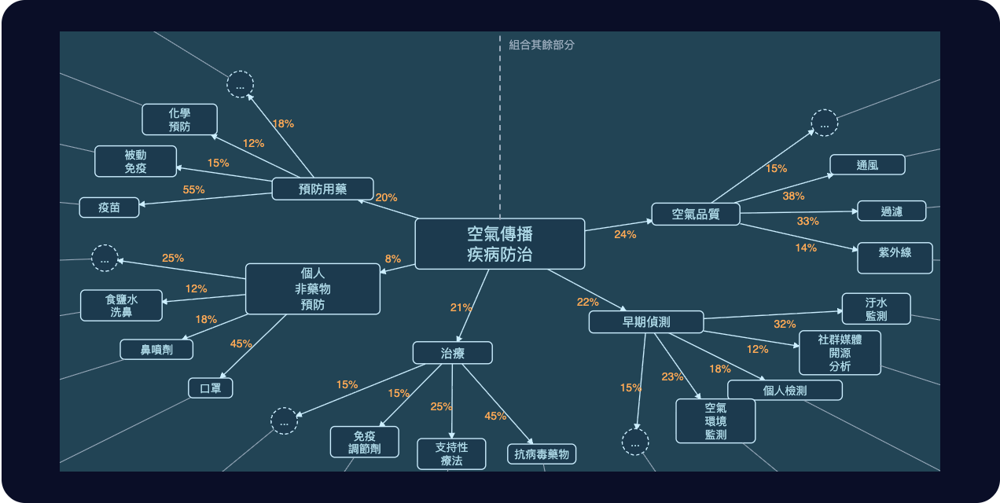
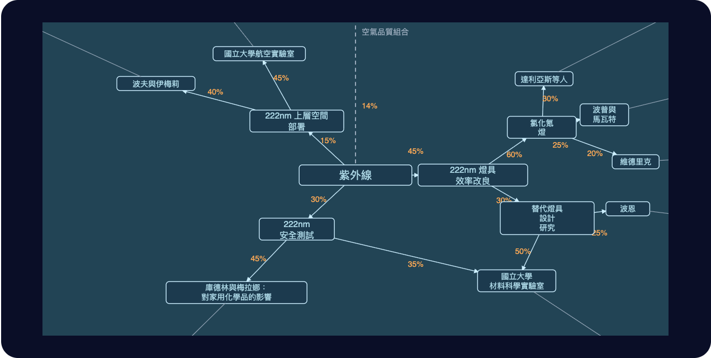

# 第十七章

維瑞迪亞，梅爾丹·3724 年果月 11 日

格拉迪亞斯沿著兩旁綠樹夾道的小徑，一路朝前方那座巨大的圓形議會大廈走去。

到了大廈的一扇側門，他把手錶貼上綠色圓圈。

圓圈嗡地響了一聲。

門開了。

格拉迪亞斯走進去，照著手錶傳來的指示走：往前，右轉，再往前，左手邊第三扇門。

到了門口，他又把手錶貼了上去。

門開了。

房裡有個男人，身上穿著維瑞迪亞的議會長袍。

「格拉迪亞斯，謝謝你跑這一趟！」參議員高聲說。

「也謝謝您撥空見我，韋爾多參議員！」

「請坐。」

一個機器人滑進了房間。

「jie mo kai tu jie hei ja ma?」機器人問。

格拉迪亞斯一愣，盯著它看了一下。

韋爾多笑了出來。

「這是我幾個月前改的設定，讓它這樣說話。算是個小小的提醒：世界上還有其他國家，而且它們很重要。」

韋爾多在機器人的螢幕上按了幾下，把螢幕轉向格拉迪亞斯。

滿螢幕都是哲戈語。格拉迪亞斯的視線在上面轉來轉去，看得一頭霧水。

「喔，喝水是『ja』，喝茶是『kai ja』。字面意思是『植物水』。」

格拉迪亞斯點了「kai ja」。

既然要在哲戈待上幾個月，不如現在就開始適應，喝點茶——順便學會當地人怎麼叫它。

機器人嗶了一聲，表示收到點單，接著悄悄滑開。房門開了一下，它就出去了。

「所以您覺得我應該去哲戈？」

「你顯然很聰明。你們在祕密會議上說些什麼，我當然完全不知道；可是聽你在聽證會上說的每一句話，再看你幾年前最初向掌舵會提出的申請，我認為你是個正直又聰明的人。我們需要像你這樣的人，更積極地為國家服務。當守律者是很好，可是拜託，守律者超過一千人，你只是其中一個。去哲戈取得第一手經驗、再帶回來，我覺得說不定更有意義。」

「如果您覺得這是個好主意，我很樂意去。只是到了那裡，該找誰談？這正是我想請教您的。」

他刻意隻字不提澤。

並不是想隱瞞這層間接的關係。他只是想先從韋爾多那裡，聽到一個完全獨立的答案。

「這個嘛，我交情最深的，是他們那邊的一些作家和音樂家。」韋爾多輕笑著說，「不過那邊的政府裡我也認識幾個人，尤其是安全與衛生部門的。我會把他們的聯絡方式傳給你，也先跟他們打聲招呼。換作是我，不會只找他們；不過要起個頭，他們應該幫得上忙。」

「謝謝，那會幫上大忙！」

「那邊我只認識兩個人，而且是間接的。是我太太在自由城的經濟研究所偶然碰上的——澤和白，他們有在打明盤台。」

韋爾多睜大了眼睛。「老實說，你手上的門路可能比我的還好。看過哲戈的明盤台比賽就知道，那些選手和訓練他們的人，顯然都是頂尖的。要是得找人保護我、對抗北極人，比起真正的哲戈軍隊，我幾乎會更信任他們。」

「澤和白的程度到哪裡？有打進什麼冠軍賽嗎？」

「賽菈上次跟我說的是，澤贏了準決賽，後來紅郡被入侵，決賽就取消了。」

「準決賽？市級的那種？」

「全國的。」

韋爾多盯著他看，又驚又喜。

「那你的人脈肯定比我的好。等你回來，一定要多跟我講講哲戈的事！」

「總之，我剛才提的那些人，還是會介紹給你，你過去的時候可以見見他們。多聽幾種觀點總是好的。」

格拉迪亞斯點頭致謝。

「喔，對了，說到多聽幾種觀點——有位圖譜募資管理人正好在這裡，等一下要來找我。你要不要也跟他聊聊？」

「聊什麼？」

「喔，聊聊他的工作、他對圖譜募資的看法，當然還有哲戈。」

「好啊，有何不可？」

------------------------------------------------------------------------

幾分鐘後，門開了。進來的是另一個男人，穿著維瑞迪亞隱私袍，卻沒戴臉罩，也沒戴兜帽。

「貝爾戈，又見面了，真好！」

「我也很高興見到你，韋爾多！」

「來，認識一下格拉迪亞斯。他是守律者。」

「很高興認識你，貝爾戈。」

「我也很高興認識你，格拉迪亞斯！」

「格拉迪亞斯最近在考慮去哲戈一趟。我們想說，也許你可以跟他多聊聊圖譜募資，順便給點建議：到了哲戈，該做些什麼、學些什麼。」

「當然，樂意之至。圖譜募資是怎麼運作的，你有多熟？」

「老實說，不太熟。」

「太好了。」

他拿出手持裝置按了幾個鍵，螢幕上跳出一張圖，他便拿給格拉迪亞斯看。

「這是空氣傳播疾病防治的子圖。圖上每一個節點，密碼學網路都會隨機選出一個委員會，由委員會決定這個節點正下方的各條邊各分到多少權重。」

「所以它跟法院、掌舵會一樣安全。分配資金能有這樣的機制，現在格外重要：北極人剛剛對平方募資發動了跟藍鯨當初一模一樣的攻擊，只是規模大了十倍。當然，換成任何比較傳統的分配方式，他們也一樣會想辦法插手。」

「喔，你說得一點都沒錯。最近連守律者都受到攻擊。不過靠著層層保密和內部的溝通屏障，至少目前這套制度還撐得住。」

「喔，是嗎？那就好。不過說來遺憾，我們還沒有好辦法讓這兩者更民主一點。聽取公民會議的意見很好，傳令官也很好，可是真正的公共問責，它們都取代不了。」

「總之，圖譜募資的設計跟法院、掌舵會的運作方式有一點不同：它容許更細的專業分工。畢竟，分配資金是相當技術性的工作。」

「目標是盡量把每一個資金分配的決定，拆成比較好處理的小塊。不要問『維瑞迪亞全部的公共資金裡，該拿百分之幾給這項紫外線 C 燈的研究』。要問的是：百分之幾該給健康；在健康裡面，百分之幾該給空氣傳播疾病；依此類推。」

「要是一個計畫同時對兩個領域有益，比方說某種燈，不知怎麼地既對紫外線 C 燈有用、又對國防有用，那這張圖就不再是一棵樹，而是一張名副其實的有向無環圖。一個節點可以有好幾個父節點，你沿著所有路徑拿到的資金會加總起來。」

「所以每個節點分到的資金，是由一個委員會負責分給它的直接子節點？」

「對。」

「他們能刪掉子節點，或是新增子節點嗎？」

「當然可以。這張圖一開始就是這樣建起來的。」

「真有意思。」

「話說回來，這一切完全取決於這些委員會有多稱職，對吧？分工分得越細，就越可能被特殊利益團體把持；越是隨機選人，就越常由根本不懂自己在決定什麼的人來做決定？」

「當然，這永遠是個取捨。」

「還有另一個取捨。實際做下來才發現，要讓委員會分得出爛計畫和好計畫並不難，要他們分得出好計畫和卓越的計畫，卻非常難。

「所以最近有一股風潮：在圖的下層，乾脆在頂端隨機分配。只要委員會評你在前一成，不管你是九十一分還是九十九分，入選的機率都一樣。」

「所以分數越是高出九十，基本上就越不用費心去迎合委員會，做自己覺得對的事就好。」

「沒錯。有時候你要的其實不是問責，而是給人的內在動機留點空間。站在最頂端的人，說不定比委員會還聰明。

「門檻以上隨機分配做的就是這件事：沒有問責就成不了事的人，給他們問責；最優秀的人，就讓他們擺脫誘因——他們幾乎不費吹灰之力，就能說服委員會自己的工作夠好。」

「總之，放大到個別計畫這一層，看起來是這樣。」

「讓隨機選出的圖譜募資委員會，一路細到這種層次去做決定，這樣明智嗎？」

「我自己也不確定。不過這個設計好就好在，它永遠可以在不改變結構的情況下演進。比方說，委員會大可以決定把一整個類別的『所有權』交給國立大學材料科學實驗室，讓他們自己在內部分配。其實社群媒體開源分析那一塊，我們基本上就是這麼做的：八成直接撥給銀聊。」

「藍鯨不太高興。不過，嘿，什麼都要封閉、什麼都要專有，是他們自己選的。」

「那這些跟哲戈又有什麼關係？」

「啊，這個嘛，這些技術其實有不少都傳到了哲戈。他們開始比較認真看待空氣清淨機和紫外線燈了。有幾個人越來越疑神疑鬼，擔心北極人哪天會故意散播一場大流行病來打擊他們。」

「北極人有沒有可能用一場大流行病打擊他們，疫情最後卻不會反彈回北極自己身上？」

「這個嘛，要是北極的防疫技術遠遠領先世界其他地方，那就有可能。他們可以散播一場大流行病，只有他們有辦法有效防護，而且護得住的也只有自己的人民。這些東西開源之所以這麼有價值，很大一部分就是因為這個，至少防禦性的那些是這樣。讓全世界站在比較公平的立足點上，就沒有人能放了火，卻只有自己穿著防火衣。」

「總之，你要是最後真的去了哲戈，回來一定要跟我說說，關於他們的公共衛生，你學到了什麼。我很好奇！」

------------------------------------------------------------------------

格拉迪亞斯開了家門，進到屋裡。

賽菈和孩子們已經在吃晚餐了。

「今天是你第一次投票吧？」賽菈問。

「是啊，你還記得，真好！」

「那你今天晚上又要出門嗎？」茲文問。

「喔，不用。要親自到場的部分，是幾個月前那幾場討論，還有金鑰登記。金鑰登記我在議會開完會之後，就馬上去辦好了。」

「最近我們守律者的線上討論小組也還有在討論，不過聊天室在投票前七天就自動關閉了。說是要留一段靜默期，給獨立思考多一點空間。」

「唉，所以關閉是在紅郡被併吞之後。那時候是什麼情況？」

「我想，那些主張把軍事硬體排除在規準最優惠幾級之外的人，全都安靜下來了。後來十八號提了一個新的修正案，把稅級調高，讓大家更有誘因把東西開放出來。我大概會投贊成。」

「那就好。」

「你在議會的會面怎麼樣？」

「很順利。參議員和那位圖譜募資的人，好像都很支持我去。不過他們說，要幫我安排這趟行程，澤可能比他們認識的任何人都更適合當聯絡人！」

「這其實說得通。大家都知道，有意思的事都不是在哲戈官方政府那裡發生的。」

「那我就去跟澤說一聲，讓你們兩個聯絡上吧！」

格拉迪亞斯、賽菈和孩子們吃了幾口飯。沒多久，餐桌上又聊開了。

「費布里克、赫蕾妲，要不要說說你們的消息？」

「我們冬季學期要去北林交換學習！」赫蕾妲得意地大聲宣布。

「哇，那可遠了，在東北邊，都快到北極的邊界了。」格拉迪亞斯說。

「很好玩啊！我們可以揹著小型旋翼機從山上滑雪衝出去，再滑翔下來！」赫蕾妲興奮地說。「而且又不是就在邊界上，北林在內陸兩百多公里的地方。這會是我第一次去那裡！」

「那你們去那邊要做什麼？」格拉迪亞斯問。

「維瑞迪亞最好的數學大學就在那裡。」赫蕾妲說。「我數學是班上前百分之五，所以獲選去上一些特別課程。」

「我也是。」費布里克補了一句，「不過我是資訊科學。」

「莉莉不是也想去北林嗎？」

莉莉在洗手間，沒辦法回答。

「維爾說，她考試要是能考到七十五分，夏天就帶她去。」

「她比較喜歡夏天，冷天她就沒那麼喜歡了。」

格拉迪亞斯的手持裝置震動了一下。

「好，硬體開放性規準的投票開始了。」

這感覺有點虎頭蛇尾，格拉迪亞斯心想。投票前那幾個月，有那麼多儀式、當面的會議、辯論和工作。

結果投票本身，就只是……在螢幕上按幾個按鈕。

不過這也合理，他想。照密碼學的運作方式，只要金鑰登記是安全的，這一步就可以在自己家裡、用自己的硬體完成。

就算德爾瓦特真的找上門，要求在整整十五長時的投票時段裡一直站在他背後盯著，他也沒辦法向德爾瓦特證明，自己裝置上的金鑰到底是不是登記過的那一把。說不定那只是個幌子，真正的票是莫夫、賽菈，甚至茲文投的。

格拉迪亞斯最後看了螢幕一眼，若無其事地按下：`反對`、`贊成`、`贊成`。
