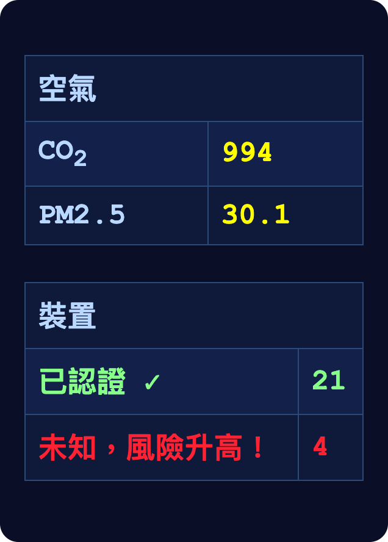
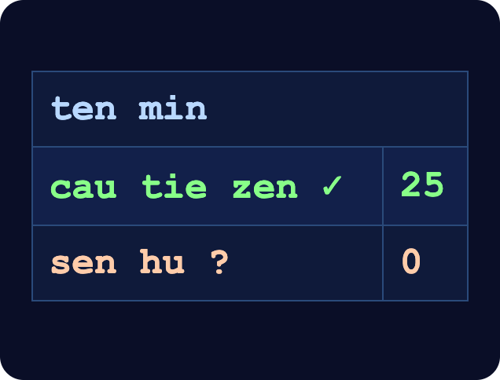
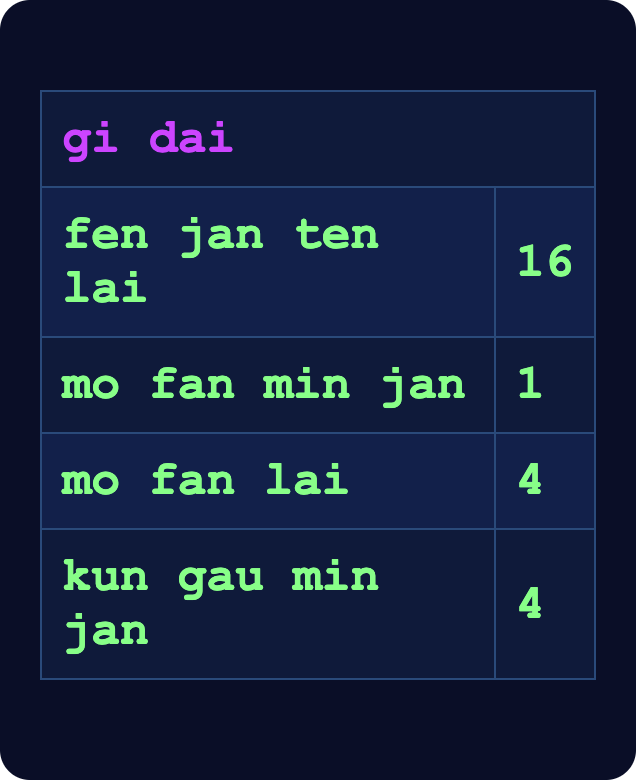
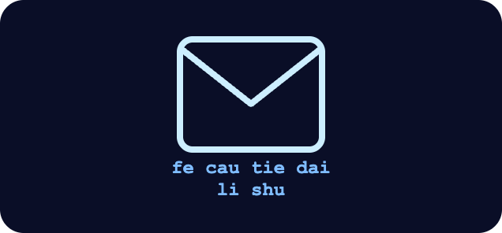
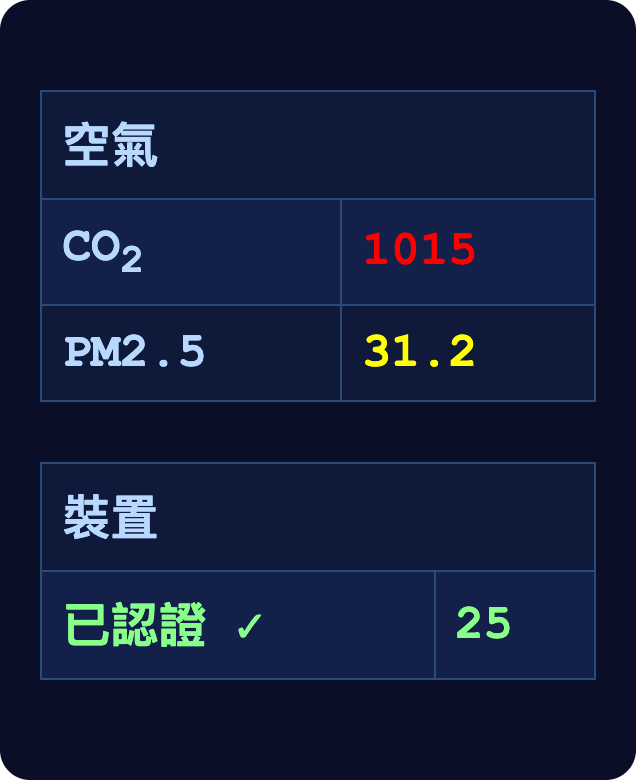
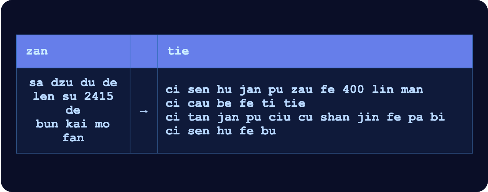
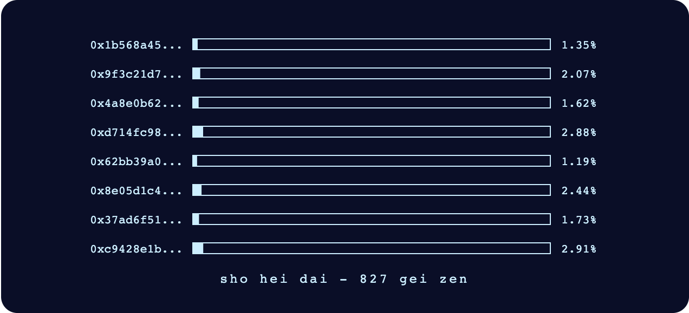

# 第十九章

哲戈，帕佛蓋都·3724 年葡萄季 15 日

格拉迪亞斯和澤坐在一張桌子旁。這間餐廳在山體金字塔深處。

一面牆上掛著兩塊大螢幕，竭盡所能地假裝成窗戶：畫面上是帕佛蓋都的景色，好像餐廳蓋在山頂上，而不是在地底下三十公尺。

「你說要介紹我認識的那個人，再說一次是誰？」格拉迪亞斯問。

「鄧。昆高派最高議會成員。你不是想多了解哲戈的體制嗎？這十年來一直替我們擋下北極暗中攻勢的組織，他就參與管理。你要讓維瑞迪亞學的是他，不是我們的官方政府。」

這時傳來一陣微弱的嗡嗡聲，很快就越來越響。幾乎馬上，幾架小型無人機就飛進了視線——跟明盤台錦標賽上檢查澤有沒有帶作弊裝置的那種很像。

格拉迪亞斯的手錶震了一下。

「怎麼了？」澤問。

「喔，我的手錶好像把那些無人機當成威脅了。這幾天它一直這樣，我猜只是還沒更新。」

「啊，我看看我的。」澤說。

他拿出自己的手錶。

他點了綠色那一欄，往下捲著看。

「呃……我來試試看。」格拉迪亞斯盯著手錶，看得很專心。

「『mo fan』是吃飯的房間，所以跟餐廳有關。」

「對！」

「『min』是機器，『jan』是人，兩個合起來，我猜是……機器人？」

「對！」

「『kun gau』是……等等，這跟昆高派有關？所以這些是昆高派的機器人？」

「沒錯，可是『kun gau』是什麼意思？」

「那我猜是保全？」

「完全正確。」

「保全機器人。呼，一點都不難嘛！」

「你該慶幸我不是汾。換成他，會花上半個長時把整個介面從頭講一遍：每個字是怎麼來的，當初縮減字彙時又為什麼把它留下來。」

其中一架機器人嗡嗡地飛近格拉迪亞斯，停在他右耳旁大約半公尺的地方，懸在那裡。

「話說回來，為什麼我一直偵測到這麼多有敵意的裝置？是我的手錶有什麼東西還沒更新嗎？」

「啊，對，那只是每一盞燈、每一架無人機、每一台攝影機都在報上自己的身分。這幾天協定加強了很多，你的手錶只是還聽不懂這套語言。來，我幫你弄。」

澤接著壓低聲音說：

「jo sun fe zin ten lai de cau tie dai」

大約一拍之後，他的手錶震了一下，表示資料已經收到。

澤把手錶湊到格拉迪亞斯的手錶旁邊。

「be」

兩支手錶同時震動，表示連上了；一個檔案從一支傳到另一支。格拉迪亞斯按下手錶上的按鈕，接收檔案。

接著他又看了一次手錶。

「看起來沒問題了！」

「咦，你的手錶連 CO2 和 PM2.5 也會測？」

「對啊！這在維瑞迪亞很普遍。我們很在乎環境乾不乾淨。我們每天要吸進十二公斤的空氣，比吃的喝的加起來還多。說起來，空氣有多重要，我們其實全都低估了。」

「為什麼要測 CO2？我們的手錶也有空氣感測器，不過主要是偵測煙霧和毒物。」

「我們大氣裡的二氧化碳，平均濃度是 300 ppm；我們呼出來的空氣是 40,000 ppm。所以，如果你吸的空氣有 700 ppm，要嘛是有別的來源把多出來的 CO2 帶了進來，要嘛——這個可能性比較大——你吸進去的空氣裡，有百分之一是別人呼出來的。而氣溶膠微粒什麼東西都帶，會在空氣裡停留很久——尤其是經由空氣傳播的病毒。」

「喔，原來如此。所以根本不是工業汙染的問題。」

「其實我很意外，你們在這方面還沒跟上，這裡的 CO2 數字也這麼差。我還以為從國防的角度，為了預防大流行病，你們會很在乎這件事。」

「啊，這個你等鄧來了再問他吧！」

一個機器人送餐來了：格拉迪亞斯的是沙拉和茶，澤的是一盤鋪滿蘑菇的蔬菜飯，外加一杯茶。

「等等，你吃的那道菜——我覺得那根本就是我們哲戈餐車上的十號餐！」格拉迪亞斯驚呼。

「要不要吃吃看？我很樂意拿你的沙拉來換。告訴我，跟你吃慣的那個版本比起來怎麼樣。」

「好啊！」

兩人換了盤子，吃了起來。

「好，這比我們在維瑞迪亞吃到的好吃太多了。」格拉迪亞斯興奮地說。

他們默默吃了幾分鐘。吃完以後，改喝茶。

澤的手錶又震了一下。他看了看手錶，眼睛睜得大大的。

「怎麼了？」格拉迪亞斯問。

「一則訊息，是薩祖都一座庭園發來的，我以前在那裡吃過一次。這真的很怪。看起來是直接寄給我的。」

「那座庭園怎麼會知道你在那裡吃過？付款用的是吉普幣，完全匿名。」

「沒錯。庭園好像把它寄給了過去半年來的*所有*客人，上面還帶著某種標籤。我的本地 AI 收下了；其他人的，幾乎全都過濾掉了。」

「上面寫什麼？」格拉迪亞斯問。

「發訊地點是薩祖都連蘇街 2415 號的美植美食街。有個匿名的人燒掉了四百吉普幣，就為了發這則訊息。訊息信封上只寫了收件人『是成功人士』，今年 18 歲。除此之外，我什麼都不知道。」

「這個描述……拿捏得還真準。」

「確實。範圍要劃得夠寬，才能確保裡面一定有我。燒掉四百吉普幣，是在告訴庭園、我們的本地 AI，也告訴我們本人：這則訊息值得花心思弄懂。可是範圍也得劃得夠窄，這次廣播*才*能只花四百吉普幣就辦到。」

「也夠窄，不會有太多人發現這則訊息。」

「好，我打開來看看……」

澤又瞪大了眼，一臉震驚。

「怎麼了？」

「訊息是一連串檔案連結，加起來超過六十 GB。看來其中八成我都得下載。」

「要下載很久嗎？」

「用無線的話，大概一天。不過這座山體金字塔裡的數位典藏節點，看起來已經有足夠的檔案了。」

「那我們乾脆直接走過去？」

「我正是這麼想。」

澤把手錶貼上桌角的綠色圓圈。片刻後，手錶震了一下。他站起身，格拉迪亞斯也馬上跟著起來。

兩人走出餐廳，沿著四通八達的隧道往前走。

------------------------------------------------------------------------

幾分鐘後，他們來到一扇裝飾華麗的大門前。

門的左邊畫著一隻河馬，正在看書；背景是一片沼澤，長著綠樹，再遠是藍天。門的右邊畫著一隻倉鼠，坐在電腦前。兩幅畫都帶著卡通式的俏皮，又透出一股嚴肅的神祕感，兩者之間拿捏得恰到好處。

門頂上有一句標語，澤看得懂：

mu fu bau hai ka sha liu li dzai hen ji cin jan fe jan

ci mu fu bau fei ka zen die jia cu can hu fe lo kin liu

「在狗之外，書是人類最好的朋友。」澤替格拉迪亞斯翻譯。「在狗之內，太暗了，沒法讀。」

兩人穿過大門，走了進去。

左手邊整面牆就是一座大書架，大約五公尺高，擺滿了實體的紙本書。書架的上半部往後縮了大約一公尺，下半部的頂端就成了一條走道，可以站在上面看上半部的書、從架上取書。

上層有兩處開口，各自通往一條小隧道，兩壁也排滿了書。下層有一處開口，裡頭同樣兩旁都是書。三個開口看起來都往裡延伸了三到六公尺，接著就轉了彎：一條書廊向右轉九十度，一條向左轉九十度；第三條，也就是下層那條，則變成一個 T 字路口。

格拉迪亞斯心想，看起來，這片書區是刻意蓋成迷宮的。

右手邊是一片開放空間，擺著桌子，沿牆有許多電腦終端機。

桌區前方有一位穿著長袍的女性。澤一看見她，馬上跑了過去。

她轉過身來。

「歡迎來到帕佛蓋都大圖書館。你們在尋找什麼呢？」她問。

「典藏裡有幾個非常大的檔案，我想載下來。」

館員笑了。

「真高興你這麼老實。」她說。

「大部分人都跟我說，他們想學點歷史、文化或數學之類的高尚學問，結果我一沒盯著，他們就跑去下載電影了。」

「呃，我不是要下載電影，比較像是……一則神祕的訊息。」

「啊，一場探險！就算最後只是個藉口，那也是我今天碰到的新鮮事，挺有意思的。好，跟我來吧。」

澤和格拉迪亞斯跟了上去。

「所以你收到一則神祕訊息，叫你下載一些大檔案？知道是哪一類的嗎？」

「呃，目前我只看到一些雜湊值……」

他們走到一台電腦終端機前。館員拿出一條傳輸線，把一端插進終端機。

「來，另一端插到你的手持裝置上。」

澤照館員說的做了。下載幾乎立刻就開始了。

「哇，只要八分鐘！」

「我們這些老古板館員老是說，實體空間對追求知識終究還是很重要。這下你也許比較聽得進去了吧？」

一個機器人滑到他們面前。

「jie hei ja ma?」

螢幕上出現一份菜單：沒有吃的，但有幾種飲料可以選。

格拉迪亞斯馬上按了按鈕，點一杯茶。澤也跟著點了一樣的。

「這裡真美。很高興你們有這樣一個地方。」

格拉迪亞斯起身走到書架前，一本一本翻開了幾本。

他這會兒沒心情絞盡腦汁去讀、去解讀哲戈語。舊書用的是早期版本的哲戈語，那更是一個字也看不懂。所以他專看裡頭的圖表和插圖。

兩分鐘後，機器人滑到他身邊，把茶交給他。茶裝在密封杯裡，只能用吸管喝。

格拉迪亞斯很意外，轉頭去看澤。澤坐在一張離所有書都很遠的桌子旁，已經拿到了茶。他的杯子是開口的，茶要是灑出來，幾乎沒什麼擋得住。

格拉迪亞斯找到一本講哲戈建築的書，書名叫「zui fia pai dan」。他翻了翻，裡頭有許多設計圖：地下室、避難所，還有山體金字塔內部的地下房間。整本書大致照時間順序排，從百年前與北極帝國那場戰爭後不久開始。

早期的設計在構造上非常實用，幾乎沒考慮舒不舒適，甚至連非人為的威脅都沒怎麼防。

中期的設計開始像普通的房間了，最明顯的例外是沒有窗戶。

到了書的最後面，設計都裝潢得很講究，住起來很舒適，甚至比地面上的建築還舒適。其中大約一半裝了仿窗，假裝外面就是戶外。另一半沒有窗戶，改擺植物、裝飾精美的牆面，還有其他看得出是精心挑選的物件，讓住在裡面的人看不到任何會讓人覺得「這裡應該有扇窗」的空間。

「格拉迪亞斯！」澤大喊。「快回來，快好了！」

格拉迪亞斯轉身走回去。他一走到，最後一條進度條就跑到了 100%。另一個視窗自動開啟，一段腳本開始執行。螢幕上寫著「正在重建資料……預估剩餘時間 175」——不是哲戈語。

格拉迪亞斯和澤啜著茶，盯著倒數的計時器。館員很好奇，靜靜地在他們身後大約兩公尺處徘徊。

果然準時，不到兩分鐘，腳本就跑完了，螢幕上出現一個畫面。

澤盯著畫面。

「跟鄧的會面改到明天吧。我有預感，這件事沒那麼簡單。」

格拉迪亞斯點點頭。

「你要回答嗎？」

澤在手持裝置上按了幾下。「我把這個程式關進沙盒了，用的是日誌式檔案系統。它連不上網路，我也隨時能把它還原到起點。所以沒有隱私外洩的風險；結果要是不滿意，還原重來就好。那何樂而不為？」

「好……我火月 10 日做了什麼來著……還是說，直接問手持裝置就好。」

澤那一天的生活紀錄跳了出來。

那天他打了最後一場明盤台比賽，是對君的準決賽——也是他的生活至少還算正常的最後一天。賽前，他起床後和白見了面；賽後，他和德盧因約在庭園碰面。

等等，澤心想。那座庭園……地址是什麼來著？

他查了一下。

正是當初那則訊息發出來的同一間餐廳。

用他的本地 AI 最愛說的話，這就是「笑點」。

澤開始打字。他照著 AI 的紀錄，再加上迅速湧回來的記憶，回想人生中的那一天。

起床。

和白見面。

去比賽。

等比賽。

打比賽。

看德盧因的比賽。

賽後和德盧因簡短聊了幾句。我那時說了什麼來著……「我的打法比你難看。不過我也是靠防守贏的」

然後，才是在庭園和德盧因碰面這件事。光是這一段，澤寫的篇幅就跟那天其他事全部加起來一樣多。

機器人。替哲戈語新提案的象形文字做 A/B 測試。

德盧因邀他去紅郡。他拒絕了。德盧因給他看紅郡的照片。

德盧因講到，一個地方的自然美不美，其實多少說明了那裡的文明。

最後是德盧因那句半開玩笑的逗弄：「我會用我的冠軍獎金替你出旅費。」

全部打完，澤按下「送出」。

「好，所以這是語言模型。可是資料重建完，那個檔案有多大？」

「10.7 GB。額外開銷剛好六倍。我開了一個背景執行緒去查這些檔案的來源，全都是最近才上傳的。六分之一是幾部最近的電影，屬於公開資料——不過當然，*他們選了哪幾部電影*，本身就算是某種祕密金鑰。另外一半是一大堆某個人的健康資料。最後三分之一也是影片，不過看起來是 AI 生成的，全是北極的說教，講維瑞迪亞和哲戈文明在根本上有多大的缺陷。」

「重組演算法是六取五抹除碼，由五份片段組成，每份 10.7 GB。每一份又各自做了隱寫編碼：他們用語言模型找出哪些位元可以翻轉，讓資料看起來仍然合理，同時把真正的訊息編碼進去。比率訂得非常大膽，每四個位元的密文就承載一個位元的明文。至於那些電影，算是某種密碼本：要是不知道用的到底是哪幾部，就算能把明文完整還原出來，看到的也只是一堆隨機資料。」

「等等，如果他們要的是密碼本，拿一些資料反覆做雜湊，偽隨機地產生一個不就好了？」

「啊，其實你說得對。也許是我想太多了。他們這樣做，也許只是為了混淆視聽。」

「好，所以這 10.7 GB 到底是什麼？」

「它不是明文的語言模型，是經混淆的語言模型。二級混淆。DU、班順派，乃至掌舵會，投票用的密碼學網路採用的都是完整的密碼學等級參數；這個的參數比那弱得多，但演算法還是同一套。」

「對語言模型來說，二級混淆其實是正確的取捨。一方面，語言模型本身又大又吃運算，承受不了四級那麼高的額外開銷；另一方面，語言模型自己本來就至少有一部分是混淆的，也能抵抗位元翻轉。就算你挖出幾個權重的值，或者有辦法穩定地翻轉幾個張量裡的幾個數值，也從中弄不到什麼有用的東西。」

「二級混淆的額外開銷，大小上是幾十倍到一兩百倍，運算上是好幾百倍到一兩千倍。所以這個模型非常小；我猜寄件的人把它微調過，只讓它做這一件事。我也覺得，這個語言模型的包裝程式，也就是被混淆的整個套件，是一口氣把思考全部做完，好驗證我的答案能不能讓它滿意。可以的話，它最後就會直接把訊息交給我們。」

彷彿算準了時機，澤的手持裝置震了一下。

程式執行完畢。螢幕上出現一則新訊息：

