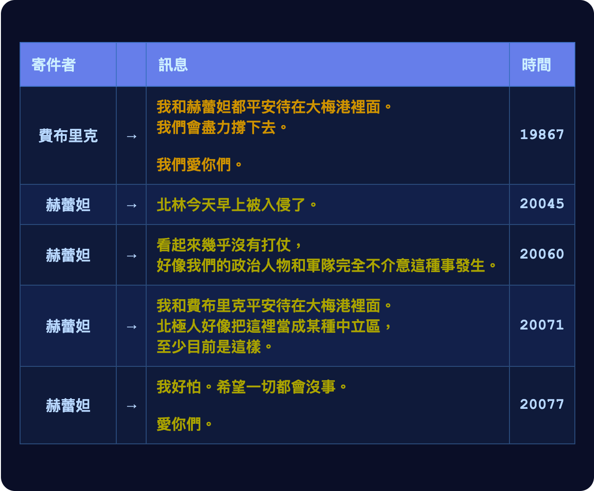

# 第二十章

維瑞迪亞，梅爾丹·3724 年霧季 10 日

手錶的鬧鈴嗡嗡作響，賽菈醒了過來。

手錶閃著刺眼的紅光。是翡翠傳來的訊息——這種訊息，她從來沒見過。

她立刻坐起來，打開手持裝置，想把新聞看個仔細。

目光一落到頭條上，她的心臟差點停了。

> 北極帝國入侵北林

北林。費布里克和赫蕾妲就在那裡。

不……

她繼續往下讀。

> 今晨 5,250 拍，北極士兵、飛行載具與無人機自四面八方降落北岸省。
>
> 維瑞迪亞軍隊幾乎未作抵抗。兩長時內，北極的士兵與無人機便已進駐北林。
>
> 目前全區已完全落入北極控制，唯一的例外是北林境內的大梅港。北極方面並未碰觸大梅港，目前似乎將其視為某種中立區而予以尊重。數百名難民湧入大梅港，其後北極設下路障，阻止更多人進入。另有難民試圖搭乘個人旋翼機進入，約半數成功，尤以第一個長時內為多；其餘遭到擊落。
>
> 除大梅港外，北林與維瑞迪亞其他地區之間的網路通訊均已切斷。大梅港與北林其他地區之間的長距離傳輸避開了干擾機制，目前是與北岸省雙向通訊的主要管道。
>
> 北岸省在地政治人物與北極官員皆尚未發表任何公開談話。據我們最新掌握的消息，入侵發生時，北極帝國駐維瑞迪亞領事艾費里昂勳爵人在北林。我們正等待進一步消息。

她把手持裝置往下捲。翡翠另外標出了五則訊息——它認為這幾則對她非常重要。

賽菈開始打字回覆。她告訴費布里克和赫蕾妲，訊息她收到了；她和維爾、黛亞會盡一切努力，帶他們回家。

字還沒打完，她就哭了起來。

------------------------------------------------------------------------

一個長時過去，門口傳來敲門聲。她走到門邊，從螢幕上看見門外站著一個穿隱私袍的男人。

「你是誰？」她問。

「我是莫夫。格拉迪亞斯跟我很熟。」

「我憑什麼相信你？」

男人對著頸帶低聲說了幾個字，接著舉起手持裝置，貼上屋門旁的綠色圓圈。賽菈的手錶震了一下。

賽菈小心翼翼地開了門，讓他進屋。

莫夫脫了鞋，立刻往地下室走。地下室在這屋子的哪個位置，他一清二楚。賽菈跟在後面。

兩人都坐了下來。

「維瑞迪亞現在這個樣子，我越來越擔心了。」

賽菈面無表情地看著他。她沒想到，這麼毫無用處的廢話，竟然也有人說得出口。

「我說的不是北林被入侵。那件事真的很震撼，太可怕了。費布里克和赫蕾妲人在那裡，我真的很遺憾。希望他們平安。」

「他們沒事。北極人不知道為什麼，一直沒去碰那裡的大梅港，費布里克和赫蕾妲及時躲了進去。」

「那你是指什麼？」

「我是說，北極人為什麼入侵得了，又為什麼幾乎沒遇到抵抗就成功了。造成這些的每一個因素，在維瑞迪亞其他地方也一樣存在。」

「這種事，我平常會找格拉迪亞斯談。可是他這幾天都忙著跟哲戈祕密政府的人開會，過去這幾個長時又在睡覺。所以我才想來找你談談。」

「你以為我知道什麼？我們的政治人物顯然是被收買了，或是被勒索了，或是根本不在乎，或是以上皆有。掌舵會的事，格拉迪亞斯不太跟我談，畢竟他本來就不該談。」

「那也許換我跟你說說我知道的。我一直在跟蹤德爾瓦特，就是這幾個月常跟格拉迪亞斯見面的那位神祕先生。他找的不只格拉迪亞斯，還有其他好幾個守律者，人脈好像相當廣。」

「有一次，在我跟丟他之前，我撞見他跟一個銀聊的人開會。後來格拉迪亞斯跟我說，他當面質問了德爾瓦特，德爾瓦特也承認，自己一直都在替銀聊工作。」

「銀聊？他們在搞什麼大動作，想腐化掌舵會？為什麼？這種事要是藍鯨做的，我還不意外，可是銀聊一直都是好人那一邊的！再說，這跟北極人又有什麼關係？」

「我覺得，我們的社會就是變得太安逸了。每個人都只顧著守住自己的幸福日子，能撈到什麼好處就撈；真正讓維瑞迪亞運作下去的那些東西，卻沒人把維護它們當一回事。連銀聊也一樣。更糟的是，守律者好像根本沒在提防這種事。」

「掌舵會的表現，好像還比我們其他任何體制都好。軍方在北岸省的防禦上徹底失敗了。就我看來，守律者已經盡力了。稅務規準甚至改得更支持開源國防硬體，至少這件事格拉迪亞斯跟我說過。他對這件事非常自豪，我也是。」

「是啊，不過那次真的是驚險過關。當初把守律者分成三個彼此不能交談的小組的那個人，真是天才。不然，德爾瓦特可能三組都搞定了。」

「這件事有哪裡不對勁。銀聊……他們就是不像會做這種事的人。」

「我知道你從小就愛銀聊，理由跟格拉迪亞斯一樣。我也是。可是有時候……你心目中的英雄，到頭來並不是英雄。也或許銀聊根本不在乎那條規準，純粹是德爾瓦特自己這個人就是極端鴿派。」

「德爾瓦特找過的其他守律者，你認識哪一個嗎？我們能找他們談談嗎？」

「其中兩個，我在他們身上裝了追蹤器。我本來大可以向密碼學網路告發他們，領一大筆賞金，可是……我想，留著繼續追蹤他們的選項比較好。」

「我們能找他們談嗎？」

「應該可以吧。」

「那我們去拜訪他們。現在就去。」

「你今天不想先專心想想，能為費布里克和赫蕾妲做些什麼嗎？」

「我也許是個擔心得要命的媽媽——呃，應該說阿姨——可是我知道自己能做的不多。我已經跟他們通過話了。他們按兵不動，我也按兵不動。要從北林來一場大逃亡，我不覺得我們或他們會比那一百個想飛進大梅港、結果被擊落的人更有本事。所以，按兵不動就是計畫，今天也沒別的事能做了。可是掌舵會到底出了什麼事，要搞清楚這個，我今天就做得到。」

她嘆了口氣。

「大概是覺得自己非得*做點什麼*不可吧。而這件事，我做得到。」

莫夫點點頭。

「只是別搭小型旋翼機。你可能會覺得那樣比較快，覺得*這一次*付那高得離譜的噪音稅也值得，可是那只會讓人注意到你。」

「放心，我本來就沒打算搭。」

一輛計程車到了。賽菈穿上格拉迪亞斯的一件隱私袍，和早已穿好隱私袍的莫夫快步走向車子。她先到了車門邊，把手錶往門旁的綠色圓圈一貼，同時完成兩件事：車門打開，付款也以密碼學方式核准了。兩人上了車。

計程車開動了。他們要去的地方，離另一位守律者的住處只有一小段自駕巴士的車程。

------------------------------------------------------------------------

二十分鐘後，他們來到一棟公寓大樓前。大樓是新蓋的，外牆包著一層某種仿石材料。一樓開著餐廳和店家，賣的東西五花八門。再往上，從外面看只有一扇扇住家的窗戶，間隔整齊，裝飾得很講究。

他們看見另一個男人朝大門走去，正準備進門。兩人立刻放慢腳步，好讓自己看起來是很自然地緊跟在他後面走到門口。

男人到了門前，把手錶貼上門旁的綠色圓圈，門就開了。他走進去，門還沒關上，賽菈和莫夫也跟了進去。

「他住 515 號房。」莫夫說，「我們直接走樓梯上去吧。」

「你怎麼知道？」

「靠我在他身上裝的追蹤器。」

兩人走樓梯上樓，最後總算來到 515 號房門口，敲了敲門。

門內傳來腳步聲。

莫夫拿下隱私袍的兜帽，讓自己看起來沒那麼有威脅性。他照理說不該認識這個人，也就拿不出什麼能證明自己值得一談——硬要說的話，大概只能在對方門口燒掉一百吉普幣。

賽菈也拿下了兜帽。

男人直接開了門。

「你好？」

「你好，我是賽菈。我知道這很尷尬，不過我們想談談掌舵會和德爾瓦特的事。」

男人睜大了眼睛。

「很高興認識你，賽菈。」

「我是莫夫。」

「我是泰爾羅伊。不過……既然你們知道我在掌舵會，也知道德爾瓦特的事，說不定連這個也早就知道了。」

莫夫這時才發現，從某個意義上說，他早就在泰爾羅伊門口燒掉遠不只一百吉普幣了。他手上的資訊，顯然足以向掌舵會的密碼學網路告發泰爾羅伊的身分、領一大筆賞金——而他選擇不這麼做。

莫夫和賽菈進了屋。泰爾羅伊請他們在沙發坐下，動手替三個人泡茶。

「所以，關於我和德爾瓦特，你們知道多少？」

「你是守律者，在資安規準小組。正在辯論的規準裡，有一條和環境感測器的資料保存有關。你至少見過德爾瓦特一次，只是你們談了什麼，我沒能聽到。」

「好吧，你們確實知道不少。德爾瓦特跟我談的時候一直很堅持：最近那股盡量減少資料蒐集的風潮其實不合理，等於是對一個根本不存在的敵人疑神疑鬼。不過現在，他大概已經改口了吧。他跟我主張，更重要的資訊威脅是內線交易，那才是該防範的。」

「他還說，地方的環境與公共安全機關需要廣泛的存取權，情勢一變才能迅速因應，不必每次都去請求許可。至於我們真正需要的隱私防線，主要就是把他們存取非疾病相關資料的時間延後五到十天，讓他們沒辦法拿來交易。」

「這……和格拉迪亞斯跟我說的那個德爾瓦特，完全不像。」

「他還說了別的嗎？」

「就像我剛才說的，他大致上反戰——他自己是這麼形容的。除此之外，他沒說太多。他主要的看法是，大家想把各種密碼學都塞進來，把事情搞得太複雜了；我們應該多信任人一點就好。」

「好，現在換我好奇了——你們認識的德爾瓦特，是什麼樣的人？」

「他反戰，重視每個人過自己生活的自由，希望掌舵會少管很多事——連用稅輕推，他都嫌太多。不過最特別的是，他非常反對某條稅務規準的修改——」

莫夫頓了一下。

他這才想到，賽菈已經主動說出了格拉迪亞斯的名字。要是再說下去，他給出的資訊可能讓泰爾羅伊推出*格拉迪亞斯*負責的規準，去告發他、領賞金。

但他轉念又想：泰爾羅伊信任他和賽菈，他們至少也該拿出一點信任來回報。

「開源硬體的那條規準。他認為只要跟軍事有關，都不該享有稅務優惠。因為軍事是零和賽局，我們參與其中，對世界沒有任何好處。」

泰爾羅伊點點頭。「看來他真的是反戰。」

「可是後來我又跟蹤了他一陣子，紅郡被入侵之後，格拉迪亞斯也當面質問了他。結果……原來他一直在替銀聊工作。」

泰爾羅伊驚訝地瞪著他。「銀聊？」

「這……真讓人意外。」

------------------------------------------------------------------------

賽菈和莫夫下了計程車，沿著卡利馬區那條林間小徑往前走。涼爽的微風從背後輕輕吹來，兩人不知不覺越走越快。

走了幾百公尺，他們離開小徑，往右轉。再走三十公尺，眼前是一棟大半埋在地下的石屋，露出地面的部分只有一公尺高。人只要站在幾公尺外，就幾乎看不見這整棟建築。

美觀、開放通行和緊急避難功能，一次全拿高分——這倒也是個辦法，她心想。這棟房子大概幾乎不用繳土地稅。

兩人走下一段樓梯，敲了門，再把隱私袍的兜帽拿下來。

接著是腳步聲。

「是誰？」一個女人的聲音問。

賽菈悄悄踩了莫夫的腳趾一下，要他別出聲。莫夫會意，往後退了一步。

「你好，我是賽菈。我知道這很尷尬，不過我們想談談掌舵會和德爾瓦特的事。」

門立刻開了。

「你好，我是芭爾梅。請進。」

「我朋友莫夫也一起進來，可以嗎？」

賽菈感覺得到，芭爾梅有點不自在。現在變成二對一，莫夫的體格又比較高大，看起來更有壓迫感。可是門都已經開了，這時再當著他們的面關上，說好聽點也是非常尷尬。

「好啊。」她輕聲說。

賽菈和莫夫都進了屋。

「很抱歉這麼冒昧跑來打擾，還暗中查了你的行蹤，才找到這裡。希望你能原諒。你也看得出來，我們的國家現在處境很危急。」

芭爾梅點點頭。

「你對德爾瓦特了解多少？」

「我見過他幾次。第一次說上話，是在一場守律者會議結束大約一個長時後，他傳了一則匿名訊息給我。我不知道他是怎麼找到我的。我在私立學校的規準小組。他講了很多自己對教育的看法。他覺得我們不該在秤上動手腳，不該用稅務規準去鼓勵他所謂偏頗的公民教育，就是那種一直講維瑞迪亞有多美、鼓勵學生珍惜它、愛它的教育。他認為學校只要教知識就好；學生自己看到維瑞迪亞有多好，自然就會愛它。」

「他還有別的看法嗎？」

「他大致上是支持自由的。他認為應該讓人自己去發展，事情自發、自然地發生，結果通常最好；掌舵會不該那麼常在秤上動手腳。」

「有提到國際政治嗎？」

「沒怎麼提，他從來沒講過這方面的事。他好像不在乎。」

「他倒是問過我一次，覺得 Dreadknot 怎麼樣。我說我不太喜歡他們。他沒回應，就換了話題。」

賽菈點點頭。

「我認識的德爾瓦特也關心自由，也覺得掌舵會應該少管很多事。可是……他對國際政治也確實有很強烈的看法。基本上，他認為凡是跟軍事有關的都是零和賽局，你不可能知道怎麼做會帶來好結果、怎麼做會帶來壞結果，維瑞迪亞應該完全置身事外。」

「不過……在自由這件事上，他的立場好像又比較兩面。他似乎不介意公共安全機關蒐集更多資訊，也不介意不用密碼學把關：不設法限制資料蒐集，也不去保證資料用在什麼目的上。」

芭爾梅一臉驚訝，眼睛睜得更大了。

「等一下，我很好奇，這種事要怎麼用密碼學來做？」

「我有個哲戈的朋友叫澤，他跟我講過一次。基本上，攝影機裡面裝了一個語言模型，負責偵測是不是正在發生什麼事，比方說暴力行為。只有真的發生了，它才會把資訊傳出去。而每傳一次，它都會往密碼學網路上傳一個雜湊值，所以這個檢查一共被觸發了幾次，大家都看得到公開的紀錄。」

「另外，他們還有一整套基礎設施，用來驗證硬體確實在執行那段程式碼。靠的是金鑰的簽章；那些金鑰是在晶片製造當下，由製程中的化學瑕疵在晶片內部隨機產生的。據說還有一條規定：任何人都有權隨機拆下一台攝影機，拿去做顯微檢驗。很多人把這當嗜好在做，所以沒有哪家製造商能做出作弊的攝影機而不被抓到。」

「這……聽起來太棒了。密碼學完全不是我的專長，可是……真正能信任的攝影機，這太合理了！等等，可是德爾瓦特那麼支持自由，怎麼會還不知道這種東西，還不大力支持？」

「我也想不通。」

賽菈停了一會兒。

「好，我知道這個問題來得有點突然，不過——你有沒有認識哪個守律者，是在社群媒體相關規準小組的？」

「我是有幾個守律者朋友，但我不敢問他們在做什麼。這是我們的傳統：要等三年做完、換到別的規準小組之後，才會公開談自己做過的事。」

「你能不能……幫我轉一則訊息給他們？我現在就寫給你。也請你跟他們說，這則訊息值得回。」

芭爾梅想了一下。賽菈，還有她那個到現在一句話都沒說的朋友，值得信任嗎？她問自己。直覺告訴她：可以。

「當然。」

------------------------------------------------------------------------

賽菈走到一棟房子門前。這棟房子跟她和格拉迪亞斯住的那棟很像。

這一次，莫夫完全留在後頭，沒有跟過來。他心想，賽菈一個人去，似乎更容易取得對方信任，那不如就讓她自己問。真有需要，他再透過耳機提示她該問什麼。

賽菈敲了敲門。

沒有回應。

過了一分鐘，她再敲一次。

還是沒有回應。

屋裡有腳步聲，可是聽起來，似乎不是朝門口走來。

手錶震了一下，跳出一則通知：

莫夫……她心想。她知道，屋裡不管是誰，都會看到同一則訊息，也就知道她是認真的。

賽菈第三次敲門。

腳步聲又響起，這次是朝門口來的。

「你要做什麼？」

「你好，我是賽菈。託芭爾梅和泰爾羅伊轉那則社群媒體規準訊息的，就是我。我想跟你談談。」

男人開了門。

「我是列克托比，在社群媒體開放性規準。」

「抱歉，剛剛沒開門。我太太困在北林，我今天心情很糟，實在不想跟人說話。」

賽菈點點頭。

「我是賽菈。我懂。我的孩子也困在北林。」

「那你幹嘛燒那些吉普幣？請芭爾梅先跟我說一聲你要來，不就好了。」

莫夫……賽菈在心裡氣得要命。他為什麼就是這麼沒耐性？

「對不起，我只是真的走投無路了。」

列克托比示意她進屋，賽菈跟了進去。兩人坐下。

「好，到底是什麼事？」

「過去一年左右，有沒有哪個奇怪的男人試著聯絡你？或是聯絡你規準小組裡你認識的其他人？」

「嗯……沒有，從來沒聽說過這種事。」

「能不能請你……直接在你們規準小組的聊天室問問看？我想確認一下。」

「*你*遇過這種事？」

「我先生遇過，芭爾梅也是，還有不少人。那個男人的主張都很強烈，可是好像會看談話對象而改變。有時候他反戰，有時候又不是；有時候他反對掌舵會干預任何事，有時候又不是。」

列克托比對著頸帶低聲說了幾句話。

「等我的守律者小組看他們怎麼說吧。」

他站起身。

「要喝點茶嗎？」

「好啊。」

列克托比走進廚房，替自己和賽菈燒水。

「你孩子的事，我很遺憾。北極這整件事真的……太瘋狂了。先是紅郡，現在又來這個。感覺他們在換檔加速，再過個一兩年，就會發動一場大戰，把全世界都拿下。」

「說不定更糟，用不到一年。他們拿下北林，看起來又是沒有人肯動一根手指頭。我來的路上看了參議院聽證會，一堆作秀式的憤慨，沒有行動，也沒有人反省我們是怎麼走到這一步的。」

列克托比嘆了口氣。

他端來兩杯茶，一杯自己的，一杯給賽菈。兩人坐下，默默喝著。

二十分鐘後，列克托比身子往前一傾，賽菈的注意力轉到他身上。

「他們都回了。」他說。

「然後呢？」

「都沒遇過。有一個人說，他在另一個規準小組的朋友遇過。可是這個規準小組裡，一個都沒有。」

「這……太奇怪了。」

「也可能只是巧合，可是……」

「怎麼了？」

「你們這個規準小組，管的是社群媒體開放性與互通性，對吧？」

「沒錯。」

「德爾瓦特應該是銀聊的人。可是銀聊最該在乎的，就是這個題目，結果……這條規準他完全沒有下手？」

「我再說一次，這也可能只是巧合，可是……」

她站了起來。

「等等，到底怎麼回事？」

她知道莫夫會希望她先離開，好私下跟他對一下資訊。可是列克托比信任了她，她覺得公平起見，自己也該信任他。

「銀聊的人，為什麼會在乎維瑞迪亞的學校公民教得好不好？銀聊的人，為什麼會那麼反戰？銀聊的人，怎麼會那麼有本事把守律者找出來？還有……銀聊的人坐在那個位置上，為什麼對銀聊最在乎的那條規準連一點力氣都不花？銀聊在開放性和互通性上做得這麼好，要拿到應有的獎勵，就看這條規準了啊。」

不過到了這時候，賽菈其實早就知道答案了，這只是最後確認的那一根稻草。她一邊站起身，拿起手持裝置準備離開，一邊想：把結論脫口說出來，也無妨。

「德爾瓦特不是銀聊的人。」
