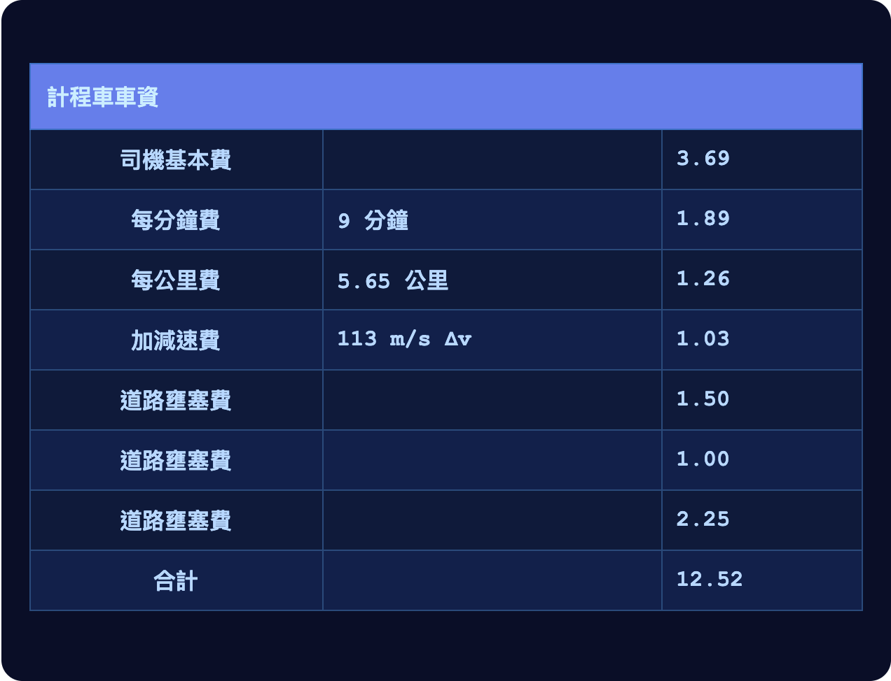

# 第二十二章

聯合城邦，自由城·3724 年霧季 22 日

楊恩坐在計程車上，看著窗外。外頭還是自由城一貫的樣子，各種建築亂糟糟地混在一起：玻璃鋼骨的、水泥的、石造的都有；有高有矮，有的漂亮，有的醜。

計程車從一條高架道路底下穿過。路邊堆著一堆堆沒人收的垃圾。

一過高架，幾乎馬上就經過一座小公園，在左手邊；右手邊則是一棟高大的工業建築。那棟建築的牆上正投影著一部電影，還配了字幕。

楊恩又轉頭往左看，想找出影像是從哪裡投過來的。就在計程車快開遠、再也看不見之前，他找到了投影機——藏在公園的一張長椅底下。

就算沒有圖譜募資，也沒有規準，他心想，總還是會有人提供公共財。

大致看來，一切如常。只是楊恩隱約察覺，街上的人車似乎比平常少了一些。

計程車又鑽過另一條高架道路。過了高架，楊恩看見一棟建築側面掛著一大幅廣告。

> 購買豪華避難所房間，就在自由城中心區北緣。
>
> 地下 10 公尺，最高等級的物理、生物與資訊過濾及隔絕。
>
> 只要 325,000 吉普幣！

一分鐘後，又是一幅廣告：

> 平民也住得起的避難所，各種形式、大小應有盡有。
>
> 只要 50,000 吉普幣起，提供分期貸款方案！

計程車繼續往西，開進了廣告上說的那一區。

楊恩在這裡看到的，是修路。在他看來，過去半年來，這種景象一直有增無減。正在興建的避難所他也看過很多，不過修路緊追在後，尤其是城北一帶。

楊恩腿上的手持裝置震了一下。

「大哥，問你一下？」楊恩對司機說。

「怎麼了？」司機應了一聲。

「你知道這趟為什麼會有這麼多筆壅塞費嗎？路上明明比平常空很多，費用怎麼收得這麼高？」

「喔，那個喔。現在能漲的稅、能漲的費全都在漲，說是要充實國防。」

「哈，連路都要漲？」

「那你那邊還有被漲到什麼別的費用嗎？」司機問。

「其實不是政府，」楊恩說，「至少不是政府直接漲的。是避難所那邊。我聽到一些挺有意思的八卦。」

「什麼八卦？」

「最好的那批避難所，本來是幾家國防企業的。紅郡被併吞後沒多久，他們就聯手組了一個卡特爾。很多避難所空間就這樣賣掉換了錢，他們再拿那筆錢，把裝甲和武器大幅翻新了一輪。」

「哈，全都是私人公司啊？那我想就是人家的財產，人家說了算。比起乾脆用配給的，留給我們這些窮人的避難所空間是少了點，不過嘛，他們也是在努力。再說，他們要是拿那筆錢好好保護我們，我們到頭來根本用不著避難所的機會也就更大。還有，路上車子少了，我開起來也舒服多了。」

「嗯，是啦，這是好聽的說法，自由城經濟哲學的極致。不過我總覺得，事情沒有*那麼*乾淨。政府好像特別賣力在修路，修的偏偏就是那些讓人進出避難所更方便的地方。他們跟那些公司之間沒有任何勾結的證據——真有的話，法院一定會狠狠打下來。不過我的理論是，這算是一種事後獎勵：讓大家形成一種預期，你要是拿自己的私有財產去做對公眾有益的事，政府做公共工程的時候，就會往你方便的方向扭一扭。這是繞過預算上限規定的手法。付錢給人，卻不用真的直接付錢給他們。」

「反過來說，你要是不肯拿自己的私有財產做點有公益精神的事，那……情況真的變糟的話，下一步可能就是以『維修』為名，開始封掉幾條路。不過我想，大家總是可以用飛的。」

「大梅港一直拒絕資助任何可能被看成跟北極人作對的事，他們怕自己在北林的據點可能會被關掉。我想到時候就看得出來，自由城到底有多會守住它的『自由』。」

「還有多會保衛它自己。」

司機和楊恩都沒再開口，就這樣安靜了一分鐘。沒多久，計程車慢慢停了下來。楊恩往窗外一看，自由城經濟研究所到了。

「謝啦大哥，祝你今天順利！」

「你也是，老闆。」司機說。

楊恩推開車門，下了計程車。

------------------------------------------------------------------------

楊恩穿過自由城經濟研究所的旋轉閘門，往餐廳走去。

走了一分鐘就到了。他看見一張熟面孔——烏塔庫。

「烏塔庫！你還在這裡啊，真沒想到。」

「是我爸媽叫我回來的。他們覺得自由城看待國防比聯合城邦其他城市都認真，所以待在這裡比待在貝爾帕基安全。」

「你自己也這麼覺得？」

「最近是有一些動作，想在克城之間建立聯防網。要是真的成了，我會樂觀一點。可是就算成了，我還是擔心那比較像在作秀，沒什麼實質。」

「那自由城自己呢？有做什麼實質的事嗎？」

「嗯，大企業都替名下所有的資產保了險。紅郡被併吞的時候，費率變成原來的三倍；北林之後，又翻了一倍。後來企業公布了最近的國防方案，費率好像又回落了四分之一。」

「所以……不知怎麼的，市場誘因好像還真的有用。」

「跟你說，我最近常跟哲戈的澤聊天，才知道他們讓大家開始重視隱私的速度有多快。現在又輪到生物安全：一個月內，室內二氧化碳平均濃度就降了一百多點。這些全是靠一套機制協調起來的。據說那套機制原本是他們為了升級自己的語言才打造的——順便也給了我們一套合理得多的距離與時間制度。」

「我越來越覺得，只要大家接受它、相信它，說不定幾乎任何制度都能運作得很好。」

「自由城的人很相信經濟自由嗎？經濟研究所裡的人當然個個都信，可是一般人呢？」

「聯合城邦早期的歷史，一百年前那段，你熟嗎？」

「大概知道一點。打過幾場仗，有些是城市跟城市打，也有跟北極人打的。」

「那些仗後來是怎麼收場的，你知道嗎？」

「後來這塊大陸上的各支軍隊終於聯合起來，合作得更緊密。北極對哲戈的攻勢最後能擋下來，很大一部分就是因為這樣。」

「危機當頭，要團結很容易。難的是把那份精神一直維持下去：撐過安逸的日子、無聊的日子；也撐過開國那一代人都走了，子孫輩需要一個對抗的對象，又很難忍住不開始互相攻擊的那段時期。」

「結果呢？我猜是共同治理制度？」

「那是其中一部分。每座城市都把自己議會的一定比例票數分給鄰近的城市。這個比例不至於威脅到各城的獨立，也不至於威脅各自獨特的文化；但已經足夠讓以後的政治人物沒有誘因完全無視周圍這塊大陸。」

「不過，為了保存各自獨特的文化，他們還做了另一件事。有一段時期，他們補貼人民交換住所和公民身分。覺得另一座城市更像家的人，可以很輕鬆地搬過去，把效忠的對象換成新的家。」

「自由城政府做了一個決定。他們通過了一部新憲法，也就是我們到今天還在用的那一部，把政府管制和課稅的權力壓到最低限度。接著他們表明：這就是我們的立場。你要是怕，就去別的城市；你要是喜歡，不管你從哪座城市來，我們都歡迎。他們甚至讓大家做性格測驗，卻不說是做什麼用的；測出政府認為『合得來』結果的人，補貼就給得比較多。」

「哇，這我還真不知道。」

「其實亞圖利亞也做過類似的事，只是方向差不多相反。他們說自己重視的是和平與安寧、研究與學習，篩選看的是盡責性和考試成績。到了今天，他們整個社會有點像一所大學。你要是太跟制度唱反調，就會被越推越用力，推著你離開、去自由城。可是你要是對這套制度沒什麼意見，就能在裡面學到很多東西，也玩得很開心。他們其實做出了不少好的科學研究，基礎建設也很可靠。」

「最強的正當性，來自人們自願認同一個理念：在表格上簽名，清楚知道自己要踏進什麼，又要放棄什麼。」

「聽起來篩選也很重要。不同的作風適合不同的人。說不定一個由亞圖利亞人組成的自由城會是一場災難，反過來也一樣。」

「當然，到現在已經過了好幾代，大家就只是在這裡出生，跟在其他任何地方出生沒有兩樣。不過到目前為止，自由城都撐住了。」

「你覺得有些人是不是……在基因上就比別人更熱愛自由？自由城當年吸引了一大批這種人，那些基因就這樣傳了下來？」

「這裡的人偶爾會提起這個說法。我覺得不太可能。我一路過來付了那麼多壅塞費，過了那麼多旋轉閘門——要說世上有哪個基因會把這些都當成『自由』，我實在很懷疑。你得受過相當深的教育，才能理解這為什麼算自由：要懂這一切都是市場的一部分，每個人、每個機構都照自己認為合適的方式運用自己的私有財產；要懂這些付費怎麼讓人能誠實地自己表明，自己是不是真的覺得某樣東西的價值，高過讓自己用得到它所要耗費的資源；還要懂，為什麼這樣比政府直接決定哪些東西它認為是浪費、然後一律禁掉，要好得多，也文明得多。」

「我倒覺得，其中可能有個核心，就算是中世紀的人也懂：我不煩你，你不煩我。大家都只是想過自己的日子，能互相幫忙當然很好，但不能因此就不留給彼此清靜的空間。採集者在廣闊野外的那種自由，你是得不到的，在城市裡尤其得不到；可是在自己的小盒子裡，你就是主人。」

「至少，自由城給我的感覺一直是這樣。」

「不過……我真的很喜歡這裡的經濟學家。嗯，應該說是這裡整體的知識文化。我喜歡在這裡可以坦白提起基因這種話題；就算別人不同意，也不會像在貝爾帕基那樣，大家馬上就認定你一定是北極人還是什麼的。」

「稍微換個話題。我當然明白他們為什麼絕對不會告訴我們兩個，不過我很好奇，那些國防企業到底在做什麼。他們設想的威脅模型是什麼？跟紅郡、北林一樣的入侵嗎？可是如果我們抵抗得更強硬，又會怎樣？他們打算怎麼反擊？」

「嗯，你問到這個還真巧。我其實還真的知道一些八卦，不過……這是軍事上的事，我想我不能跟你說。」

「咦，你居然打得進那種圈子，我還真意外。他們是想聽聽你這位經濟學家的看法，怎麼替國防籌到更多錢嗎？」

楊恩嘆了口氣。「可惜，我真的不能跟你說。言論自由在很多事情上都是好東西，可是……軍事機密不行。」

------------------------------------------------------------------------

楊恩點了一道蔬菜料理和一杯茶，就留在餐廳區上網查資料。他想弄清楚的，正是烏塔庫剛才問的那個問題：自由城還有哪些辦法，能替國防再籌到更多錢。

他拿出電腦做了一張表，把各種方案分成三欄打分數：能籌到多少錢、會對經濟造成多少附帶損害，還有多大的風險讓自由城變得不那麼……自由。

一長時後，楊恩的手錶震了一下。是澤，發來通話請求。

他拿起電腦和水杯，換到附近一間通話亭。

「怎麼了，澤？」

「上個月你幫我跟國防企業牽線，真的要再謝謝你一次。那邊其實有些很有意思的新進展！」

「欸，我只是把你介紹給經濟研究所的所長，幫你牽上那些公司的是他。」

「不過到底是什麼進展？」

「嗯，我先跟你說一下現在的狀況。你知道哲戈那邊在國防企業的協助下，都在忙些什麼嗎？」

「不知道。」

「他們一直在紅郡獵殺北極的無人機。」

「如果你能說的話……多講一點？」

「不如我直接給你看？」

楊恩的電腦震了一下，他看見有個檔案正在下載，是閱後即焚檔案。

楊恩真想的話，當然可以透過作業系統偷偷存下來，或乾脆拿另一台裝置拍下螢幕。不過按照預設，檔案一打開就只能看五分鐘，不能複製，時間一到便自動刪除。基於禮貌，大家都不會去動這些預設。

他點開檔案，跳出一個畫面。

「我現在看的是什麼？」

「這是此時此刻正在發生的事。畫面上是我們的祕密殺傷鏈，目標是紅郡的一架北極地面無人機。」

「紅色方塊是敵人。藍色圓圈是我們自己的無人機，一共七架，排成六角形，負責干擾通訊。它們現在還在休眠，等北極無人機完全進到裡面來。」

「那接下來會怎樣？」

「啊，我們一起看下去就知道了。」

過了大約十拍，楊恩的螢幕上又跳出一個閱後即焚檔案。

「再稍等一下。」

「我好興奮。」

「然後……動手。」

「看到了嗎？」

「看到了。」

「干擾無人機正在干擾。紅色的 X 代表目標被擊中了。照理說要打中兩下：一下打主天線，一下打腿，讓它離不開干擾範圍。藍色三角形是我們的兩架攻擊無人機。」

通話安靜了大約二十拍。

「還沒死？怎麼拖這麼久？」

「那兩個三角形是我們的無人機，它們其實沒打算擊殺。真要殺的話，第一擊打重一點就解決了。」

「那它們在幹嘛？」

「它們在跳舞。」

「跳舞？」

「它們的目標是盡可能*活*久一點。用盡各種花招，就是不要被殺掉；最好還能被誤認成北極的無人機，甚至被當成動物。最後要等到目標快逃出陷阱了，才動手擊殺。」

「這就是我們的目標。拿北極無人機當靶子，練習怎麼殺掉它們，代價太高了。可是拿北極無人機當陪練，練習怎麼在它們手下*活下來*，這我們做得到；基本上兩個三角形只要還有一個活著，就能一直練下去。最後再由六角形上的七架無人機收尾擊殺，並且確實燒毀目標的電路，讓北極人自己拿不到任何訓練資料。」

「等等……」

「怎麼了？」

「出狀況了。」

「北極的援軍？你現在要親自接手，操控無人機打贏這一仗嗎？」

「沒錯，我現在就在做。先讓那兩架受了傷、但還能動的干擾無人機暫時裝死，把來攻擊的引到中間；接著干擾無人機重新啟動，重新圍成一圈，然後擊殺。」

「你忙你的，不用跟我實況轉播。」

「我是在對 AI 下指令，順便讓你聽。」

「圓圈，立刻解決西北方的方塊。目標：通訊與記憶體全部摧毀。」

「除了左邊和左上，其他干擾全部停止。」

「時機對了，就重新圍成一圈，重新啟動干擾，出擊。盡量出其不意。」

「不——」

「怎——」

楊恩話才說到一半就打住了。他想起來，自己不該讓澤分心。

「他們開始干擾，我這邊斷線了。」

「現在我什麼也做不了。就是我們的 AI 對上北極人的 AI 加真人。要是我們的干擾奏效，就是我們的 AI 對他們的 AI。」

兩人都沒出聲，就這麼等著。

十拍。

二十拍。

三十拍。

終於，楊恩電腦上的下載圖示又亮了。

「剛才真的好險。」

「哇。」

「我們這邊完好的無人機只剩一架。最後一步，是讓它走一圈，把所有無人機的晶片和記憶體都銷毀。先處理北極的，再來是我們自己剩下的，以防萬一。它得趕在更多北極無人機過來之前做完。」

「受傷的那些幫得上忙嗎？」

「它們動不了。攻擊是還能攻擊，可是要徹底銷毀晶片與記憶體，最好是在十公分內動手。」

「就算這樣，我們也沒辦法真的確定北極人救不回任何訓練資料。只能往好處想了。」

「好……指令下完了，現在我只要看著就好。」

「我很好奇，你們是怎麼連上紅郡的網路的？」

「啊，那也是我們的大計畫之一。現在麻煩的是，北極人把所有沒被植入後門的電子裝置都沒收了。各地還藏著不少手錶、手持裝置和運算盒，可是只要有哪台裝置想往外傳東西，北極人都察覺得到。所以我們用的是隱寫術。」

「兩個人假裝在講電話或視訊。通話的同時，那台沒被植入後門的裝置就擺在旁邊，小聲播著一段音訊。那段音訊聽起來是隨機的，其實是加密資料，外面包著一層高度抗雜訊抹除碼。我們再用上之前跟你說過、用在健康資料上的那些技巧，盡量多藏一點資料。這樣不管是任何人或 AI 在監聽，都只會覺得這通電話一切正常。」

「大計畫之一……你們還有別的大計畫？」

「嗯，下一步，我們想真的綁架一架北極無人機，帶回哲戈分析。」

「哇。」

「其實，這件事我想再請你幫一次忙。」

「你需要什麼？」

「我想請你介紹我認識另一家國防企業。最好不要透過研究所所長，換一條路。」

「為什麼？」

「所長介紹的那家擅長海上作戰。我想從其他幾家裡，找一家比較擅長空中作戰的。」

「而且，拜託，這裡是自由城，是市場耶。你得多找幾家談，互相比一比，才不會被坑。」
