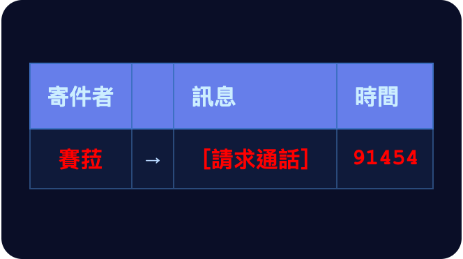

# 第二十三章

哲戈，帕佛蓋都·3724 年霧季 22 日

格拉迪亞斯、白和汾在一間餐廳裡圍桌坐著。這間餐廳在山體金字塔內部，深埋地底。

餐桌和牆壁之間，四面都種著綠樹。兩面牆爬滿了藤蔓；另外兩面裝著大片鏡子，整個房間看起來彷彿只是某個無限重複、無邊無際的空間的一部分。

入口只有一個，開在其中一個角落。兩側各有一叢濃密的灌木，擋住了通往入口隧道的視線。

另一個角落，還有餐廳中央、離他們幾公尺遠的地方，地上立著幾台空氣清淨機。顯然是最近才添的，至於怎麼讓它們在外觀上和房間搭得起來，還沒人怎麼花心思。天花板上則掛著朝下吹的風扇和紫光燈。

三人坐的是一處隱密的區域，灌木把餐廳其他大部分的地方都擋住了。兩個喇叭模擬著清晨森林裡的蟬鳴，蓋過了其他桌的談話聲。他們知道，這也同樣保護了自己的談話。

澤走了進來，看得出累壞了，在他們身邊坐下。

「好險。我們中了一群北極無人機的埋伏，差一點就打不贏。還好下一波機群趕來收拾我們的無人機之前，我們還有整整五分鐘。北極人能拆回去、從這一仗裡取得訓練資料的晶片，我想應該全都毀掉了。」

「自由城那邊的人感覺如何？」

「他們很興奮。」

「你看，我就說吧。先跟自由城合作，是讓昆高派慢慢習慣更多國際合作的好辦法。」

「得先給大家一些速效成果，讓他們有東西能拿去給上司或朋友看。盡快以績效建立正當性，大家才會信任你，讓你走下一步。」

「對，你的建議很好。不過……我猜下一步會比這一步難。自由城的國防企業是想合作的；到了維瑞迪亞，我們得想辦法繞過他們的體制，那就難多了。」

「小計畫，繞過人也做得成。可是要打贏大仗，就需要規模。要有規模，你就得做那件難事：真正把一些比較大的體制拉到你這邊來。」

「有想到要怎麼做嗎？」

「賽菈說她會想想辦法。我把韋爾多的聯絡方式給她了。到目前為止，他是我唯一真正信任的參議員。所以，再看看吧。」

一個機器人過來，把四人份的餐點擺上桌。他們安靜地吃了起來。

汾和格拉迪亞斯先吃完，喝著茶休息了幾分鐘。

汾從包包裡拿出一本書，遞給格拉迪亞斯。

「來，看看你的哲戈語有多好。翻開一頁，唸唸看。」

格拉迪亞斯接過書，隨手翻到一頁，看了一眼。

「你覺得我唸得來？」格拉迪亞斯不敢置信地問。

「來嘛，試試看。」

「好吧，那我來了……」

「從物質世界小思考，到網路小思考。」

「小思考就是極簡主義。」

「啊，懂了。這種情況，光知道字根是根本讀不通的。」

「沒錯。整個縮減字根的計畫，也是等我們接受了這種情況免不了，才終於成功的。」

「包在綠色裡面，四十年前，全世界美思考的一個大的模式改變，是極簡主義。」

「開頭那句是固定說法，意思是『包括哲戈和維瑞迪亞』。美思考就是美學。」

「很多人認識到，擁有很多實體的東西不只是線心，也是一個上鎖的房間。」

「線心是一種簡單、或者說方便的感覺；上鎖的房間在這裡比較接近牢籠。」

「複雜的房間意味著複雜的心。」

「很好！」

「帶著擁有很少東西的暖心——快樂？——生活，是自由。」

「太好了！」

「這件事在四十年前發生，有一個邏輯——理由？」

「對。」

「電的機器和網路開始存在。」

「這意味著很多人收集了實體的東西……等等，是很多人收集的實體東西，開始變得不被想要。」

「這裡我會說『不需要』。」

「手持裝置使不需要了聚合分組裝置、音樂裝置、聲音對話裝置，和以前一個人會有的其他十種裝置。」

「聚合分組裝置應該是加和乘的裝置，也就是計算機。聲音對話裝置是電話。」

「它可以裝下沒有上蓋的書。」

「無上限。」

「我們全部活的許多部分，正在搬到電的世界。」

「我們所有人生活的許多部分。」

「結果，實體世界的複雜停在了後面。」

「是被留在了後面。」

「在附近的幾年，我們正在尋找一個不同的模式改變。」

格拉迪亞斯停了一會兒。

「好，我累了。不過我很好奇，剩下的在講什麼，能不能直接告訴我？」

澤拿起那本書。

「社群媒體對人的心理健康不見得都有好處。很多人在意隱私，不只是因為怕北極人；更大的原因是人人都在議論別人，量多得驚人，而且誰也說不準，別人私生活裡哪件偶然的小事，會突然變成公共話題。」

「大家怕網路的很多面向，在其他國家更是如此，那些地方的隱私技術沒那麼強，大家也沒那麼了解。位置追蹤、行為側寫，全都是。而且不只是隱私。大家漸漸發現，網路可以像毒品一樣讓人上癮。」

「所以現在，我們慢慢看到另一種極簡主義出現了：網路極簡主義。斷開連線。在自己的裝置上做事。當年實體極簡主義能夠實現，靠的是數位世界的能力越來越強；網路極簡主義也一樣，靠的是 AI 和本地軟體的能力越來越強——你可以把整個世界都放在自己的裝置上。」

「真有意思。」

「格拉迪亞斯，你表現得很好。」

「謝謝。好，換你了。掌舵會的治理規則，你了解多少？」

「有一套稅務規準。每一條規準都會隨機選出二十一名守律者，每年補進七人，任期三年。這一組人的工作，是提出並表決規準的修改。二十一人分成三個七人的子小組，每組裡第一年、第二年和第三年的成員都有。任何守律者都可以提案修改規準。每項提案都由各子小組各自獨立討論，而且彼此不知道其他子小組是誰。討論過幾輪之後，二十一名守律者全體對每項提案投票；拿到二十一票中至少有十三票贊成的，就算通過，予以採納。」

「另外還有一套獨立的機制：哨兵。哨兵也是隨機選出來的，編成小組去稽核個別企業，那邊是三組、每組三人。他們的任務非常明確，就是判定一家企業在每條規準上屬於第幾級。至於比較小的企業，則交給見習生，也就是受訓中的掌舵會成員來稽核。見習生要轉正，兩個條件缺一不可：通過參議院委員會的核准，而且預測分數要排在前一成。預測分數看的是吻合度：他們的稽核裡，會隨機抽出一小部分由哨兵重做，他們在這部分的判定和哨兵的結果越吻合，分數就越高。」

「那法院呢？」

「跟哨兵是同一套機制，只是法官是五個人，不是九個。另外，判決可以上訴：民事案件雙方都可以，刑事案件只有被告方可以。法院沒有上下級，上訴就只是再隨機抽一組人。還有一條普通法規則：你提出的案子——不管是上訴，還是第一次起訴——如果毫無理由到構成惡意的程度，結局可能不只是你敗訴，甚至還會對你做出懲罰性判決。這就是用來防範我們所說的『阻斷服務攻擊』的機制。」

「你提到最後那點，其實正好。和我們家共養孩子的維爾，跟他的——嗯，基本上就是他的前雇主——打了很久的官司。對方耍了一些財務花招把他開除，還想不付事先談好的資遣費就這樣了事。第一回合他贏了。公司上訴，又輸了。然後他們再上訴。就在昨天，法院駁回了他們的第二次上訴，判定那是惡意上訴，還把他們要付給維爾和其他員工的金額提高成三倍。」

「很高興聽到制度真的管用！」

「最重要的問題永遠是這個：它到底管不管用。比方說，議會核准新任守律者和哨兵的聽證會，到現在幾乎已經完全不管用了——至少我是這麼看。」

白開口了。

「這些資訊都很有用，格拉迪亞斯。澤，也謝謝你這麼快就把這些摸熟了。如果我們想影響維瑞迪亞，就得了解這些體制現在是怎麼運作的，這跟軍事那一面一樣重要。」

「總之，我想鄧應該在他的私人房間等我和澤了。我們該動身過去了。」

「好啊。」澤說。

澤和格拉迪亞斯同時搶著把手錶貼上桌角的小綠色圓圈，結果兩人都把對方的手腕推得太遠，誰也沒感應到。

汾也加入搶的行列，一掌把手錶拍在圓圈上。片刻之後，他的手錶震了一下。

四個人一起站起來，往餐廳外走去。

------------------------------------------------------------------------

格拉迪亞斯躺在床上，正準備睡覺。

手錶突然震了一下。

這種深淺的紅色，他以前只見過兩次。一次是北林遭到攻擊，賽菈傳訊息給他；另一次，是她為了德爾瓦特的事打電話來。

翡翠是在告訴他：這件事有多重要，賽菈現在又是什麼情緒。格拉迪亞斯知道，光是這些，就已經是這則訊息很大的一部分了。

他心跳得飛快，接起了電話。

「你知不知道莉莉出了什麼事？！」賽菈尖聲吼道。

「我……不知道。我只記得聽說她最近一次考試考了八十一分。發生什麼事了？！」

「我進她房間的時候，她正一邊講話，一邊在手持裝置上打字。從鏡子裡，我看得到她在讀什麼、說什麼。」

「我就那樣盯著看了好幾分鐘。我不敢相信。」

「是什麼東西？」

「她在某個聊天群組裡，那些人在分享北極帝國的宣傳。替艾費里昂勳爵的那些文章叫好。盼著北極人很快也會來到維瑞迪亞其他地方。」

「什麼？！」

「我當場就爆了。我當面質問她，怎麼能這樣背叛我們？費布里克和赫蕾妲就是因為他們，才被困在一千公里外。」

「她怎麼說？」

「她說北極人是對的。他們的哲學是：有些人比較差，有些人比較好；比較好的人應該統治其他所有人；人生最重要的事，就是努力成為比較好的那種人。她說，就是這套想法激勵了她，讓她有理由認真讀書、努力用功。她說我們無條件的愛是毒藥。北極人的哲學只把欣賞和愛當成成功的獎賞，反而真的把她從谷底拉了出來；我們做的一切，卻連一點點忙都沒幫上。」

「這……太可怕了。」

「我對著她吼了十分鐘，然後把門關上。」

「我哭了一長時。等我再打開門，窗戶是開著的，她已經不見了。」

「你能不能……追蹤她？用她的手錶？」

「我已經找莫夫查過了，根本白費工夫。她把手錶丟上了一輛不知道開去哪裡的自駕巴士。」

「天哪。我現在覺得糟透了。我們真的從來沒有做過什麼，去真正激勵她、鼓勵她。」

「格拉迪亞斯，她被北極人洗腦了！你敢給我擺出那副哲學家的樣子，跟我說他們講得有道理試試看！」

「你怎麼可以這麼失職？！」

「好，等一下。沒看穿德爾瓦特，那是我的錯。我很蠢。莫夫也很蠢。我承認。可是這件事，這件事是我們兩個人的責任。你是莉莉的媽媽。你見過她很多次：她去維爾和黛亞家之前、她住在他們家那段時間我們去探望的時候，還有她回來以後。你跟我一樣，有很多機會讓事情變好；你也跟我一樣，沒有做到。所以，我們一起來解決這個問題吧。」

「你根本一點都不懂，對不對？！」

賽菈掛斷了電話。
