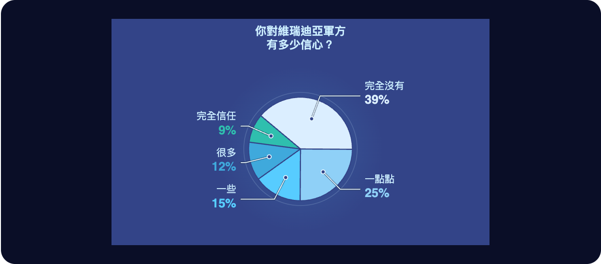
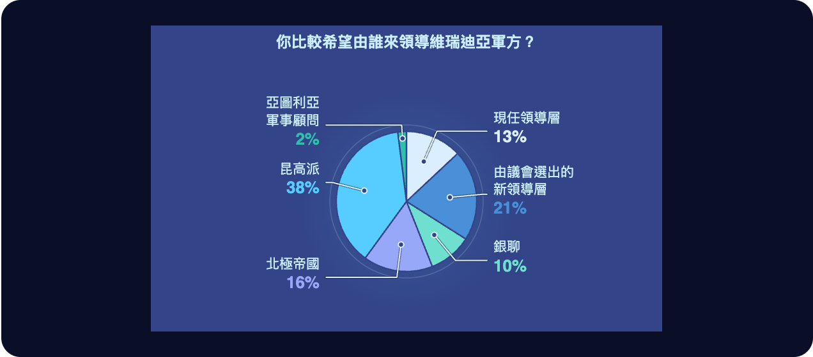
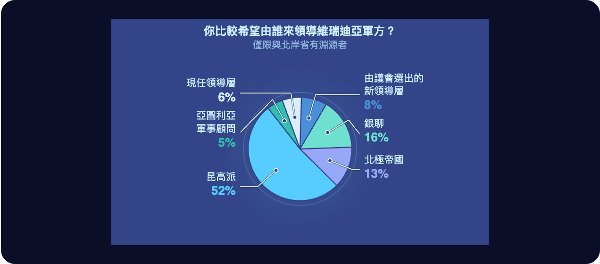
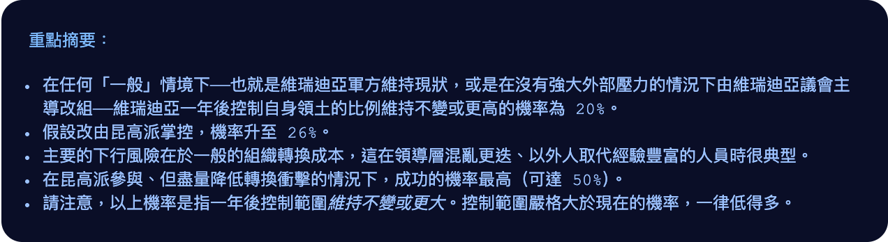

# 第二十七章

維瑞迪亞，梅爾丹·3724 年霜季 7 日

格拉迪亞斯聽見有人敲他政府旅館房間的門。還來不及應聲，一陣嗡嗡聲響起，門就開了。

進來的是賽菈。

格拉迪亞斯幾乎立刻開口，一臉難過。「賽菈，真的很對不起。我看這個計畫是行不通了。」

「我辜負了我們全家。費布里克和赫蕾妲在哪裡，我們知道；現在連莉莉在哪裡也知道了。可是沒有任何辦法把他們救出來——除非北極把我們整個征服。」

賽菈走到他面前，抱住了他。

兩人好一會兒都沒說話。然後她退開一步，臉上綻出笑容。

「跟你說，我有個新主意。」

格拉迪亞斯眼睛一亮。

「什麼主意？」

「昨天我們學到一件事：法官不願意做他們覺得非常不民主的事。所以我想到一個解法——我們就讓它變得民主。」

「什麼，難道明天就辦一場選舉？」

「某種意義上，正是這樣。」

「你在哲戈的時候，我和莫夫開始在銀聊裡一層一層往上找人談。一開始，我們沒什麼辦法引起他們注意。大約十天前韋爾多加入，幫了很大的忙，但即使這樣，他們還是沒把我們當一回事。不過昆高派救出塔芬德爾那天，我冒了個險：提前一長時跟他們說，軍事上會有一件值得注意的事發生。結果當然發生了。所以現在，他們肯聽了。要跟他們提什麼，我也已經想好了。」

「銀聊有民調功能。你燒掉吉普幣——好吧，其實是把吉普幣付給公司——它就會自動向平台上一大群涵蓋各類族群的人發問。燒的吉普幣越多，問到的人就越多。我們要做的，就是問很多人一大堆問題：他們怎麼看維瑞迪亞和其他國家的各種政府機構，再加上其他各種假設情境。」

「題目裡會有『你認為議會代表人民嗎？』，也會有『如果維瑞迪亞的軍隊由救出紅郡總統之子的那群哲戈人來掌管，你會有什麼感覺？』不過這幾題會夾在幾百道誘餌題中間，這樣北極就不會知道我們在做什麼。」

「要讓回答出自真心、又經過深思，優先級就得很高，我想這要付很多吉普幣。還有，要讓這件事成為具有強大正當性的社會訊號，就必須形成共同知識：維瑞迪亞的每個人不只要知道有人做了這份民調、知道結果是什麼，還要知道其他每個人也都知道有這份民調、知道結果是什麼，而且其他每個人都知道其他每個人知道，依此類推。這需要*全國人口中很大一部分*都看到這份民調。所以我們得付*非常多*吉普幣。」

「照我估計，要九十萬吉普幣。」

「我們有那麼多嗎？」

「沒有。我們所有積蓄加起來，連莫夫的也算進去，也只有一半。」

「但妙就妙在這裡：我們不用付。我們去說服銀聊的創辦人艾維洛，讓他親自透過公司來做。這樣一來，觸及範圍和優先級，他們想設多高就設多高——費用百分之百會回到他們自己手上。」

「等等，他們不能直接手動處理，一毛錢都不花嗎？」

「他們的平台是這樣運作的：可讀訊息的集合每更新一次，就把證明公布到密碼學網路上。所以他們根本不可能違反規則。真要這麼做，證明就驗證不過，讀者的用戶端會自動把那些訊息當成無效而拒收。他們唯一*能*做的，是公布新的演算法雜湊值，但那要延遲二十天才會生效。」

「而且錢能百分之百拿回來？不用繳營業稅？」

「最新一輪規準調整之後，銀聊的稅已經降到零了，因為他們一直表現得很好：演算法透明——也就是那套讓他們沒辦法直接在自家規則裡開後門、破壞規則的證明機制；還有互通性、尊重使用者隱私、配合研究人員。」

「那就來看看艾維洛怎麼想吧！」

------------------------------------------------------------------------

格拉迪亞斯、賽菈和澤沿著平常那條路，一起穿過卡利馬區。路上綠樹成蔭，兩旁是一棟棟石屋。

為了安全起見，大半路程他們都搭黑色專車；可是車子只能開到無車區的邊界，最後幾百公尺別無選擇，只能用走的。

希望隱私袍夠用，格拉迪亞斯心想。

一陣冷風從背後吹來。寒意讓三人精神一振，風又正好推著他們往前，腳步不由得快了起來。

「這裡右轉。」賽菈透過頸帶低聲說。到了這時候，她幾乎已經和格拉迪亞斯一樣，習慣每句話都靠頸帶來說了。

他們右轉，拐進一條小一點的路。路筆直往前，大約一百公尺。起初兩旁還是石屋；走了五十公尺左右，房子漸漸沒了，換成一片看似茂密的森林。走完那一百公尺，前方出現一個像是小山的東西。

小路往下斜，盡頭是一扇門，門後似乎就是小山的內部。

又是一棟幾乎不用繳土地稅的建築，格拉迪亞斯心想。在森林裡生活、工作、蓋起複雜的建築，卻讓同一片森林從短短一百公尺外看去，像是從沒被人碰過——這門藝術，維瑞迪亞人到這時已經練得近乎完美。

澤看得讚嘆不已，馬上拿它和哲戈的山體金字塔比較。在哲戈，人們把天然的山鑿成金字塔，讓自然看起來像人的作品；在維瑞迪亞——至少在梅爾丹的卡利馬區——他們卻把一座很可能完全是人造的小山，弄得像天然的一樣。

哲戈可以學學維瑞迪亞這一套，他想。說不定連防護效果都更好。

賽菈把手持裝置往門邊的綠色圓圈一貼，門就開了。

她領著三人往裡走：先左轉，再右轉、爬上一段坡，接著又右轉，然後上了一段樓梯。最後她打開另一扇門，帶大家再走上一段樓梯，出來正好站在一塊圓形空間的中央，抬頭就是開闊的天空。

格拉迪亞斯和澤這才發現，他們已經到了山頂。

他們轉過身。那裡已經有人了：另一個男人，穿著隱私袍，但沒戴兜帽，也沒戴臉罩。

「我是艾維洛。」他說，「很高興認識你們。」

「我是格拉迪亞斯。我也很榮幸認識你。」

「我叫澤。」

艾維洛按下一個按鈕，頭頂的屋頂開始合攏。大約十拍後，屋頂完全關上了。

「只是為了隱私。」艾維洛說，「袍子儘管脫掉，別客氣。對了，你們要喝點水，還是喝茶？」

「我喝茶。」格拉迪亞斯說。

「我也喝茶。」澤跟著說。

賽菈稍微看了一下四周。「那我也來杯茶吧。」

「好，那就四杯茶。機器人一會兒就上來。」

樓梯出口的後方有一道安全欄杆，艾維洛在緊貼著欄杆的長椅上坐下。房間沿著圓周繞了一整圈環形長椅，他朝那邊比了比：「請坐。」

三人脫下隱私袍的兜帽和臉罩，坐了下來。

「所以，賽菈，你跟我說你有個主意，銀聊可以做點什麼，讓整個維瑞迪亞政府別再那麼蠢。」他直接脫口而出，語氣坦白得毫不修飾。

「對，我有。」

「簡單說，我想做一份民調。我請翡翠擬了大約一千道題目，自己審過一遍。有些問大家對現狀的感受，有些問可能的未來。其中只有一小部分，是在探我們真正在意的那件事——就算議會不願意，也要撤換軍方；其他都是誘餌。」

澤微微皺了一下眉。他覺得賽菈太快就主動把整個計畫的內容說出來了。昆高派絕不會這樣做事。

不過，也許維瑞迪亞的文化本來就比較容易信任人；又或許艾維洛早已向賽菈證明過，甚至向全維瑞迪亞證明過，自己是值得信任的人。

「目的是建立共同知識：讓大家都知道這份民調做過了，也知道結果是什麼。如果順利，我們去找法官時，論據就會有力得多——這是人民真正想要的，而且不會因此暴動。」

賽菈把手持裝置拿給艾維洛看。艾維洛大略捲了捲題目，就念出聲來。

「你比較希望由誰來領導維瑞迪亞軍方？A：現任領導層。B：由議會選出的新領導層。C：銀聊的領導層。D：北極帝國。E：昆高派（最近救出紅郡總統之子的哲戈團體）。F：亞圖利亞軍事顧問。」

「那你打算在這上面花多少？」

「三百萬吉普幣。我原本是希望銀聊公司自己出面來做，反正這筆錢你們會百分之百拿回去。」

「有意思！不過我會說三百萬太多了。那比銀聊上以往任何一次民調或廣告都多，北極會起疑，覺得有什麼不尋常的事。我會花一百萬。在花費上還是排得進前三，但不算前所未見。」

「這樣可以。」

「不過還有另一個問題。」艾維洛接著說，「這麼做，我們能讓法官看到：大幅改變會受到支持，而且人民並不覺得議會有多少正當性。當然，也可能我們會發現，自己對維瑞迪亞人想法的判斷錯得離譜。但光靠民調，說服不了他們這麼激烈的行動真的*行得通*。」

「你有想法了嗎？」

「其實有。我們最近加了一個功能，叫銀聊預測，讓人——或是 AI——可以對未來的事件下注。到目前為止，表現最好的都是 AI——」

「我看過。」格拉迪亞斯插嘴，「預測市場很酷，但有兩個弱點。第一，北極要是看到這個市場，就可能出手操縱。理論上，任何操縱的企圖都會讓套利者更有動機進場：他們把價格推回應有的位置，平均而言就能從中獲利。但這在實務上到底多有效，幾乎還沒經過驗證。」

「已經有研究結果指出：除非套利者完全風險中立，或者錢多到無限，否則操縱者總能讓價格至少偏移一些。再說，如果標的變數是這麼前所未有、這麼未知的事——比如我們能不能拿下過去一百年來世界上第二場對北極的勝利——任何套利者都很難有意願進場。」

「第二個問題是私密資訊。我們對昆高派有信心，是因為我們很了解他們、信任他們，也很清楚他們有多少能耐。但只要把這些公開，就等於透露給北極。」

「沒錯，兩點都說得很好。第一點，希望我們能隨著時間慢慢改善，只是……預測市場現在還很新。第二點就比較難解決了。」

「好，那我有另一個想法。不直接用市場。我們找排行榜上表現最好的五個 AI，用可驗證的兩方計算去問它們。做法是建一個某種臨時的虛擬私有沙盒：我們把私密資訊餵進沙盒，對方把 AI 放進沙盒，沙盒只輸出 AI 的答案。」

澤看準機會開口。「對，那只是混淆電路的延伸——你們大概會想用可驗證的混淆電路。額外開銷相當嚇人——」

「針對 AI 運算，有專門的最佳化。別忘了，大型語言模型裡幾乎所有東西都是線性的。要讓語言聰明，非線性的部分少不了，但它只佔整個運算的千分之一。」

澤這才明白，在這個特定的專門題目上，自己被比下去了。看來學了九個月的密碼學，他還是沒能在每件事上都比每個人聰明。

「原來如此……」

底下傳來一陣機械聲，越來越響，他們的談話暫時停了下來。幾拍之後，機器人的頭頂出現在眼前。它托著一盤四杯茶，慢慢爬上樓梯，每一階都是先抬升、再滑動。一到樓梯頂端，它就朝格拉迪亞斯移過去，先把他的茶遞給他。

「格拉迪亞斯，」艾維洛問，「你看起來很聰明。我另外有個問題想問你。」

「什麼問題？」

「艾費里昂和希爾卡的那場辯論，你還記得嗎？」

「記得。」

「艾費里昂說，社會上大多數『比較軟』的特質，似乎都在繞圈子。好的會孕育壞的種子，壞的又會孕育好的種子。從災難到英雄氣概，到繁榮，到安逸，再到災難；從技術官僚到民主，到混亂，到強人，再回到技術官僚。諸如此類。唯一不是這樣的，是經濟產出：成長會在自己身上不斷複利。所以我們不該再去加速那些繞圈子的東西，專心讓經濟產出成長就好。這個論點我不喜歡，它隱含的意思讓我很不舒服。可是它到底*錯*在哪裡，我還是說不上來。你怎麼看？」

「我不覺得只有經濟產出會在自己身上複利。很多好東西都會彼此複利。健康讓人更有生產力；生產力讓人有資源變得更好；教育支撐這兩者，健康又支撐教育。」

「換句話說，艾費里昂講的那個特徵向量，不只包含單一維度——其實大多數特徵向量本來就是這樣。」

「你顯然比我懂特徵向量！」

「銀聊可是社群媒體網站。特徵向量差不多就在……最早那份白皮書的第一頁吧。」

格拉迪亞斯笑了。

「不過另一方面，」艾維洛接著說，「北極確實在乎健康。不是希爾卡想要的那種健康，帶著慈悲、愛與關懷之美；他們的是冷硬、金屬感的長壽診所。但那仍然是健康。」

「嗯，希爾卡會說，重要的不是活得久，是活得健康。」

「對，可是中世紀那些故事裡，有人喝了長生不老的靈藥，結果注定永遠躺在地上，全身骨頭都斷了——沒有任何一種長壽科學真的是那樣運作的。活得更久，本來就等於活得更健康。要阻止損傷，最容易的時機就是它剛開始的那一刻。」

「我猜你接下來會說，北極也在乎教育。他們幾乎不懂音樂和詩，但教孩子科學一點問題也沒有；而教育裡會進入最大特徵向量的，本來就是這一塊。」

「沒錯。」

格拉迪亞斯看得出賽菈皺著眉，一臉不自在。他腦子飛快地轉，想再找出別的論點，來反駁艾費里昂的那套思路。

「可是北極其實並沒有在最大化經濟產出。他們想開戰——而戰爭可以把經濟摧毀好幾十年。他們想除掉哲戈每一個在科學和技術上走得太遠的人，這也不是在最大化經濟產出，恰恰相反。他們要最大化的不是經濟產出，而是在他們控制之下的經濟產出；其他的一切，他們要毀掉。」

這時，澤開口了。

「艾費里昂的說法背後隱含著一個模型：有個向量朝無限遠射出去，它衝向無限的速度越快，大家就越快得到快樂。但我完全不是這樣看世界的。」

「我看到的，是一個脆弱的世界。它以前沒有這麼脆弱。過去，通訊有限，權力的傳遞也有限；任何帝國統一得夠久，最後都會垮掉。世界是可逆的。但今天，有了現代的機器人、現代的監控，只要*任何人*成功奪權，把控制力鞏固到全世界，就能把權力鎖死。不可逆。永遠。」

「如果北極贏了，某一種熵——也就是人類未來可能性所構成的空間的維度——就會永久收縮。從那一刻起，唯一可能的未來世界，就只剩下北極的世界。」

「而這還不是最糟的。如果北極，或是其他任何人，在他們的某種超級武器上出了差錯，而別人又沒有能力抵抗，整個生命世界都可能被他們徹底毀掉。」

「總有一天，世界會再度變得可逆。我們將能在星際間旅行，文明會大到不可能被完全控制，也不可能被完全摧毀。但在那之前，我們都處在一個脆弱的位置。要是在接下來十年內，一切被永遠乘以零，北極就會是原因。」

「我的答案比較簡單。」賽菈補充，「這些關於遙遠未來的論證，都很難預測。而且，如果你早就知道自己想走哪條路，要說服自己那條路是對的，再搬出很聰明的數學來替它辯護，實在太容易了。但有一件事很容易預測：北極要是征服維瑞迪亞，戰爭可能會殺死我們幾十萬、甚至幾百萬人，北極也會毀掉我們熟悉、珍惜的這個美好世界。對我來說，光是這樣，就已經值得與之對抗。而我們的世界、我們的國家、我們的友誼有多美好——光是這些，就已經值得為之奮戰。」

「都是很好的答案。」艾維洛說。他啜了一口茶，往椅背一靠，陷入沉思。

3724 年霜季 8 日

政府經營的旅館裡，一間會議室的桌邊圍坐著格拉迪亞斯、賽菈、澤、白、韋爾多、鄧和穆。

他們面前的牆上投影著一個計時器，倒數銀聊上那份問卷還有幾拍發布。此刻還剩 150 拍。

「給 AI 的資料包，你們的資料都放進去了嗎？」賽菈問。

「我的部分剛弄好。」鄧說。

「記住，那是 AI，用不著什麼漂亮的呈現和潤飾。想到還有什麼要說、要塞進去的，直接丟進去就對了。」

「澤，希望你和你的 AI 有把密碼學好好審過。我可是把一大堆軍事機密都交給它了。」

「這套混淆電路演算法有一份可由機器檢查的數學證明，證明它滿足標準的正確性與隱私性質。證明是端到端的，一路往下涵蓋到作業系統，連硬體都算在內。它證明了哪些命題，我讀過；也請翡翠和另外兩個 AI 檢查過。相當紮實。除非雜湊被破解，否則零資訊外洩——真到了那一步，我們的麻煩可就大多了。」

「我也檢查過了。」穆插話，「我用的是另一種方法，以防萬一證明系統或那些定義其實已經壞了十幾年，卻一直沒人發現。我讓翡翠去讀原始的學術論文，自己寫一份實作；再開一個全新的實例，把那份程式碼和原版並排讀過，逐一檢查每一處差異，看是哪一邊對。艾維洛的程式碼完美無瑕。」

「還有五十拍就開始了！」

「這次不模仿明盤台播報員的聲音了？」白打趣地接了一句。

澤故意把那種刻板的機器人腔調演得很誇張，逗大家笑：「MU GU GEI HUI ZIU FA。」

大家圍著桌子，等著。

「LE MU GEI HUI ZIU FA！」白喊道。

「喂！」澤叫了一聲。

「搶先你了！」

他們繼續盯著倒數。數字一跳到十，大家立刻齊聲喊了起來：

「PA GU……SO……BI……ZE……HA……MU……FO……SHI……LE……PA……HUI ZIU FA！」

螢幕一分為二。左半邊是五條並排的進度條，分別顯示五個 AI 各自執行混淆電路的計算進度；右半邊是一大片圓餅圖，問過的每一道題目各一張。選票很快開始湧進來。

「放大來看我們在意的那幾題吧。」韋爾多提議。

澤點點頭，挑了其中一張圓餅圖點開。

「跟我預料的一樣。接下來看看，大家覺得這個問題該怎麼解決。」

「只看北岸省出身的人。」

「等等，我們有設定到這麼細嗎？投票是匿名的，我們根本沒辦法知道每一票是誰投的。」

「我們確實有分組：按年齡、自報最近投給的參議員、省分，還有大型語言模型推斷出來的幾個人格類型軸。」

「啊，找到了。」

「恭喜啊，艾維洛。」韋爾多挖苦地說，「看來比起真正的議會，你更適合治理北岸省。」

「這些結果，我現在看了有點怕。」賽菈插話，「我們是不是剛剛把底牌都亮給北極看了？」

「我想沒關係。」穆說，「民調裡我們問了很多不同的問題。其中有一題，居然有兩成的人說，要籌錢收復北岸省，應該依法把北岸省所有政府擁有的土地全轉讓給海卓菲，讓他們自己想辦法。」

「那場訴訟，北極當然會注意到，也會一直盯著。我們應該延後幾天再提告，免得看起來太像事先串通好的。不過不管怎麼做，我們都已經讓所有人看清楚了——北極也包括在內——維瑞迪亞人知道出了大問題。我們需要藏起來的，是解決辦法的細節。」

他們停了一下，盯著那幾條進度條。

「好吧，那還要等一陣子。我們再來看幾張圓餅圖。」

一個機器人走進房間，給每個人端來一杯茶。

------------------------------------------------------------------------

「然後……好了！」澤得意地喊了一聲。

螢幕上跳出五個圖示，分別是五個 AI 的回答。澤點開第一個。

「嗯。」韋爾多咕噥。

「你覺得這合理嗎？」格拉迪亞斯問。

「這些 AI 的性子肯定比我保守，但說得還算公道。」

「其他四個講的也大致差不多。最悲觀的那個認為，維持現狀和交給昆高派，機率是一樣的。」

「還有，投票那邊又進來很多資料了，結果和民調剛開跑時我們最早看到的大致相同。」

「我想能拿到的資料都拿到了。準備一下，幾天後提告吧。」
