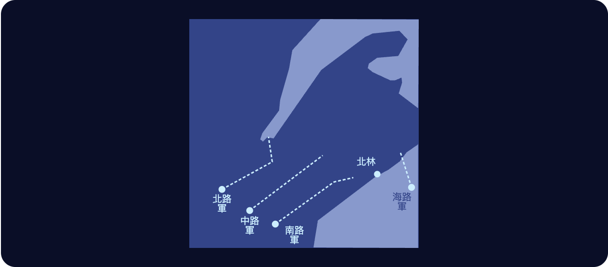
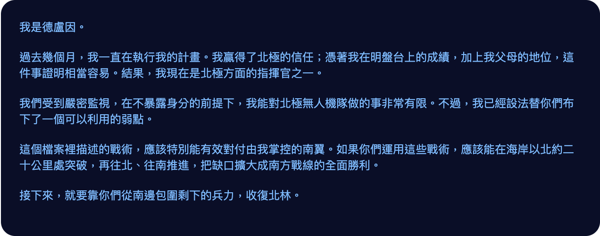

# 第二十九章

維瑞迪亞，艾勒納森林·3725 年雪月 29 日

澤和穆站在一座積雪的山丘頂上。放眼望去，四周全是松樹，青綠的枝葉上積著厚厚的白雪，一路延伸到視線盡頭。

冷風迎面颳來，又強又冷，刮得臉頰生疼。身上其他地方都裹在白灰相間的外套裡。外套厚到足以讓他們好好欣賞四周的景色，卻刻意沒厚到讓人覺得暖和。

遠方的樹梢上方，太陽剛從東邊升起。

「就是這裡了。我們的未來，會在這裡決定。」穆平靜地說。

「你覺得我們準備好了嗎？」澤問。

「沒有。」穆說，「但有意義的事，從來不會在人們準備好的時候發生。」

「我們只希望，北極比我們更沒準備好。」

身後傳來腳步聲，有人正慢慢爬上山丘。腳陷進深雪裡，一聲一聲，每一步都得和雪較勁，大約隔一拍才跨出下一步。

過了一會兒，澤感覺到有人從背後抱住了他。

「不管今天發生什麼事，澤，我很高興認識了你。」

是白。澤轉過身，抓住她的手，把她拉上最後一步，讓她和自己、和穆站在一樣的高度。

「我也很高興認識了你。」

三個人默默等了好一會兒，看著風把雪吹過東邊的樹林，捲過樹梢。

「所以，計畫是什麼？」

「開往艾迪爾的最後一班火車今天到。事情到了這一步，北極不可能不知道我們在這裡集結了某種大部隊，我相信他們已經開始調動軍隊，準備迎戰。這片森林很難穿越，但也不是難到無法穿越。所以我們最好的機會，就是今晚出擊：從西邊推進北岸省北部，完全繞過北林，再把它切斷、包圍。」

「這個計畫，你有信心嗎？」

「上次跟北極交手，我徹底搞砸了，是穆救了大家。所以，不，我沒有信心。但這是我們最好的機會。」

白又從側邊抱住了澤。

「我相信你。」

穆打破了沉默。「我也相信你，澤。」

他們又默默望著那片積雪厚重的松林，望了五分鐘，才開始慢慢走下山，回到臨時搭建的掩體。

------------------------------------------------------------------------

鄧、穆、澤，還有其他幾十名維瑞迪亞將領與昆高派領袖，都擠坐在一個狹小的房間裡。雷克托站在最前面做簡報。

「好，每個人都清楚自己的任務了嗎？」雷克托大聲問，「加洛瓦？」

「我率領北路軍。任務是穿越森林，一路往東北推進到海岸，建立防線，把北極軍和整座半島切斷。要做到這一點，南翼得和北岸省的北極部隊交戰，把他們包圍；北翼則要擋住任何援軍。」

「很好！特爾坡，你呢？」

「我率領中路軍，任務是往正東穿越森林。預計會和北極的主力無人機群交戰。我們沒有攻佔陣地的目標，工作就是牽制他們，不讓他們突破。」

「那你呢，鄧？」

「我率領南路軍。任務是穿越森林，往東南推進，再到北林外圍建立防線。」

「瓦卡里亞？」

「我率領海路軍。主要任務是用海上無人機從南邊進攻北岸省，就在北林以東。盡我所能牽制、包圍。延伸目標是再往東，攻擊北極本土的薩杜爾島。」

瓦卡里亞說完，房裡安靜了一下。最後，雷克托才又開口。

「澤？」

「監督所有戰線，找出無人機作戰在戰略和戰術上任何必須調整的地方。」

雷克托轉過身，再看了一眼螢幕。

各路軍指揮官說的每一項，看來都和地圖上的計畫對得上。

「好，非常好。看來大家都知道自己該做什麼了。各位，解散。你們還有三長時做最後的準備。日落時出擊。」

------------------------------------------------------------------------

澤、白和穆又一次站上山丘頂。太陽在他們身後，只比地平線高出一點點，再過幾分鐘就要落下。松樹和先前一樣積著雪。

但眼前的景象已經徹底變了。森林邊緣停著數千台類似雪上摩托車的機械，其中許多一看就知道裝著武器。

澤還看得見大量細細的銀線在陽光下閃著光。它們從許多最大型雪地無人機的尾部拉出來，一路往後延伸，直到視線盡頭。

是光纖纜線，他這才明白。今晚，這些纜線會延伸幾百公里；前線往前推進時，澤就是靠它們和無人機保持穩定的聯繫。

「等等，其中一台無人機上面，是一箱*印表機*嗎？」白忽然問。

「對。還有別的無人機載著貼紙和襯衫，一大堆教室用品。以防我們得對北極無人機的演算法快速發動視覺攻擊。」

「原來如此……」

澤的手錶震了一下。他轉過身，太陽的底部已經開始沒入地平線。

「Fi le gei fa。」他心想。一百拍後開始。

他想起過去十年打過的所有明盤台比賽，從練習賽一路到冠軍賽。他從沒察覺，這段時間自己其實一直在為一場比賽受訓——唯一真正重要的那一場：今晚。

「該回指揮所了。」穆輕聲說。

澤轉過身。太陽已經沉下去一半了。

「是啊，該回去了。」

三人慢慢走回山腳下的掩體，開門進去，脫下雪鞋，再把門關上。

一進門，就有一台機器人滑到他們面前，送上茶來。

「謝謝你。」穆溫柔地低聲說，拍了拍機器人的頭，接過自己那杯茶。機器人輕輕嗶了一聲。

澤和白也各自拿起茶。

澤的手錶震了一下。

他聽見外頭傳來雪地無人機加速的聲音。

任務開始了。

3725 年雪月 30 日

澤和穆各自坐在椅子上，兩人的房間相鄰，但彼此分開。他們看的是同一個指揮螢幕。螢幕左上角顯示著時間：剛過午夜。

陸上三路軍都在快速推進。海路軍則延後出發，好讓它的攻勢在主戰開打後不久才發動。到目前為止，三路主力輕鬆擊潰了幾支小型的北極哨戒部隊，正繼續全速前進。

警報大作。

澤立刻在地圖上看出原因。

澤聽見加洛瓦和特爾坡在通訊頻道裡協調。

「採取防禦陣形，分散開來，防止被包圍！」加洛瓦大喊。

「派一部分中路軍往北，從背後攻擊。」特爾坡回答。

澤把畫面放大。維瑞迪亞和北極的無人機群正迅速朝彼此逼近，雙方已經發射了幾發遠程武器。北路軍有十架無人機失去作用；在這之前，還有幾十架早就折損在森林各處的北極固定陷阱裡。不過到目前為止，主要的交戰還沒開始。

過去一個半月，森林雪地無人機作戰他模擬過幾百次。偵察、隱蔽、攻擊與掩護各有什麼最佳策略，他都很清楚，這些策略也已經載入無人機的 AI 模型。

螢幕上出現一張影像：北極雪地無人機的確切設計。

和他以前看過的影像相比，它略有不同：速度更快、更靈活，更能抵擋固定陷阱，側面和後方的防禦也更強。他這才明白，北極早就預料到又會有一場快速的攻勢作戰。

這些改良是有代價的：打起傳統的定點正面作戰，效能就比較差。維瑞迪亞的雪地無人機隊也做了一些類似的修改，只是幅度小得多。

所以，對他們最有利的打法似乎是……戰線固定的直接正面作戰。

不妙，澤心想。北極的無人機隊規模比較大，他們得靠更好的細部戰術來彌補。

幾分鐘後，雙方的無人機隊近到足以交鋒。維瑞迪亞無人機隊預先砍倒大量樹木，防止被包圍，北翼尤其如此。

加洛瓦的策略很簡單：北邊拖延，東邊交戰。大約二十分鐘後，特爾坡的部隊會從南邊攻擊東側的北極部隊，可望將它包圍、擊潰。

澤仔細看著。雙方無人機的損失數開始快速攀升，很快，維瑞迪亞和北極的損失都突破了一百。

澤繼續捲動一個個影像畫面。加洛瓦幾台最大型雪地無人機頂上的大箱子打開了，一大群旋翼球的旋翼機和送貨旋翼機飛了出來，看起來都改裝過，能攜帶更危險的酬載。

啊，對了——北極的雪地無人機從上方也很脆弱。民用設施改裝得好，澤心想。

每一路軍裡都安插了大批哲戈最頂尖的明盤台選手，還有一些維瑞迪亞最頂尖的旋翼球選手，坐在遠離前線、安全無虞的後方指揮中心。哲戈選手是昆高派悄悄用飛機送來的。說到空中對決，最有實戰經驗、最懂得其中門道的，就是這兩群人。

澤繼續看著。目前看來，加洛瓦的策略進行得很順利：他的部隊在北翼成功地緩慢撤退，一邊砍樹、一邊布下陷阱；東翼的戰鬥也進展順利。確切的戰損比很難判定，但從螢幕上的數字看來，明顯是維瑞迪亞佔優。

四十分鐘後，他看到了真正重要的好消息：加洛瓦的部隊從北極北翼與東翼之間突破了，特爾坡的部隊也開始從南邊與北極東翼交戰。

沒多久，東邊的北極雪地無人機就開始一架接一架迅速失去作用。另一頭，加洛瓦的西翼仍在緩慢撤退，拖住北極北翼的腳步。

北極的無人機也想學這套緩慢撤退，卻沒能學成：這時特爾坡已經幾乎完全包圍了它們，它們無處可去。

幾分鐘後，加洛瓦宣布，這支北極無人機隊已經被充分擊潰。他下令東翼繞過它們，免得殘存的半損無人機或它們的陷阱造成任何損害，然後全速往東北前進。

澤把畫面拉遠，重新看了一次全局。

又過了一個半長時。維瑞迪亞的四支無人機隊都還在推進，只有一支例外：加洛瓦留在後頭的那支小分隊，負責拖住北邊那支北極無人機部隊。

警報再度大作。這一次，受到威脅的是中路軍和南路軍，兩路同時。

「好了，各位，」雷克托大喊，「這才是真正的決戰。」

「採取防禦陣形。中央緩慢撤退，兩側嘗試包抄。小心點，我們的損失壓到最低，他們的損失拉到最高。別讓他們突破我們的陣地。」

過了一會兒，他又補上一句：

「為了維瑞迪亞！」

「Dze go ba fau gie！」鄧緊接著大喊。

澤下令無人機把所有戰術都用上，連幾個月前在紅郡祕密作戰中學到的那幾套也不例外。他知道，這些戰術只能撐一小段時間，等北極適應了就不管用。但現在不用，就沒機會了。

雙方的無人機隊各自散開，拉出防線。地圖拉到最遠，澤看得見兩條戰線一點一點靠近。幾分鐘後，兩軍交鋒。損失很快就衝上幾百，兩邊都是。

加洛瓦的北路軍突然由撤退轉為推進，也用起同樣的戰術。

澤屏住呼吸，仔細盯著。小範圍的戰術地圖、即時影像畫面，他一張一張捲過去。

有哪裡不對勁。他察覺到了。

「翡翠，分析所有細部戰術與視覺畫面，判斷哪些戰術有效。」

「分析中……」

大約二十拍後，翡翠有了回應。

「一號、五號戰術效果中等。二號、三號、四號、六號戰術效果為零或略為負面，北極方面似乎已完全適應。」

澤低聲哀嘆。

他和自由城國防企業拿來訓練的，是紅郡那批無人機的影像畫面。他知道，自己雖然已經盡了全力，北極一定還是至少拿回了其中一部分。

「全體單位，停止使用二號、三號、四號、六號戰術，改用一號、五號戰術。編號尾數為 0 或 5 的單位，嘗試隨機修改。」

有幾分鐘，戰損比又倒回維瑞迪亞軍這一邊。然後，北極又開始佔上風——緩慢，卻無可避免。

「翡翠，哪些修改有效？」他問。

「共嘗試八種。只有第七種有效，已採用為五號戰術的主版本。建議停用一號戰術。」

「照做。」

澤急得開始冒汗。他沒料到，北極能把他們的戰術擋得這麼有效。

快啊，澤心想。想點辦法。

海上無人機那邊看來是成功了，至少攻勢初期是如此。它們已經把地面載具送上岸，一處在北林以東，另一處在再往東幾百公里的鐵爾登，那裡已經是北極本土。現在海上無人機已經開始返回基地，準備裝載第二波酬載。

這讓澤高興了一下。但還遠遠不夠。

一台機器人進了房間，悄悄滑到澤身邊，送上一罐能量飲料。澤拿起來，咕嚕咕嚕灌掉大約一半，剩下的擱回桌上。不一會兒，飲料就起了作用——只是唯一的作用，似乎是讓他更加絕望。

又過了一會兒，螢幕上跳出一則訊息，把澤眼中僅剩的光都抽乾了。

澤哭了起來。

南路軍的指揮，穆已經立刻接了過去。接下來幾分鐘，澤心不在焉地對著麥克風低聲說話，提出一些無人機戰術的小調整，想把陣地優勢和戰損比調到最好。

但他心裡知道，這一仗已經輸了。

就在這時，澤的手錶震了一下。

這不是一般的軍事通訊頻道。而且翡翠判定，這件事重要到足以無視他那道嚴格的「勿擾」指令。

澤對著頸帶低聲下令，把手錶連上眼鏡裡的顯示器。螢幕上出現一則訊息。

幾乎是立刻，澤的腦子又湧上一股勁。

為鄧哀悼，只能留待另一天了。

「翡翠，確認這則訊息的真實性。」

「簽章金鑰相同。和你在葡萄季 15 日收到的德盧因原始訊息裡嵌入的，是同一把金鑰。」

「分析這些戰術。看起來可信嗎？」

「戰術極具攻擊性。看似非正統，但可信。對手若會被這套戰術克制，效果會非常好；對手若沒有這個弱點，用的一方反而會敗得快得多。正在執行模擬。」

大約二十拍後，翡翠又開口了。

「拿來對付維瑞迪亞、昆高派或自由城的 AI，用這套戰術的一方會敗得更快。效果完全取決於德盧因的判斷對不對：北極 AI 是否真有他說的那個弱點。這個弱點可能是被發現的，也可能是被刻意布置的。」

澤想了一下，決定找人幫忙。

「白，我傳一則德盧因的訊息給你，你看看覺得怎麼樣。」

白幾乎立刻就回了。

「在看了。」

大約三十拍後，她又回了一則。

「我不知道能不能信任德盧因。我們手上唯一的依據，就是他的一面之詞。就連他葡萄季那時寄給你的訊息，也可能是安排好的。這種策略北極完全使得出來。德爾瓦特就花了好幾個月布置假證據，騙過了格拉迪亞斯和莫夫。」

「不過，我有另一個想法。」

「你說。」

「我們沒有好理由信任德盧因，可是德盧因有充分的理由信任我們。所以，把這件事反過來丟給他。先跨出信任的第一步，是他的責任。」

「那你要他怎麼做？」

「把北極無人機 AI 模型的原始權重傳給我們。」

白停了一下，又接著說下去。

「AI 模型和一般軟體不一樣。一般軟體可以整個拿來分析，找出安全性質，再用數學證明它是安全的。AI 模型是難以預測的野獸——它們是長出來的，不是鍛造出來的。它們沒有城牆，只有免疫系統。所以只要拿到原始權重，我們就能同時跑大量模擬，最佳化出騙得過它們的攻擊。」

澤的心情又亮了起來。

「其實比同時跑大量模擬簡單得多，用梯度下降就行。把模型在模擬器裡的結果，對所有我們在戰場上改得了的變數求導數：貼在無人機側面的圖案、無人機的動作方式，都算。這樣就能自動找出一個小改變，讓他們的模型漏看我們無人機的機率提高最多。就算只是一小步，把他們漏看我們某架無人機的機率從百萬分之一提高到百萬分之二，也能馬上找出來。」

「接下來就是一直找，每次都找出最能提高成功機率的調整。再換用參數不同的各種模擬器。記住，最後的攻擊是發生在真實世界，不是在模擬器裡，所以我們能做的最多就是篩選出在各種模擬器裡都站得住的改變。跑過一百萬輪之後，希望能得到效果相當好、在現實中也行得通的東西。在我們人類眼裡，它大概只是一堆看不懂又古怪的彎曲線條。可是對我們這次攻擊要針對的那個 AI 來說，那就像一條有致命凝視的魔蛇，正對著你的臉直直瞪過來。」

「他們的無人機，我們大概沒辦法說服它們倒戈、反過來對付主人，或是自行關機。但可以讓它們注意不到我們的無人機，說不定還能讓它們射到自己的腳，過熱失靈。」

「哇。好，那就回訊給德盧因，問問看。」

「翡翠，起草一則給德盧因的訊息，把白剛才說的意思寫進去，再透過他用的那條隱寫通道傳回去。希望德盧因看得懂。」
